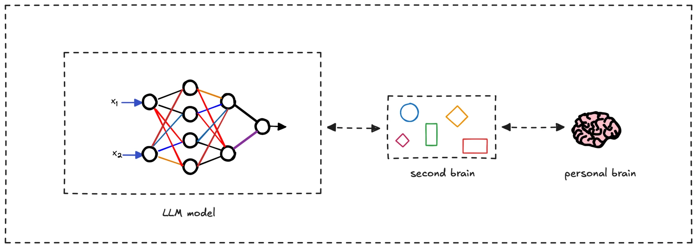

> **tl;dr**
>
> Relying on AI can feel like pretending to know, but a second brain helps you internalize knowledge through active curation and connection. Use LLMs for quick insights, then process them in your second brain to truly understand and own what you learn.

As I build my second brain, a curated database of notes and insights, I often turn to large language models (LLMs) for quick answers. But this ease of access raises a concern: **am I just pretending to know** things when I rely on AI, rather than truly understanding them?

My second brain is meant to internalize knowledge by connecting new information with existing notes, fostering deep insights. Yet, LLMs offer instant world knowledge, making me question whether I’m bypassing real learning for surface-level recall.

What’s the value of owning knowledge in an age of AI?

## Why true knowledge matters

The fear of pretending to know stems from the difference between **accessing information** and **embodying knowledge**. True understanding requires **internalization**, where you process, contextualize, and integrate ideas into your mental framework. Cognitive science, like Bloom’s Taxonomy, shows that higher-order learning (analysis, synthesis, creation) demands active engagement, not just retrieval.

When you query an LLM, you outsource cognitive effort, which can feel shallow because it skips sense-making. In contrast, a second brain fosters deep knowledge by forcing you to select, summarize, and connect ideas, building a web of understanding that’s uniquely yours.

This process also cultivates metacognition, thinking about your thinking. By curating your second brain, you gain clarity on what you know and how ideas fit together, a form of intellectual ownership LLMs can’t replicate. Philosophers like Hubert Dreyfus argue that human expertise relies on experiential knowledge, grounded in personal context. Your second brain bridges this gap, acting as a backup for your brain, storing insights, and even automating low-priority tasks like recalling key connections.

## AI as a tool, not a shortcut

**LLMs are allies, not replacements, for deep learning**. Use them to source raw information, then process it in your second brain. Summarizing AI outputs in your own words or linking them to existing notes solidifies understanding, per the elaboration effect. This hybrid approach ensures you’re a thinker, not just a conduit for AI.

To own your knowledge:

- Summarize LLM insights in your second brain.
- Connect new ideas to existing notes for context.
- Apply knowledge to projects to make it real.

**Relying on AI doesn’t mean pretending if you internalize what you learn**. A second brain transforms fleeting queries into lasting understanding, making you a true knower in an AI-driven world.

---

> Next: [Continual learning DIKW pyramid](dikw-pyramid.md)
