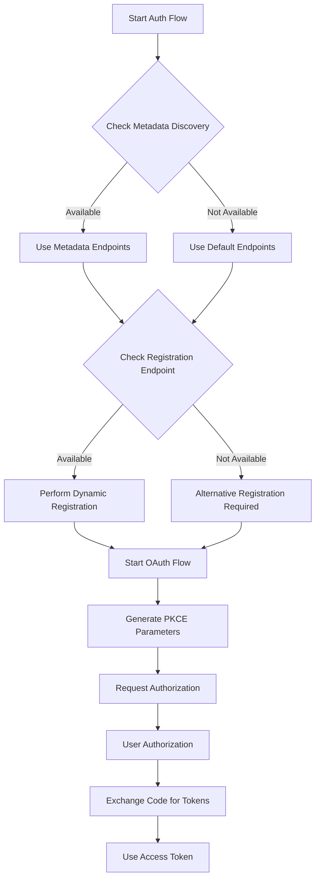
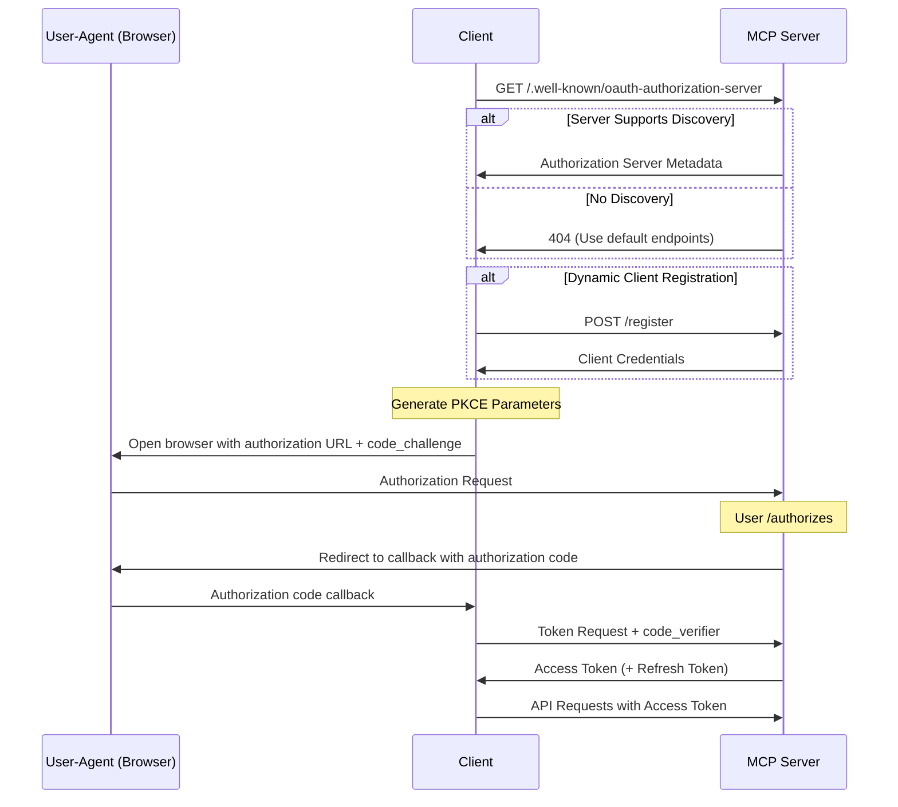
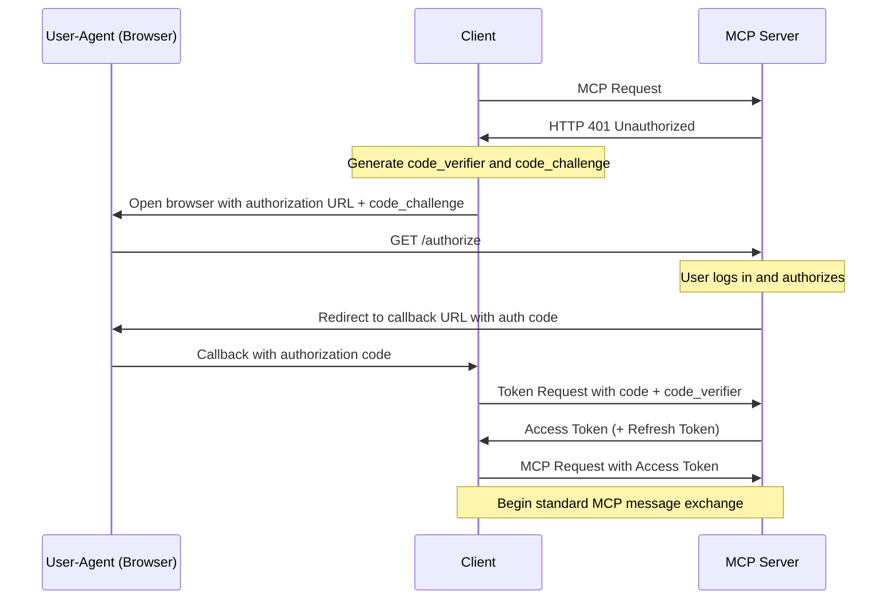
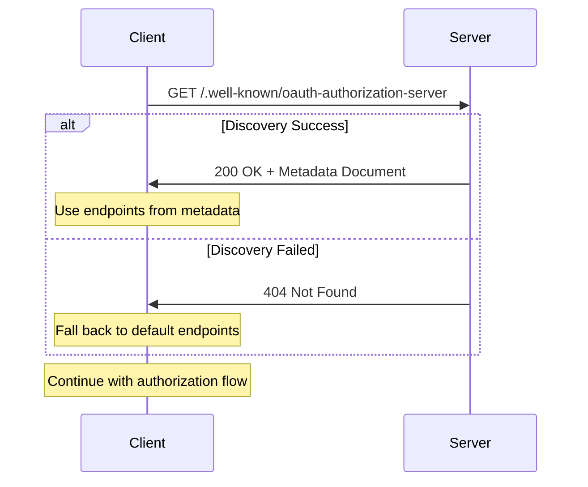
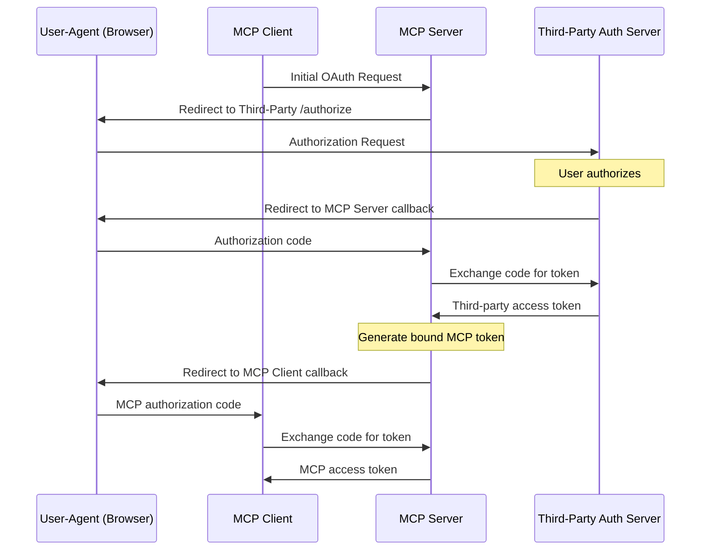

## Introduction

This document presents a comprehensive specification for implementing authorization within the **Model Context Protocol (MCP)** when using **Server-Sent Events (SSE)** as the transport mechanism. The core MCP specification establishes a foundation for AI-to-tool communication but intentionally delegates transport and security implementation details to system architects. Our RFC extends the MCP draft authorization guidelines while maintaining vendor independence.

## Background

The **Model Context Protocol** creates a standardized communication framework between AI systems and external tools or services. Deploying MCP in production environments necessitates robust security controls to protect access to potentially sensitive tools and data. The existing MCP draft provides guidance for HTTP-based authorization, but the unique properties of SSE transport require specialized security considerations.

**Server-Sent Events** establishes an asymmetric communication channel where the server streams data to clients while clients initiate communication through standard HTTP requests. This architectural pattern influences how authentication and authorization must be implemented to maintain security throughout the connection lifecycle.

## Goals

This RFC seeks to establish a vendor-neutral security framework for MCP over SSE by defining precise authorization flows that integrate with existing security standards. The specification provides concrete implementation guidance for both server and client developers while ensuring a frictionless authentication experience for end users. Throughout the document, we maintain strict adherence to the broader MCP specification to ensure compatibility with the evolving protocol ecosystem.

## Architecture overview

The security architecture consists of three principal components working in concert to establish secure connections. The **MCP Client** represents applications requesting access to MCP tools, such as AI assistants or development environments. The **MCP Server** delivers MCP tools and capabilities, exposing functionality through a standardized interface. The **Authorization Server** implements OAuth 2.1 compliance, authenticating users and issuing security tokens.

Within this architecture, the MCP Server functions in a dual role as both an **OAuth Resource Server** that consumes access tokens and an **Authorization Server** that issues tokens. For organizations with existing identity infrastructure, the MCP Server may additionally act as an **OAuth Client** to external identity providers, creating a federated security model.



## Detailed design

### 1. Transport protocol specifications

The MCP Server implements a dedicated SSE endpoint functioning as the primary communication channel between clients and tools. This endpoint accepts standard HTTP requests to initiate connections, then transitions to a persistent stream for event delivery. When a client makes its initial connection request, the server performs comprehensive authorization validation, verifying the presence and validity of the provided access token. After successful authentication, the server maintains a persistent connection, allowing bidirectional communication through a combination of the SSE event stream and separate HTTP endpoints for command submission.

### 2. Authorization flow architecture

The security model implements the **OAuth 2.1** authorization framework with **PKCE (Proof Key for Code Exchange)** enhancement to protect against authorization code interception attacks. The complete authorization sequence unfolds through seven distinct stages:

```
+----------+                               +---------------+
|          |                               |               |
|          |---(A) Initial Connection----->|               |
|          |                               |               |
|          |<--(B) 401 Unauthorized------  |               |
|          |                               |               |
|          |---(C) /authorize (Browser)--->|               |
|  MCP     |                               |  MCP Server   |
|  Client  |<--(D) Auth Code-------------  |               |
|          |                               |               |
|          |---(E) Token Exchange--------->|               |
|          |                               |               |
|          |<--(F) Access Token----------  |               |
|          |                               |               |
|          |---(G) Connect with Token----->|               |
|          |                               |               |
+----------+                               +---------------+

```

This flow begins with an unauthorized connection attempt, which triggers the authentication process. The client then opens a browser session directing the user to the authorization endpoint. After successful authentication, the server issues an authorization code that the client exchanges for access and refresh tokens. Finally, the client establishes an authenticated SSE connection using the obtained access token.



#### Client implementation requirements

The MCP Client must implement several critical security capabilities to participate in this authorization flow. Support for the OAuth 2.1 protocol with PKCE enhancement forms the foundation of client security. The client application needs browser interaction capabilities to redirect users through the authentication flow. Secure token storage prevents credential compromise, while proper token management ensures valid credentials are included with each connection request. The client must also handle token lifecycle events including expiration and renewal.

#### Server implementation requirements

The MCP Server bears responsibility for the integrity of the entire authorization system. Implementation requires fully compliant OAuth 2.1 authorization endpoints adhering to protocol specifications. The server must validate access tokens for each SSE connection request, employing proper cryptographic verification methods. Token issuance requires secure handling of credentials, potentially delegating authentication to external identity providers when necessary. Comprehensive session management tracks connected clients, maintaining security context throughout the connection lifecycle.

### 3. Server endpoint architecture

The MCP Server exposes a structured set of endpoints that collectively provide the complete authorization and communication framework.

#### 3.1 SSE connection endpoint

The primary MCP connection endpoint, typically located at `/sse`, serves as the central communication channel for the protocol. This endpoint performs authorization verification by examining the `Authorization` header for a valid Bearer token. When authentication succeeds, the server establishes a persistent SSE connection for event streaming. Unauthorized connection attempts receive a standard 401 HTTP status response, signaling the need for authentication.

#### 3.2 OAuth authorization endpoint

The authorization endpoint, conventionally located at `/authorize`, initiates the OAuth authentication flow. When accessed, this endpoint redirects users to the appropriate login interface, which may be the server's native authentication system or a delegated third-party identity provider. Throughout the authentication process, the endpoint maintains secure state information to prevent cross-site request forgery attacks. Upon successful authentication, users are redirected back to the client application with a single-use authorization code.



#### 3.3 Token endpoint

The token endpoint, typically found at `/token`, handles credential exchange operations within the OAuth flow. Its primary responsibility involves exchanging authorization codes for access and refresh tokens after validating request authenticity. The endpoint also processes token refresh requests when access tokens expire. An essential security function of this endpoint involves validating PKCE parameters to prevent authorization code interception attacks.

#### 3.4 Client registration endpoint

The optional client registration endpoint, commonly located at `/register`, implements the **OAuth 2.0 Dynamic Client Registration Protocol**. This endpoint enables MCP clients to programmatically register with the server, eliminating manual configuration requirements. Upon registration, the endpoint issues client credentials and establishes appropriate permission boundaries for the new client.

## RFC: Model Context Protocol authorization over SSE transport

### 4. Authorization process workflow

The **Model Context Protocol** authorization process unfolds through a carefully orchestrated sequence of security exchanges between client, server, and end user. This process follows OAuth 2.1 principles while addressing the specific requirements of SSE-based communication.

The workflow begins when an MCP Client makes an initial connection attempt to the SSE endpoint without authentication credentials. Upon receiving this unauthorized request, the server responds with a standard 401 Unauthorized status code, signaling that authentication is required before establishing the persistent connection.

The client proceeds with **OAuth Discovery** by requesting the `/.well-known/oauth-authorization-server` metadata endpoint. This critical step provides the client with the authorization server's endpoints, enabling dynamic adaptation to different server configurations without hardcoded assumptions about URL structures.



Before user authentication begins, the client generates **PKCE (Proof Key for Code Exchange)** parameters to protect against authorization code interception attacks. This security measure involves creating a cryptographically random code verifier and deriving a corresponding challenge through SHA-256 hashing and base64url encoding.

With the PKCE parameters prepared, the client launches a browser session directing the user to the authorization endpoint with a structured parameter set:

```
<https://mcp-server.example/authorize>?
  response_type=code&
  client_id=CLIENT_ID&
  redirect_uri=http://localhost:PORT/callback&
  code_challenge=CODE_CHALLENGE&
  code_challenge_method=S256&
  state=STATE

```

The user completes the authentication process through the server's interface or a delegated authentication provider. This typically involves username/password verification and potentially **multi-factor authentication** for high-security environments. Upon successful identification, the server redirects the user's browser to the client's callback URL, appending a single-use authorization code.

The client application captures this code from the redirect URL and exchanges it for access and refresh tokens by submitting a token request to the server:

```
POST /token HTTP/1.1
Host: mcp-server.example
Content-Type: application/x-www-form-urlencoded

grant_type=authorization_code&
code=AUTHORIZATION_CODE&
client_id=CLIENT_ID&
redirect_uri=http://localhost:PORT/callback&
code_verifier=CODE_VERIFIER

```

With valid tokens obtained, the client establishes an authenticated SSE connection by including the access token in the Authorization header:

```
GET /sse HTTP/1.1
Host: mcp-server.example
Accept: text/event-stream
Authorization: Bearer ACCESS_TOKEN
```

Throughout the connection lifetime, the client monitors token expiration and proactively refreshes credentials before they expire, maintaining continuous authentication without disrupting the user experience.

### 5. Reference implementations

#### 5.1 Server implementation (Node.js with Express)

The following server implementation demonstrates a functional OAuth 2.1 authorization system for MCP over SSE using Node.js and Express:

```jsx
const express = require('express');
const { v4: uuidv4 } = require('uuid');
const crypto = require('crypto');
const app = express();

// In-memory storage systems (replace with database persistence in production)
const authRequests = new Map();
const tokens = new Map();
const sessions = new Map();

// SSE connection endpoint implementation
app.get('/sse', (req, res) => {
  const authHeader = req.headers.authorization;

  if (!authHeader || !authHeader.startsWith('Bearer ')) {
    return res.status(401).json({
      error: 'unauthorized',
      error_description: 'Authentication required'
    });
  }

  const token = authHeader.substring(7);
  const session = tokens.get(token);

  if (!session || session.expires < Date.now()) {
    return res.status(401).json({
      error: 'invalid_token',
      error_description: 'Token is invalid or expired'
    });
  }

  // Configure SSE connection headers
  res.setHeader('Content-Type', 'text/event-stream');
  res.setHeader('Cache-Control', 'no-cache');
  res.setHeader('Connection', 'keep-alive');

  // Eliminate request timeout for persistent connection
  req.setTimeout(0);

  // Record the client connection in session management
  const clientId = session.userId;
  sessions.set(clientId, { res, userId: session.userId });

  // Send connection confirmation event
  res.write(`data: ${JSON.stringify({ type: 'connection_established' })}\\n\\n`);

  // Handle connection termination
  req.on('close', () => {
    sessions.delete(clientId);
  });
});

// OAuth authorization endpoint implementation
app.get('/authorize', (req, res) => {
  const { client_id, redirect_uri, code_challenge, code_challenge_method, state } = req.query;

  if (!client_id || !redirect_uri || !code_challenge || code_challenge_method !== 'S256') {
    return res.status(400).json({ error: 'invalid_request' });
  }

  // Persist authorization request parameters
  const requestId = uuidv4();
  authRequests.set(requestId, {
    client_id,
    redirect_uri,
    code_challenge,
    state,
    created: Date.now()
  });

  // In production, render login UI here instead of auto-approval
  // This simplified implementation immediately generates a code

  // Generate authorization code
  const code = uuidv4();

  // Associate code with authorization request
  authRequests.get(requestId).code = code;

  // Redirect to client callback with authorization code
  const redirectUrl = new URL(redirect_uri);
  redirectUrl.searchParams.append('code', code);
  if (state) {
    redirectUrl.searchParams.append('state', state);
  }

  res.redirect(redirectUrl.toString());
});

// OAuth token endpoint implementation
app.post('/token', express.urlencoded({ extended: true }), (req, res) => {
  const { grant_type, code, client_id, redirect_uri, code_verifier } = req.body;

  if (grant_type !== 'authorization_code') {
    return res.status(400).json({ error: 'unsupported_grant_type' });
  }

  // Locate authorization request associated with the code
  let authRequest = null;
  for (const [id, request] of authRequests.entries()) {
    if (request.code === code) {
      authRequest = request;
      authRequests.delete(id);
      break;
    }
  }

  if (!authRequest) {
    return res.status(400).json({ error: 'invalid_grant' });
  }

  // Validate PKCE code challenge match
  const codeChallenge = crypto
    .createHash('sha256')
    .update(code_verifier)
    .digest('base64')
    .replace(/\\+/g, '-')
    .replace(/\\//g, '_')
    .replace(/=/g, '');

  if (codeChallenge !== authRequest.code_challenge) {
    return res.status(400).json({ error: 'invalid_grant' });
  }

  // Generate access and refresh tokens
  const accessToken = uuidv4();
  const refreshToken = uuidv4();

  // Record token information for validation
  tokens.set(accessToken, {
    userId: client_id, // In production, use real user identifier
    clientId: client_id,
    scope: 'mcp',
    expires: Date.now() + 3600000 // 1 hour expiration
  });

  // Return OAuth token response
  res.json({
    access_token: accessToken,
    token_type: 'bearer',
    expires_in: 3600,
    refresh_token: refreshToken
  });
});

// OAuth discovery metadata endpoint
app.get('/.well-known/oauth-authorization-server', (req, res) => {
  const baseUrl = `${req.protocol}://${req.get('host')}`;

  res.json({
    issuer: baseUrl,
    authorization_endpoint: `${baseUrl}/authorize`,
    token_endpoint: `${baseUrl}/token`,
    registration_endpoint: `${baseUrl}/register`,
    scopes_supported: ['mcp'],
    response_types_supported: ['code'],
    grant_types_supported: ['authorization_code', 'refresh_token'],
    token_endpoint_auth_methods_supported: ['none'],
    code_challenge_methods_supported: ['S256']
  });
});

app.listen(3000, () => {
  console.log('MCP Server running on port 3000');
});
```

#### 5.2 Client implementation using Mastra

The **Mastra framework** provides robust MCP client capabilities with built-in tooling for connecting to MCP servers. The following implementation demonstrates how to leverage Mastra for seamless authentication with SSE-based MCP servers:

```tsx
import { Mastra, MCPConfiguration } from 'mastra';
import * as crypto from 'crypto';
import * as http from 'http';
import open from 'open';

class AuthenticatedMCPClient {
  private mastra: Mastra;
  private baseUrl: string;
  private clientId: string;
  private redirectPort: number;
  private accessToken: string | null = null;
  private refreshToken: string | null = null;
  private tokenExpiry: number = 0;
  private callbackServer: http.Server | null = null;

  constructor(baseUrl: string, clientId: string, redirectPort: number = 8000) {
    this.baseUrl = baseUrl;
    this.clientId = clientId;
    this.redirectPort = redirectPort;

    // Initialize Mastra instance
    this.mastra = new Mastra();
  }

  /**
   * Connects to the MCP server with authorization
   */
  async connect(): Promise<void> {
    try {
      // Try direct connection first (in case we have a valid token cached)
      if (this.accessToken) {
        await this.setupMastraWithToken();
        console.log('Connected using existing token');
        return;
      }
    } catch (error) {
      console.log('No valid token available, initiating authorization flow');
    }

    // Start authorization flow
    await this.authorize();
    await this.setupMastraWithToken();
  }

  /**
   * Configures Mastra with the authenticated token
   */
  private async setupMastraWithToken(): Promise<void> {
    if (!this.accessToken) {
      throw new Error('No access token available');
    }

    // Configure MCP in Mastra with the SSE endpoint and authentication
    const mcpConfig: MCPConfiguration = {
      servers: {
        defaultServer: {
          type: 'sse',
          url: `${this.baseUrl}/sse`,
          headers: {
            'Authorization': `Bearer ${this.accessToken}`
          }
        }
      }
    };

    // Apply the configuration to Mastra
    await this.mastra.configure({ mcp: mcpConfig });

    // Verify connection by listing available tools
    const tools = await this.mastra.getTools();
    console.log(`Connected to MCP server with ${tools.length} available tools`);
  }

  /**
   * Discovers OAuth endpoints from the server
   */
  private async discoverOAuthEndpoints(): Promise<any> {
    try {
      const response = await fetch(`${this.baseUrl}/.well-known/oauth-authorization-server`);

      if (response.ok) {
        return await response.json();
      }
    } catch (error) {
      console.warn('OAuth discovery failed, using default endpoints');
    }

    // Fall back to default endpoint structure
    return {
      authorization_endpoint: `${this.baseUrl}/authorize`,
      token_endpoint: `${this.baseUrl}/token`
    };
  }

  /**
   * Executes the OAuth authorization flow
   */
  private async authorize(): Promise<void> {
    const metadata = await this.discoverOAuthEndpoints();

    // Generate PKCE security parameters
    const codeVerifier = this.generateCodeVerifier();
    const codeChallenge = this.generateCodeChallenge(codeVerifier);
    const state = crypto.randomBytes(16).toString('hex');

    // Define the redirect URI for the OAuth flow
    const redirectUri = `http://localhost:${this.redirectPort}/callback`;

    // Construct the authorization request URL
    const authUrl = new URL(metadata.authorization_endpoint);
    authUrl.searchParams.append('response_type', 'code');
    authUrl.searchParams.append('client_id', this.clientId);
    authUrl.searchParams.append('redirect_uri', redirectUri);
    authUrl.searchParams.append('code_challenge', codeChallenge);
    authUrl.searchParams.append('code_challenge_method', 'S256');
    authUrl.searchParams.append('state', state);

    // Obtain authorization code through browser interaction
    const code = await this.getAuthorizationCode(authUrl.toString(), redirectUri, state);

    // Exchange code for access and refresh tokens
    await this.exchangeCodeForTokens(code, codeVerifier, redirectUri, metadata.token_endpoint);
  }

  /**
   * Opens browser and captures the authorization code
   */
  private async getAuthorizationCode(authUrl: string, redirectUri: string, state: string): Promise<string> {
    return new Promise((resolve, reject) => {
      // Create temporary web server to handle the OAuth callback
      this.callbackServer = http.createServer((req, res) => {
        const url = new URL(req.url!, `http://localhost:${this.redirectPort}`);

        if (url.pathname === '/callback') {
          // Extract authorization parameters from callback
          const receivedCode = url.searchParams.get('code');
          const receivedState = url.searchParams.get('state');

          // Validate state parameter to prevent CSRF attacks
          if (receivedState !== state) {
            res.writeHead(400, { 'Content-Type': 'text/html' });
            res.end('<html><body><h1>Authentication Error</h1><p>Invalid state parameter</p></body></html>');
            reject(new Error('Invalid state parameter'));
            return;
          }

          if (!receivedCode) {
            res.writeHead(400, { 'Content-Type': 'text/html' });
            res.end('<html><body><h1>Authentication Error</h1><p>No code received</p></body></html>');
            reject(new Error('No code received'));
            return;
          }

          // Send success response to the browser
          res.writeHead(200, { 'Content-Type': 'text/html' });
          res.end('<html><body><h1>Authentication Successful</h1><p>You can close this window now.</p></body></html>');

          // Clean up the temporary server
          this.callbackServer!.close();
          this.callbackServer = null;

          // Return the authorization code
          resolve(receivedCode);
        }
      });

      // Start the callback server and launch browser
      this.callbackServer.listen(this.redirectPort, () => {
        open(authUrl);
      });
    });
  }

  /**
   * Exchanges authorization code for access and refresh tokens
   */
  private async exchangeCodeForTokens(
    code: string,
    codeVerifier: string,
    redirectUri: string,
    tokenEndpoint: string
  ): Promise<void> {
    const response = await fetch(tokenEndpoint, {
      method: 'POST',
      headers: {
        'Content-Type': 'application/x-www-form-urlencoded',
      },
      body: new URLSearchParams({
        grant_type: 'authorization_code',
        code,
        client_id: this.clientId,
        redirect_uri: redirectUri,
        code_verifier: codeVerifier,
      }).toString(),
    });

    if (!response.ok) {
      throw new Error(`Token exchange failed: ${response.statusText}`);
    }

    const tokenData = await response.json();

    // Store tokens for subsequent connections
    this.accessToken = tokenData.access_token;
    this.refreshToken = tokenData.refresh_token;
    this.tokenExpiry = Date.now() + tokenData.expires_in * 1000;

    console.log('Successfully obtained access token');
  }

  /**
   * Generates a cryptographically secure code verifier for PKCE
   */
  private generateCodeVerifier(): string {
    return crypto.randomBytes(32).toString('base64url');
  }

  /**
   * Derives a code challenge from the verifier using SHA-256 hashing
   */
  private generateCodeChallenge(verifier: string): string {
    return crypto
      .createHash('sha256')
      .update(verifier)
      .digest('base64')
      .replace(/\\+/g, '-')
      .replace(/\\//g, '_')
      .replace(/=/g, '');
  }

  /**
   * Returns the Mastra instance for application use
   */
  getMastra(): Mastra {
    return this.mastra;
  }

  /**
   * Cleans up resources when connection is no longer needed
   */
  async disconnect(): Promise<void> {
    if (this.callbackServer) {
      this.callbackServer.close();
      this.callbackServer = null;
    }

    // Mastra will handle closing the underlying connections
  }
}

// Example usage demonstrating integration with a Mastra-powered application
async function main() {
  // Initialize the authenticated MCP client
  const mcpClient = new AuthenticatedMCPClient('<https://mcp-server.example>', 'client-123');

  try {
    // Establish authenticated connection
    await mcpClient.connect();

    // Get the Mastra instance for application use
    const mastra = mcpClient.getMastra();

    // Access available tools through Mastra's API
    const tools = await mastra.getTools();
    console.log(`Connected with ${tools.length} available tools`);

    // Create an agent with the available tools
    const agent = await mastra.createAgent({
      tools: tools,
      model: "claude-3-5-sonnet", // Or your preferred model
      systemPrompt: "You are an assistant with access to external tools through MCP."
    });

    // Example interaction using the authorized tools
    const response = await agent.chat("Can you analyze this data using the available tools?");
    console.log("Agent response:", response.content);

    // Maintain the connection for continued use
    // In a real application, this would be part of your service lifecycle
    await new Promise(resolve => setTimeout(resolve, 60000));

    // Clean up when done
    await mcpClient.disconnect();

  } catch (error) {
    console.error('Error in MCP integration:', error);
  }
}

main();
```

### 6. Integration with third-party authentication systems

Many organizations maintain existing identity management systems which they wish to leverage for MCP authorization. The MCP Server can be designed to function as an **OAuth client** to external identity providers, creating a federation pattern. This architecture establishes a two-level authorization hierarchy where the MCP Server delegates the authentication to external providers while maintaining control over MCP-specific permissions.



When implementing this federated model, the MCP client initiates the standard OAuth flow with the MCP Server. Upon receiving the authorization request, the MCP Server redirects the user to the external provider's authentication interface. After successful authentication at the external provider, the MCP Server establishes an internal session linked to the external identity. The server then issues its own access tokens to the MCP Client, binding them to the externally authenticated session.

This approach enables MCP Server administrators to leverage existing enterprise identity infrastructure while maintaining granular control over MCP-specific permissions and access policies. The MCP Server can implement additional authorization rules based on the identity information received from the external provider, such as role-based access controls for specific MCP tools.

The integration with GitHub as an external identity provider demonstrates a practical implementation of this pattern:

```jsx
const express = require('express');
const fetch = require('node-fetch');
const app = express();

// GitHub OAuth configuration retrieved from environment
const GITHUB_CLIENT_ID = process.env.GITHUB_CLIENT_ID;
const GITHUB_CLIENT_SECRET = process.env.GITHUB_CLIENT_SECRET;

// MCP Server authorization endpoint with GitHub delegation
app.get('/authorize', async (req, res) => {
  const { client_id, redirect_uri, code_challenge, state } = req.query;

  // Validate required authorization parameters
  if (!client_id || !redirect_uri || !code_challenge) {
    return res.status(400).json({ error: 'invalid_request' });
  }

  // Generate session identifier and store the MCP client request
  const requestId = uuidv4();
  const mcpRequest = {
    client_id,
    redirect_uri,
    code_challenge,
    state
  };

  // Persist the session state
  sessions.set(requestId, mcpRequest);

  // Construct GitHub authorization URL
  const githubAuthUrl = new URL('<https://github.com/login/oauth/authorize>');
  githubAuthUrl.searchParams.append('client_id', GITHUB_CLIENT_ID);
  githubAuthUrl.searchParams.append('redirect_uri',
    `${req.protocol}://${req.get('host')}/github/callback`);
  githubAuthUrl.searchParams.append('state', requestId);
  githubAuthUrl.searchParams.append('scope', 'read:user');

  // Redirect to GitHub authentication
  res.redirect(githubAuthUrl.toString());
});

// GitHub OAuth callback handler
app.get('/github/callback', async (req, res) => {
  const { code, state: requestId } = req.query;

  // Retrieve the original MCP client request
  const mcpRequest = sessions.get(requestId);
  if (!mcpRequest) {
    return res.status(400).send('Invalid state parameter');
  }

  // Exchange GitHub authorization code for access token
  const tokenResponse = await fetch('<https://github.com/login/oauth/access_token>', {
    method: 'POST',
    headers: {
      'Content-Type': 'application/json',
      'Accept': 'application/json'
    },
    body: JSON.stringify({
      client_id: GITHUB_CLIENT_ID,
      client_secret: GITHUB_CLIENT_SECRET,
      code,
      redirect_uri: `${req.protocol}://${req.get('host')}/github/callback`
    })
  });

  const tokenData = await tokenResponse.json();
  const githubToken = tokenData.access_token;

  // Retrieve GitHub user profile using the token
  const userResponse = await fetch('<https://api.github.com/user>', {
    headers: {
      'Authorization': `token ${githubToken}`,
      'User-Agent': 'MCP-Server'
    }
  });

  const userData = await userResponse.json();

  // Generate authorization code for the MCP client
  const mcpCode = uuidv4();

  // Associate GitHub identity with the MCP authorization code
  authorizations.set(mcpCode, {
    githubToken,
    githubUser: userData,
    mcpRequest
  });

  // Redirect back to the MCP client with authorization code
  const redirectUrl = new URL(mcpRequest.redirect_uri);
  redirectUrl.searchParams.append('code', mcpCode);
  if (mcpRequest.state) {
    redirectUrl.searchParams.append('state', mcpRequest.state);
  }

  res.redirect(redirectUrl.toString());
});

```

This integration pattern can be adapted for any OAuth-compatible identity provider, including enterprise systems like Microsoft Entra ID (formerly Azure AD), Okta, Auth0, or Google Workspace. The approach maintains a clear separation between identity verification (delegated to the external system) and MCP authorization (managed by the MCP server).

### 7. Deployment architecture considerations

The implementation of an MCP authorization system requires careful architectural planning to ensure security, scalability, and operational reliability in production environments.

#### 7.1 Server infrastructure requirements

A production-ready MCP Server must address several critical infrastructure concerns for robust operation. **Horizontal scalability** becomes essential when supporting multiple concurrent SSE connections, requiring an architecture that distributes connection load across multiple server instances. This typically involves implementing a connection pooling system with sticky sessions or distributed session storage mechanisms to ensure consistent client experiences during horizontal scaling events.

**Connection management** demands sophisticated systems for tracking the creation, monitoring, and termination of persistent connections. Each SSE connection consumes server resources, making efficient lifecycle management crucial for system stability. Implementing heartbeat mechanisms and idle timeouts helps maintain clean connection states, while proper connection cleanup protocols prevent resource leaks during unexpected disconnections or server failures.

**Token storage** requires secure, persistent, and potentially distributed data storage systems. Access tokens, refresh tokens, and associated metadata must be stored with appropriate encryption and protected from unauthorized access. Many production implementations leverage specialized token stores like Redis with encryption capabilities or secure database systems with encryption-at-rest functionality. The token storage system must support high-throughput validation operations while maintaining strict security guarantees.

**User management** typically integrates with existing organizational identity systems as outlined in the third-party authentication section. This integration must account for user provisioning, deprovisioning, and permission changes that occur in the primary identity system. Implementing proper synchronization or just-in-time provisioning ensures that MCP authorization remains current with organizational access control policies.

**Security hardening** involves implementing a comprehensive defense-in-depth strategy against common web vulnerabilities. This includes robust protection against cross-site scripting (XSS), cross-site request forgery (CSRF), injection attacks, and denial-of-service vectors. Network level protections such as Web Application Firewalls (WAFs), rate limiting, and traffic anomaly detection form additional security layers. Regular security audits and penetration testing should verify the effectiveness of these controls throughout the system lifecycle.

#### 7.2 Client implementation considerations

MCP Clients demand several essential capabilities to participate securely in the authorization ecosystem. **Token management** involves secure storage of access and refresh tokens, often leveraging platform-specific secure storage mechanisms like system keychains, secure enclaves, or encrypted storage. Mobile applications face different token security challenges than server-side implementations, requiring developers to address platform-specific security considerations in each environment.

**Connection resilience** requires sophisticated handling of network disruptions, including automatic reconnection with exponential backoff strategies, token refresh during reconnection attempts, and preservation of client state during connectivity gaps. Well-designed clients maintain application stability even during intermittent network availability, ensuring continuous operation in challenging network environments.

**Browser integration** capabilities must be carefully implemented to support the OAuth authentication flow. This includes the ability to launch the system browser, establish a local redirect listener, and securely capture authorization codes from redirect URLs. Platform-specific considerations become important when implementing these features on desktop, mobile, or headless server systems, each requiring different approaches to browser interaction.

**Error handling** must address various failure modes in the authentication process, from network errors to invalid credentials. Clients should implement clear error messaging and recovery paths that guide users through resolution steps without exposing sensitive security details. Proper error categorization allows clients to distinguish between temporary failures requiring retry and permanent authorization issues requiring user intervention.

### 8. Security considerations

#### 8.1 Authentication security architecture

The MCP authorization system must implement multiple layers of security controls to protect sensitive capabilities exposed through the protocol.

**Token protection** represents the cornerstone of the security architecture. Access tokens must never be transmitted over unencrypted connections, requiring **Transport Layer Security (TLS)** for all authorization and API interactions. Token storage requires similar protection, leveraging secure storage mechanisms appropriate to the deployment environment. Server-side tokens should be stored with cryptographic protection, while client applications should use platform-specific secure storage APIs rather than general-purpose storage.

**PKCE implementation** is mandatory for all client applications regardless of their classification as public or confidential OAuth clients. This requirement mitigates authorization code interception attacks that can occur during the OAuth redirect flow. Even though desktop and mobile applications traditionally operated as public clients with limited security guarantees, PKCE provides essential protection against common attack vectors in these environments.

**State parameter validation** prevents cross-site request forgery attacks that could otherwise trick users into initiating unintended authorization flows. Each authorization request must include a cryptographically random state value that is validated when the authorization code is received. This check ensures the authorization response corresponds to an authentic request from the same client session.

**Refresh token rotation** enhances security by limiting the lifetime of authentication credentials. When a refresh token is used to obtain a new access token, the authorization server issues a new refresh token while invalidating the previous one. This approach limits the damage potential if a refresh token is compromised, as the window of opportunity for exploitation is limited to a single refresh cycle.

**Scope limitation** applies the principle of least privilege to MCP tool access. The authorization system should define granular scopes corresponding to specific tool capabilities, allowing clients to request only the permissions necessary for their intended functionality. Users should be presented with clear consent screens detailing exactly what capabilities each client is requesting.

#### 8.2 Service security controls

The operational security of the MCP service requires additional protections beyond the core authentication mechanisms.

**Rate limiting** must be applied to authentication endpoints to prevent brute force attacks and credential stuffing. These limits should be applied both at the IP level and at the client identifier level. Sophisticated rate limiting implementations should employ progressive delays for repeated failures rather than hard cutoffs, making automated attacks impractical while accommodating legitimate users who occasionally mistype credentials.

**Token validation** requires comprehensive verification before establishing SSE connections. Beyond simple existence checks, the server must cryptographically validate token signatures, verify that the token hasn't been revoked, check that scopes authorize the requested operation, and confirm the token hasn't expired. Proper validation requires a complete security context for each request.

**Connection timeouts** help maintain system integrity by releasing resources associated with inactive connections. While SSE connections are designed for long-lived communication, implementations should establish reasonable inactivity timeouts that balance user experience with resource management. Activity monitoring should distinguish between application-level activity and transport-level keepalive signals.

**Audit logging** provides essential visibility into authentication events for security monitoring. Each authentication attempt, token issuance, token validation, and connection establishment should generate audit records with appropriate detail. These logs support security monitoring, intrusion detection, and forensic analysis in case of security incidents. Care must be taken to avoid logging sensitive information like tokens or credentials in plaintext.

### 9. Compatibility and migration strategies

The MCP authorization specification maintains compatibility with several key ecosystems and standards. This compatibility ensures that organizations can implement secure MCP systems without disrupting existing infrastructure or creating security islands.

The authorization framework aligns completely with the core **MCP specification** and its evolution, ensuring that security enhancements don't break protocol compatibility. The use of standard OAuth 2.1 enables integration with existing **identity management systems** through established federation patterns. The implementation approach accommodates various **hosting environments**, including cloud platforms, on-premises infrastructure, and hybrid deployments.

Organizations migrating from other MCP transport mechanisms should implement a transitional strategy. Maintaining **dual-protocol support** during migration allows clients to upgrade incrementally rather than requiring a synchronized cutover. **Cross-transport authentication** can be implemented by sharing token stores between transport implementations, enabling a single authentication to be valid across multiple transport mechanisms. Clear **developer guidance** should document preferred authentication methods and migration timelines to ensure a smooth transition.

### 10. References

The implementation of this authorization framework should reference these authoritative specifications:

1. Model Context Protocol Specification: [https://modelcontextprotocol.io/specification/](https://modelcontextprotocol.io/specification/)
2. Model Context Protocol Authorization Specification Draft: [https://spec.modelcontextprotocol.io/specification/draft/basic/authorization/](https://spec.modelcontextprotocol.io/specification/draft/basic/authorization/)
3. OAuth 2.1 IETF Draft: [https://datatracker.ietf.org/doc/html/draft-ietf-oauth-v2-1-12](https://datatracker.ietf.org/doc/html/draft-ietf-oauth-v2-1-12)
4. Server-Sent Events Specification: [https://html.spec.whatwg.org/multipage/server-sent-events.html](https://html.spec.whatwg.org/multipage/server-sent-events.html)
5. Proof Key for Code Exchange: [https://datatracker.ietf.org/doc/html/rfc7636](https://datatracker.ietf.org/doc/html/rfc7636)
6. OAuth 2.0 Authorization Server Metadata: [https://datatracker.ietf.org/doc/html/rfc8414](https://datatracker.ietf.org/doc/html/rfc8414)

### 11. Conclusion

This RFC establishes a comprehensive, vendor-neutral framework for implementing secure authorization for MCP over SSE transport. The specification leverages established OAuth 2.1 security patterns while addressing the unique characteristics of persistent SSE connections for MCP communication.

The proposed architecture balances robust security protections with practical implementation requirements. By adopting standardized authentication flows, the specification enables seamless integration with existing identity infrastructure while avoiding vendor lock-in. The detailed implementation guidance for both server and client components provides a clear roadmap for developers implementing MCP systems.

Organizations implementing this specification should prioritize security foundations from the outset, recognizing that retrofitting security measures becomes exponentially more difficult as systems scale. The reference implementations demonstrate that implementing proper authentication need not create excessive complexity, but rather establishes a foundation for confident tool sharing between AI systems and external services.

As the MCP ecosystem continues to grow, this authorization framework provides a solid foundation that can evolve alongside emerging security requirements and use cases. By embracing open standards and security best practices, this specification ensures that MCP implementations can remain both secure and interoperable in a rapidly evolving technology landscape.
