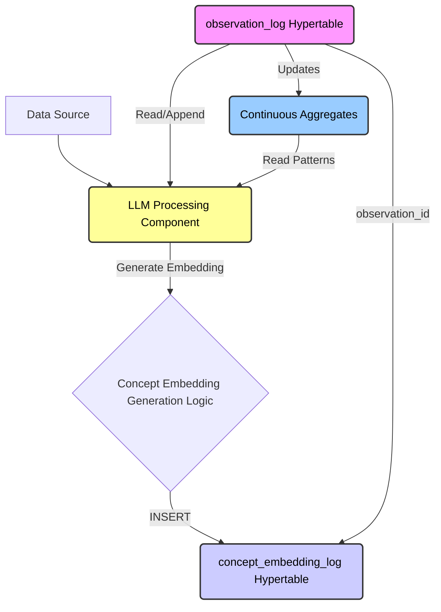
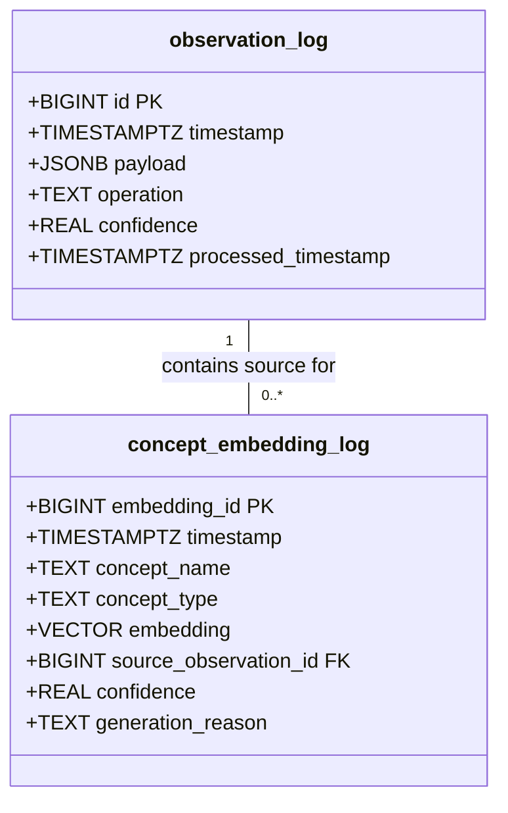
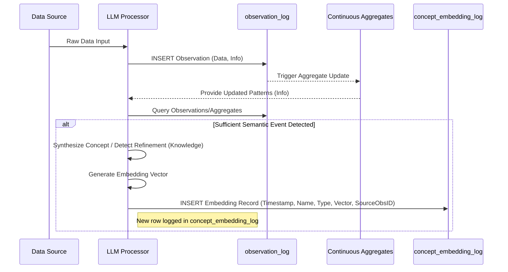

## Abstract

We're proposing something exciting: an **append-only concept embedding log** that captures how our understanding of concepts evolves over time. Think of it as a time machine for semantic meaning. Instead of just storing the latest vector representation of a concept, we're keeping its entire history - every twist and turn in how its meaning has evolved.

This isn't your typical mutable database. We're using **TimescaleDB** with **pgvector** and **pgvectorscale** (specifically the **StreamingDiskANN** index) to create a system that can:

- Track how concepts evolve semantically over time
- Analyze semantic drift with precision
- Maintain complete historical fidelity
- Enable sophisticated latent space reasoning

## Motivation

Here's the big picture: we're building a system that learns continuously, climbing the **DIKW pyramid** by turning raw data into actionable knowledge. Our existing **observation_log** is great at preventing **catastrophic forgetting** at the data layer, but we need more. We need to understand how concepts themselves evolve in the **latent space**.

Traditional approaches have a blind spot: they only keep the latest vector representation of a concept. It's like having a photo album with only the most recent picture of someone - you miss their entire life story. We're fixing this by creating a system that captures every semantic snapshot, just like our **observation_log** captures every observation.

## Technical principles

Our design rests on four key pillars:

1. **Immutability**: Once we record an embedding, it's set in stone. No updates, no deletions - just like a historical record.
2. **Temporal fidelity**: Each embedding is a precise snapshot of how we understood a concept at that moment.
3. **Traceability**: Every embedding links back to the specific observations that shaped it.
4. **Separation of concerns**: We're using specialized structures optimized for vector operations, distinct from our main observation log.

## Proposed solution

We're creating a new **TimescaleDB hypertable** called `concept_embedding_log`. This isn't just another table - it's a temporal semantic derivative of our `observation_log`, designed specifically for tracking concept evolution.

### Architecture overview

Here's how everything fits together:



*Diagram 1: How data flows from source through LLM processing to our embedding log*

### Schema definition

Let's look at the schema. We're using **pgvector**'s `VECTOR` type for efficient storage of our high-dimensional embeddings:

```sql
-- SQL Definition for concept_embedding_log
CREATE TABLE concept_embedding_log (
  embedding_id BIGINT GENERATED ALWAYS AS IDENTITY, -- Unique identifier for this embedding event
  timestamp TIMESTAMPTZ NOT NULL DEFAULT NOW(), -- Precise time of embedding generation/logging
  concept_name TEXT NOT NULL, -- The unique name identifying the concept
  concept_type TEXT NOT NULL, -- Categorization, e.g., 'entity', 'coined_term'
  embedding VECTOR(<embedding_dimension>) NOT NULL, -- The semantic vector representation (specify dimension)
  source_observation_id BIGINT NOT NULL REFERENCES observation_log(id), -- Foreign key linking to the trigger event
  confidence REAL, -- Optional: LLM's confidence in this semantic representation
  generation_reason TEXT -- Optional: Metadata, e.g., 'initial_discovery', 'refinement'
);

-- Convert the table into a hypertable partitioned by time
SELECT create_hypertable('concept_embedding_log', 'timestamp', chunk_time_interval => INTERVAL '1 week');

-- Create an index for efficiently retrieving the embedding history for a specific concept
CREATE INDEX idx_concept_embedding_log_name_time ON concept_embedding_log (concept_name, timestamp DESC);

-- Create an ANN index using pgvectorscale's StreamingDiskANN for cosine distance
CREATE INDEX idx_concept_embedding_log_embedding_cos_diskann
ON concept_embedding_log
USING diskann (embedding vector_cosine_ops);
```

Here's how it relates to our `observation_log`:



*Diagram 2: How our concept embedding log relates to the observation log*

### Data flow and operational logic

Here's how it works in practice:

1. Our **LLM** continuously monitors the **observation_log** and its aggregates
2. When it spots something significant - like a new concept or a shift in meaning - it generates an embedding
3. This embedding captures the concept's meaning based on everything we know up to that point
4. We insert a new row into `concept_embedding_log`, never updating existing ones
5. For similarity searches, we use the cosine distance operator (`<=>`)

Here's the sequence in detail:



*Diagram 3: The sequence of events when generating and logging a new concept embedding*

## Reasoning capabilities

This is where it gets interesting. Our append-only design lets us do things that were impossible before:

1. **Track semantic evolution**: We can see how a concept's meaning has changed over time
2. **Analyze semantic drift**: By calculating vector distances between consecutive embeddings
3. **Perform time-contextual searches**: Find concepts similar to "Vibe Coding" as it was understood during its early days
4. **Monitor concept emergence**: Track when new concepts first appear
5. **Observe semantic stabilization**: See when a concept's meaning becomes more stable

Here's an example of querying the semantic history of 'Vibe Coding':

```
+---------------------+---------------+--------------------------+------------------------+
| timestamp           | concept_name  | embedding                | source_observation_id  |
+---------------------+---------------+--------------------------+------------------------+
| 2025-01-15 10:00:00 | Vibe Coding   | [0.1, 0.5, ..., 0.2]     | 123                    | <-- Initial Discovery
| 2025-02-20 14:30:00 | Vibe Coding   | [0.12, 0.51, ..., 0.25]  | 456                    | <-- Refinement after new context
| 2025-04-10 09:15:00 | Vibe Coding   | [0.11, 0.49, ..., 0.28]  | 789                    | <-- Slight drift
| ...                 | ...           | ...                      | ...                    |
+---------------------+---------------+--------------------------+------------------------+
```

*Figure 1: How we track the evolution of a concept's semantic meaning over time*

## Considerations and tradeoffs

Every design choice comes with tradeoffs. Here are the key ones to consider:

1. **Storage growth**: We're keeping every version of every embedding. This means:
   - More storage needed
   - Need for effective compression strategies
   - Possible need for tiered storage for older embeddings
2. **Query patterns**: Getting the "current" state requires explicitly selecting the latest timestamp. This is different from mutable stores but gives us more flexibility.
3. **Search performance**: While **StreamingDiskANN** is efficient, searching the entire history without time bounds might be slower. We'll need to optimize our queries.
4. **LLM decision making**: The system's effectiveness depends on the **LLM**'s ability to detect significant semantic shifts. We'll need to tune this carefully.

## Alternatives considered

We looked at the traditional approach: a standard relational table or key-value store with UPSERT operations. It would be simpler to implement and use less storage, but it would lose something crucial - the history of how concepts evolve.

Given our goal of building a system that truly learns and understands, we chose the append-only approach. It aligns with our core principles and gives us capabilities that simpler solutions can't match.
