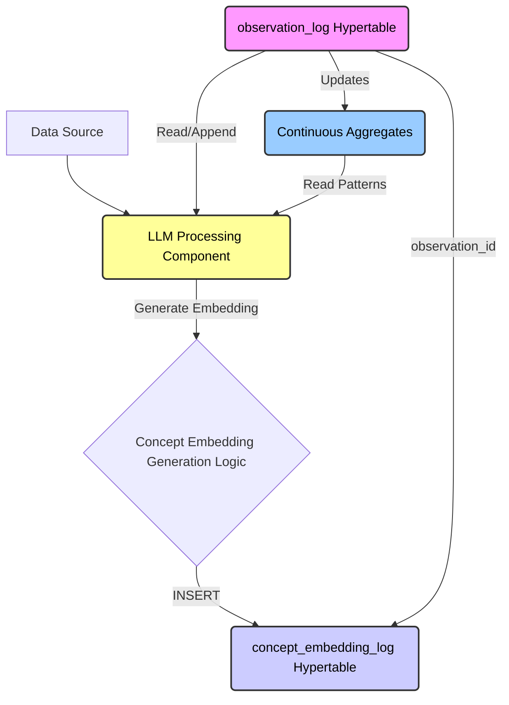
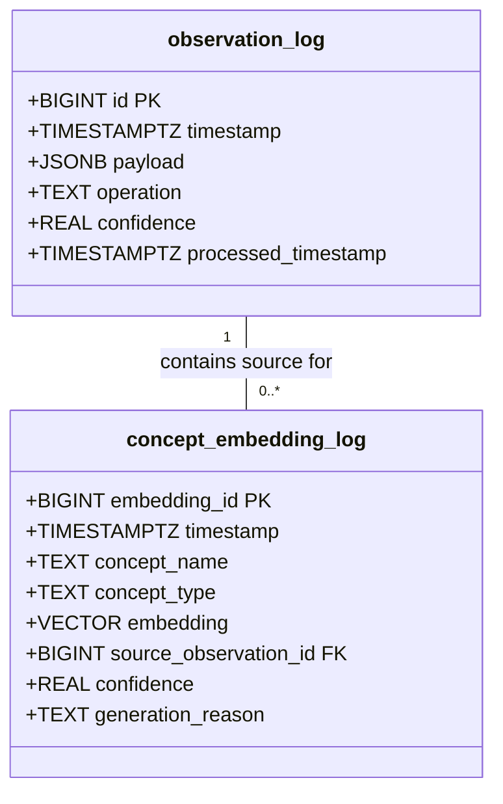
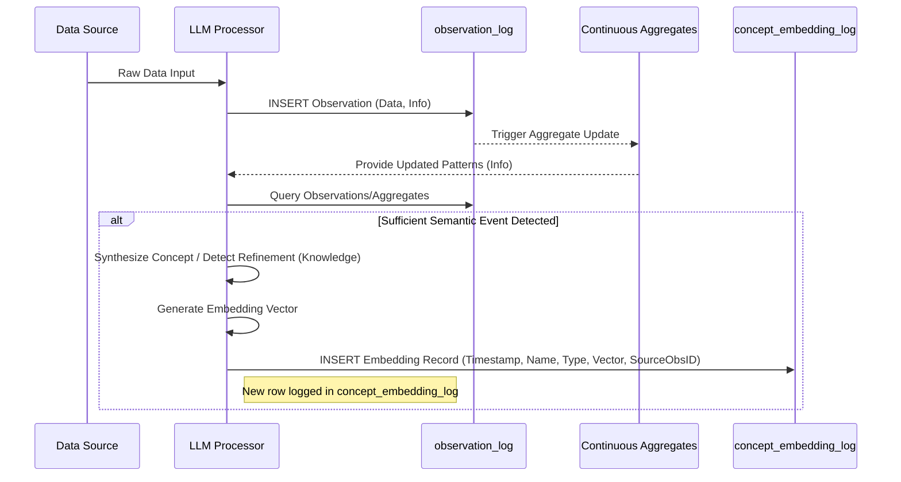

# RFC: Append-only concept embedding log for temporal semantic reasoning

## Abstract

This document proposes the implementation of an **Append-Only Concept Embedding Log**, a novel component designed to store and manage the historical evolution of semantic vector representations for learned concepts within our continual learning architecture. This approach diverges from traditional mutable stores by treating each generated concept embedding as an immutable, time-stamped event, directly mirroring the append-only nature of the primary **observation_log**. Leveraging **TimescaleDB** hypertables along with the **pgvector** and **pgvectorscale** extensions, specifically utilizing the **StreamingDiskANN** index, this design enables sophisticated **latent space reasoning** about concept evolution, semantic drift, and temporal context, while maintaining full historical fidelity.

## Motivation

Our overarching goal is to construct a system capable of **continual learning**, progressing up the **DIKW pyramid** by synthesizing knowledge from accumulating data and information. The existing **observation_log** provides an immutable history of raw observations and explicitly derived information, combating catastrophic forgetting at the data layer and adapting to evolving data structures via its flexible JSONB payload. However, effective reasoning requires understanding not just the explicit historical record but also the evolution of semantic meaning within the **latent space**. Traditional methods of storing embeddings often involve mutable tables that only retain the latest vector representation, discarding the history of how a concept's semantic meaning developed. This loss of temporal context hinders true **continual learning** and the ability to perform deep reasoning about conceptual evolution. To address this, we require a mechanism to capture the semantic state of concepts over time with the same **immutability** guarantee as the **observation_log**. This proposal introduces such a mechanism, enabling **latent space reasoning** that fully respects the temporal dimension of learning.

## Technical principles

The design adheres to several core technical principles guiding its structure and function. Foremost is **immutability**, ensuring that once an embedding representing a concept at a specific time is recorded, it is never altered, thereby preserving the complete history of semantic understanding. This directly supports **temporal fidelity**, where each logged embedding accurately reflects the system's semantic interpretation based on the data available up to that point in time. **Traceability** is paramount, with each embedding explicitly linked back to the specific entry or entries in the **observation_log** that triggered its generation, allowing for deep contextual analysis during reasoning tasks. Furthermore, **separation of concerns** dictates that this specialized embedding history is managed in a dedicated structure, optimized for vector storage and querying using **pgvector** and **pgvectorscale**, distinct from the primary **observation_log** which handles observational data.

## Proposed solution

We propose the creation of a new **TimescaleDB hypertable** named `concept_embedding_log`. This table will serve as the dedicated, append-only repository for all generated concept embeddings, functioning as a temporal semantic derivative of the `observation_log`.

### Architecture overview

The following diagram illustrates the high-level interaction between the key components involved in generating and storing concept embeddings:

**Code snippet**



*Diagram 1: High-level architecture showing the flow from data source through LLM processing to the logging of observations and embeddings.*

### Schema definition

The schema for `concept_embedding_log` is designed to capture the embedding itself along with critical temporal and contextual metadata. It leverages **pgvector**'s `VECTOR` type for efficient storage of high-dimensional data.

**SQL**

```sql
-- SQL Definition for concept_embedding_log
CREATE TABLE concept_embedding_log (
  embedding_id BIGINT GENERATED ALWAYS AS IDENTITY, -- Unique identifier for this embedding event
  timestamp TIMESTAMPTZ NOT NULL DEFAULT NOW(), -- Precise time of embedding generation/logging
  concept_name TEXT NOT NULL, -- The unique name identifying the concept
  concept_type TEXT NOT NULL, -- Categorization, e.g., 'entity', 'coined_term'
  embedding VECTOR(<embedding_dimension>) NOT NULL, -- The semantic vector representation (specify dimension)
  source_observation_id BIGINT NOT NULL REFERENCES observation_log(id), -- Foreign key linking to the trigger event
  confidence REAL, -- Optional: LLM's confidence in this semantic representation
  generation_reason TEXT -- Optional: Metadata, e.g., 'initial_discovery', 'refinement'
);
-- Convert the table into a hypertable partitioned by time
SELECT create_hypertable('concept_embedding_log', 'timestamp', chunk_time_interval => INTERVAL '1 week'); -- Interval adjustable
-- Create an index for efficiently retrieving the embedding history for a specific concept
CREATE INDEX idx_concept_embedding_log_name_time ON concept_embedding_log (concept_name, timestamp DESC);
-- Create an ANN index using pgvectorscale's StreamingDiskANN for cosine distance
CREATE INDEX idx_concept_embedding_log_embedding_cos_diskann
ON concept_embedding_log
USING diskann (embedding vector_cosine_ops);
```

A visual representation of the `concept_embedding_log` schema and its relation to `observation_log`:

**ERD**



*Diagram 2: Class diagram illustrating the schema for `concept_embedding_log` and its foreign key relationship to `observation_log`.*

*(Prerequisites: Ensure the `vector` and `vectorscale` extensions are enabled in the database.)*

### Data flow and operational logic

The operational flow involves the **LLM** processing component continuously monitoring the **observation_log** and its associated continuous aggregates. When the **LLM** identifies a sufficiently significant event related to a concept – such as its initial discovery, explicit coining (e.g., "Vibe Coding"), or a detected shift in its usage or context indicating semantic refinement – it generates the corresponding **embedding** vector. This vector captures the concept's meaning based on the cumulative knowledge up to that specific point in time. Following generation, the system logic performs an **INSERT** operation, adding a new row to the **concept_embedding_log** hypertable. This row includes the concept's name, type, the newly generated **embedding** vector, the current **timestamp**, and crucially, the `source_observation_id` referencing the record in **observation_log** that triggered this semantic snapshot. No UPDATE operations are ever performed against this log, ensuring strict adherence to the **immutability** principle. Similarity queries against this log will primarily utilize the cosine distance operator (`<=>`), which corresponds to the `vector_cosine_ops` class specified during the creation of the **StreamingDiskANN** index.

The sequence diagram below details this flow:



*Diagram 3: Sequence diagram illustrating the data flow for generating and logging a new concept embedding.*

## Reasoning capabilities

This append-only design unlocks powerful reasoning capabilities centered on the temporal evolution of semantics, offering insights previously unavailable with mutable embedding stores. Analysts and the **LLM** itself can query the **concept_embedding_log** to retrieve the complete semantic trajectory of any learned concept. This enables the direct, quantitative analysis of **semantic drift** over time by calculating the vector distance between consecutive embeddings for the same concept.

Consider querying the semantic history of 'AI':

```
+---------------------+---------------+--------------------------+------------------------+
| timestamp           | concept_name  | embedding                | source_observation_id  |
+---------------------+---------------+--------------------------+------------------------+
| 2025-01-15 10:00:00 | Vibe Coding   | [0.1, 0.5, ..., 0.2]     | 123                    | <-- Initial Discovery
| 2025-02-20 14:30:00 | Vibe Coding   | [0.12, 0.51, ..., 0.25]  | 456                    | <-- Refinement after new context
| 2025-04-10 09:15:00 | Vibe Coding   | [0.11, 0.49, ..., 0.28]  | 789                    | <-- Slight drift
| ...                 | ...           | ...                      | ...                    |
+---------------------+---------------+--------------------------+------------------------+
-- Query: SELECT timestamp, embedding, source_observation_id FROM concept_embedding_log WHERE concept_name = 'Vibe Coding' ORDER BY timestamp ASC;
```

*Figure 1: Conceptual representation of querying the temporal embedding history for the concept 'Vibe Coding'.*

Furthermore, the design facilitates time-contextual similarity searches. For instance, one could find concepts semantically similar to "Vibe Coding" *as it was understood during its emergence phase*, by filtering the **concept_embedding_log** to a specific early time window before executing the ANN search using the `<=>` operator. The log also supports tracking concept emergence (identifying the `MIN(timestamp)` for a `concept_name`) and observing semantic stabilization (when the distance between consecutive embeddings diminishes below a threshold). The explicit link via `source_observation_id` provides profound **traceability**, allowing any reasoning about a concept's meaning at a point in time to be grounded in the specific observational data that shaped that understanding.

## Considerations and tradeoffs

The primary consideration for this append-only approach is the potential for significant storage volume growth, as every generated version of a concept's embedding is perpetually retained. Implementing effective **TimescaleDB** compression strategies and defining appropriate data lifecycle management policies (such as tiered storage or selective retention for older, less critical embedding snapshots) will be crucial for sustainable long-term operation. Query patterns also differ from mutable stores; retrieving the "current" semantic state necessitates explicitly selecting the record with the maximum **timestamp** for a given concept.

While **StreamingDiskANN** provides highly efficient indexing for ANN queries, searches spanning the entire historical log without temporal filtering might incur higher latency compared to querying a smaller table containing only the latest states. Therefore, optimizing queries with appropriate time bounds will be important. Finally, the robustness of the **LLM**'s logic in determining *when* a semantic shift is significant enough to warrant logging a new embedding is critical. This logic must strike a balance between capturing meaningful evolution and avoiding excessive storage consumption due to minor fluctuations. Utilizing the `confidence` score might aid this decision process.

## Alternatives considered

The main alternative involves employing a standard relational table or a key-value store with an UPSERT mechanism, designed to store only the most recent embedding vector for each unique concept name. This approach simplifies retrieving the current semantic state but fundamentally sacrifices the historical record of semantic evolution. Given that a core objective of our system is **continual learning** and understanding the *process* of knowledge formation over time, the loss of this temporal semantic context was deemed unacceptable. The **Append-Only Concept Embedding Log** model aligns more coherently with the system's foundational principle of **immutability**, as exemplified by the **observation_log**, providing a richer substrate for advanced temporal reasoning.
