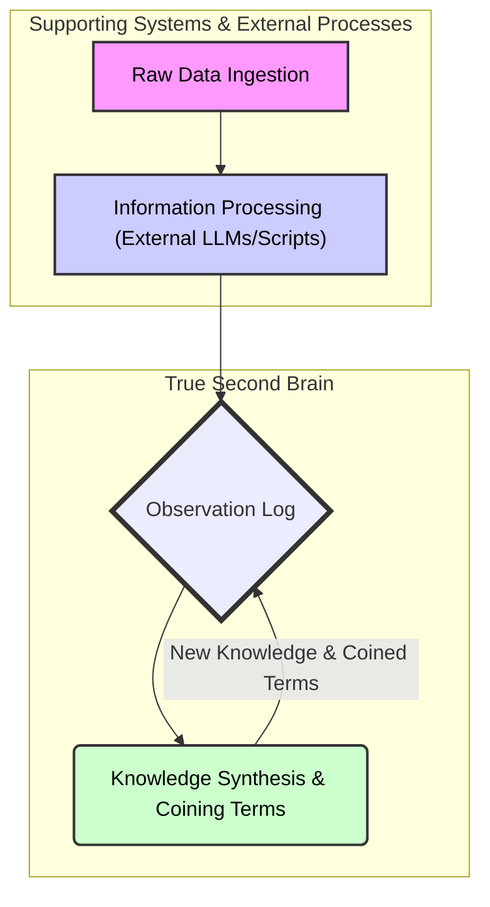

## Core architecture: the observation log

At the core of our system lies a single, massive log called the **observation_log**. This runs on **TimescaleDB** and follows an **append-only** pattern. Every piece of data, processed thought, and new **insight** gets written as a new entry. *Nothing ever gets deleted or changed in place*. This is how we prevent **catastrophic forgetting** at the data layer.

The magic for flexibility comes from each entry's **JSONB payload**. This means the *structure* of what we store can change on the fly. No rigid schemas breaking when we discover something new. If the **LLM** figures out a new way to categorize information, it just starts doing it. The **LLM** acts as the cognitive engine, processing raw inputs, structuring them, and analyzing the entire log to extract new **knowledge**.

## How the brain learns

The brain learns through a continuous loop, similar to human learning but supercharged:



1. **Data ingestion**: Raw signals come in from various sources - API outputs, system logs, text from chats or documents
2. **Information processing**: Dedicated scripts and **LLMs** structure the raw data, extract key entities, and identify relationships
3. **Observation logging**: The processed information gets written to the **observation_log** as a permanent record
4. **Knowledge synthesis**: The internal **LLM** scans accumulated information using **TimescaleDB** features like **continuous aggregates** to identify patterns and correlations
5. **Knowledge persistence**: New insights and **coined terms** get written back into the **observation_log** as enriched observations

## Example: tracking tech trends

Let's see how this works by analyzing Hacker News data to spot emerging tech trends.

### Step 1: Data ingestion and processing

We start with Hacker News posts and comments. An **LLM** job processes this through:

- **Named Entity Recognition (NER)** to identify technologies and companies
- **Sentiment analysis** to gauge community reaction
- **Trend detection** to spot emerging patterns

The processed information gets structured into the **observation_log**:

```json
{
  "context_id": "hackernews:post:12345678",
  "content_summary": "Big buzz around 'XYZ Corp's new Vector DB'. People love the scalability.",
  "entities": [
    {"name": "XYZ Corp", "type": "company"}, 
    {"name": "Vector DB", "type": "technology_category"}
  ],
  "sentiment": {
    "topic": "XYZ Vector DB", 
    "score": 0.85, 
    "label": "positive"
  }
}
```

### Step 2: Find patterns

The brain's internal **LLM** analyzes these observations over time. It might notice:

- Increasing mentions of vector databases
- Positive sentiment in discussions
- Growing job postings requesting vector DB experience

This leads to the synthesis of new knowledge:

```json
{
  "context_id": "system:knowledge_synthesis:2025-08-01",
  "content": "Identified emerging trend in vector database adoption...",
  "coined_terms": [
    {
      "name": "Vector Database Adoption Wave",
      "confidence": 0.92,
      "supporting_evidence": [
        "hackernews:post:12345678",
        "hackernews:post:12345679"
      ]
    }
  ]
}
```

### Step 3: Use the insights

This synthesized knowledge can then be used to:

1. Guide product development decisions
2. Inform technical blog content
3. Shape hiring strategies
4. Influence technology stack choices

## Apply to other domains

The same pattern can be applied to other domains:

1. **CRM intelligence**: Process customer interactions to identify patterns in successful sales approaches
2. **Project performance**: Analyze completed projects to extract best practices and optimal team structures
3. **Token usage analytics**: Monitor blockchain transactions to understand platform dynamics

Each use-case follows the same pattern:

1. Ingest and process raw data
2. Structure it into the **observation_log**
3. Allow the brain to synthesize new knowledge
4. Apply the insights to improve decision-making

## Wrap

The power of this system lies in its ability to continuously learn and adapt. By maintaining an **append-only log** with flexible data structures, we create a foundation for true machine learning. The system doesn't just store information - it actively synthesizes new knowledge and applies it to improve outcomes.

The key to success is starting with a clear use-case and following the pattern of data ingestion, processing, synthesis, and application. This creates a virtuous cycle where the system gets smarter with each new piece of information it processes.

---

> Next: [Access brainery use-cases](access-brainery.md)
