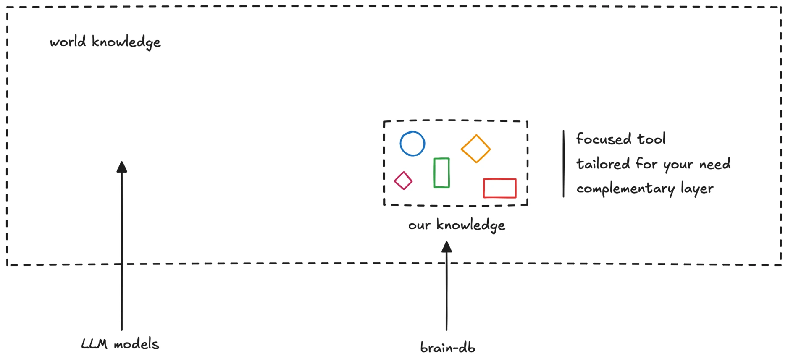

> **tl;dr** Building a second brain is still worth it, even with AI like LLMs. It curates knowledge tailored to your goals, fuels creativity through active engagement, and works with AI to amplify your thinking, not replace it.

## The question and tension

With large language models (LLMs) like Grok delivering world knowledge in real time, why invest in a personal second brain, a curated database of notes, articles, and insights? As I build my second brain to store knowledge and spark ideas by colliding new information with existing notes, I wonder if it’s redundant. LLMs seem to offer instant access to vast information, making my efforts feel unnecessary.

What’s the difference between **my knowledge and world knowledge** if I can tap into the latter via an LLM call? And does a second brain still have unique value?

## Why a second brain matters

A second brain isn’t just a subset of world knowledge; it’s a **curated, personalized system** that reflects your unique perspective, goals, and projects. World knowledge, accessed through LLMs, is broad but generalized, often overwhelming without context. Research on information overload shows curated systems reduce cognitive strain (Bawden & Robinson, 2009). Your second brain filters what matters, creating a tailored web of ideas. Unlike LLMs, it acts as a **backup** for your brain, storing insights and connections that align with your work.

Moreover, **a second brain automates and enhances your thinking**. By organizing knowledge, it suggests connections, streamlines low-priority decisions, or even automates parts of your job, like drafting ideas or recalling key facts. Cognitive science highlights the generation effect: actively engaging with knowledge through curation boosts retention and understanding, unlike passive LLM queries. This makes your second brain a creative engine, not a redundant archive.

## The AI partnership

**LLMs and second brains are symbiotic**. Use AI for quick fact-checking or inspiration, then integrate findings into your second brain with notes or links to existing ideas. This feedback loop leverages AI’s speed and your system’s depth, mirroring how experts blend tools and personal systems for mastery.

To make your second brain count:

- Use tools like Obsidian for networked thinking.
- Process LLM outputs into your database for ownership.
- Review regularly to keep it focused.

Building a second brain is worth it because it’s uniquely yours, amplifying your thinking and automating tasks in ways LLMs can’t. In an information-rich world, it’s your anchor for creating meaning and staying intentional.
