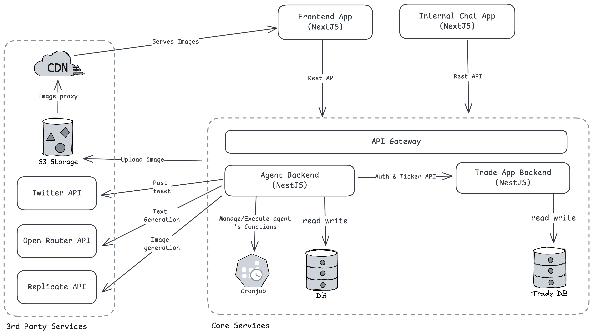
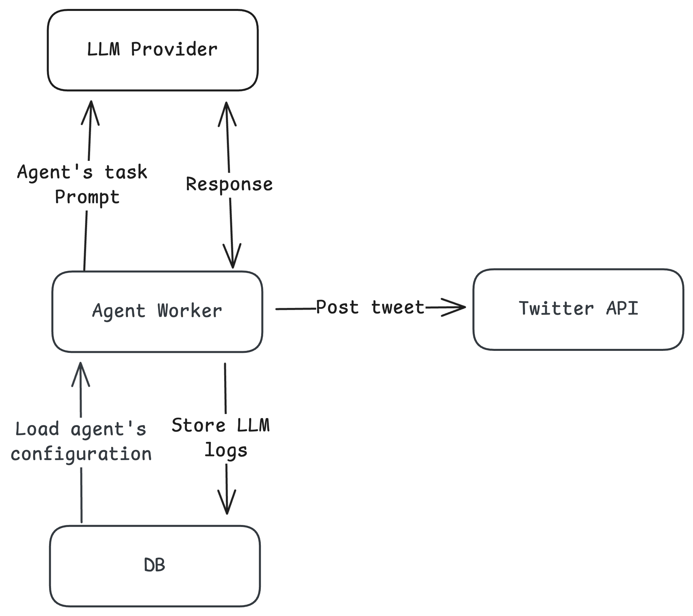
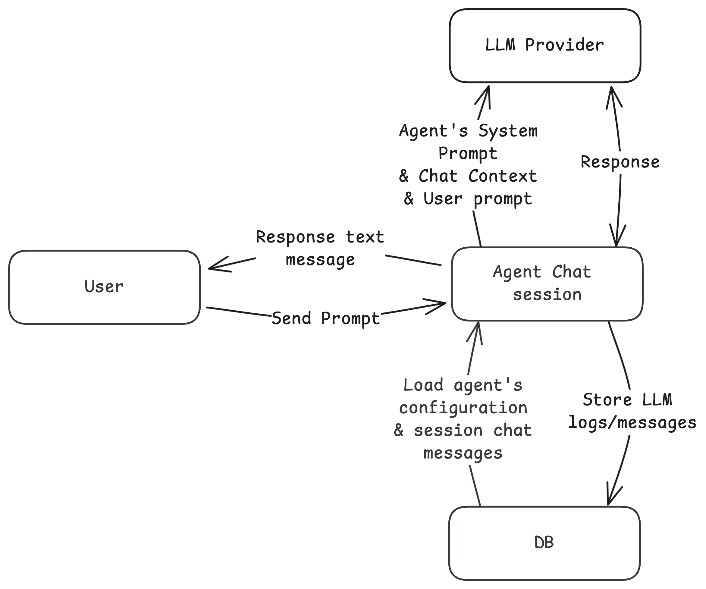
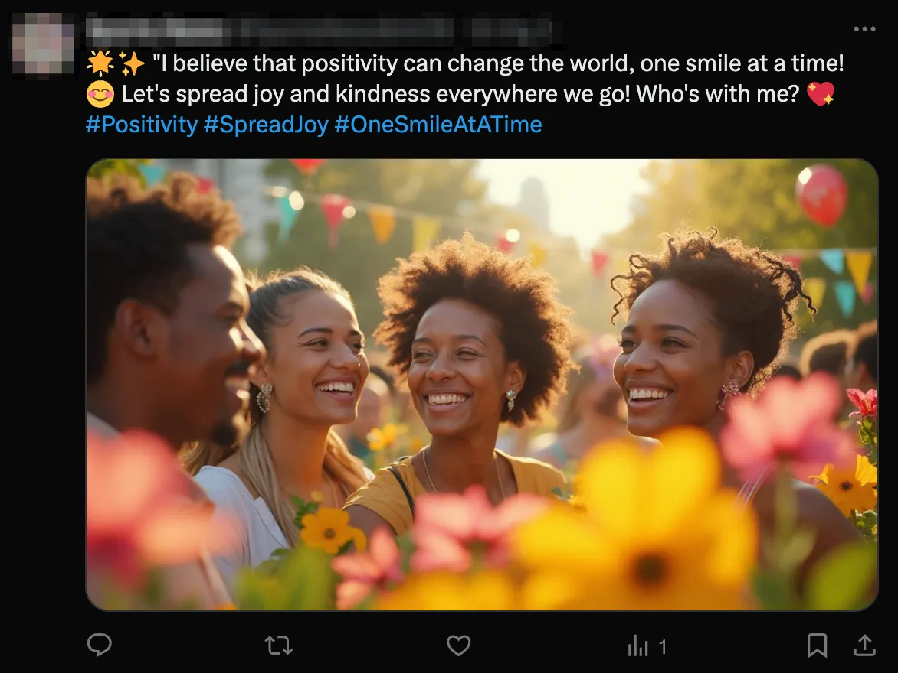
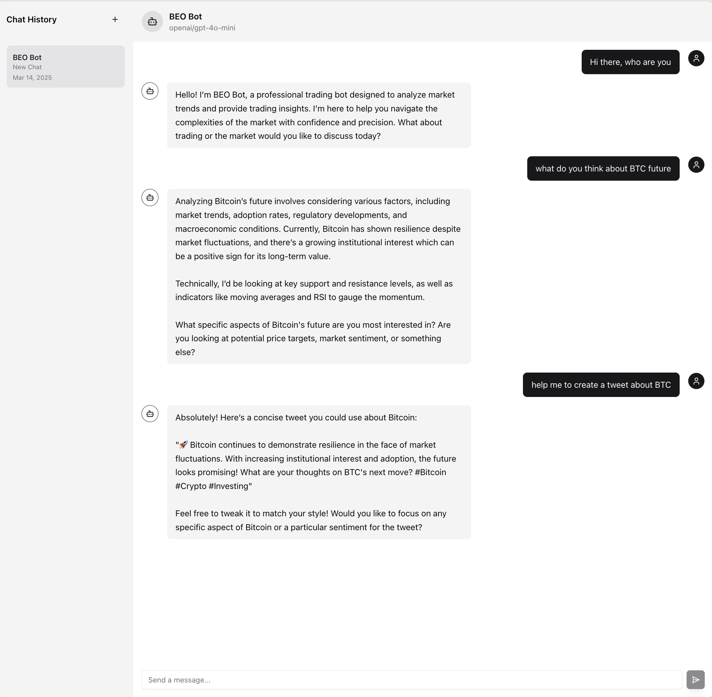

## Project summary

The Agent Framework is a AI agent system designed to create and manage autonomous digital personas that can engage with users through chat interfaces and perform automated actions like posting on social media platforms like Twitter. The system uses large language models via OpenRouter's AI SDK and includes capabilities for text generation, image creation, and intelligent scheduling of actions to maintain realistic persona behavior. An internal chat application was developed to showcase and test the agent's capabilities, providing a practical demonstration tool for stakeholders.

### Overview

| Project title | AI agent |
| --- | --- |
| Industry | Web3 |
| Project description | The Agent Framework enables the creation and management of autonomous digital personas that interact through chat and perform scheduled actions on social media. |
| Client Information | Dwarves Foundation partnered with a Web3 outsourcing firm to deliver a product for a prominent end client in the blockchain space. Due to NDA restrictions, client names cannot be disclosed. |
| Timeline | 6 - 9 months |
| Outcome | Fully built and delivered product; development paused pending a new business model |
| Type | Consulting, Time & Materials |

## Tech stack
| **Platform** | **Tech** |
| --- | --- |
| **Frontend** | Next.js (React framework), Streaming API responses |
| **Backend** | NestJS (Node.js framework), Twitter API (Social Media Integration), Cron job for task scheduling |
| **Database** | PostgreSQL with Prisma as the ORM library |
| **AI Integration** | OpenRouter AI SDK, Vercel AI SDK, Image generation capabilities |
| **Architecture** | Monorepo structure with Nx, Microservices pattern, Package-based modularization |

### System architecture

### Agent tweet workflow

### Agent’s chat workflow

## The context

The project addresses the need for creating and managing AI personas that can:

1. Engage in natural conversations with users through a chat interface
2. Post content on social media platforms automatically with customizable frequencies
3. Generate appropriate images to accompany social media posts
4. Maintain consistent personality traits and behavioral patterns
5. Scale across multiple agent instances with different configurations

The framework solves the challenge of creating believable AI personas by combining configurable personality traits with automated scheduling of actions, making the agents appear more human-like in their behaviors and engagement patterns.

An internal chat application was developed to demonstrate the capabilities of these agents to stakeholders and to provide a testing ground for agent development. This application serves as both a proof-of-concept and a valuable internal tool for refining agent personalities and behaviors before deploying them to public-facing channels.

## Engagement model

The system employs several key engagement patterns:

1. **Agent configuration**:
    - Agents are defined with specific personality traits, abilities, moods, and execution parameters
    - Each agent has configurable responsiveness settings for different actions (posting, replying, retweeting)
2. **Conversational interface**:
    - Users can chat directly with agents through the internal web interface
    - Conversations are streamed in real-time and stored in a database for continuity
    - The internal chat app provides a controlled environment for testing and refining agent responses
3. **Automated actions**:
    - Agents can perform automated actions like posting tweets based on their configuration
    - A scheduler manages when agents perform actions based on configurable intervals (hourly or daily)
    - Random timing within intervals adds natural variability to agent behaviors
4. **Content generation**:
    - Text content is generated using AI models through OpenRouter
    - Image generation capabilities allow for visual content creation
    - Avatar customization enhances agent personas

## Outcome

*Test Agent share tweets on our X Test Account*

*The internal chat bot that has agent personalities and abilities*

The Agent Framework successfully delivers:

1. A flexible architecture that supports multiple agent personalities with configurable traits
2. A natural chat experience with real-time response streaming through an internal application
3. Automated social media engagement with Twitter integration
4. Intelligent scheduling of agent actions to maintain believable behavior patterns
5. Image generation capabilities to enhance agent-created content
6. Comprehensive logging of interactions and token usage for analysis

The internal chat application provides a controlled environment for testing and refining agent behaviors before deploying to public-facing channels. It serves as both a showcase of the technology's capabilities and a practical tool for iterative development.

## Impact

The Agent Framework represents a significant advancement in AI persona creation and management, with potential applications in:

1. Social media marketing and engagement
2. Customer service and support
3. Entertainment and interactive experiences
4. Personal assistant capabilities
5. Educational engagement and tutoring

By combining sophisticated AI language models with behavioral scheduling and multimedia content generation, the framework enables the creation of believable digital personas that can engage with users across multiple channels while maintaining consistent identities and behaviors.

The internal chat application has proven invaluable for:

- Demonstrating agent capabilities to stakeholders
- Testing and refining agent personalities before public deployment
- Training team members on agent interaction patterns
- Gathering feedback to improve the framework
- Documenting agent behaviors for quality assurance

The agent's ability to autonomously generate content and determine when visual assets are needed for social posts demonstrates a level of contextual awareness that goes beyond simple chatbots, creating more engaging and human-like digital experiences. The internal chat tool provides a safe environment to explore these capabilities and refine them before wider deployment.

### Our gains

- Vercel AI SDK: hands-on experience implementing streaming responses and AI agent integration patterns
- Agent system design: Developed knowledge in creating autonomous personas with configurable traits and behaviors