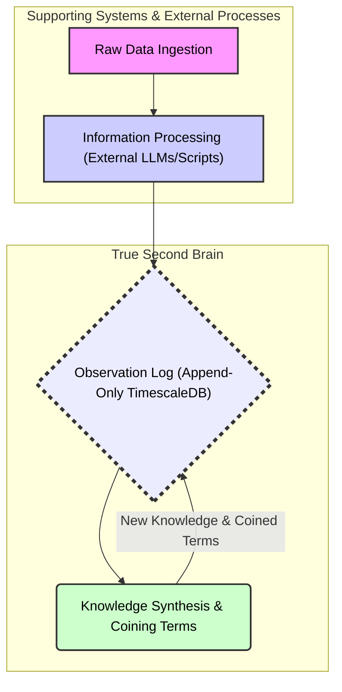
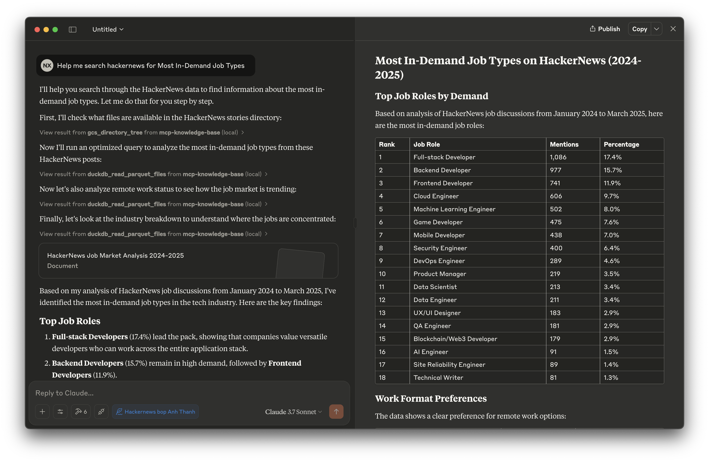
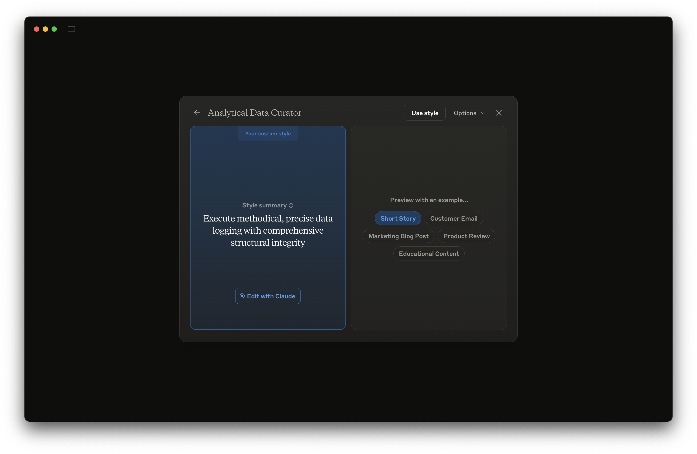
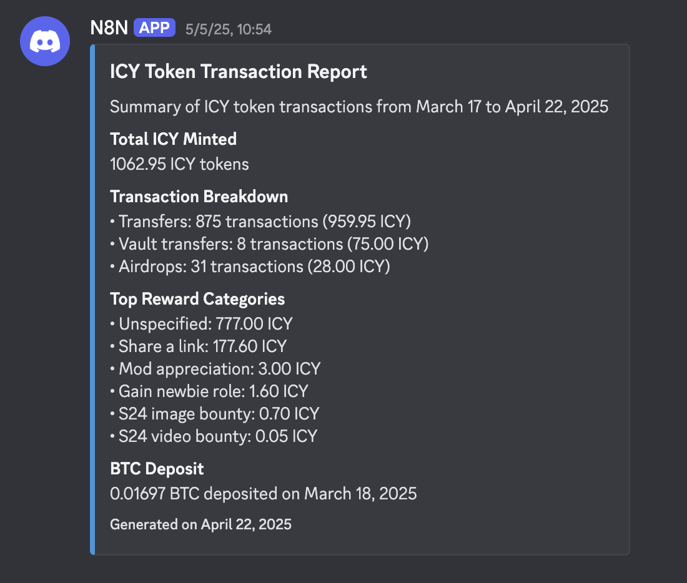

> Prev: [A true Second brain - Motivations](a-true-second-brain-motivations.md)

Look, building systems that *actually* learn, that get smarter over time? It's hard. Traditional databases? They're brittle. New info comes in, and *bam*, you're in **migration** hell. And **Large Language Models (LLMs)**, as amazing as they are, can suffer from **catastrophic forgetting (CF)** – teach them something new, and they might forget the old stuff. Trying to just stuff everything into **in-context learning (ICL)**? That doesn't scale. Prompts get insane.

We're taking a different path. We're building a **true second brain**. This isn't just about storing data. It's about creating a system that continuously learns, generates genuine **insight**, and then *remembers* it, making itself more valuable every single day. We'll show you how specific, real-world use-cases feed this brain, and the kind of powerful new capabilities that spin out as a result.

## The architectural bedrock: an append-only log for evolving understanding

So, what's the core? It's simple, actually. A single, massive log called the **observation_log**. This thing runs on **TimescaleDB**, and it's **append-only**. Every piece of data, every processed thought, every new **insight** – it all gets written as a new entry. *Nothing ever gets deleted or changed in place*. This is fundamental. It's how we kill **CF** at the data layer.

And the magic for flexibility? Each entry in this log has a **JSONB payload**. This means the *structure* of what we store can change on the fly. No rigid schemas breaking when we discover something new. If the **LLM** figures out a new way to categorize information, it just starts doing it. No permission slips needed. The **LLM** is the cognitive engine here – processing raw inputs, structuring them, and then, critically, analyzing the entire log to pull out new **knowledge**.

## The cycle of learning: transforming signals into persisted knowledge

How does this brain actually learn? It’s a continuous loop, kind of like how we learn, but supercharged.



1. First, **Data Ingestion**. Raw stuff comes in from all over – API outputs, system logs, messy text from chats or documents. Just raw signals.

2. Then, **Information Processing**. This often happens in our supporting systems, which we'll get to. Dedicated scripts, maybe other **LLMs**, chew on that raw **Data**. They structure it, pull out key entities, figure out relationships. Now it's **Information** – organized and meaningful.

3. Next, this **Information** gets piped into the **observation_log** of our **true second brain**. It becomes a permanent record.

This is where the internal **LLM** of the second brain really goes to work. **Knowledge Synthesis & Coining Terms**. It scans all this accumulated **Information**, using cool **TimescaleDB** features like **continuous aggregates** to spot trends, patterns, weird correlations over time. When it sees something significant, something *new* emerging from the noise, it synthesizes this into **Knowledge**. Often, it will literally **coin a term** to describe this new concept it just "understood." Think of it like inventing a new word for a new idea.

And the final, crucial step: **Knowledge Persistence**. This new **Knowledge**, these **coined terms**, get written *back* into the **observation_log** as a brand new, enriched observation. Boom. The brain didn't just process data; it *learned* something new and made that learning a permanent, queryable part of itself.

This loop runs constantly. The brain isn't static. It's actively getting smarter.

## Fueling the second brain: supporting use-cases delivering actionable information

This brain doesn't live in a vacuum. It gets its power from real-world operational systems and analytical processes that feed it high-quality, structured **Information**. These are the tributaries keeping the river of intelligence flowing.

### Analyzing Hacker News: tapping into the tech zeitgeist

Hacker News? It's a goldmine of what's next in tech. The **raw data** is all there – posts, comments, job listings. Great for ad-hoc **data analysis** with Claude Desktop + our MCP server to convert that raw data into valuable information to then pipe to our second brain.



We achieve this through our knowledge in creating system prompts and creating custom styles to guide Claude Desktop to behave the way we want.



Otherwise for other stuff in the background, we use an external **LLM**-powered job that dives in, does **Named Entity Recognition (NER)** to spot technologies and companies, figures out the **Sentiment Analysis** (are people loving or hating this new gadget?), and detects **Trends** (like "everyone's hiring prompt engineers!"). This all gets packaged up as **Information** and shot straight into the `observation_log`.

> Imagine an `observation_log` entry:
>
> ```json
> {
>   "context_id": "hackernews:post:12345678",
>   "content_summary": "Big buzz around 'XYZ Corp's new Vector DB'. People love the scalability.",
>   "entities": [{"name": "XYZ Corp", "type": "company"}, {"name": "Vector DB", "type": "technology_category"}],
>   "sentiment": {"topic": "XYZ Vector DB", "score": 0.85, "label": "positive"},
>   /* ... more data ... */
> }
> ```
This stream helps our second brain build a live map of the tech landscape. Powerful stuff.

---

### Monitoring ICY token usage: insights into platform dynamics

We've got our ICY token. Understanding how it's used is key. **Raw data** comes from blockchain transactions, platform analytics (who's staking what, which dApp features are hot). Scripts crunch this, calculating active wallets, transaction volumes, staking trends. This processed **Information** – say, "ICY staking is up 15% this week in Europe" or "major spike in transactions related to NewFeatureX" – goes into the brain. Now it has a real-time pulse on the ICY ecosystem.



---

### CRM intelligence: enhancing customer relationships and sales pipelines

Our CRM is packed with **raw data** – contacts, emails, call logs, deal stages. An **LLM**-assisted process sifts through this, looking for signals. "This lead went cold but just hit our pricing page three times." Or, "Sentiment in emails with Client X is trending down." This **Information**, these alerts and summaries, give the second brain a deep understanding of our sales funnel and customer health. We can spot opportunities, or problems, way faster.

---

### Project sales performance: optimizing consulting and engineering engagements

After we finish a project, there's a ton of **raw data**: scope, tech stack, team, client feedback, profit margins. Analytical tools, maybe with some **LLM** help for the fuzzy feedback, turn this into **Information**. "Projects using Technology Y with senior engineers have 20% higher margins." Or, "Clients consistently praise our 'agile communication' on these types_of projects." This feedback loop makes the second brain smarter about what actually *works* in our engagements.

## Synthesizing knowledge: the emergence of coined terms

Okay, so all this **Information** is pouring into the `observation_log`. Now the second brain's internal **LLM** starts connecting dots across *all* these different streams. This is where it gets really interesting.

Maybe it sees:
*   Hacker News buzzing about "AI code refactoring tools."
*   CRM showing clients asking about "automating legacy system upgrades with AI."
*   Our project performance data highlighting successful "AI-assisted COBOL to Java migrations."

The **LLM** looks at this convergence and has an "aha!" moment. It says, "This isn't just three random things. This is a *thing*." And it might **coin a term** for it:

`"AI-Augmented Legacy Modernization" (AALM)`

It then writes a new observation to the log, defining AALM, linking it back to the source observations that sparked the idea, and giving it a confidence score.
```json
{
  "context_id": "system:knowledge_synthesis:2025-08-01",
  "content": "Coined 'AI-Augmented Legacy Modernization' (AALM)...",
  "coined_terms": [{"name": "AI-Augmented Legacy Modernization", "acronym": "AALM", /* ...details... */}],
  /* ...more data... */
}
```
This **coined term**, AALM, is now **Knowledge**. It's a new concept the brain understands, can track, and can use to interpret future information. It’s like the brain just learned a new word and its meaning, derived from experience.

## Unlocking multiplied value: derivative use-cases of an evolving intellect

Once the second brain starts building up this kind of synthesized **Knowledge**, some seriously powerful new capabilities light up. This is where it goes beyond just being a smart database.

### A conversational knowledge partner: the "current state" of Dwarves Foundation

Suddenly, you can just *talk* to it. "Hey brain, what's the latest on 'AI-Augmented Legacy Modernization'? What are clients saying, what's the industry vibe?" Instead of digging through emails and asking ten people, you get a consolidated, nuanced answer. It's like having an oracle for the organization's collective intelligence. Information silos? Smashed.

### Cross-domain insight fusion: accelerating best practices

This is huge. The brain can connect dots we'd never see. It might link specific sales tactics for AALM projects (from CRM data) with engineering team structures that led to the highest profits on those same projects (from performance data). Then it could literally suggest:

> "New Best Practice: For AALM deals, lead with the 'Phased AI Assessment' sales play. And staff it with a team that has both deep legacy system knowledge AND experience with our new AI migration toolkit. Expect X% better outcomes."

It's generating *new strategies* by fusing knowledge from completely different parts of the business.

### Trend foresight: preparing for what's next

Because it's constantly tracking how these **coined terms** and underlying **Information** streams evolve, the brain becomes an early warning system. If "AALM" mentions are skyrocketing everywhere, that's a clear signal: big opportunity, gear up! If buzz around an older tech is dying, it'll flag that too. We can be proactive, not reactive. Train people, shift focus, build new products *before* the wave hits, not after.

## Conclusion: towards a continuously self-improving intellect

So, what are we building here? It's more than just a clever database. It's an engineering approach to a system that actually gets smarter. It eats **Information**, digests it into **Knowledge**, and that **Knowledge** makes it better at understanding the next wave of **Information**. It's a virtuous cycle.

No more brittle schemas. No more **LLMs** forgetting what they learned. The **append-only log**, the flexible **JSONB**, the smart **LLM** synthesis – this architecture is built for evolution. The supporting use-cases feed it, the derivative use-cases are the payoff. This isn't just theory. It’s how you build a brain that genuinely accumulates wisdom and becomes an indispensable partner. The future is a learning system. Let's build it!
