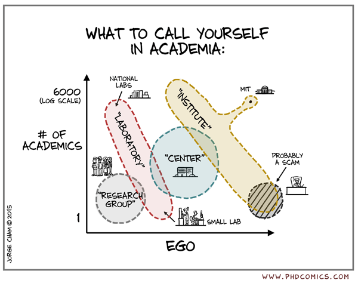

Welcome,

After surviving multiple tech waves, we've learned something crucial: the research-first approach isn't just a nice philosophy, it's the right way for our team and its advantages are clear. While others chase trends and scramble to keep up, we dig deeper, think longer-term, and consistently deliver insights that others miss.

Want to build a tech company that leads with big ideas and creates a community around them? This guide shows you how to turn research into a business that makes money, lasts long, and stands out. It's for anyone; entrepreneurs, researchers, or dreamers; who wants to solve problems and bring people together.

A research-first company puts discovery first, but here's what we've learned: it's also the most practical approach for staying ahead. You dig into tough questions while others avoid them, create solutions that command premium pricing, and share knowledge that builds unshakeable reputation. It's not just about being smart (though that helps!). It's about building sustainable competitive advantages that compound over time. This guide breaks it down into battle-tested steps: start with a strong research team, understand your unique value, and build systems that survive market shifts. You'll learn how to turn insights into profit, weather industry changes, and attract the kind of people who thrive on solving hard problems.

With practical tips and real-world lessons, each chapter gives you clear advice to build a company and community that thrive. Expect straightforward ideas, a few techie terms (like trade secrets or ops), and no fluff. Whether you're starting small or aiming big, this is your guide to creating something that lasts; a business that turns research into real results and a community that supports it.

#### Core model

- [Profitable](profitable.md): Make more money than you spend
- [Sustainable](sustainable.md): Stay strong over time
- [Research to Value](research-value.md): Turn ideas into products or impact
- [Company](company.md): Brand value + Trade secrets

#### How to build

- [Research Team](research-consulting.md): Start with a strong research team
- [Identity](identity.md): Know your mission & what makes you special
- [Get money to grow](funding.md): Investors, grants, or partners
- [Trusted Brand](brand.md): Build a trusted brand: Be known for great work
- [Share your ideas](sharing-ideas.md): Create research, posts, or tools
- [Resilience](resilience.md): Stay resilient: Pass the test of time
  - [Knowledge Hub & Ops](knowledge-hub.md): Build a central hub for knowledge & ops
  - [Tough Times](tough-times.md): Handle tough times (tech shifts, money issues)
- [Talent](talent.md): Attract & keep talented people
- [Community](community.md): Grow a community: Events, forums, or online groups
- [Scaling](scaling.md): Scale smart: Grow big but stay research-first

---

- Next: [Profitable: make more money than you spend](profitable.md)
