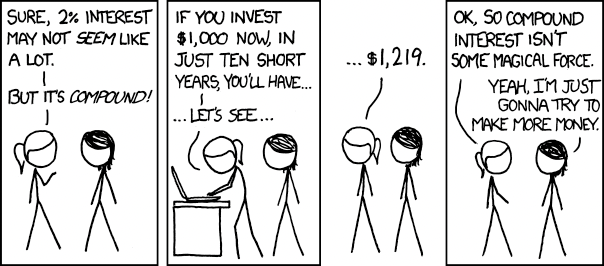

Here's something most people miss about building a company: you're not just creating a business, you're building assets that compound over time. Think about it: your knowledge base grows, your network expands, your processes get smarter, your customer relationships deepen, and your team expertise accumulates. But among all these compounding assets, there's one that stands above the rest: **your brand**.

While other assets have limits (you can only hire so many people, store so much data), brand value? That keeps growing, wave after wave. People come and go, projects end, markets shift, but brand value sticks around and compounds. Think of it like building credit: every good move adds to your reputation, and over time, that reputation starts working for you instead of you working for it.

The smartest move? Go inbound. Instead of chasing clients or talent, build a brand so strong that they come to you. When people hear your company name, they should think "those are the folks who really know their stuff." That's not luck, that's intentional brand building through positive footprints.

## Making your mark

So how do you leave these positive footprints? It's simpler than you think. Open-source your tools so others can benefit. Write articles that actually help people solve problems. Share insights that make the industry smarter. Build products that people genuinely love using. Each of these moves adds another layer to your brand value.

The goal isn't just recognition, it's magnetic positioning. You want to create a brand that people are excited to be associated with. Whether it's potential employees saying "I'd love to work there" or clients thinking "these are exactly the people we need," your brand should pull the right people toward you.

Keep this in mind: every interaction, every piece of work, every public move either adds to or takes away from your brand. Choose to add. The compound effect over time becomes your biggest competitive advantage.

---

- Next: [Share your ideas: create research, posts, or tools](sharing-ideas.md)
