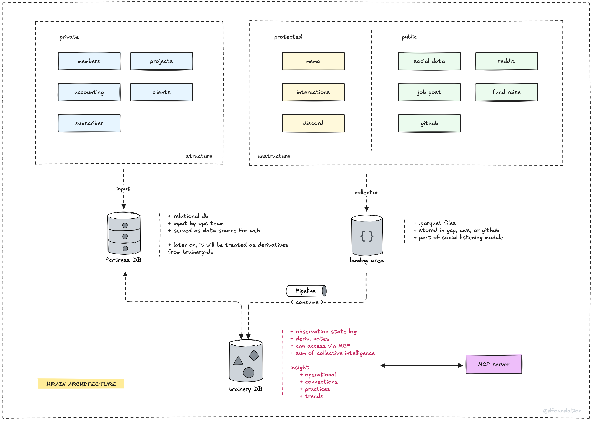

Companies that last have one thing others don't: **institutional memory**. They capture what they learn, document what works, and build systems that remember so individuals don't have to. Without this, you're constantly reinventing the wheel, losing hard-won insights when people leave, and making the same mistakes over and over.

Your knowledge hub becomes the brain of your organization. It's where lessons learned get stored, processes get documented, and insights get preserved. For a research-first company, this isn't just nice to have, it's essential survival equipment.

## What goes in the hub

**Project learnings** should be captured while they're fresh. What worked? What didn't? What would you do differently next time? These insights become gold for future projects, but only if someone takes the time to write them down and make them findable.

**Process documentation** keeps operations smooth as you grow. How do you onboard new clients? What's your research methodology? How do you handle common problems? Document these once, refine them continuously, and save countless hours of explanation and confusion.

**Industry insights** and research findings need a home where the whole team can access and build upon them. Today's random observation might be next month's breakthrough, but only if it's captured and connected to other knowledge.

## Making it work

The best knowledge hubs are living documents, not digital graveyards. They're easy to update, searchable, and actually used by the team. Think wiki-style collaboration where everyone contributes and benefits. The key is making it as easy to add knowledge as it is to find it.

For us, this vision became reality through our [Brainery engine](/brainery) - a sophisticated "second brain" system designed for continuous learning and transforming raw data into actionable insights. It goes beyond simple documentation to actually promote information from data to wisdom, connecting insights across projects and time. The system interfaces human cognition with AI to help us not just store knowledge, but truly understand and apply it.

Start simple: a shared space where people can quickly capture insights, document processes, and connect ideas. Complexity kills adoption, so begin with the basics and let the system evolve with your needs. Whether you build something custom like Brainery or use existing tools, the goal is the same: create a system that actually gets used.

The key insight: knowledge that isn't shared and preserved dies with the person who has it. Your hub ensures that hard-won wisdom becomes organizational strength, not individual power.

---

- Next: [Tough times: handle tough times (tech shifts, money issues)](tough-times.md)
