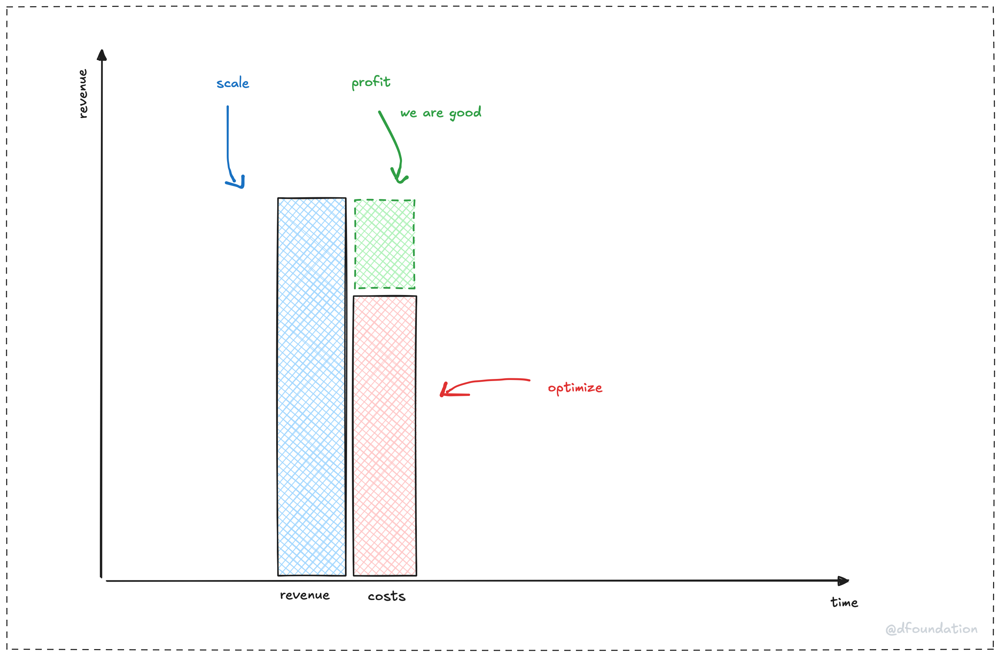

At its heart, a company's success boils down to one thing: **making more money than it spends**. That's profitability in a nutshell: **revenue > costs**. It's not about fancy formulas or overthinking it. It's a straightforward way to see if a company's winning or just spinning its wheels.

- **Revenue** is the cash coming in, the money a company makes from selling stuff, offering services, or whatever it does to bring in the bucks.
- **Costs** are what it spends to make that happen, think team, tools, or tech.

When revenue beats costs, boom, you've got profit. It's like a scoreboard: if the "money in" number is bigger than the "money out" number, the company's in the green. Simple as that.

## Why this matters

This view cuts through the noise. A company could have massive revenue, millions rolling in, but if its costs are even higher, it's not profitable. Picture a tech giant raking in cash but blowing it all on wild experiments. No profit, no dice. On the flip side, a smaller outfit with modest revenue can still win big if its costs are tiny. It's not about size; it's about that gap.

For a research-first crew like us, this keeps us grounded. We're here to dig into big questions and innovate, but profitability means we can keep doing that without running on fumes. It's the fuel for the long haul, sustainability, not just survival.

## Keeping it light

No stress here; just a clear way to look at things. Profitability isn't about pinching pennies or slashing budgets (we won't go there!). It's about knowing the game: bring in more than you shell out. Whether we're consulting, selling a tool, or building a community, it's all about making that revenue bar climb higher than the costs bar. Easy, right?

So, yeah, that's the simple view: **profit = revenue > costs**. It's the heartbeat of a company, and it keeps us moving forward.

---

- Next: [Sustainable: stay strong over time](sustainable.md)
