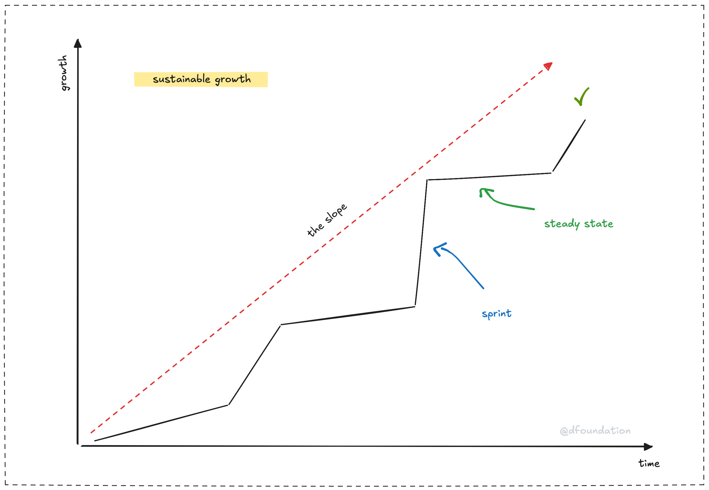

Ever wonder how some companies just keep thriving, year after year, no matter what hits them? It's not magic: it's **sustainability**. For us, that means looking ahead and making choices that keep our company strong not just today, but for the long haul. Think of it like saving up for something big instead of spending every penny right now. It's about the future as much as the present.

Picture a tree. It doesn't grow tall overnight. It takes time, steadily stretching its roots deep into the ground. Those roots keep it standing through storms. That's us too. We're building a solid base with every decision, so we can handle whatever comes our way and still keep growing.

Here's what that looks like:

- **Resilience**: We're not just dodging trouble; we're ready to roll with it. When things shift (markets, tech, you name it), we've got systems to adapt. Like that tree bending in the wind but never snapping.
- **Community**: We lean on our people: customers, team, partners. Those strong ties aren't just feel-good; they're our strength when times get tough.
- **Innovation**: We keep moving forward, tweaking and improving. It's not about jumping on every bandwagon. It's about staying sharp and relevant.

Imagine a timeline: a line climbing up over the years, with a few dips but always heading higher. That's sustainability: steady progress, not a sprint.

So how do we do it? It's all about asking: "Does this help us down the road?" Every hire, every project, every dollar spent. We weigh it for the long term. Quick wins are great, but we're playing for something bigger.

The cool thing? It's just thoughtful choices, one after another. Strengthening our roots, growing our community, pushing ahead smartly. That's how we stay strong over time, ready for today and whatever's next.

---

- Next: [Research to value: turn ideas into products or impact](research-value.md)
