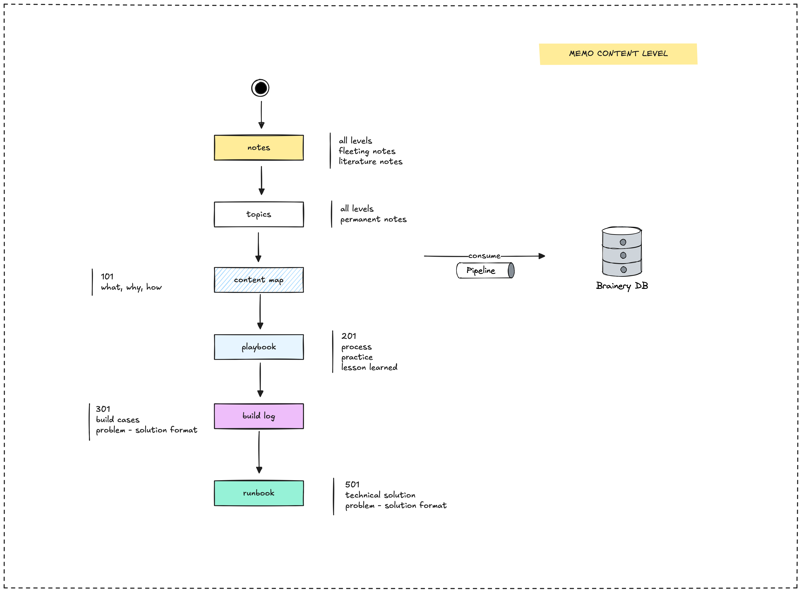

Memo is where we organize and render our knowledge base, capturing our activities, content maps, focused topics, and more. It's not just a static blog engine; it's a place designed to connect generations of Dwarves alumni by making our shared knowledge accessible.

The knowledge is stored in our second brain database, a system designed for interconnected learning and retrieval. We have a series of documents in our handbook that cover various aspects of Memo.

## Purpose and key features

Dwarves Memo serves as a collaborative knowledge repository for the Dwarves Foundation. It's where our team members share insights, technical documentation, and other knowledge in a searchable, accessible format. Here's what the system does:

- Converts Markdown/Obsidian notes into a structured web application.
- Provides advanced search functionality with AI-powered embeddings.
- Enables permanent storage of selected content on Arweave.
- Supports NFT minting of content on blockchain networks.
- Offers a collaborative platform with version history tracking.

## Memo build log

Here's a list of documents detailing the development of Memo:

- [Architecture](memo-architecture.md): Understand the overall design and structure of the Memo platform.
- [Git repos relation](multi-git-submodules.md): Learn how we manage our codebases using multi-git submodules.
- [Single makefile](single-makefile.md): Details the use of a single makefile to streamline development tasks.
- [Static site by choice](static-site-by-choice.md): Explains why we chose a static site approach for Memo.
- [DuckDB as intermediary storage](duckdb-as-intermediary-storage.md): Describes how we use DuckDB as an intermediary storage solution.
- [Onchain permanent storage](onchain-permanent-storage.md): Covers the implementation of permanent storage on Arweave.
- [Build pipeline](build-pipeline.md): Outlines the automated process for building and deploying Memo.
- [Automate static site deployment](deployment.md): Focuses on the automation of our static site deployment process.
- [Build an onchain profile](onchain-profile.md): Explains the process of creating an onchain profile for content creators.

---

> Next: [Architecture](memo-architecture.md)
