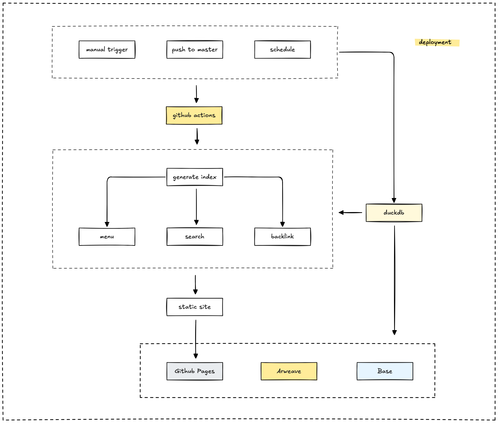

The Memo platform leverages GitHub Actions to automate the deployment process. This includes publishing the website and integrating with our blockchain and permanent storage systems.

## GitHub Actions workflows

We use several distinct GitHub Actions workflows to manage different aspects of the deployment pipeline:

| Workflow | Trigger | Purpose |
| --------- | ------- | ------- |
| **main.yml**           | Push to `main`                   | Builds and deploys the Next.js application to GitHub Pages. |
| **dispatch.yml**       | Push to `dev`                    | Updates submodules and exports processed data to DuckDB.    |
| **deploy-arweave.yml** | Push to `main` (parquet changes) | Deploys content marked for permanent storage to Arweave.    |
| **add-mint-post.yml**  | Push to `main` (parquet changes) | Mints selected content as NFTs on the blockchain.           |
| **backup.yml**         | Daily schedule                 | Creates a daily backup of the DuckDB database to AWS S3.    |

## Deployment workflow steps

The overall deployment process is a multi-step workflow that ensures content is built, optimized, and published correctly:

1. **Content processing:** The content goes through the DuckDB pipeline for extraction, processing, and storage.
2. **Static index generation:** We generate static files for the navigation menu, search index, backlinks, and redirects.
3. **Next.js static site generation:** Next.js builds the static website from the processed content and generated indexes.
4. **Deployment to GitHub Pages:** The built static site is published to GitHub Pages, making it accessible to users.
5. **Optional onchain actions:** Content marked for permanent storage is deployed to Arweave, and selected content can be minted as NFTs.

---

> Next: [Build an onchain profile](onchain-profile.md)
