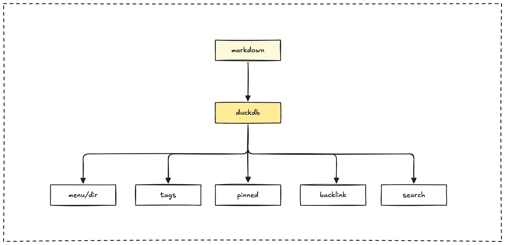

The Elixir pipeline is responsible for extracting content and metadata from our Markdown files. It processes this information using AI techniques and stores the results in a DuckDB database.

This database plays a central role in powering various features of the Memo platform, including the search functionality, the content displayed on the web application, the process for permanent storage on Arweave, and the NFT minting capabilities.

All the processed content is stored in a DuckDB table named `vault`. Here's a look at its structure:

```sql
CREATE TABLE vault(
    file_path VARCHAR, 
    md_content VARCHAR, 
    tags VARCHAR[], 
    title VARCHAR, 
    date DATE, 
    description VARCHAR, 
    authors VARCHAR[], 
    estimated_tokens BIGINT, 
    embeddings_openai FLOAT[1536], 
    total_tokens BIGINT,
    hide_frontmatter BOOLEAN,
    hide_title BOOLEAN,
    pinned VARCHAR,
    featured BOOLEAN,
    spr_content VARCHAR,
    embeddings_spr_custom FLOAT[1024],
    draft BOOLEAN,
    should_deploy_perma_storage BOOLEAN,
    should_mint BOOLEAN,
    previous_paths VARCHAR[],
    -- Additional fields omitted for brevity
);
```

This schema is designed to capture a wide range of information about each content item:

- **File Metadata:** Essential details like the file path, raw Markdown content, title, description, date, and authors.
- **Organization:** Tags and other categorizations to help structure and find content.
- **Display Settings:** Flags that control visibility and options for pinning or featuring content.
- **AI-Processed Data:** Includes generated embeddings (both OpenAI and custom), compressed content, and token counts for search and analysis.
- **Integration Flags:** Boolean values that control whether content should be deployed to permanent storage or minted as an NFT.
- **Historical Data:** Tracks previous file paths to maintain references even when files are renamed or moved.



## Data processing pipeline

The DuckDB component is integral to the multi-stage pipeline that processes our Markdown files before they are stored and ready for export.

### File processing workflow

Files move through a pipeline that handles extracting frontmatter, processing the content itself, and performing necessary database operations.

### File history tracking

We track file history using Git. This allows us to maintain associations between files even when they are renamed, ensuring that content references and links remain intact throughout the repository.

## Database operations

The DuckDB component performs several key operations to ensure data integrity, currency, and efficiency within the database.

### Upsert operation

To handle updates to file content, the system uses an 'upsert' approach, specifically a delete-then-insert method. This ensures that any changes to a file's content are accurately and properly reflected in its corresponding record in the database.

### Embedding regeneration

The system is capable of detecting when AI embeddings for content need to be regenerated. This typically occurs when the content of a file changes or if embeddings are found to be missing for a particular entry.

## Practices

When working with the DuckDB schema and the content pipeline, keep these best practices in mind:

- Always add new columns to the `@allowed_frontmatter` list in `export_duckdb.ex` before you start using them in your frontmatter.
- When you rename files, make sure to commit the rename using Git. This is crucial for maintaining the correct content associations and history.
- Use the recommended export format, which is Parquet, for optimal efficiency when working with the data outside of DuckDB.
- Be aware that for larger files (those over 7500 tokens), only custom embeddings will be generated; OpenAI embeddings will not be included for these files.

> Next: [Onchain permanent storage](onchain-permanent-storage.md)
