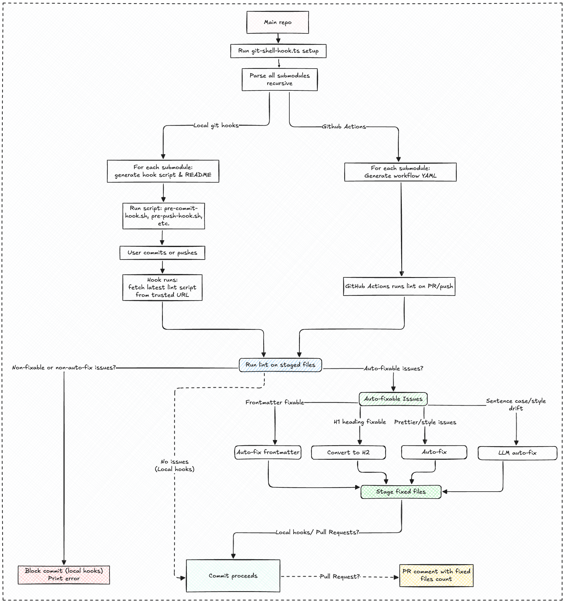

Maintaining a healthy knowledge base requires attention to detail: consistent headings, complete frontmatter, valid links, and stylistic coherence over time. However, enforcing quality across a multi-repository system—where content is authored by many contributors and rules evolve—presents a significant challenge. We address this complexity through a sophisticated Markdown linting and formatting pipeline, integrating traditional rule engines with generative AI to ensure consistency and efficiency.

## Why automate markdown quality?

Initially, relying on contributors to follow conventions might seem sufficient. However, as our knowledge base expanded, we encountered increasing entropy: inconsistent headings, missing metadata, broken links, and gradual stylistic divergence. Manual review became unsustainable, driving us to develop a system capable of:

- Enforcing structural integrity (frontmatter completeness, heading levels, link validity)
- Standardizing stylistic elements (sentence case, Prettier formatting)
- Seamlessly integrating with local developer workflows and CI/CD pipelines
- Adapting to evolving rules and diverse content types

## Modular linting: rules as code

We developed a modular linting engine that dynamically loads rule modules from `scripts/formatter/rules/`. Each rule is implemented as a TypeScript file following a standardized interface: it analyzes files, reports violations, and optionally provides automated fixes. Our current rule set includes:

- **Frontmatter validation**: Guarantees every note contains required fields (`title`, `description`, `date`), proper YAML structure, and canonical field ordering.
- **No H1 headings**: Prohibits the use of `#` level headings in content, ensuring titles are consistently sourced from frontmatter.
- **Relative link existence**: Verifies that all relative links within content point to valid, existing files.
- **Prettier formatting**: Applies Prettier across the entire file, leveraging project-specific configuration when available.
- **Sentence case via LLM**: Utilizes OpenRouter (GPT-4) to convert headings, titles, and key phrases to sentence case while intelligently preserving proper nouns and acronyms.

This linting system operates flexibly, capable of processing any file set recursively or by pattern, and offers straightforward extensibility—new rules can be added simply by dropping additional TypeScript files into the `rules/` directory.

## How does lint work?

The cornerstone of our linting system is `scripts/formatter/note-lint.ts`, a TypeScript module that orchestrates the entire linting and formatting process through these key steps:

1. **File discovery:** Accepts file paths or glob patterns, recursively identifying all Markdown files requiring linting.
2. **Config loading:** Dynamically loads linting rules from `.notelintrc.js`, `.notelintrc.json`, or `package.json` if present, otherwise falling back to a default configuration.
3. **Rule execution:** For each file, parses frontmatter and content, then sequentially executes each rule module. Rules can report errors, warnings, and optionally provide auto-fixes.
4. **Auto-fixing:** When executed with `--fix` or within git hook/CI contexts, applies all available fixes—including Prettier formatting and LLM-based sentence case—then stages changes using `git add`.
5. **Reporting:** Generates a comprehensive summary of errors, warnings, and fixes printed to the console. In CI environments, it sets outputs for GitHub Actions to facilitate auto-commit and PR comment generation.
6. **Extensibility:** New rules can be seamlessly integrated by adding a file to the `rules` directory and updating the index.

This modular, rule-driven methodology enables us to enforce structural integrity, stylistic consistency, and even AI-powered conventions across thousands of Markdown files—both locally and in CI—without requiring manual intervention.

## Generative formatting: LLMs in the loop

A particularly innovative aspect of our system is the integration of generative models for style normalization. The `sentence-case.ts` rule extracts all headings, frontmatter titles, and key phrases, then leverages OpenRouter's GPT-4 API to convert them to sentence case. This process intelligently preserves acronyms and proper nouns while maintaining stylistic consistency—a subtle yet powerful approach to standardization, especially as new content and contributors join the ecosystem.

This methodology operates recursively: the linter extracts content, the LLM rewrites it, and the linter applies the changes. If the API key is unavailable locally, the rule gracefully skips execution; however, it always runs in CI environments to ensure consistent quality.

## Markdown lint overview

### Git hooks: local enforcement

To proactively identify and resolve issues before they reach the repository, we employ a sophisticated shell-based Git hook manager (`scripts/git-shell-hook.ts`). This script transcends simple hook installation—it orchestrates a robust, recursive, and self-updating system for Markdown quality enforcement across all submodules.

The system operates through these key capabilities:

- **Recursive submodule discovery:** Identifies all Dwarves Foundation submodules by parsing `.gitmodules` files and exploring nested submodule structures.
- **Standalone hook script generation:** Produces dedicated hook scripts (`pre-commit-hook.sh`, `pre-push-hook.sh`, etc.) within each submodule, containing embedded logic to fetch and execute the latest linting script from a trusted URL.
- **Comprehensive documentation:** Creates a README for each hook, detailing usage instructions, troubleshooting guidance, and security considerations.
- **Flexible command handling:** Manages install, remove, and status operations for each hook, both from the root repository and within individual submodules.
- **GitHub Actions workflow integration:** Supports automated generation of GitHub Actions workflows to ensure CI/CD parity.

The hooks themselves are engineered for resilience: they retrieve the latest linting script on every execution, support both TypeScript and JavaScript execution environments, and automatically update as the central linting logic evolves. This design ensures that every commit—across every submodule—adheres to the same Markdown quality standards with minimal manual oversight.

### GitHub Actions: CI for markdown everywhere

For continuous integration, the same `scripts/git-shell-hook.ts` script generates tailored GitHub Actions workflows for each submodule. These workflows operate through a defined sequence:

1. **Script acquisition:** Downloads the latest linting script (available in both TypeScript and JavaScript formats).
2. **Environment setup:** Installs necessary dependencies, including `tsx` for TypeScript execution environments.
3. **Change detection:** Identifies modified Markdown files within pull requests or push events.
4. **Linting execution:** Runs the linter, applying Prettier and sentence case fixes automatically when required.
5. **Automated updates:** Auto-commits and pushes formatting changes back to the pull request branch.
6. **Feedback mechanism:** Posts a persistent PR comment summarizing all applied modifications.

The workflow architecture emphasizes modularity, allowing triggering via push events, pull requests, or manual dispatch. It securely manages sensitive information like the OpenRouter API key and executes formatting steps only when necessary, optimizing both performance and resource utilization.

## Lessons and open questions

Our implementation has yielded several key insights:

- **Rule modularity is fundamental.** Adding or updating a rule simplifies to editing a single file—eliminating the need to modify the linter's core functionality.
- **Cross-repository consistency is achievable.** By generating hooks and workflows for every submodule, we maintain high standards uniformly across all repositories, not merely the primary repository.
- **Automation potential remains vast.** We are actively exploring how LLMs could further enhance our workflows through applications like link rewriting, automated summary generation, and even changelog composition.

This approach ensures we maintain both structural integrity and stylistic coherence across our knowledge base while continuously exploring new frontiers for automation and enhancement.
