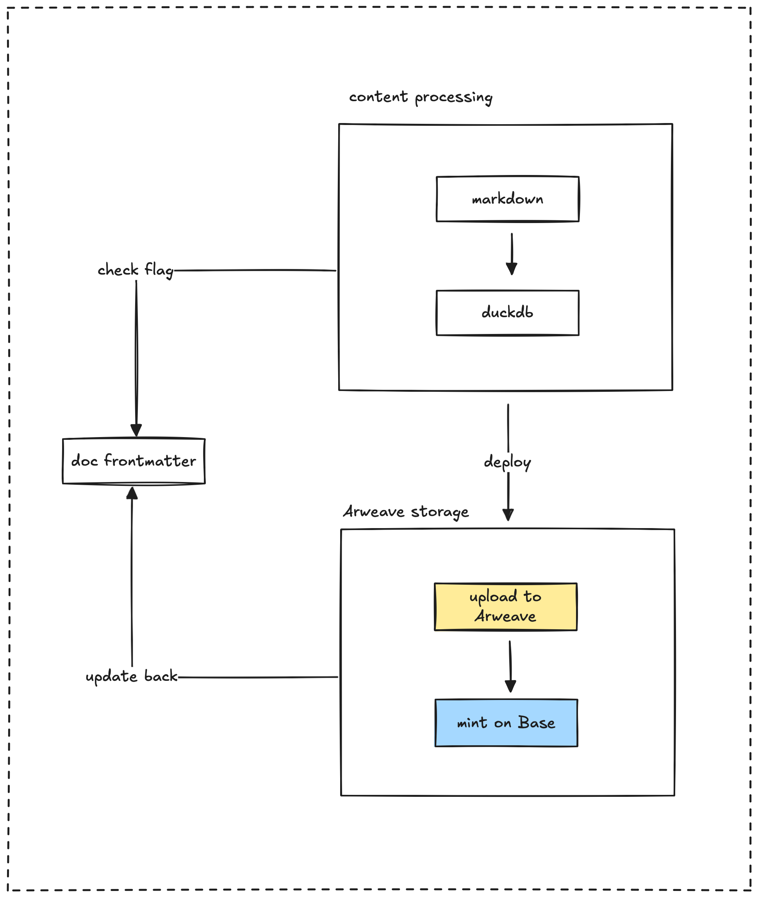

In designing the Dwarves Memo, a key goal was to **minimize maintenance costs**. In software development and operations, these costs can accumulate significantly over time, encompassing everything from debugging and updates to server upkeep and dependency management. Our tech stack selection and architectural choices were made with this in mind, aiming for a lean, efficient, and sustainable system.

This document provides a quick overview of the Memo platform's architecture and design.

## Tech stack

The development environment and key technologies for Memo include:

- **Devbox:** Provides isolated, reproducible environments with Nix.
- **Git Submodules:** Manages content repositories and dependencies.
- **Elixir:** Powers the content processing pipeline.
- **Node.js and PNPM:** Used for the web application.
- **DuckDB:** Our choice for data storage and querying.
- **Git:** Essential for version control and tracking content history.
- **Makefile:** Provides convenient commands for common development tasks.
- **Arweave:** Used for permanent, decentralized content storage.
- **Base Blockchain:** Underpins NFT minting and onchain interactions.
- **RainbowKit:** Facilitates wallet connections for Web3 features.

## Component diagrams

Let's look at how content flows through the system. The pipeline starts with your Markdown files from Obsidian, transforms them into a structured database, and then presents them through our web application. We can also store selected content permanently on Arweave or even mint it as NFTs.

Within this system, we handle a few key types of files and data sources:

- **Markdown files:** These are our original content source.
- **DuckDB:** This acts as a secondary or derivative data source.
- **.config files:** These hold important configuration settings.

## Component roles

The architecture functions like a pipeline, with each component playing a specific role:

| Component | Purpose | Key Files |
|------------|---------|-----------|
| **Content Sources**   | Original Markdown files and assets from Obsidian    | Git submodules, markdown files |
| **Processing Pipeline** | Extracts content, processes metadata, generates embeddings | `export_duckdb.ex`        |
| **Storage Layer**     | Maintains content database, exports to parquet      | `db/schema.sql`, `vault.parquet` |
| **Web Application**   | Renders content with dynamic routing and search     | `[...slug].tsx`           |
| **Deployment**        | Automates building and publishing of content      | GitHub workflows          |

## Content processing pipeline

The heart of the system is the pipeline that processes Markdown files from Obsidian and structures them into a format stored in DuckDB. Here's how it works:

1. The Elixir-based compiler extracts and processes Markdown files.
2. Content is compressed, and embeddings are generated to power the search functionality.
3. We track metadata, including frontmatter, links, and Git history.
4. The processed data gets stored in a DuckDB database, specifically in `vault.parquet`.

## Data storage

We primarily use DuckDB to store our data, with options to export to various formats:

1. `vault.parquet`: This is where our processed content is mainly stored.
2. We generate indexes for search, the menu structure, backlinks, and redirects.
3. Optionally, we can export data to Arweave for permanent storage.
4. We also integrate with blockchain for NFT minting of selected content.

## Web application

The web application, built with Next.js, is the interface for browsing, searching, and interacting with our content. It provides a user-friendly experience with these key features:

- Dynamic routing for content pages.
- A command palette for powerful search capabilities.
- Markdown rendering with syntax highlighting and math support.
- Web3 integration to handle blockchain interactions.
- A responsive design that supports both dark and light themes.

## Web3 integration

The system connects with blockchain technology to enable various features. This integration includes:

1. A Web3Provider context that wraps the entire application.
2. RainbowKit for seamless wallet connections.
3. Support for minting content as NFTs.
4. Integration with Arweave for permanent and decentralized storage.

The Web3Provider is responsible for setting up the connection to blockchain networks and managing wallet states.

---

> Next: [Git repos relation](multi-git-submodules.md)
