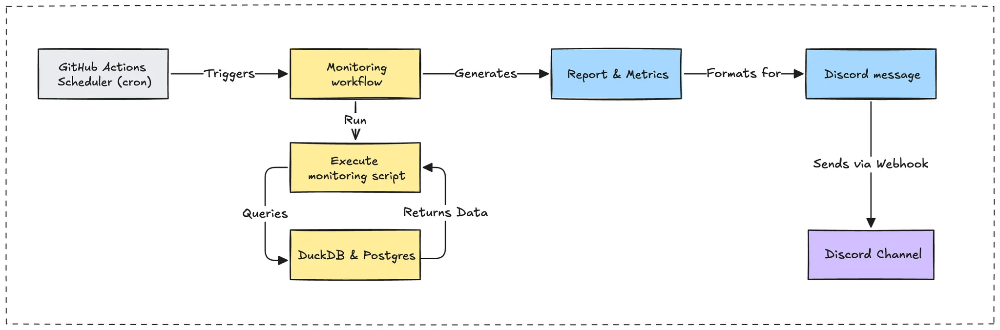

To ensure the operational reliability of our **memo.d.foundation**, we have developed a comprehensive, dual-mode monitoring system that combines proactive **synthetic monitoring** with reactive **instrumental alerts**. This integrated strategy provides complete visibility into platform health, from business metrics to real-time system events.

## Key benefits of our dual-mode approach

Our hybrid monitoring strategy delivers significant operational advantages by addressing the limitations of traditional single-method systems:

- **Proactive and reactive coverage**: We combine scheduled "scout" checks for landscape-level health with event-driven "messenger" alerts for immediate issue notification, eliminating visibility gaps.
- **Early issue detection**: Synthetic monitoring identifies potential data quality or pipeline bottlenecks before they impact user experience or downstream processes.
- **Real-Time event awareness**: Instrumental monitoring provides immediate feedback on critical events, such as NFT mints and CI/CD pipeline status, enabling rapid engineering response.
- **End-to-end data integrity**: Our checks span the entire data lifecycle, from Markdown content ingestion and **Parquet** file health to database consistency and AI embedding generation.



### Proactive health audits: Synthetic monitoring

Our synthetic monitoring platform operates on a fixed schedule, executing a series of checks against our core data assets and business logic. It serves as our early warning system, providing a regular pulse on the health of the entire **memo.d.foundation** system and catching issues before they escalate.

#### NFT system reporting (`memo-nft-report.ts`)

This daily report provides a comprehensive overview of our minting pipeline and NFT collection activity. It leverages **DuckDB** to execute federated queries across both our canonical **Parquet** vault and our production **PostgreSQL** database, unifying disparate data sources into a single, coherent view.

**Federated data integration:**

The system joins data from a remote Parquet file and a PostgreSQL table to generate a holistic report.

```typescript
// Dual-source data integration with DuckDB
const vaultMetrics = await connection.runAndReadAll(`
  SELECT
    COUNT(CASE WHEN should_mint = true THEN 1 END) as mintable_total,
    COUNT(CASE WHEN should_mint = true AND minted_at IS NOT NULL THEN 1 END) as minted_count
  FROM read_parquet('https://memo.d.foundation/db/vault.parquet')
`);

const collectionMetrics = await connection.runAndReadAll(`
  SELECT
    COUNT(*) as total_events,
    SUM(amount) as total_collected
  FROM memo_nft_db.memo_nft.memo_minted_events
`);
```

This daily audit, running via a `cron` schedule in **GitHub Actions**, tracks key performance indicators, including:

- **Minting pipeline health**: Monitors success rates, queue depth, and pending content.
- **Collection activity**: Analyzes total collection events, revenue, and unique collectors.
- **Author and content Trends**: Identifies top contributors and popular content tags.

#### Data vault integrity (`monitor-vault-parquet.ts`)

This check is designed to verify the completeness and quality of our core knowledge vault. It provides a quick, color-coded health status that allows us to assess data integrity at a glance.

**Data quality metrics:**

Our script assesses the vault based on a predefined set of quality metrics.

```typescript
interface VaultMetrics {
  totalRecords: number;
  missingDates: number;
  missingAuthors: number;
  missingEmbeddings: number;
  pendingMint: number;
  pendingArweave: number;
}
```


**Health status logic:**

The system uses tiered thresholds to classify the vault's health, ensuring we prioritize critical issues effectively.

```typescript
const hasWarnings = metrics.missingDatesPercent > 25 || metrics.missingAuthorsPercent > 40;
const hasCritical = metrics.pendingMint > 20 || metrics.missingEmbeddings > 100;
const healthStatus = hasCritical ? '🔴 Critical' : hasWarnings ? '🟡 Warning' : '🟢 Healthy';
```

This provides **actionable insights** by immediately flagging which specific metrics have crossed their warning or critical thresholds, enabling focused remediation.

### Real-time event notifications: Instrumental monitoring

Where synthetic monitoring is proactive, our instrumental monitoring is reactive. It operates across several integration layers to provide immediate notifications based on specific system events.

#### NFT minting alerts

When a new article is successfully minted as an NFT, our `notify-discord-minted-articles.ts` script is triggered. This process handles community communication by sending a rich, formatted Discord notification. We leverage the **Model Context Protocol (MCP)** to generate context-aware messages that are more informative and engaging than standard text.

**MCP Integration for rich notifications:**

```typescript
await mcpDiscord.callTool({
  name: "discord-send-embed",
  arguments: {
    username: "Memo NFT",
    webhookUrl: process.env.DISCORD_WEBHOOK_URL,
    content: generatedMessage,
    title: "📢 New notes minted in the Memo",
    autoFormat: true,
  }
});
```

This system ensures both optimal performance and high reliability through:

- **Connection resilience**: Implements a retry mechanism for establishing the initial connection.
- **Exponential backoff**: If a notification fails, the system waits progressively longer before retrying, preventing API rate-limiting issues.
- **Graceful error handling**: Failures are logged without crashing the parent workflow.


#### CI/CD workflow monitoring

We have integrated instrumental monitoring directly into our **GitHub Actions** workflows. This provides real-time status updates on deployments and other critical automated processes, sending success or failure notifications to a dedicated Discord channel.

**Standardized notification steps:**

```yaml
- name: Notify Discord on Success
  if: success()
  uses: sarisia/actions-status-discord@v1
  with:
    webhook: ${{ secrets.DISCORD_WEBHOOK_URL }}
    title: '✅ Deployment Completed Successfully'
    color: 0x00ff00

- name: Notify Discord on Failure
  if: failure()
  uses: sarisia/actions-status-discord@v1
  with:
    webhook: ${{ secrets.DISCORD_WEBHOOK_URL }}
    title: '❌ Deployment Failed'
    description: 'Please check workflow logs for details.'
    color: 0xff0000
```

### System architecture and implementation

Our monitoring platform is built on a modern, flexible technology stack chosen for its performance, ease of integration, and alignment with our team's expertise.

#### The DuckDB analytics engine

We selected **DuckDB** as our core data processing engine due to its unique capabilities for in-process analytics. It allows us to perform complex analytical queries on local and remote data sources without the overhead of a traditional data warehouse.

**Key advantages:**

- **Federated queries**: Natively queries remote Parquet files and connects to our live **PostgreSQL** database in a single session.
- **High performance**: Columnar-vectorized query execution is highly optimized for analytical workloads.
- **Zero-dependency**: Runs entirely in-memory, simplifying our CI/CD environment setup.

**PostgreSQL integration:**
The connection process involves loading the `postgres` extension and attaching our remote database as a read-only source.

```typescript
async function setupDuckDBConnections(): Promise<DuckDBConnection> {
  const instance = await DuckDBInstance.create(':memory:');
  const connection = await instance.connect();

  // Load extensions and attach remote database
  await connection.runAndReadAll('LOAD postgres;');
  await connection.runAndReadAll(`
    ATTACH '${process.env.DB_CONNECTION_STRING}' AS memo_nft_db (TYPE postgres, READ_ONLY);
  `);

  return connection;
}
```

### Security and data handling

We built our monitoring system with security and responsible data handling as core principles:

- **Secure credentials management**: All credentials, such as API keys and database strings, are managed as **GitHub Secrets**. Access is limited by the **principle of least privilege**, and our services connect using a dedicated **read-only** database user to prevent accidental data modification.
- **Privacy by design**: We practice **data minimization** in all public-facing reports to protect community privacy. For instance, collector wallet addresses are truncated to show activity trends without revealing full identities.

  ```typescript
  // Address truncation for privacy
  const truncatedAddress = String(row.address || '').substring(0, 8) + '...';
  ```

### Success metrics

We track a set of key performance indicators to measure the effectiveness of our monitoring infrastructure:

- **Monitoring with Uptime**: Targeting 99.9% uptime for all monitoring services, ensuring continuous visibility.
- **Alert latency**: Average delivery time for critical alerts is under 2 minutes.
- **Data freshness**: Reports leverage data that is never more than 6 hours old.
- **Query performance**: Complex analytical reports complete in under 30 seconds.

### What's next?

While the current work provides a solid foundation, we have several enhancements planned to further improve our monitoring capabilities:

- **Automated remediation**: For common, well-understood issues, we will explore self-healing capabilities to reduce manual intervention.
- **Executive dashboards**: We will create higher-level dashboards that distill technical metrics into clear business insights for leadership.
