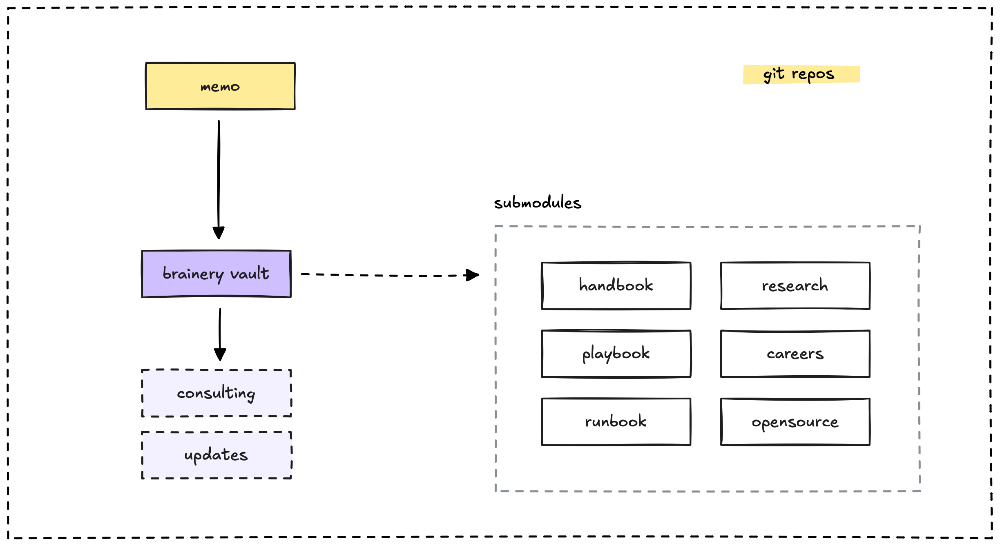

We heavily rely on Git submodules to link multiple content repositories together for the Memo platform. Initially, these repositories were organized based on purpose, such as **handbook** or **playbook** content. As the project evolved, more repositories were introduced, eventually leading to the structure centered around the **brainery** vault.

To allow developers to browse these repositories using the standard Git interface without breaking the history, we've kept them as separate entities.

When a sub-repository is updated, it triggers a workflow in the main repository to update the Git commit reference for file preparation. Following this, the [build pipeline](build-pipeline.md) runs to process the changes.

## Git workflow and content management

The development environment leverages Git for version control and includes specific configurations for managing our content repositories. The main repository is set up to:

- Ignore build artifacts, environment files, and generated content.
- Utilize Git submodules for organizing and managing content.
- Provide scripts for fetching and updating content efficiently.

## Workflow related to Git submodules

Git submodules are crucial for how we manage our content repositories. Here's a look at the key workflows involving them:

### Fetch process

The `git-fetch.sh` script handles updating our nested submodules. It:

- Uses depth limiting to improve performance during fetching.
- Provides an HTTPS fallback in case of SSH failures.
- Maintains a cache to avoid unnecessary updates.

### CI integration

Our GitHub Actions workflows automate submodule updates. They are configured to:

- Update submodules before content processing begins.
- Limit recursion depth to prevent excessive fetching operations.

---

> Next: [Use makefile to simplify development](single-makefile.md)
