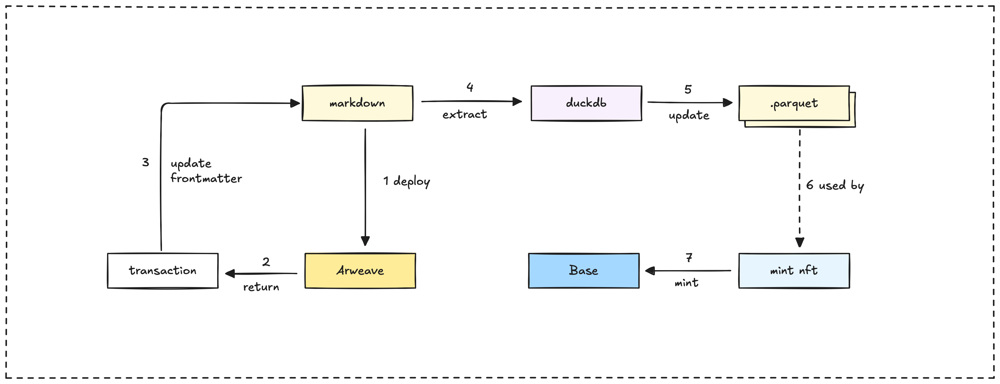

### Why we use onchain permanent storage

We utilize onchain permanent storage primarily for cost savings in the long run, as maintaining content on traditional infrastructure can become expensive.

Storing content onchain significantly reduces future maintenance efforts and costs. Additionally, this approach helps in building a verifiable onchain profile for our users.

### Permanent storage and NFT integration overview

The Memo platform allows selected content to be marked for permanent storage on Arweave or for minting as an NFT. Here's a brief overview of these processes:

1. **Arweave Storage:** Content intended for permanent storage is marked with `should_deploy_perma_storage: true` in its frontmatter. The `deploy-arweave.yml` workflow identifies these files and uploads them. After a successful upload, the `perma_storage_id` field in DuckDB is updated with the Arweave transaction ID.

2. **NFT Minting:** Content designated for NFT minting is marked with `should_mint: true` in its frontmatter. The `add-mint-post.yml` workflow processes these files for minting. Upon successful minting, the `token_id` and `minted_at` fields are updated in DuckDB.

3. **Database Updates:** Both Arweave storage and NFT minting operations trigger updates in the DuckDB database. The updated database is then exported to a parquet file, which in turn triggers rebuilds of the web application to reflect the changes.



## Arweave storage

The integration with Arweave allows for the persistent and decentralized archival of selected content from the Memo knowledge base. This offers several key benefits:

1. Permanent, decentralized storage for important content.
2. Content addressable access using Arweave transaction IDs.
3. Preservation of content even if the primary hosting becomes unavailable.
4. Provides a solid foundation for subsequent NFT minting operations.

## Content selection mechanism

We select content for Arweave storage by using specific frontmatter flags within the Markdown files:

| Flag                          | Type    | Description                                        |
| ----------------------------- | ------- | -------------------------------------------------- |
| `should_deploy_perma_storage` | Boolean | When set to `true`, this marks the file for Arweave deployment. |
| `perma_storage_id`            | String  | This field is automatically populated with the Arweave transaction ID after a successful deployment. |

The deployment workflow efficiently queries the DuckDB database to find files that meet the criteria for Arweave deployment:

```sql
SELECT STRING_AGG(file_path, ',') 
FROM 'db/vault.parquet' 
WHERE should_deploy_perma_storage = true AND perma_storage_id IS NULL;
```

This query specifically looks for files that are marked for deployment but do not yet have an associated Arweave transaction ID.

### File processing

Each file selected for Arweave storage goes through a specific processing sequence:

1. The system reads the file content and extracts the frontmatter.
2. The content is prepared for Arweave storage, including relevant metadata.
3. Images within the content are detected and uploaded to Arweave first.
4. The main content is then deployed as a JSON payload.
5. Finally, the file's frontmatter is updated with the resulting Arweave transaction ID.

### Image handling

Images embedded in the Markdown content are also processed and stored permanently. The system:

1. Detects the first image in the content using regex patterns.
2. Resolves the image path relative to the Markdown file.
3. Uploads images to Arweave separately from the content.
4. Includes the image transaction IDs within the content payload stored on Arweave.

This process ensures that all visual assets linked in the content are also permanently archived and correctly referenced.

## Arweave transaction structure

Understanding how content is packaged for Arweave helps clarify the permanent storage process.

### Content payload format

Content is stored on Arweave as a JSON object. This structure includes the content itself along with essential metadata:

```json
{
  "content": "Markdown content...",
  "timestamp": 1234567890123,
  "type": "article",
  "name": "Article Title",
  "description": "Article description",
  "image": "ar://ImageTransactionId",
  "authors": ["Author Name"]
}
```

### Transaction tags

Each Arweave transaction includes specific tags. These tags improve discoverability and help verify the content:

| Tag          | Description                                       |
|--------------|---------------------------------------------------|
| `Content-Type` | Set to "application/json" for content transactions. |
| `digest`       | The SHA-256 hash of the content for verification.    |

Images uploaded separately also receive appropriate `Content-Type` tags based on their file extension.

### Transaction ID storage

The `deploy-arweave.ts` script is responsible for the entire process of storing content on the Arweave network. Its key steps include:

1. Reading the Markdown file, extracting both frontmatter and content.
2. Finding and uploading any images referenced within the content.
3. Creating a JSON payload that includes the content and its metadata.
4. Uploading this payload to Arweave using a configured Arweave wallet.
5. Updating the original file's frontmatter with the resulting Arweave transaction ID.

After a successful deployment, the script updates the markdown file and, indirectly through subsequent workflows, the DuckDB database. When these updated files with the `perma_storage_id` are committed back to the repository, the next database export run captures these transaction IDs, making them available throughout the system.

## NFT minting

The NFT minting system allows selected content to be tokenized on a blockchain. This creates a permanent and verifiable record of the intellectual property. This process happens in two main steps:

1. The content is first stored permanently on Arweave.
2. An NFT is then minted, with the token referencing the content stored on Arweave.

### Content preparation for minting

To mark content for NFT minting, you need to set two specific flags in the Markdown file's frontmatter:

| Flag | Purpose | Required Value |
| -----| ------- | -------------- |
| `should_deploy_perma_storage` | Ensures permanent storage on Arweave is enabled. | `true`         |
| `should_mint`                 | Enables the content for NFT minting.                  | `true`         |

Here's an example of how the frontmatter would look:

```yaml
---
title: "Important Document"
description: "A document that should be permanently stored and minted"
author: "John Doe"
date: 2023-01-01
should_deploy_perma_storage: true
should_mint: true
---
```

The system automatically processes files with both these flags set during the build process. It handles the Arweave deployment first and then proceeds with the NFT minting.

### NFT minting process

The `add-mint-post.ts` script manages the technical steps for NFT minting. For each eligible file (those with a `perma_storage_id` and `should_mint=true`), the script:

1. Processes the file.
2. Connects to a configured Ethereum smart contract using a provided private key.
3. Calls the smart contract's `createTokenType` function, passing the Arweave transaction ID.
4. Retrieves the unique token ID generated by the smart contract.
5. Updates the file's frontmatter, adding the `token_id` and `minted_at` values.

## Monitoring and verification

After the minting process is successfully completed, the frontmatter of the document is updated with the following fields:

| Field | Description | Example Value |
|-------|-------------|----------------|
| `perma_storage_id` | The transaction ID from Arweave, confirming permanent storage. | `"XYZ123..."`    |
| `minted_at`        | The date when the NFT was successfully minted.           | `"2023-04-01"`   |
| `token_id`         | The unique identifier for the minted NFT on the blockchain. | `"42"`           |

These updated fields provide a way to verify that a document has been both permanently stored on Arweave and minted as an NFT. You can access the content directly on Arweave using the URL format: `https://{perma_storage_id}.arweave.net`.

---

> Next: [Build pipeline](build-pipeline.md)
