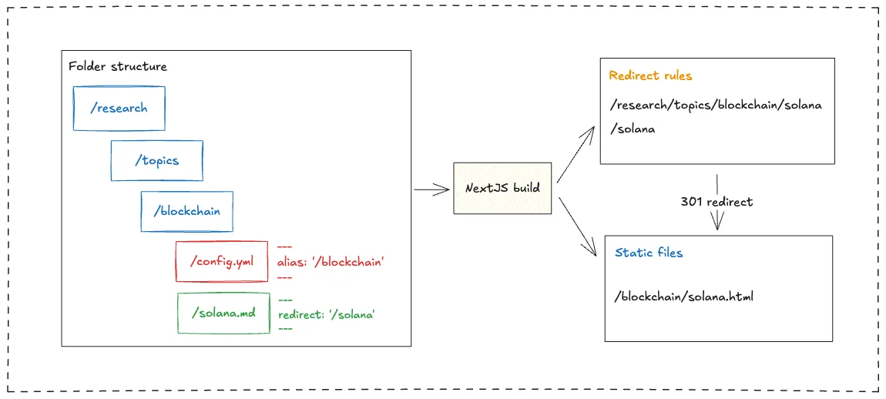

We implemented a comprehensive **URL redirect system** for NextJS static memo pages that transforms deeply nested directory structures into SEO-friendly, shareable URLs. The system addresses the core problem of user-unfriendly URLs like `/research/topics/blockchain/defi-protocols.md` by creating clean aliases such as `/blockchain/defi-protocols` while maintaining full backward compatibility.

The solution operates across three integration layers: build-time static generation, server-side redirect handling, and automated CI/CD workflows. This approach ensures both optimal performance and maintainable URL management for content teams.

## Core architecture components

### Directory-level alias

The **folder alias system** uses `config.yml` files to define directory-wide URL shortcuts. Here's how the configuration structure works:

```yaml
# /research/topics/blockchain/config.yml
alias: blockchain
title: 'Blockchain Research'
description: 'Comprehensive blockchain technology analysis'
```

When this configuration is present, all files within `/research/topics/blockchain/` become accessible via the `/blockchain/` path. The system generates static HTML files at these alias locations during the NextJS build process, ensuring fast page loads without server-side processing.

The **recursive inheritance** pattern allows subdirectories to inherit parent aliases unless explicitly overridden. For example, files in `/research/topics/blockchain/defi/` would be accessible via `/blockchain/defi/` unless the defi subdirectory defines its own alias.

### Individual file redirects

The system supports **file-level redirect overrides** through markdown frontmatter configuration:

```markdown
---
title: 'DeFi Protocol Analysis'
redirect:
  - '/defi-analysis'
author: 'Research Team'
---

# Content begins here...
```

Individual redirects work independently from folder aliases, providing content managers with granular control over specific file destinations. When users access a redirect link, the system directs them to the alias path if defined, otherwise to the existing nested path.

### URL resolution engine

The **URL resolution engine** processes requests through two independent systems: folder aliases and individual file redirects. The system demonstrates this behavior in the following example:



As shown in the diagram, the system handles different access patterns distinctly. When users access `/research/topics/blockchain/solana`, they receive a 301 redirect to the alias path `/blockchain/solana(.html)`. The `solana.md` file contains `redirect: '/solana'` in its frontmatter, which creates an independent redirect behavior. Users accessing the `/solana` redirect link are directed to `/blockchain/solana(.html)` since the folder alias is defined, ensuring consistent routing through the alias system.

The resolution process occurs during the NextJS build phase, generating static files at alias paths and creating nginx redirect maps for server-side handling.

## Static generation pipeline

The build process leverages NextJS **static export capabilities** to generate HTML files at alias paths while creating nginx redirect configuration during compilation.


The build process operates through parallel configuration parsing and file processing streams. The system scans `config.yml` files for folder aliases and processes markdown files for individual redirect declarations. These inputs generate `alias.json` and `redirect.json` files, which are consolidated into the comprehensive `nginx_redirect_map.conf` for server-side redirect handling.

The `generateRouteMap()` function traverses the directory structure, parses configuration files and markdown frontmatter, then creates a comprehensive mapping of all required static routes for both original and alias paths.

All of these operations occur during the NextJS build phase, ensuring that the static export process generates all necessary files and configurations without requiring additional runtime processing.

## Nginx configuration management

### Redirect map generation

The system generates `nginx_redirect_map.conf` files that handle server-side redirects for original nested paths. The configuration follows this pattern:

```nginx
map $request_uri $redirect_uri {
    default 0;

    /research/topics/blockchain/defi-protocols /blockchain/defi-protocols;
    /research/topics/blockchain/consensus /blockchain/consensus;
}
```

The **redirect map approach** provides efficient server-side processing without requiring complex rewrite rules or application-level routing. All redirects use 301 status codes to maintain SEO value and indicate permanent URL changes.

The nginx configuration integrates seamlessly with **Railway's deployment environment**. The generated configuration files are automatically included in the deployment package, ensuring that redirect behavior is consistent across development and production environments.

## Automated workflow and link generation

The system provides automated redirect generation through both local development triggers and GitHub Actions integration. The workflow handles shortened link creation and maintains redirect configurations automatically.


For existing files, developers can trigger redirect generation locally during development. When new files are added to the repository, GitHub Actions automatically detects changes and runs the `generate-redirect.ts` script. The script includes uniqueness checking to prevent URL conflicts and generates deterministic shortened links for new content.

## Integration benefits

This URL redirect system delivers measurable improvements in content shareability and SEO performance while maintaining full backward compatibility with existing URLs. The automated workflow reduces manual maintenance overhead for content teams and ensures consistent URL behavior across all deployment environments.
