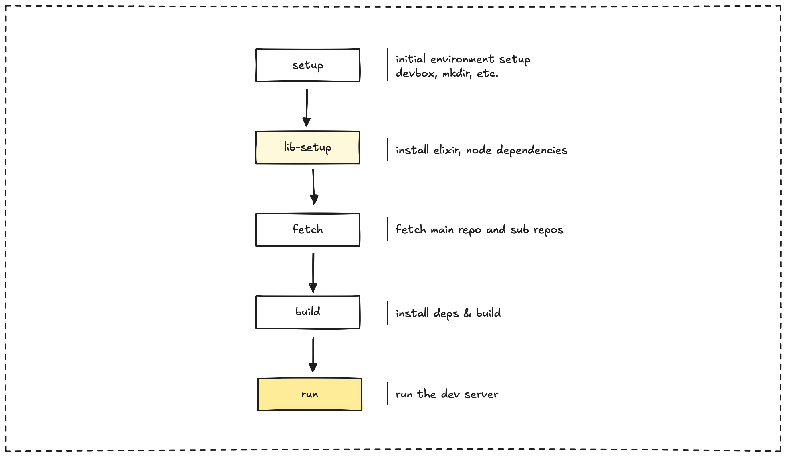

The Memo project incorporates multiple technologies, including Elixir, Node.js, and shell scripts. This diversity could pose a challenge for new team members trying to set up the development environment. To address this and accelerate the development process, we utilize a single Makefile.

This Makefile standardizes our toolchain and orchestrates various aspects of building, running, and exporting data.

## Common development tasks

The Makefile provides a set of key commands to streamline common development tasks:

| Command | Description | Implementation |
| -------- | ----------- | --------------- |
| `make setup`         | Initializes the environment.    | Installs Devbox and creates the content directory.                |
| `make lib-setup`     | Installs Elixir dependencies.  | Runs Hex and Rebar setup, then fetches dependencies.               |
| `make fetch`         | Fetches content repositories.   | Executes the Elixir fetch process and the `git-fetch.sh` script.                       |
| `make build`         | Builds the entire application. | Installs dependencies, exports markdown, and builds the Next.js application.  |
| `make run`           | Runs the development server.   | Exports markdown, generates indexes, and starts the Next.js development server. |
| `make duckdb-export` | Exports data to DuckDB.        | Removes the old database file and runs the DuckDB export process.                |

## Project structure

The development environment primarily interacts with these key elements:

1. **`content/`**: This directory holds our markdown files and is ignored in Git.
2. **`lib/obsidian-compiler/`**: Contains the Elixir code responsible for processing Obsidian markdown.
3. **Next.js Application**: This is the web application that displays our content.
4. **`vault.duckdb`**: The database file used for storing our processed content.

## Working with the development environment

To work effectively with the Dwarves Memo system development environment, follow these steps:

1. Start a Devbox shell using the `devbox shell` command. This command automatically runs the necessary initialization hooks.
2. Make your desired changes to the content or code.
3. Use `make run` to test your changes locally with the development server.
4. If you need to create a production-ready build, use `make build`.
5. Whenever you add new content, use `make duckdb-export` to process it into the database.

For typical content development, you will:

1. Edit your Markdown content within the `content/` directory.
2. Run `make run` to instantly preview your changes in the local development server.
3. If you are adding new features to the export pipeline, modify the relevant files in the `lib/obsidian-compiler/` directory.
4. For changes to the web interface, work directly with the Next.js application code.

---

> Next: [Static site by choice](static-site-by-choice.md)
