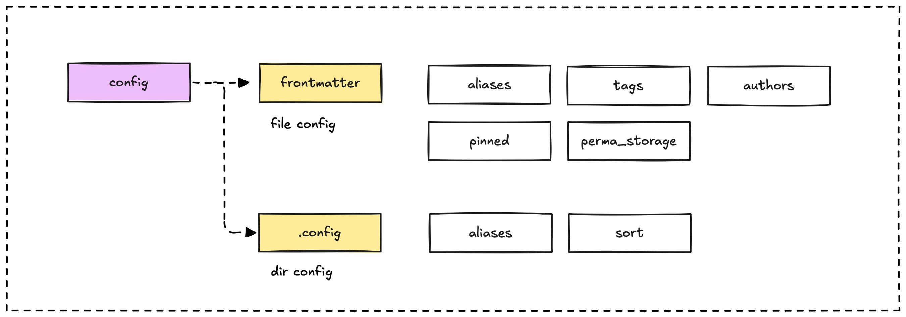
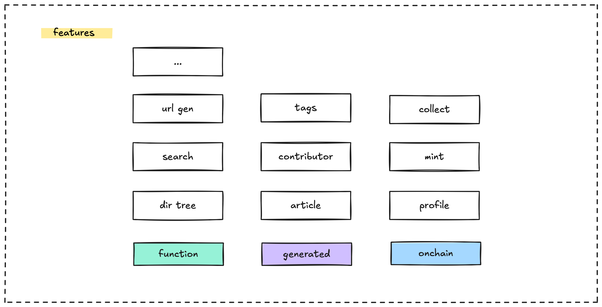
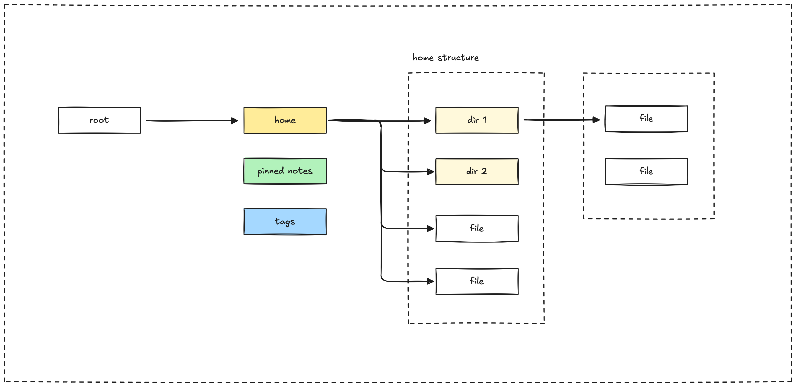
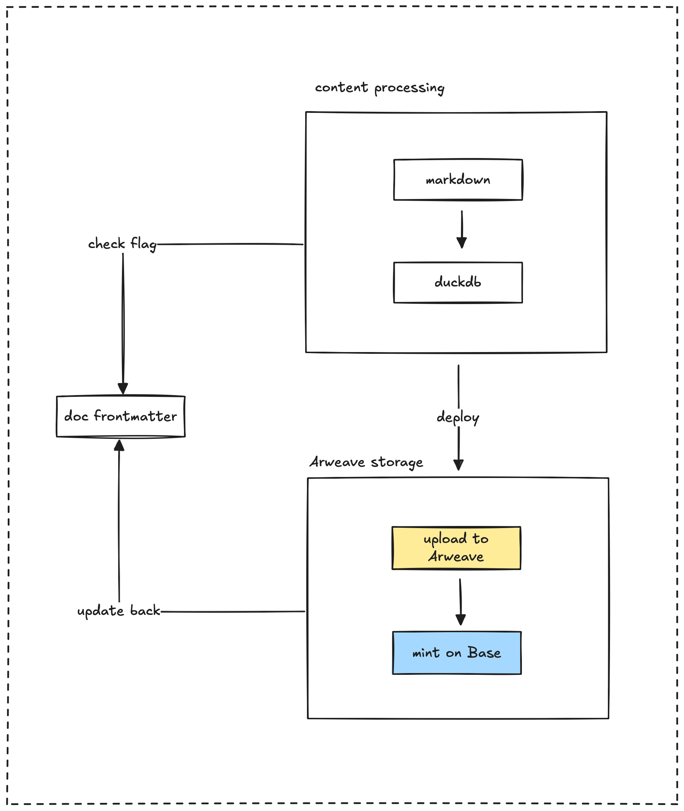

The Memo web application is built using Next.js. We opted for a static site architecture coupled with dynamic rendering to provide a seamless user experience, complete with powerful search and navigation features.

## The benefits of a static site

Choosing a static site architecture for Memo offers several advantages over dynamic applications, contributing to lower maintenance and a better user experience:

- **Performance:** Pages are pre-built and served fast from a CDN.
- **Security:** Reduced attack surface as there's no direct database connection per request.
- **Reliability and scalability:** Static files are reliable and scale easily via CDNs.
- **Lower maintenance:** Fewer servers and dependencies mean less upkeep.
- **Cost-effectiveness:** Hosting static files is typically much cheaper.

By leveraging Next.js, we combine static site performance and low maintenance with the dynamic features needed for search, navigation, and Web3.

## Dynamic page rendering

The Next.js application uses a dynamic route structure with `[...slug].tsx` to handle all content pages. The process for rendering a page involves these steps:

### Static path generation

The `getStaticPaths` function generates all possible content paths during the build process. It:

- Processes every markdown file in the content directory.
- Handles aliases and redirects to ensure path normalization.
- Creates paths for browsing content by directory.

### Content retrieval

The `getStaticProps` function is responsible for loading the content for a specific path. It:

- Resolves the canonical path, correctly handling any aliases and redirects.
- Loads and processes the markdown content from the source files.
- Fetches any associated backlinks and other relevant metadata.

### Component rendering

The `ContentPage` component takes the retrieved and processed content and renders the final page. This component is structured with a `RootLayout` and `ContentLayout` and:

- Processes internal links to enable fast client-side navigation using the Next.js router.
- Dynamically renders the markdown content, including features like code syntax highlighting and mathematical expressions using KaTeX.

## Markdown processing

Markdown content goes through a comprehensive processing pipeline before it's ready for rendering. This includes:

- **Frontmatter extraction:** Parsing the YAML frontmatter to get all the metadata.
- **Content transformation:** Converting the markdown into HTML. This involves:
  - Processing GitHub Flavored Markdown (GFM).
  - Handling mathematical expressions with KaTeX.
  - Resolving image paths and internal links to ensure they work correctly.
- **Enhanced features:** Adding extra capabilities like:
  - Generating a table of contents for easy navigation.
  - Providing code syntax highlighting for code blocks.
  - Rendering Mermaid diagrams.
  - Handling internal links using the Next.js router for a smooth user experience.

### Frontmatter

The frontmatter at the beginning of each Markdown file serves as metadata for the article. We use it to compute secondary data in DuckDB and enhance SEO. It acts as a primary data source for this information.



### Frontmatter requirements

All content files must include YAML frontmatter with specific, mandatory metadata fields:

```
---
title: "Document Title"
date: "YYYY-MM-DD"
authors: ["Author Name"]
tags: ["tag1", "tag2"]
---
```

Here are some optional frontmatter fields you can use:

| Field         | Purpose                                    | Example                        |
| ------------- | ------------------------------------------ | ------------------------------ |
| `pinned`      | Marks a note for display in a pinned section.               | `pinned: true`                 |
| `draft`       | Indicates a note is not yet ready for publication. | `draft: true`                  |
| `description` | Provides a short description for search results.       | `description: "A guide to..."` |
| `image`       | Specifies a featured image for the note.                | `image: "/assets/image.png"`   |

## Features



### Pinned notes system

The system includes a pinned notes feature that allows certain notes to appear prominently in the navigation menu. To use this:

1. Mark the note as pinned in its frontmatter by adding `pinned: true`.
2. Pinned notes are extracted during the build process and saved to `pinned-notes.json`.
3. These notes then appear in a special "Pinned" section at the top of the navigation tree.

### Directory tree generation

The directory structure of the content is processed to create a hierarchical tree for navigation. This tree includes three special root nodes:

1. **Pinned notes:** Contains content specifically marked as pinned in the frontmatter.
2. **Home:** Represents the root level content and provides the main navigation entry point.
3. **Popular tags:** Organizes tags based on their popularity, offering an alternative way to browse content.



### URL and slug generation

The system automatically generates clean, user-friendly URLs (slugs) from the file paths of your Markdown content:

1. For standard Markdown files (e.g., `path/to/file.md`), the URL will be `/path/to/file` (without the `.md` extension).
2. For index files like `README.md` or `_index.md` within a directory (e.g., `path/to/README.md`), the URL will be `/path/to`, pointing to the parent directory.
3. For tag pages, the URL format is `/tags/tag-name`, allowing easy access to all content associated with a specific tag.

### Tags

The Dwarves Memo system features a robust tagging system to help organize and discover content by topic.

### Tag definition and storage

Tags are defined in the frontmatter of your Markdown files. During the build process, these tags are extracted from all content files and aggregated into a central `tags.json` file. This makes the tags available for navigation via the `/tags` route.

```
---
title: "JavaScript Basics"
tags: ["javascript", "programming", "web development"]
---
```

### Tag navigation

The `/tags` page provides a directory of all available tags. On this page, users can:

1. Browse all the tags that have been used.
2. See the count of content items associated with each tag.
3. Navigate to dedicated pages for each tag, listing all the content tagged with it.

## Search

The search system is powered by MiniSearch, a lightweight full-text search engine that operates entirely within the user's browser. The search index is created during the build process, which allows for fast search results without needing to send requests to a server.

The command palette, accessible via Cmd+K or Ctrl+K, provides a quick and keyboard-friendly interface for searching across all Memo content. The search relies on a pre-built index located at `/content/search-index.json`, which is loaded when the application starts.

The search index includes key fields from each document to provide relevant results:

- `title`: The document's title, given a higher relevance weight.
- `description`: A brief summary of the document.
- `tags`: Associated tags, also with increased relevance for better filtering.
- `authors`: The authors of the document, contributing to search relevance.
- `spr_content`: A compressed version of the document content used for searching and previews.

## Web3 integration

Dwarves Memo incorporates Web3 functionality to enable users to connect their blockchain wallets, authenticate using their wallet addresses, and interact with blockchain features like NFT minting. This integration is built using standard libraries such as wagmi, RainbowKit, and viem to ensure a smooth and secure experience.

The Web3 integration is configured using several providers:

1. **WagmiProvider:** Manages the connection and state with blockchain networks.
2. **QueryClientProvider:** Handles data fetching and caching for Web3 data.
3. **RainbowKitProvider:** Provides the user interface for connecting wallets.

The provider is configured to support specific networks, including Base and Base Sepolia. It also includes theme customization that adapts to the application's light or dark mode settings.

The application manages the wallet connection lifecycle by:

1. Detecting when a user connects their wallet.
2. Storing the connected wallet address in localStorage.
3. Removing the stored address when the user disconnects their wallet.



---

> Next: [DuckDB as an intermediary storage](duckdb-as-intermediary-storage.md)
