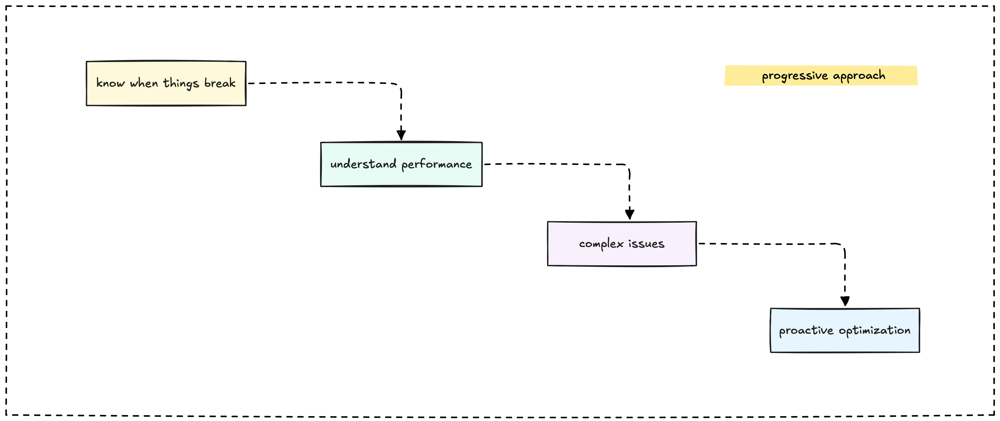

Building a monitoring system feels overwhelming at first. Where do you start? What should you monitor? How much is too much? We've built monitoring systems for everything from simple static sites to complex distributed applications, and we've learned that the best approach isn't about following a rigid checklist. It's about making smart decisions at each step.

## Start with the pain points

Before you install a single monitoring tool, ask yourself: what keeps you up at night?

Maybe your site goes down and you only find out when users complain. Maybe your database gets slow and you have no idea why. Maybe your API throws errors randomly and you're tired of playing detective after the fact.

**Your pain points drive your monitoring priorities.** If you're worried about uptime, start with simple availability checks. If performance is your concern, focus on response time metrics. If you're debugging complex issues, invest in logging and tracing.

We've seen teams spend months building elaborate monitoring setups that measure everything except the things that actually break. Don't be those teams.

## The progressive monitoring approach

Here's how we think about building monitoring systems: start simple, then add complexity as your needs grow. Each stage builds on the previous one, so you're always adding value without throwing away your previous work.

### Stage 1: Know when things break

Your first goal is basic awareness. You want to know when your system stops working before your users do.

**What you need:**

- Uptime monitoring for your main application
- Basic error rate tracking
- Simple alerts that wake you up when things go wrong

**Tools that work:** UptimeRobot for external checks, basic application logging, email or Slack alerts

**Time investment:** A few hours to set up, minimal ongoing maintenance

This stage answers the fundamental question: "Is my stuff working?" If you can't answer that reliably, everything else is just noise.

### Stage 2: Understand performance

Once you know when things break, you want to understand how well they work when they don't break.

**What you add:**

- Response time monitoring
- Database query performance
- Resource usage (CPU, memory, disk)
- Performance trends over time

**Tools that work:** Application Performance Monitoring (APM) tools, system metrics collectors, time-series databases

**Time investment:** A weekend to instrument your main application

This stage helps you spot problems before they become outages. Slow database queries often become timeouts. High memory usage often becomes crashes.

### Stage 3: Debug complex issues

When your system grows beyond a simple application and database, debugging becomes harder. You need visibility into how requests flow through your system.

**What you add:**

- Structured logging with correlation IDs
- Distributed tracing across services
- Better dashboards that connect different data types
- More sophisticated alerting rules

**Tools that work:** OpenTelemetry for tracing, structured logging frameworks, Grafana for dashboards

**Time investment:** Several weeks to properly instrument a distributed system

This stage transforms debugging from guesswork into systematic investigation. Instead of wondering why something is slow, you can follow a request through your entire system.

### Stage 4: Proactive optimization

The final stage is about preventing problems before they happen and optimizing for efficiency.

**What you add:**

- Capacity planning based on growth trends
- Business metrics monitoring
- Automated scaling triggers
- Cost optimization insights

**Tools that work:** Machine learning-based anomaly detection, custom business dashboards, cloud monitoring integrations

**Time investment:** Ongoing effort as your system evolves

This stage helps you run your system efficiently and scale smoothly as you grow.

## Choosing your first tools

Every monitoring tool promises to solve all your problems. Here's how we cut through the marketing and make practical decisions.

### Start with what you have

Before buying new tools, see what your existing infrastructure provides. Most cloud platforms offer basic monitoring. Your web server logs already contain useful information. Your application framework probably has built-in metrics capabilities.

**Use existing tools first.** Add new tools only when you've outgrown what you have.

### Match tools to your team

The best monitoring tool is the one your team will actually use effectively. A simple tool that everyone understands beats a sophisticated tool that only one person can operate.

If your team knows Python, use Python-based monitoring tools. If everyone lives in the AWS ecosystem, start with CloudWatch before evaluating alternatives.

## Building your foundation

The key to successful monitoring is building a solid foundation and then evolving it based on your actual needs, not theoretical requirements.

**Start simple and iterate.** It's better to have basic monitoring that works than sophisticated monitoring that nobody maintains.

**Focus on user impact.** Monitor the things that directly affect your users' experience. Everything else is secondary.

**Plan for correlation.** From day one, include request IDs and other identifiers in your logs, metrics, and traces. You'll thank yourself later when you need to debug complex issues.

Remember: monitoring isn't about perfection. It's about having confidence that you'll know when things go wrong and having the information you need to fix them quickly.

---

> Next: [Which metrics actually matter](metrics.md)
