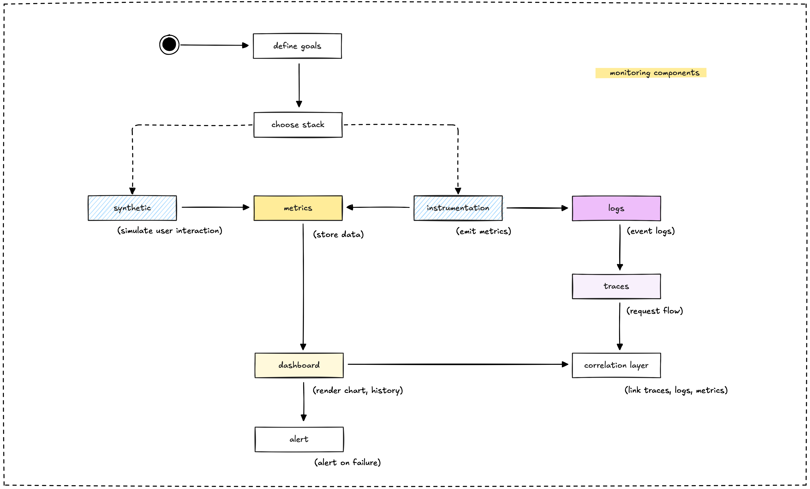

Think of monitoring like having a health checkup for your application. You want to know if it's running smoothly, where it might be struggling, and catch problems before your users do. Our monitoring setup combines several key components that work together to give us a complete picture of system health.

## Synthetic monitoring: Your digital test pilot

Synthetic monitoring is like having a robot that pretends to be your user. It visits your site, clicks around, and reports back on how things are working. This proactive approach helps us catch issues before real users encounter them.

We use automated tests to simulate real user behavior. Think of it as quality assurance that never sleeps. These tests run from different locations around the world, checking if your blog loads quickly, if API calls to Arweave or Base are responding, and if everything renders correctly.

**What it looks like in practice:**

- A script loads your homepage every 5 minutes from New York, London, and Tokyo
- Another test checks if a blog post with on-chain data loads within 2 seconds
- If something breaks, you know immediately (not when users start complaining)

Tools like Playwright, Puppeteer, or Selenium power these synthetic tests. They're particularly valuable for static sites on GitHub Pages where you can't always predict when something might go wrong.

## Instrumentation: Teaching your code to speak

Instrumentation is the process of adding telemetry to your application. Think of it as teaching your code to talk about what it's doing. Instead of wondering why something is slow, you get concrete data about performance, errors, and usage patterns.

You embed monitoring code directly into your application. When someone requests a page, your instrumented code records how long it took to process, whether it succeeded, and any relevant details along the way.

**Here's how we instrument different parts of our stack:**

- **Node.js apps:** Use prom-client to expose metrics like request latency and error rates through a `/metrics` endpoint
- **Elixir services:** The telemetry library emits events (like DuckDB query duration) that Prometheus can scrape
- **On-chain interactions:** Wrap API calls to track request duration, success rates, and gas usage
- **Infrastructure:** Node Exporter collects system metrics like CPU and memory usage

For example, when your Markdown-to-HTML converter processes a file, instrumentation tracks how many files were processed and how long each conversion took. This data flows into Prometheus as metrics you can analyze and alert on.

## Metrics: The numbers that matter

Metrics are numerical measurements that capture the state and performance of your system at specific points in time. Think of them as vital signs for your application. Just like a doctor checks your heart rate and blood pressure, metrics tell you if your system is healthy.

Metrics come in different types:

- **Counters** track things that only go up (like total requests served)
- **Gauges** measure current values that can go up or down (like active user sessions)
- **Histograms** show distributions of values (like response time percentiles)

**Common metrics we track:**

- Response time for web requests
- Error rates and success rates
- Database query performance
- Memory and CPU usage
- Active user connections

Prometheus excels at storing and querying time-series metrics data. It's optimized for fast aggregations and can handle millions of data points efficiently.

## Logs: The system's diary

Logs are textual records of events that happen in your system. They're like a detailed diary of what your application did, when it did it, and what went wrong. While metrics tell you "what" happened, logs provide the context and details about "why."

Good logs include:

- Timestamps for when events occurred
- Log levels (INFO, WARN, ERROR) to indicate severity
- Structured data that's easy to parse and search
- Relevant context like user IDs or request IDs

**What we log:**

- User actions and API requests
- Database queries and their execution times
- Error messages with stack traces
- Business logic events (like successful payments)
- Security-related events (login attempts, permission changes)

Tools like Loki, Elasticsearch, or simple file-based logging can store and index your logs for searching and analysis.

## Traces: Following the request journey

Distributed tracing tracks a single request as it flows through multiple services in your system. Imagine following a package through the postal system, from sender to recipient, tracking every stop along the way.

A trace consists of multiple "spans," where each span represents work done by a particular service. When you load a blog post, the trace might include spans for:

- Receiving the HTTP request
- Querying the database for post content
- Fetching metadata from Arweave
- Rendering the final HTML
- Sending the response

**Why tracing matters:**

- Identifies bottlenecks in complex workflows
- Shows how services depend on each other
- Helps debug issues that span multiple components
- Provides timing information for each step in a request

OpenTelemetry and Jaeger are popular tools for implementing distributed tracing. They add minimal overhead while providing valuable insights into system behavior.

## Dashboard: Your monitoring command center

A dashboard is your visual window into system health. It takes all the raw data from metrics, logs, and traces and presents it in charts, graphs, and tables that humans can quickly understand. Think of it as the instrument panel in your car, showing speed, fuel level, and engine temperature at a glance.

Good dashboards answer key questions instantly:

- Is my system currently healthy?
- Are there any ongoing issues?
- How is performance trending over time?
- Where should I focus my attention?

**Dashboard best practices:**

- Show the most critical metrics prominently
- Use colors meaningfully (red for problems, green for healthy)
- Include both current status and historical trends
- Make it easy to drill down from high-level overviews to detailed data

Grafana is the most popular dashboarding tool in the monitoring space. It connects to multiple data sources and offers flexible visualization options.

## Correlation layer: Connecting the dots

The correlation layer is what makes monitoring data truly powerful. It connects related information across metrics, logs, and traces so you can understand the complete picture when investigating issues.

Correlation typically works through shared identifiers:

- **Request IDs** that appear in logs, metrics, and traces for the same user request
- **User IDs** that help track behavior across different system components
- **Session IDs** that group related activities together
- **Transaction IDs** for business processes that span multiple services

**Why correlation matters:**
When you see a spike in response times (metrics), correlation helps you find the related error messages (logs) and identify which specific service is slow (traces). Without correlation, you're solving puzzles with pieces from different boxes.

Modern observability platforms automatically correlate data when you include these shared identifiers in your telemetry.

## Alert: Your early warning system

Alerts are automated notifications that wake you up when something goes wrong. They're like smoke detectors for your application, designed to catch problems before they become disasters.

Effective alerts have three key characteristics:

- **Actionable:** They tell you about problems you can actually fix
- **Timely:** They fire quickly enough to prevent or minimize impact
- **Reliable:** They don't cry wolf with false positives

**Common alert scenarios:**

- Website down or returning errors
- Response times exceeding acceptable thresholds
- Error rates climbing above normal levels
- Infrastructure resources (CPU, memory, disk) reaching capacity
- Business metrics falling outside expected ranges

**Alert fatigue is real.** Too many alerts train people to ignore them. Focus on alerting for conditions that require immediate human intervention, not every minor blip in your metrics.

Prometheus Alertmanager, PagerDuty, and similar tools can route alerts to the right people through email, Slack, SMS, or phone calls based on severity and time of day.

## How these components work together

Each monitoring component serves a specific purpose, but their real power emerges when they work together:

- **Synthetic monitoring** provides the user perspective, ensuring your application works as customers expect.
- **Instrumentation** gives you internal visibility into how your code and infrastructure perform.
- **Metrics** offer quantitative measurements that are easy to alert on and trend over time.
- **Logs** provide detailed context when something goes wrong and you need to debug.
- **Traces** show you the complete journey of requests through your distributed system.
- **Dashboards** make all this data visible and actionable for your team.
- **Correlation** connects related data so you can debug efficiently.
- **Alerts** ensure you know about problems quickly enough to respond effectively.

Building a comprehensive monitoring system means implementing these components thoughtfully and ensuring they complement each other. Start with the basics (metrics and logs), then add more sophisticated components (tracing and correlation) as your system grows in complexity.

---

> Next: [Approach to build](approach-to-build.md)
