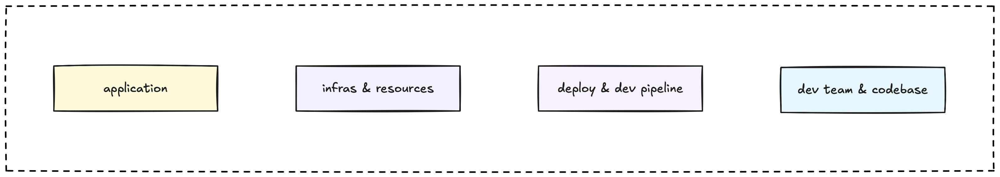

So you've decided what to monitor and how to approach building your monitoring system. Now comes the practical part: how do you actually implement it? This guide provides concrete implementation steps for setting up monitoring tools, establishing development team performance tracking, and creating sustainable monitoring practices.

## Define monitoring goals and scope

Before jumping into tools, clearly define what you want to monitor across all aspects of your system:



### Application logic layer

Monitor your application's core functionality to ensure everything works as expected:

**Content processing workflows:**

- Markdown to HTML conversion pipeline health
- Database migration and schema change tracking
- Search indexing job completion and performance
- Image processing and optimization workflows

**On-chain integrations:**

- Arweave upload success rates and performance
- Base blockchain transaction monitoring
- IPFS content availability and retrieval times
- Smart contract interaction success/failure rates

**Site availability and delivery:**

- Frontend application uptime across different regions
- API endpoint availability for all critical services
- Static asset delivery performance (CDN health)
- Third-party service dependency health

### Infrastructure and resource usage

Track infrastructure metrics that predict performance issues before they affect users:

**System resource patterns:**

- Resource usage trends and capacity planning indicators
- Performance anomaly detection across services
- Network latency between service components
- Storage I/O patterns and optimization opportunities

**Application runtime health:**

- Service startup and shutdown behavior
- Memory leak detection and garbage collection patterns
- Connection pool health across databases and external services
- Background job queue health and processing efficiency

### Deployment and development pipeline

Monitor your entire software delivery process to ensure reliable releases:

**Build and deploy pipeline health:**

- Build success/failure rates and duration trends
- Deployment frequency and rollback rate tracking
- Environment promotion success rates
- Configuration drift detection between environments

**Release and feature management:**

- Feature flag effectiveness and rollout success metrics
- A/B test performance and statistical significance tracking
- Canary deployment health monitoring
- Post-deployment verification and smoke test results

### Development team performance and code quality

This is where most monitoring guides stop, but tracking how your development process affects system quality is crucial for long-term success:

**Code quality and technical health:**

- **Test coverage evolution:** Track coverage percentage trends over time
  - Unit test coverage by module, service, and critical path
  - Integration test coverage for user-facing workflows
  - End-to-end test coverage for complete user journeys
  - Mutation testing effectiveness (when applicable)

- **Technical debt management:** Measure accumulation and reduction efforts
  - Code complexity scores (cyclomatic complexity, cognitive complexity)
  - Duplicate code percentage and refactoring opportunities
  - Code smell density from static analysis tools
  - Documentation coverage for APIs, components, and business logic
  - Outdated dependency tracking and security vulnerability management

- **Security and compliance tracking:**
  - Security scan results and vulnerability resolution time
  - Dependency vulnerability alerts and patching cadence
  - Code review security checklist completion rates
  - Secrets detection and remediation tracking
  - Compliance audit trail completeness

**Development velocity and efficiency:**

- **DORA metrics (DevOps Research and Assessment):**
  - Deployment frequency: How often you successfully ship to production
  - Lead time: Time from code commit to production deployment
  - Change failure rate: Percentage of deployments causing incidents
  - Mean time to recovery (MTTR): Time to restore service after incidents

- **Code collaboration effectiveness:**
  - Pull request cycle time (creation to merge) by complexity
  - Code review participation rates and feedback quality scores
  - Branch lifetime and merge conflict frequency patterns
  - Commit message quality and conventional commit adoption
  - Knowledge sharing through code reviews (reviewer diversity)

- **Team capacity and focus optimization:**
  - Story points completed vs. committed (velocity predictability)
  - Sprint goal achievement rates and scope creep tracking
  - Context switching frequency (task changes per developer per day)
  - Time allocation: new features vs. bug fixes vs. technical debt
  - Interrupt handling and unplanned work impact measurement

**Developer experience and team health:**

- **Development environment efficiency:**
  - Local development setup time for new team members
  - CI/CD pipeline execution time and reliability percentages
  - Development environment uptime and performance consistency
  - Tool and dependency update frequency and automation success
  - Developer productivity metrics (build times, test execution speed)

- **Learning and growth indicators:**
  - Documentation usage patterns and contribution rates
  - Knowledge sharing session frequency, attendance, and effectiveness
  - Cross-team collaboration instances and knowledge transfer
  - Skill development tracking and mentoring relationship effectiveness
  - Innovation time allocation and experimental project outcomes

## Choose your monitoring stack

Here's a practical technology stack that covers all monitoring needs while remaining manageable for most teams:

### Metrics collection and storage

**Prometheus for time-series metrics:**

- Lightweight and integrates well with most systems
- Excellent for application and infrastructure metrics
- Built-in alerting capabilities with Alertmanager
- Strong ecosystem and community support

**Configuration example:**

```yaml
# prometheus.yml
global:
  scrape_interval: 15s
  evaluation_interval: 15s

scrape_configs:
  - job_name: 'blog-api'
    static_configs:
      - targets: ['localhost:3000']
    metrics_path: '/metrics'
    scrape_interval: 5s

  - job_name: 'node-exporter'
    static_configs:
      - targets: ['localhost:9100']

  - job_name: 'dev-metrics'
    static_configs:
      - targets: ['localhost:8080']
    metrics_path: '/dev-metrics'
    scrape_interval: 60s
```

### Logging and log analysis

**Loki for centralized logging:**

- Cost-effective alternative to ELK stack
- Integrates seamlessly with Grafana
- Excellent for correlating logs with metrics
- Efficient storage and querying for most use cases

**Alternative: ELK Stack (Elasticsearch, Logstash, Kibana):**

- More features but higher resource requirements
- Better for complex log analysis and full-text search
- Good when you need advanced log processing and analysis

**Structured logging implementation:**

```javascript
// Application logging with comprehensive correlation
const correlationContext = {
  request_id: req.requestId,
  trace_id: span?.spanContext()?.traceId,
  user_id: req.user?.id,
  session_id: req.sessionId,
  deployment_version: process.env.APP_VERSION,
  feature_flags: req.featureFlags
};

logger.info('Blog post processed', {
  ...correlationContext,
  post_id: 456,
  processing_time_ms: 234,
  arweave_upload: true,
  content_size_bytes: 15420,
  cache_hit: false
});
```

### Distributed tracing

**OpenTelemetry for request tracing:**

- Industry standard with broad ecosystem support
- Automatic instrumentation for popular frameworks
- Future-proof choice as observability standards evolve
- Supports custom business logic tracing

**Jaeger for trace storage and visualization:**

- Clean, intuitive interface for trace analysis
- Good performance with reasonable resource usage
- Excellent for debugging distributed systems and performance optimization

**Implementation example:**

```javascript
const { trace } = require('@opentelemetry/api');

app.get('/posts/:id', async (req, res) => {
  const span = trace.getActiveSpan();
  
  try {
    // Automatic span creation for database calls
    const post = await db.posts.findById(req.params.id);
    
    // Manual span for external service calls with business context
    const arweaveData = await trace.getTracer('blog-app')
      .startActiveSpan('arweave-fetch', async (arweaveSpan) => {
        arweaveSpan.setAttributes({
          'post.id': req.params.id,
          'post.category': post.category,
          'user.subscription': req.user?.subscription || 'free'
        });
        
        const data = await fetchFromArweave(post.arweave_id);
        arweaveSpan.setAttributes({
          'arweave.data_size': data.length,
          'arweave.cache_hit': data.fromCache,
          'arweave.region': data.region
        });
        return data;
      });
    
    res.json({ post, arweaveData });
  } catch (error) {
    span.recordException(error);
    span.setStatus({ code: SpanStatusCode.ERROR });
    throw error;
  }
});
```

### Visualization and dashboards

**Grafana for unified monitoring dashboards:**

- Single pane of glass for metrics, logs, and traces
- Extensive alerting capabilities with multiple notification channels
- Rich ecosystem of pre-built dashboards and plugins
- Good sharing, collaboration, and team management features

**Dashboard organization strategy:**

- **Executive dashboard:** High-level business and system health KPIs
- **Service dashboards:** Detailed metrics per application/service
- **Infrastructure dashboard:** System resources and capacity planning
- **Development dashboard:** Code quality, deployment, and team performance metrics
- **Incident response dashboard:** Critical metrics for on-call teams

### Code quality and development monitoring

**SonarQube for comprehensive code quality analysis:**

- Code quality metrics, security vulnerability detection
- Technical debt tracking and trends over time
- Integration with CI/CD pipelines for automated analysis
- Custom quality gates and team-specific rules

**GitHub/GitLab analytics for development velocity:**

- Built-in insights for development velocity and collaboration
- Pull request and code review analytics and trends
- Contributor activity patterns and team collaboration metrics
- Integration with project management tools for end-to-end tracking

**Custom development metrics collection:**

```javascript
// Example: Track comprehensive deployment and development metrics
const deploymentMetrics = {
  deployment_frequency: 'daily',
  lead_time_hours: 24,
  mttr_minutes: 15,
  change_failure_rate: 0.02,
  code_review_participation: 0.95,
  test_coverage_percentage: 87.5,
  technical_debt_hours: 16.2
};

// Send to monitoring system with proper labeling
Object.entries(deploymentMetrics).forEach(([metric, value]) => {
  prometheus.register.getSingleMetric(`dev_${metric}`)
    .set({ team: 'platform', service: 'blog', sprint: 'current' }, value);
});
```

### Alerting and incident management

**Prometheus Alertmanager for intelligent alerting:**

- Flexible alerting rules with sophisticated routing
- Alert deduplication, grouping, and noise reduction
- Multiple notification channels with conditional routing
- Integration with incident management platforms

**PagerDuty or Opsgenie for incident management:**

- Escalation policies and intelligent on-call rotations
- Incident tracking, collaboration, and post-mortem workflows
- Integration with monitoring tools and ChatOps platforms
- Analytics for incident response improvement

## Implementation best practices

### Start with the foundation and build incrementally

1. **Establish basic infrastructure monitoring first**

- System resources monitoring with node_exporter
- Network connectivity and basic application health checks
- Essential alerting for service availability

2. **Add application metrics progressively**

- Implement RED metrics (Rate, Errors, Duration) for user-facing endpoints
- Add correlation IDs to all logs, metrics, and traces from day one
- Focus on metrics that predict user impact rather than internal system state

3. **Integrate development and code quality monitoring into workflows**

- Make code quality metrics visible in development environments
- Include monitoring and alerting requirements in definition of done
- Track trends and improvements, not just current state snapshots

### Ensure comprehensive data correlation

**Implement consistent correlation across all telemetry data:**

```javascript
// Comprehensive correlation context for all monitoring data
function createCorrelationContext(req, additionalContext = {}) {
  return {
    // Request tracking
    request_id: req.requestId,
    trace_id: req.traceId,
    
    // User and session context
    user_id: req.user?.id || 'anonymous',
    session_id: req.sessionId,
    user_agent: req.get('user-agent'),
    
    // Application context
    deployment_version: process.env.APP_VERSION,
    environment: process.env.NODE_ENV,
    service_name: 'blog-api',
    
    // Feature and experiment context
    feature_flags: req.featureFlags || {},
    experiment_groups: req.experimentGroups || {},
    
    // Additional context
    ...additionalContext
  };
}

// Apply correlation context to all telemetry
function logWithContext(level, message, context = {}) {
  const correlationContext = createCorrelationContext(req, context);
  logger[level](message, correlationContext);
}

function recordMetricWithContext(metricName, value, labels = {}) {
  const correlationContext = createCorrelationContext(req, labels);
  metrics.record(metricName, value, correlationContext);
}
```

### Design for scale and maintainability

**Plan your monitoring architecture for growth:**

- **Implement sampling strategies** for high-volume tracing to control costs
- **Establish log retention and archival policies** based on compliance and debugging needs
- **Set up monitoring for your monitoring systems** (meta-monitoring) to prevent blind spots
- **Plan for multi-environment consistency** (development, staging, production) from the beginning

### Foster team adoption and continuous improvement

**Make monitoring data accessible and actionable for your entire team:**

1. **Create role-specific monitoring interfaces**

- **Developers:** Error rates, performance regressions, deployment impact, code quality trends
- **Product managers:** Business metrics, user behavior, feature adoption, conversion funnels
- **Leadership:** System reliability, team velocity, cost optimization, technical health

2. **Establish monitoring-driven development practices**

- Include comprehensive monitoring requirements in feature specifications
- Review monitoring data and trends during team retrospectives and planning
- Use monitoring insights to guide architectural and process decisions
- Celebrate monitoring improvements and successful incident prevention

3. **Integrate monitoring into incident response and learning**

- Create detailed runbooks that reference specific dashboards and correlation strategies
- Train all team members on using monitoring tools for debugging and investigation
- Include monitoring gaps and improvements in post-incident reviews and action items
- Share monitoring insights and lessons learned across teams

### Continuous monitoring improvement

**Treat your monitoring system as a product that evolves with your needs:**

- **Regularly review and retire unused metrics and dashboards** to reduce noise
- **Conduct monitoring effectiveness reviews** during major incidents and retrospectives
- **Benchmark your monitoring costs** against the value provided in incident prevention and resolution
- **Stay current with monitoring tool evolution** and consider upgrades when they provide clear value

Remember: The goal isn't perfect monitoring from day one, it's building a monitoring foundation that grows intelligently with your system and team. Start with the basics, focus on correlation and actionability, and continuously improve based on real-world usage and incident learnings.

---

> Next: [Best practices that actually work](best-practices.md)
