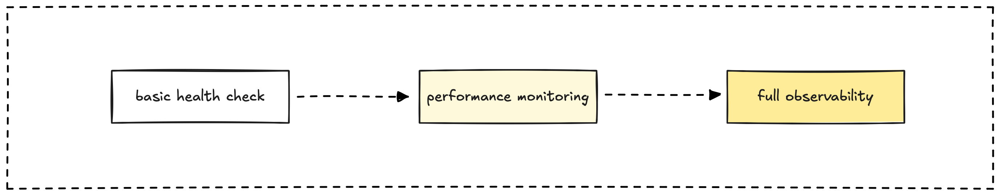
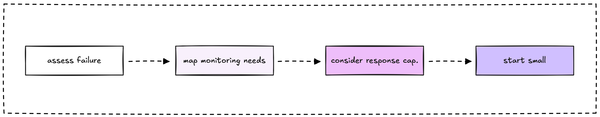
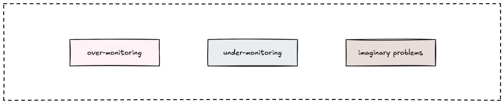

"Do I really need all this monitoring complexity?" It's a question every engineering team asks, usually while staring at a monitoring setup that feels like overkill for their current needs. The honest answer: it depends. Not every system needs enterprise-grade monitoring, but figuring out what you actually need requires thinking beyond just "how many users do I have?"

## The monitoring complexity spectrum

Let's be real about what different levels of monitoring actually look like in practice:

### Level 1: Basic health checks

- **What it is:** Simple uptime monitoring and basic error alerting
- **Tools:** UptimeRobot, basic application logs, email alerts
- **Time investment:** A few hours to set up, minimal maintenance
- **Good for:** Early-stage products, personal projects, simple services

**Example:** A static blog with a contact form. You want to know if the site is down and if the contact form stops working, but you don't need to track every page view or optimize for milliseconds.

### Level 2: Performance monitoring

- **What it is:** Response time tracking, error rates, basic user experience metrics
- **Tools:** APM tools, time-series databases, simple dashboards
- **Time investment:** Days to weeks of setup, regular maintenance
- **Good for:** Growing applications, customer-facing services, small businesses

**Example:** A SaaS product with paying customers. You need to know not just if it's working, but how well it's working. Slow response times directly affect customer satisfaction and churn.

### Level 3: Full observability

- **What it is:** Distributed tracing, correlation, business metrics, predictive monitoring
- **Tools:** Comprehensive monitoring stack with multiple integrated tools
- **Time investment:** Weeks to months of setup, ongoing dedicated maintenance
- **Good for:** Complex systems, high-scale applications, mission-critical services

**Example:** An e-commerce platform during Black Friday. You need to understand how traffic flows through dozens of services, predict capacity needs, and correlate business metrics with technical performance.

## What actually drives monitoring needs

Scale matters, but it's not just about user count. Here are the factors that actually determine how much monitoring you need:

### Failure impact (the most important factor)

**High impact scenarios:**

- Revenue directly tied to system availability (e-commerce, SaaS)
- User data or safety at risk (healthcare, financial services)
- Reputation damage from outages (public-facing platforms)

**Lower impact scenarios:**

- Internal tools with workarounds available
- Personal projects or learning experiments
- Systems with natural retry mechanisms

**Real example:** A small newsletter service with 500 subscribers might need more monitoring than a corporate intranet with 5,000 users if the newsletter drives the business and the intranet has manual backup processes.

### System complexity and failure modes

**Complex systems need more monitoring because:**

- More moving parts mean more ways to fail
- Failures cascade in unpredictable ways
- Root cause analysis becomes detective work

**Simple systems can get by with less because:**

- Fewer failure modes to track
- Issues are usually obvious
- Quick to restart or redeploy

**Complexity indicators:**

- Multiple services or databases
- External API dependencies
- Background job processing
- Real-time features
- Data synchronization requirements

### Team capacity and expertise

**Monitoring systems need maintenance.** Consider your team's ability to:

- Set up and configure monitoring tools
- Respond to alerts during off-hours
- Debug issues using monitoring data
- Keep dashboards and alerts up to date

**Team size reality check:**

- **1-2 person team:** Focus on the basics that prevent major disasters
- **3-5 person team:** Add performance monitoring for customer-facing issues
- **6+ person team or dedicated SRE:** Can justify comprehensive observability

### Business stage and resources

**Early stage (MVP, startup):**

- Focus on learning about users, not perfecting infrastructure
- Monitor what prevents you from shipping features
- Avoid over-engineering monitoring at the expense of product development

**Growth stage (scaling users and revenue):**

- User experience directly impacts growth
- Performance issues affect conversion and retention
- Invest in monitoring that helps optimize the user experience

**Mature stage (established business):**

- System stability affects revenue and reputation
- Compliance and SLA requirements
- Can afford dedicated monitoring infrastructure and expertise

## Decision framework: What monitoring do you actually need?

Instead of following generic advice, use this framework to match your monitoring to your actual needs:

### Step 1: Assess your failure scenarios

**Ask yourself:**

- What happens if my system is down for 1 hour? 1 day?
- Which parts of my system, if broken, would hurt users the most?
- How quickly do I need to know about different types of problems?

**Example analysis for a blog platform:**

- **Site completely down:** Readers can't access content → High impact
- **Slow page loads:** Poor user experience, SEO impact → Medium impact  
- **Comments not working:** Annoying but not critical → Low impact
- **Admin dashboard slow:** Only affects content creators → Low impact

### Step 2: Map complexity to monitoring needs

**Simple systems (monolith, single database, few integrations):**

- Basic uptime monitoring
- Error rate tracking for main user flows
- Simple alerting for critical failures

**Moderate systems (few services, some background jobs, external APIs):**

- Add response time monitoring
- Track external dependency health
- Monitor resource usage trends

**Complex systems (microservices, multiple databases, real-time features):**

- Distributed tracing across services
- Correlation between different data types
- Capacity planning and prediction

### Step 3: Consider your response capability

**Be honest about your team's capacity:**

- Can you respond to alerts 24/7? If not, focus on alerts that can wait until business hours
- Do you have expertise to debug complex monitoring data? If not, start simple
- How much time can you spend maintaining monitoring? Factor this into tool choices

### Step 4: Start small and evolve

**Don't try to implement everything at once.** Start with monitoring that addresses your highest-impact failure scenarios, then add complexity as your system and team grow.

## Real-world examples by system type and scale

### Personal blog (1k visitors/month)

For a small personal blog, monitoring should be almost invisible. You want to know if your site goes down, but you shouldn't spend more time maintaining monitoring than creating content.

Start with simple uptime monitoring (UptimeRobot works great) and basic web analytics to understand your audience. If you're self-hosting, set up basic server alerts for disk space or memory issues.

Skip the fancy stuff: response time percentiles, distributed tracing, and custom business metrics are overkill. Occasional downtime is annoying but not catastrophic, your energy is better spent writing great content.

### SaaS startup (10k users, $50k MRR)

Now user experience directly affects your business. Slow response times cause churn, and errors hurt your reputation with paying customers.

You need application performance monitoring to catch issues before they affect users, error tracking to debug problems quickly, and basic business metrics to understand how technical issues impact signups and retention.

But resist the urge to implement enterprise-grade monitoring just yet. Complex distributed tracing, predictive analytics, and multi-region monitoring are premature optimizations that will distract from building features your customers actually want.

### E-commerce platform (1M users, $10M revenue)

At this scale, downtime directly costs money and every minute of poor performance affects revenue. You've crossed the threshold where comprehensive monitoring pays for itself.

Invest in the full observability stack: real-time business metrics that correlate technical performance with sales, distributed tracing to debug complex interactions between services, and predictive capacity planning to handle traffic spikes.

The complexity is justified because the cost of system failures now outweighs the cost of sophisticated monitoring infrastructure.

### Internal tooling (500 employees)

Internal tools have different constraints than customer-facing systems. Users can work around issues, support requests provide feedback about problems, and manual processes can bridge gaps during outages.

Focus on basic uptime monitoring and error alerting during business hours. Simple performance dashboards help identify trends, but you don't need 24/7 alerting or sub-second response time optimization.

Save your monitoring budget and engineering time for customer-facing systems where downtime has real business impact.

## Common scale-related monitoring mistakes

### Over-monitoring small systems

We've all seen it: a side project with the same monitoring complexity as Netflix. Maybe you're following a tutorial designed for microservices when you have a simple blog. Maybe you're copying what worked at your previous job at a much larger company.

Here's the thing: enterprise-grade monitoring for a personal project isn't impressive, it's wasteful. You're spending time configuring Prometheus, Grafana, and distributed tracing instead of writing content or building features. Worse, you'll get alert fatigue from over-sensitive monitoring that treats every minor hiccup like a production incident.

**A better path:** Start with basic health checks. Add monitoring only when you encounter specific problems that monitoring would help solve. Your time is better spent building things users care about.

### Under-monitoring growing systems

The opposite problem is equally common but often harder to recognize. Your startup began with a simple uptime check, and it's worked fine... until suddenly it isn't.

You're still using the same basic monitoring from when you had 100 users, but now you have 10,000. Debugging becomes guesswork. When things break, you're scrambling to understand what happened. Your users experience issues before you even know there's a problem.

The "it's worked so far" mentality is dangerous when your system crosses the complexity threshold. What you need is a regular monitoring health check: When debugging becomes painful, it's time to add more observability.

### Monitoring for imaginary problems

This one's subtle but expensive. You read about monitoring best practices and implement comprehensive tracking for problems you've never actually encountered. Your dashboards show metrics for edge cases that may never happen in your specific system.

The result? Signal gets lost in noise. You're maintaining dashboards nobody looks at and tracking metrics that don't inform decisions. Meanwhile, the real issues (the ones your users actually hit) might not be monitored at all.

**The fix:** Add monitoring reactively. When you encounter a problem, ask "How could monitoring have helped us detect or debug this faster?" Then add exactly that monitoring, nothing more.

## Making the right choice for your situation

The best monitoring system is the one that helps your team ship better software while fitting your constraints. Here's how to make smart decisions:

### Start with your pain points

What keeps you up at night? What problems do you actually encounter? Focus your monitoring efforts on preventing or quickly resolving the issues that actually happen.

### Match monitoring complexity to system complexity

Simple systems need simple monitoring. Complex systems justify complex monitoring. Don't let your monitoring be more complicated than the system it's monitoring.

### Consider total cost of ownership

Include setup time, maintenance overhead, tool costs, and the opportunity cost of not working on other things. Sometimes "good enough" monitoring is actually better than perfect monitoring.

### Plan for growth but don't over-engineer

It's easier to add monitoring than to remove it. Start simple and add sophistication as your needs become clear.

### Learn from your incidents

Every outage or performance issue teaches you something about what monitoring you actually need. Use post-mortems to guide your monitoring evolution.

Remember: monitoring is a tool to help you build better software, not an end in itself. The right amount of monitoring is whatever helps your team succeed without getting in the way of building the thing your users actually care about.

---

> Next: [Trace IDs and request IDs that work](request-and-trace.md)
