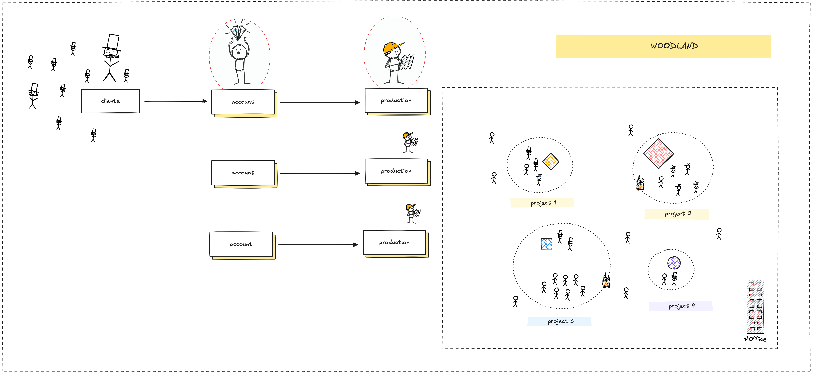
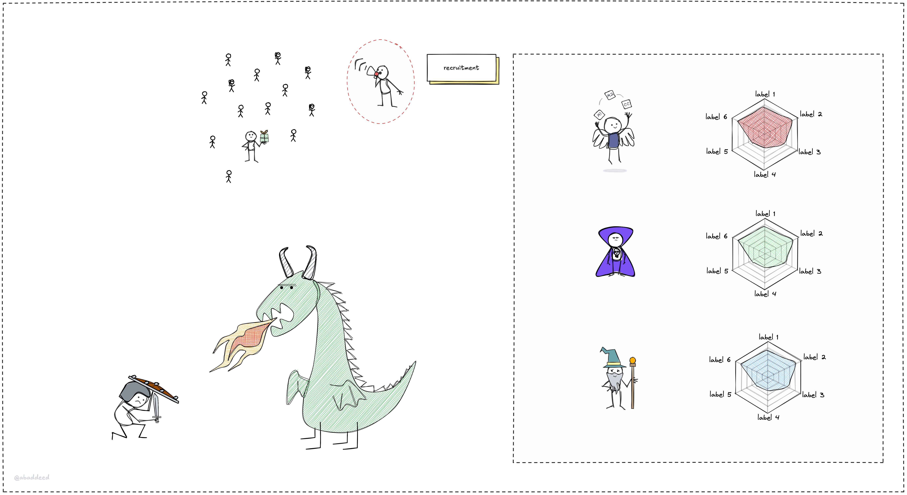

### nature of consulting model

as a consulting business, to have business to do, we always need to address where is the current market demand lie on, so we can focus on.

ppl rarely talk about the nature of this model, but we should aware

the input starts with

- funding
- owner: team/ppl have idea and want to build

the output

- the design
- the build
- the manual guides

and to make that happens, it depends on the tech capability of the production team
ppl want our tech capability, our know-how on certain domain,
that we could build software better, faster and maybe cheaper.
and that is where the team, the ppl inside the team is the core of everything that gonna happen. that's the soul of everything we do under the name of consulting.
we consult, give advice and get it done.

that's also why some will say consulting is the ppl business. we sell our ppl expertise. it also apply in other business model, but tech consulting is one of the most ...

### consulting model in the age of AI agents

so LLM and AI agents will gonna automate a lot of things in our workflow, including give advice, design, implement and operate systems.

so what is the role of consultants when AI agents are around?

the human edge is to **feel**, **create**, **connect**, and **find purpose**, that qualities AI can’t replicate.
ppl want great experience and that's the thing that consultants have to understand and provide.

sure the tech know-how and tech cap. is shifting. AI will be another layer to get things done faster, and the consultants should be the one to know how to leverage them to make decision.

---

> Next: [Technology run in cycles](cycle.md)
