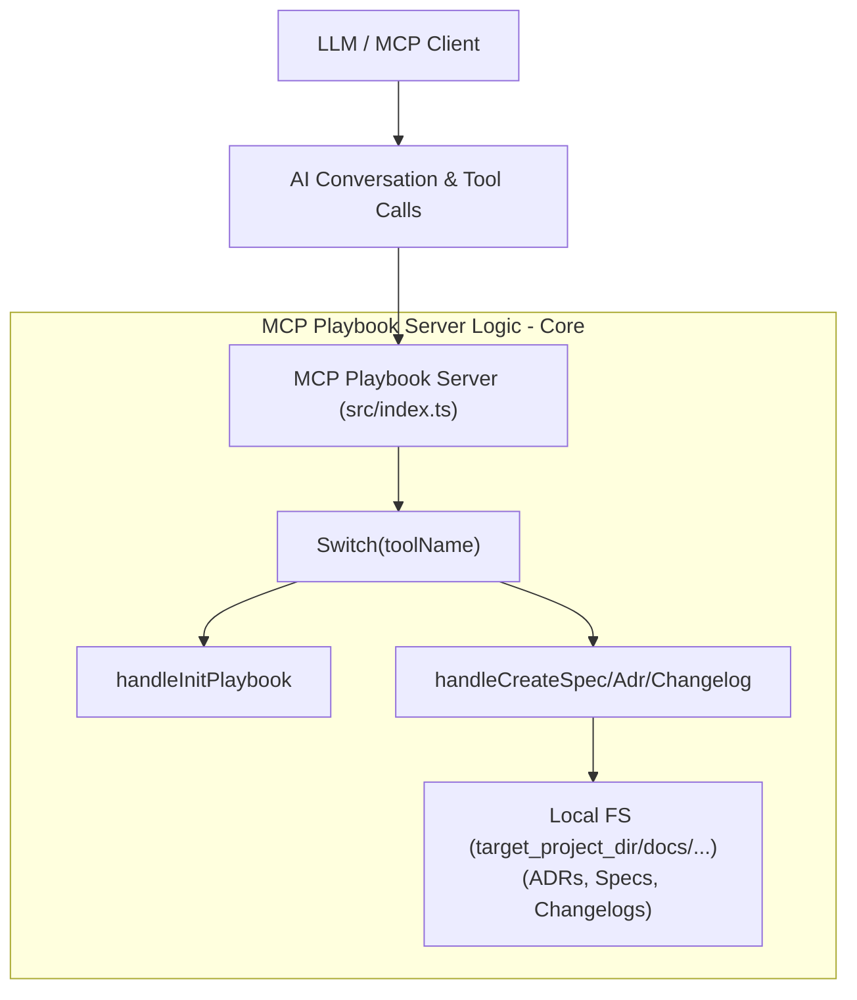
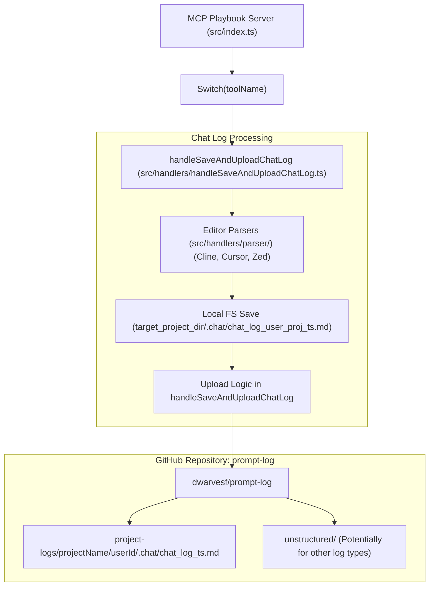
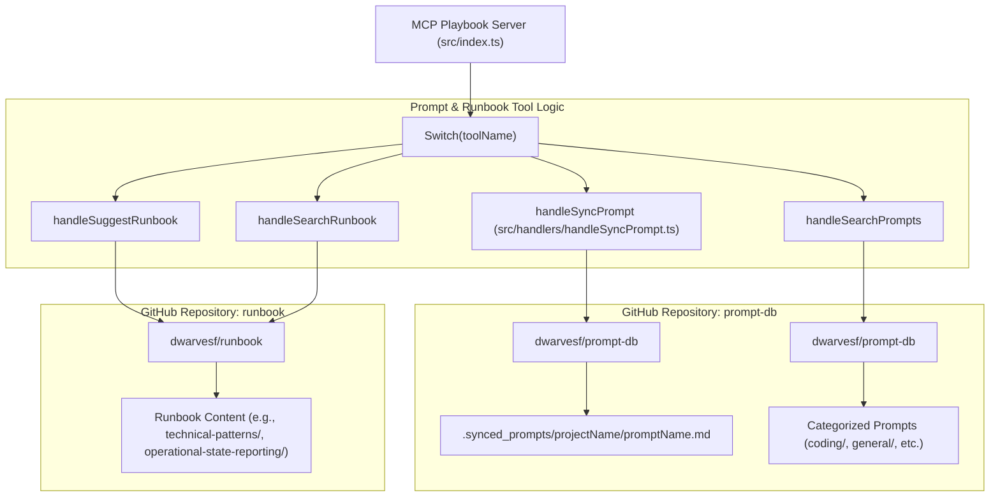

> **tl;dr**
>
> The MCP Playbook server processes tool calls via `src/index.ts`, routing them to handlers in `src/handlers/`. These handlers interact with the local file system and GitHub (e.g., `prompt-db`, `prompt-log`). Chat log syncing involves editor-specific parsers and uploads to a structured path in `prompt-log`, while prompt syncing targets `prompt-db`.

This document provides a detailed walkthrough of the `mcp-playbook` server's internal code execution, its data flow, particularly concerning chat log and prompt synchronization, and its interactions with key GitHub repositories.

## Core request handling and tool execution

The fundamental operation of the `mcp-playbook` server revolves around receiving Model Context Protocol (MCP) requests and dispatching them to appropriate handlers for execution.

1.  **Entry point (`src/index.ts`)**:
    *   This file initializes the MCP server and defines handlers for various request types (`CallToolRequestSchema`, `ListToolsRequestSchema`, etc.).
    *   When a `CallToolRequest` is received, `src/index.ts` extracts the `toolName` and `arguments`.
    *   A `switch` statement on `toolName` routes the request to the corresponding function in `src/handlers.ts` (which aggregates handlers from the `src/handlers/` directory).

2.  **Tool handlers (`src/handlers/`)**:
    *   Each tool (e.g., `create_spec`, `sync_prompt`, `save_and_upload_chat_log`) has a dedicated handler file in this directory (e.g., `handleCreateSpec.ts`).
    *   These handlers contain the core logic for the tool, utilizing arguments passed from `src/index.ts`.
    *   Interactions include:
        *   File system operations within the `target_project_dir`.
        *   API calls to GitHub.

## Detailed data flow diagrams

The interaction between the LLM, MCP Playbook server, and external systems can be broken down into several key areas:

### 1. MCP server core logic and documentation tools

This diagram shows the initial request handling and the flow for tools that primarily interact with the local file system for documentation purposes.

### 2. Chat log synchronization flow

This diagram details the path for the `save_and_upload_chat_log` tool, from parsing editor-specific logs to uploading them to `dwarvesf/prompt-log`.

### 3. Prompt and runbook synchronization flow

This diagram illustrates how prompts are synced to `dwarvesf/prompt-db` and how runbook-related tools interact with `dwarvesf/runbook`.

## Chat log synchronization (`save_and_upload_chat_log`)

The `save_and_upload_chat_log` tool has a specific flow for handling conversation histories from different AI-assisted coding editors.

1.  **Invocation**: The tool is called with `targetProjectDir`, `userId`, and `editorType` (e.g., 'cline', 'cursor', 'zed').
2.  **Parsing (`src/handlers/parser/`)**:
    *   Based on `editorType`, `handleSaveAndUploadChatLog.ts` invokes a specific parser:
        *   `clineChatParser.ts`: Reads Cline's SQLite database (`~/.local/share/cline/history.db` or platform equivalent) to extract messages, timestamps, and potentially associated project paths.
        *   `cursorChatParser.ts`: Likely parses Cursor's internal storage format (often JSON or similar flat files within its application support directory, e.g., `~/.cursor/conversations/` or `~/Library/Application Support/Cursor/conversations/`) to get conversation turns, code snippets, and project context.
        *   `zedChatParser.ts`: Reads Zed's conversation log files, which might be stored in a structured format (e.g., JSONL) within Zed's application support directory (e.g., `~/Library/Application Support/Zed/conversations/`), extracting messages and associated context.
    *   Each parser aims to extract a structured representation of the conversation, including messages, roles (user/assistant), timestamps, and ideally, the project name or path the conversation was associated with.
    *   `parserUtils.ts` may contain shared utility functions for these parsers, such as common path resolution or data cleaning.
3.  **Formatting**: The retrieved history is then formatted into a standardized Markdown representation by an editor-specific formatting function (e.g., `formatCursorHistory`).
4.  **Local save**:
    *   The formatted Markdown content is saved locally within the `target_project_dir` at:
        `.chat/chat_log_<safeUserId>_<safeProjectName>_<timestamp>.md`.
    *   `<safeProjectName>` is derived by the parser; if it cannot be determined, it defaults to "unknown-project".
5.  **GitHub upload**:
    *   The same Markdown content is uploaded to the `dwarvesf/prompt-log` repository.
    *   The path in the repository is:
        `project-logs/<safeProjectName>/<safeUserId>/.chat/chat_log_<timestamp>.md`.
    *   This structured path allows for organized storage and retrieval based on project and user.

This detailed flow ensures that conversation logs are captured from various sources, standardized, and archived in a discoverable manner.

## Prompt synchronization (`sync_prompt`)

The `sync_prompt` tool facilitates saving and versioning LLM prompts.

1.  **Invocation**: Called with `projectName`, `promptName`, and `promptContent`.
2.  **GitHub interaction**:
    *   The tool directly interacts with the `dwarvesf/prompt-db` GitHub repository.
    *   It creates or updates a file at the path:
        `.synced_prompts/<projectName>/<promptName>.md`.
    *   The content of this file is the `promptContent`.

This allows for a centralized and version-controlled database of prompts used across different projects and by various team members. The `search_prompts` tool, in contrast, searches the categorized directories like `coding/`, `general/`, etc., within `prompt-db`, intentionally excluding the `.synced_prompts/` directory which acts more as a direct, raw sync target.

This detailed code and data flow provides clarity on how `mcp-playbook` operates internally and manages the crucial task of knowledge capture and dissemination in an AI-augmented development environment.
