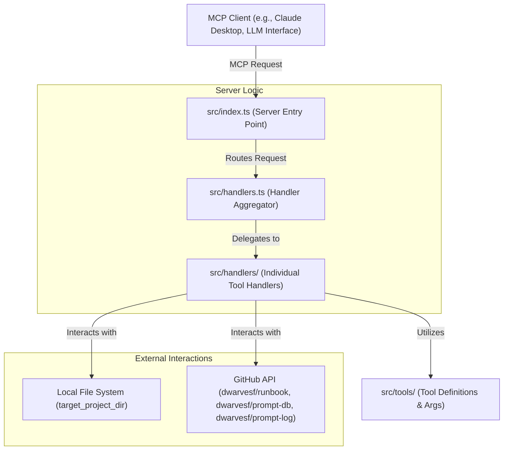
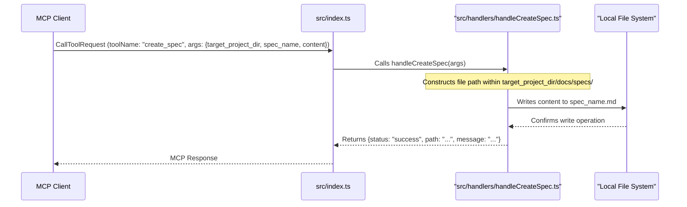
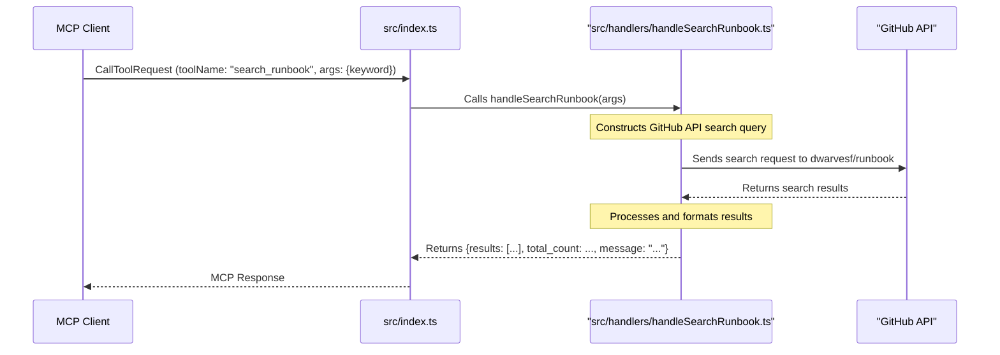
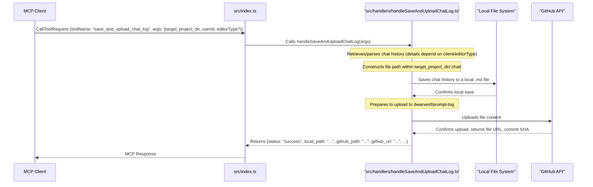

> **tl;dr** The MCP Playbook server receives tool requests from an MCP client (like Claude Desktop or other LLM interfaces). It routes these requests to specific handlers that perform actions like creating documentation files, searching GitHub, or saving chat logs. It interacts directly with the local file system and GitHub APIs.

This document outlines the data flow and architecture of the `mcp-playbook` server, a Node.js/TypeScript application designed to assist LLMs in managing project documentation and conversation logs.

## Core architecture

The `mcp-playbook` server acts as an intermediary between an MCP (Model Context Protocol) client and various backend operations, primarily file system manipulations and GitHub API interactions.

### System components

### How it works

1.  **Request initiation**: An MCP client (e.g., an LLM environment like Claude Desktop) sends an MCP request to the `mcp-playbook` server. This can be a `CallToolRequest`, `ListToolsRequest`, `ListPromptsRequest`, or `GetPromptRequest`.
2.  **Server entry point (`src/index.ts`)**:
    *   The main server instance is initialized, along with transport layers (e.g., `StdioServerTransport`).
    *   It sets up request handlers for different MCP request types.
    *   For a `CallToolRequest`, it identifies the `toolName` and `arguments` from the incoming request.
    *   A `switch` statement routes the request to the appropriate handler function based on the `toolName`.
3.  **Handler aggregation (`src/handlers.ts`)**:
    *   This file imports all individual tool handler functions from the `src/handlers/` directory.
    *   It re-exports these handlers, making them available to `src/index.ts`.
4.  **Individual tool handlers (`src/handlers/`)**:
    *   Each file in this directory (e.g., `handleCreateSpec.ts`, `handleSearchRunbook.ts`) contains the specific logic for executing a particular tool.
    *   These handlers take the arguments parsed by `src/index.ts`.
    *   They perform the core operations, such as:
        *   Reading from or writing to the local file system within the specified `target_project_dir` (for tools like `create_spec`, `create_adr`, `create_changelog`, `save_and_upload_chat_log`).
        *   Making API calls to GitHub (for tools like `search_runbook`, `search_prompts`, `suggest_runbook`, `sync_prompt`, `save_and_upload_chat_log`).
    *   Handlers utilize type definitions for arguments from the `src/tools/` directory.
5.  **Tool definitions (`src/tools/`)**:
    *   This directory contains files defining the arguments for each tool (e.g., `createSpec.ts` defines `CreateSpecArgs`).
    *   `definitions.ts` provides an array of all tool definitions, which is used by the server to respond to `ListToolsRequest`.
6.  **Response**: The handler function returns a result (or an error). `src/index.ts` wraps this result in the standard MCP response format and sends it back to the MCP client.

## Key tool interaction flows

The `mcp-playbook` provides several tools. Here are examples of how data flows for some key operations:

### 1. Document creation (e.g., `create_spec`)

This flow applies to `create_spec`, `create_adr`, and `create_changelog`.

### 2. GitHub search (e.g., `search_runbook`)

This flow applies to `search_runbook` and `search_prompts`.

### 3. Chat log saving and uploading (`save_and_upload_chat_log`)

## Data persistence and external interactions

*   **Local File System**: The server directly interacts with the file system for tools that create or modify documentation (`create_spec`, `create_adr`, `create_changelog`) and for locally saving chat logs before upload. All these operations are scoped to the `target_project_dir` provided in the tool arguments.
*   **GitHub**: Several tools interact with GitHub repositories:
    *   `dwarvesf/runbook`: Searched by `search_runbook` and updated by `suggest_runbook`.
    *   `dwarvesf/prompt-db`: Searched by `search_prompts` and updated by `sync_prompt`.
    *   `dwarvesf/prompt-log`: Chat logs are uploaded here by `save_and_upload_chat_log`.
    These interactions are typically authenticated using a `GITHUB_PERSONAL_ACCESS_TOKEN` environment variable.

## Key characteristics

*   **Self-contained**: The server uses Node.js built-in modules (`fs`, `path`) and libraries like `node-fetch` (implicitly via `@octokit/rest` or similar for GitHub interactions, though the README mentions `node-fetch` directly for older versions) for its operations, rather than relying on external command-line tools from the environment (like a separate `commander` or `github` CLI).
*   **MCP-driven**: All operations are initiated via MCP requests from a client.
*   **Stateless (mostly)**: The server itself doesn't maintain persistent state across requests, aside from potential in-memory caches (e.g., for `search_runbook` results as mentioned in the README). State is primarily managed by the client or stored in the file system/GitHub.
*   **Focused scope**: The server's tools are specifically designed for documentation assistance, knowledge base interaction, and chat log management within the Dwarves Foundation ecosystem.

This data flow ensures that the `mcp-playbook` can effectively assist LLMs by providing a structured way to interact with project files and relevant GitHub repositories, streamlining documentation and knowledge sharing processes.
