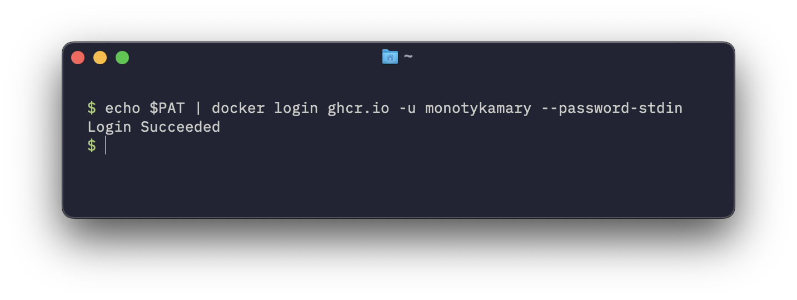

> **tl;dr** This tutorial walks you through generating a GitHub Personal Access Token (PAT) with `read:packages` and `write:packages` scopes, logging into Docker with this PAT for `ghcr.io` using `--password-stdin`, and configuring your MCP client (e.g., Claude Desktop) to use the `mcp-playbook` Docker image.

The `mcp-playbook` server enhances your AI-assisted development workflow by providing tools to manage documentation and synchronize knowledge. This guide will show you how to set it up, focusing on the recommended Docker-based deployment.

## Prerequisites

*   **Docker installed:** Ensure Docker Desktop or Docker Engine is installed and running on your system. You can download it from [Docker's official website](https://www.docker.com/products/docker-desktop/). Otherwise, we recommend using [Orbstack](https://orbstack.dev/) for better performance.
*   **GitHub account:** You'll need a GitHub account to create a Personal Access Token.
*   **MCP client:** An application that can use MCP servers, such as Claude Desktop, Cursor, or a compatible LLM environment.

## Step 1: Create a GitHub personal access token (PAT)

The `mcp-playbook` Docker image is hosted on GitHub Container Registry (`ghcr.io`). To pull this image and for the server to interact with GitHub repositories (like `dwarvesf/prompt-log`, `dwarvesf/prompt-db`, and `dwarvesf/runbook`), you need a Personal Access Token (PAT) with appropriate permissions.

1.  **Navigate to GitHub token settings:** 
    *   Go to your GitHub account settings.
    *   In the left sidebar, click **Developer settings**.
    *   Then, click **Personal access tokens**, and select **Tokens (classic)**.
    *   Click **Generate new token**, then **Generate new token (classic)**.
    *   Or if you're lazy: [https://github.com/settings/tokens](https://github.com/settings/tokens)

    

2.  **Configure token scopes:**
    *   **Note:** Give your token a descriptive name, e.g., `mcp-playbook-ghcr`.
    *   **Expiration:** Set an appropriate expiration period for your token.
    *   **Select scopes:**
        *   For pulling Docker images from `ghcr.io` and allowing `mcp-playbook` to push to it (if ever needed for custom images, though primarily for reading official ones) and interacting with package registries:
            *   Select `write:packages` (this includes `read:packages`).
        *   For `mcp-playbook` tools that interact with repositories (e.g., `save_and_upload_chat_log`, `sync_prompt`, `suggest_runbook`):
            *   Select `repo` (Full control of private repositories). This is a broad permission; ensure you are comfortable with it or manage access via more granular fine-grained tokens if your organization uses them and `mcp-playbook` supports them in the future. For classic tokens, `repo` is often necessary for full tool functionality.

    

3.  **Generate and copy the token:**
    *   Click **Generate token** at the bottom of the page.
    *   **Important:** Copy the generated token immediately. You will not be able to see it again. Store it securely, for example, in a password manager.

    

## Step 2: Authenticate Docker with GitHub container registry

Now, you need to log in to `ghcr.io` using Docker so you can pull the `mcp-playbook` image. Using `--password-stdin` is recommended for security as it avoids saving your PAT in shell history or displaying it on screen.

1.  **Open your terminal or command prompt.**
2.  **Store your PAT in an environment variable (optional but recommended for this method):**
    You can temporarily store your PAT in an environment variable. Be mindful of your shell's history if you type this directly.

    ```bash
    export PAT="your_github_pat_here" 
    ```
    Replace `"your_github_pat_here"` with the actual PAT you copied in Step 1.

3.  **Run the Docker login command:**
    Use your GitHub username and pipe the PAT to the `--password-stdin` flag.

    ```bash
    echo $PAT | docker login ghcr.io -u YOUR_GITHUB_USERNAME --password-stdin
    ```
    Alternatively, if you didn't set the `PAT` environment variable, you can paste the token directly after `echo` (ensure no extra spaces or newlines if pasting, though using the variable is safer):
    ```bash
    echo your_github_pat_here | docker login ghcr.io -u YOUR_GITHUB_USERNAME --password-stdin
    ```
    Replace `YOUR_GITHUB_USERNAME` with your actual GitHub username.

    

    If successful, you should see a `Login Succeeded` message.

4.  **(Optional) Unset the PAT environment variable if you used it:**
    If you stored the PAT in an environment variable for the command, it's good practice to unset it after the login is complete, especially if it was set directly in an interactive terminal session.
    ```bash
    unset PAT
    ```

## Step 3: Configure your MCP client

The final step is to tell your MCP client (e.g., Claude Desktop, Cursor) how to run the `mcp-playbook` server. The server will run as a Docker container, using the PAT for authentication.

1.  **Find your MCP client's configuration settings:**
    This varies by application. For example, in Claude Desktop, you might find a JSON configuration file or a settings UI for MCP servers.

2.  **Add the `mcp-playbook` server configuration:**
    You'll need to add a JSON object similar to the following. Replace `your_github_token_here` with the actual PAT you generated.

    ```json
    {
      "mcpServers": {
        "mcp-playbook": {
          "command": "docker",
          "args": [
            "run",
            "-i",
            "--rm",
            "--pull=always",
            "-e",
            "GITHUB_PERSONAL_ACCESS_TOKEN", // This makes the token available inside the container
            "ghcr.io/dwarvesf/mcp-playbook:latest"
          ],
          "env": {
            // This ensures the PAT is correctly passed to the 'docker run -e' command
            "GITHUB_PERSONAL_ACCESS_TOKEN": "your_github_token_here" 
          }
        }
      }
    }
    ```

    **Explanation of parameters:**
    *   `"command": "docker"`: Tells the client to use Docker.
    *   `"args"`:
        *   `"run", "-i", "--rm"`: Standard Docker flags to run interactively and remove the container when it exits.
        *   `"--pull=always"`: Ensures you always get the latest version of the image.
        *   `"-e", "GITHUB_PERSONAL_ACCESS_TOKEN"`: This is the crucial part that makes the environment variable named `GITHUB_PERSONAL_ACCESS_TOKEN` available *inside* the Docker container. The `mcp-playbook` application running inside the container will read this environment variable.
        *   `"ghcr.io/dwarvesf/mcp-playbook:latest"`: The path to the Docker image.
    *   `"env"`:
        *   `"GITHUB_PERSONAL_ACCESS_TOKEN": "your_github_token_here"`: This is an instruction for the *MCP client itself*. It tells the client: "When you construct the Docker command, replace the placeholder for the `GITHUB_PERSONAL_ACCESS_TOKEN` environment variable in the `args` with this actual token value."

3.  **Add the initialization prompt (if required by your client):**
    Some clients might require you to specify an initialization prompt in their rules to ensure the `mcp-playbook` tools are recognized. The recommended prompt is:

    ```
    ALWAYS run the `init_playbook` tool before starting to get instructions on how things should be done and documented.
    ```
    Add this to your client's global prompts or rules for when `mcp-playbook` should be active.

    

## Step 4: Test the setup

1.  **Restart your MCP client** to ensure it picks up the new configuration.
2.  **Attempt to use an `mcp-playbook` tool.** A simple test is to ask your AI assistant to run the `init_playbook` tool.
    For example: "MCP Playbook, initialize yourself." or trigger a tool call for `init_playbook` directly.

If the setup is correct, the MCP client should start the Docker container, and the `mcp-playbook` server inside the container should respond. You should see output in your MCP client's logs or the AI's response indicating the `init_playbook` instruction.

## Troubleshooting

*   **Docker pull errors:**
    *   Ensure you have successfully run `docker login ghcr.io` with the correct PAT.
    *   Check that your PAT has the `read:packages` scope (included in `write:packages`).
    *   Verify your internet connection.
*   **Container not starting or exiting immediately:**
    *   Check the Docker logs for the container if possible.
    *   Ensure the `GITHUB_PERSONAL_ACCESS_TOKEN` is correctly passed in the MCP client configuration. The `mcp-playbook` server needs this token to operate fully.
*   **Tools failing (e.g., cannot save chat log):**
    *   Confirm your PAT has the `repo` scope for repository interactions.
    *   Ensure the `target_project_dir` you are using in your tool calls is an absolute path and accessible by the Docker container (if volume mounting is used, though the provided command doesn't explicitly mount volumes, meaning file operations occur within the container unless `target_project_dir` points to a mounted volume configured elsewhere). *For the default setup provided, `target_project_dir` will be paths inside the container, which isn't usually what's desired for persistent local file changes. Advanced users might map local directories into the container.*
    *   For `save_and_upload_chat_log`, ensure the `userId` and `editorType` are correctly specified.

You have now successfully set up the `mcp-playbook` server! You can leverage its tools to automate documentation, manage chat logs, and interact with your team's knowledge base more effectively.
