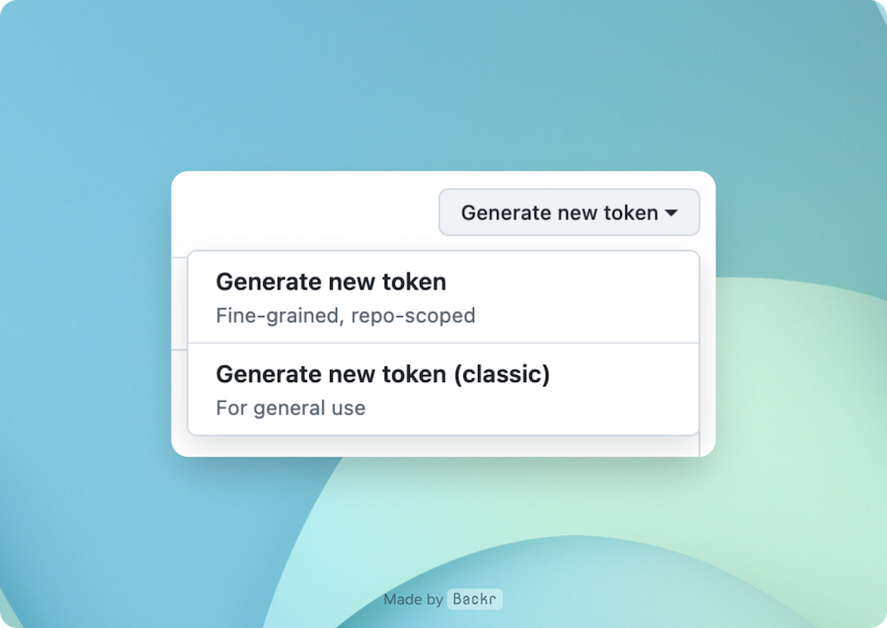
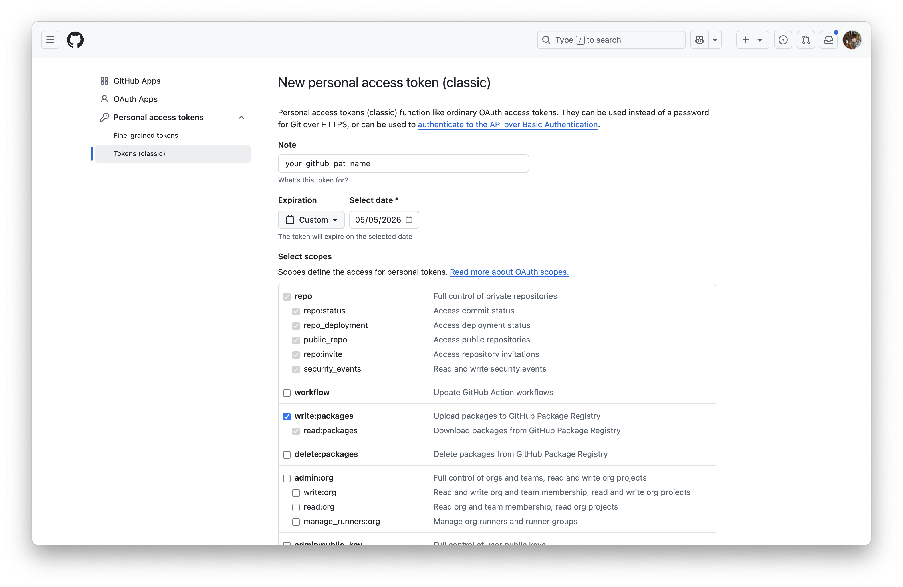
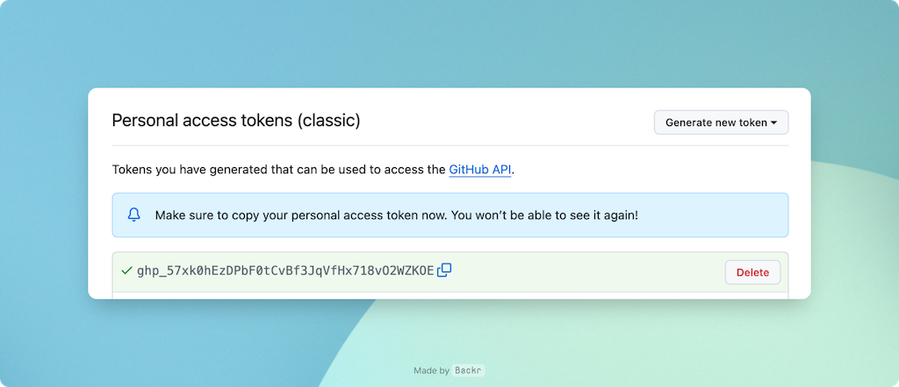
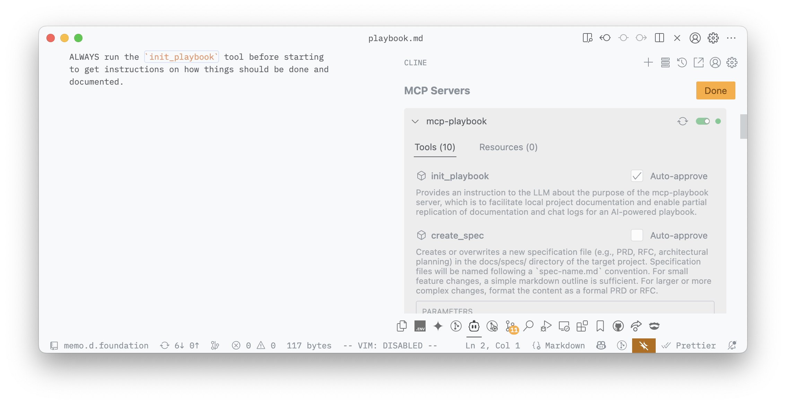

> **tl;dr** This tutorial walks you through generating a GitHub Personal Access Token (PAT) with `repo` and `write:packages` scopes, and configuring your MCP client (e.g., Claude Desktop) to use the `mcp-playbook` server via `npx`.

The `mcp-playbook` server enhances your AI-assisted development workflow by providing tools to manage documentation and synchronize knowledge. This guide will show you how to set it up using `npx`.


## Prerequisites

*   **Node.js and npm installed:** Ensure Node.js (which includes npm) is installed on your system. You can download it from [Node.js official website](https://nodejs.org/).
*   **GitHub account:** You'll need a GitHub account to create a Personal Access Token.
*   **MCP client:** An application that can use MCP servers, such as Claude Desktop, Cursor, or a compatible LLM environment.

## Step 1: Create a GitHub personal access token (PAT)

The `mcp-playbook` server interacts with GitHub repositories (like `dwarvesf/prompt-log`, `dwarvesf/prompt-db`, and `dwarvesf/runbook`) and potentially GitHub Packages. For these interactions, you need a Personal Access Token (PAT) with appropriate permissions.

1.  **Navigate to GitHub token settings:**
    *   Go to your GitHub account settings.
    *   In the left sidebar, click **Developer settings**.
    *   Then, click **Personal access tokens**, and select **Tokens (classic)**.
    *   Click **Generate new token**, then **Generate new token (classic)**.
    *   Or if you're lazy: [https://github.com/settings/tokens](https://github.com/settings/tokens)

    

2.  **Configure token scopes:**
    *   **Note:** Give your token a descriptive name, e.g., `mcp-playbook-access`.
    *   **Expiration:** Set an appropriate expiration period for your token.
    *   **Select scopes:**
        *   `repo`: Essential for `mcp-playbook` tools that interact with your code repositories (e.g., `save_and_upload_chat_log`, `sync_prompt`, `suggest_runbook`). This scope grants full control of private repositories.
        *   `write:packages`: This scope (which includes `read:packages`) allows interaction with GitHub Packages. While not strictly required for all current core features, it's recommended for potential future capabilities of `mcp-playbook` or if specific tools need to manage or access packages in GitHub's package registry.

    

3.  **Generate and copy the token:**
    *   Click **Generate token** at the bottom of the page.
    *   **Important:** Copy the generated token immediately. You will not be able to see it again. Store it securely, for example, in a password manager.

    

## Step 2: Configure your MCP client

The final step is to tell your MCP client (e.g., Claude Desktop, Cursor) how to run the `mcp-playbook` server. The server will be run using `npx`, using the PAT for GitHub authentication.

1.  **Find your MCP client's configuration settings:**
    This varies by application. For example, in Claude Desktop, you might find a JSON configuration file or a settings UI for MCP servers.

2.  **Add the `mcp-playbook` server configuration:**
    You'll need to add a JSON object similar to the following. Replace `your_github_token_here` with the actual PAT you generated in Step 1.

    ```json
    {
      "mcpServers": {
        "mcp-playbook": {
          "command": "npx",
          "args": ["-y", "@dwarvesf/mcp-playbook"],
          "env": {
            "GITHUB_PERSONAL_ACCESS_TOKEN": "your_github_token_here"
          }
        }
      }
    }
    ```

    **Explanation of parameters:**
    *   `"command": "npx"`: Tells the client to use `npx` to run the package.
    *   `"args"`:
        *   `"-y"`: Skips confirmation when `npx` installs the package.
        *   `"@dwarvesf/mcp-playbook"`: The name of the package to execute.
    *   `"env"`:
        *   `"GITHUB_PERSONAL_ACCESS_TOKEN": "your_github_token_here"`: This makes the GitHub PAT available as an environment variable to the `mcp-playbook` server process. The server will use this token to authenticate with GitHub for operations like saving chat logs or suggesting runbook entries.

3.  **Add the initialization prompt (if required by your client):**
    Some clients might require you to specify an initialization prompt in their rules to ensure the `mcp-playbook` tools are recognized. The recommended prompt is:

    ```
    ALWAYS run the `init_playbook` tool before starting to get instructions on how things should be done and documented.
    ```
    Add this to your client's global prompts or rules for when `mcp-playbook` should be active.

    

## Step 3: Test the setup

1.  **Restart your MCP client** to ensure it picks up the new configuration.
2.  **Attempt to use an `mcp-playbook` tool.** A simple test is to ask your AI assistant to run the `init_playbook` tool.
    For example: \"MCP Playbook, initialize yourself.\" or trigger a tool call for `init_playbook` directly.

If the setup is correct, the MCP client should execute the `npx` command, and the `mcp-playbook` server should start and respond. You should see output in your MCP client\'s logs or the AI\'s response indicating the `init_playbook` instruction.

## Troubleshooting

*   **`npx` command not found / errors during execution:**
    *   Ensure Node.js and npm are correctly installed and that their installation directory is in your system's PATH.
    *   Try running `npx -y @dwarvesf/mcp-playbook --version` (if the package supports a version flag) or a simple command like `npx cowsay hello` in your terminal to check if `npx` is working.
    *   Check for error messages in your MCP client's logs or terminal output when the command is run.
*   **Server not starting or exiting immediately:**
    *   Ensure the `GITHUB_PERSONAL_ACCESS_TOKEN` is correctly passed in the MCP client configuration. The `mcp-playbook` server needs this token to operate fully.
    *   Check for any error messages from Node.js or the `mcp-playbook` script itself.
*   **Tools failing (e.g., cannot save chat log):**
    *   Confirm your PAT has the `repo` (and potentially `write:packages`) scope for repository and package interactions.
    *   Ensure the `target_project_dir` you are using in your tool calls is an absolute path and accessible by the user running the MCP client (and thus the `npx` command).
    *   For `save_and_upload_chat_log`, ensure the `userId` (and `editorType` if applicable) are correctly specified.

You have now successfully set up the `mcp-playbook` server! You can leverage its tools to automate documentation, manage chat logs, and interact with your team\'s knowledge base more effectively.
