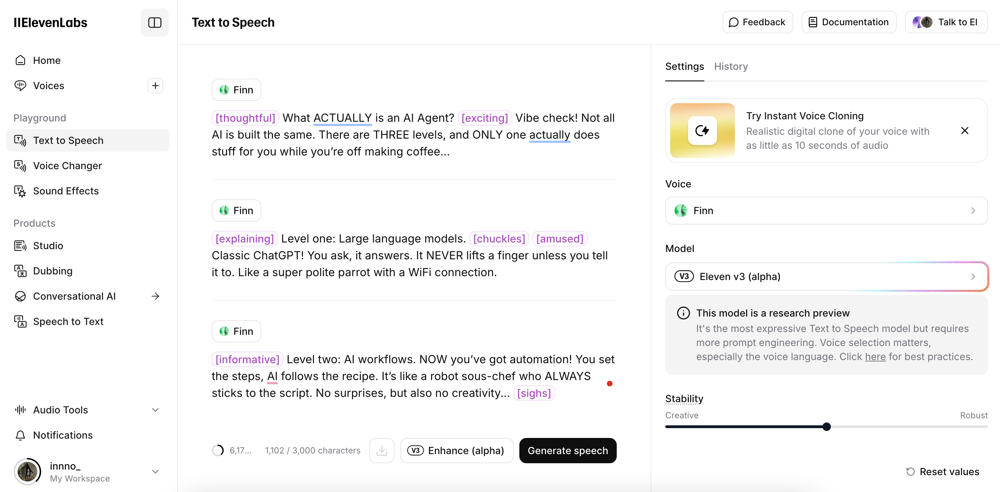
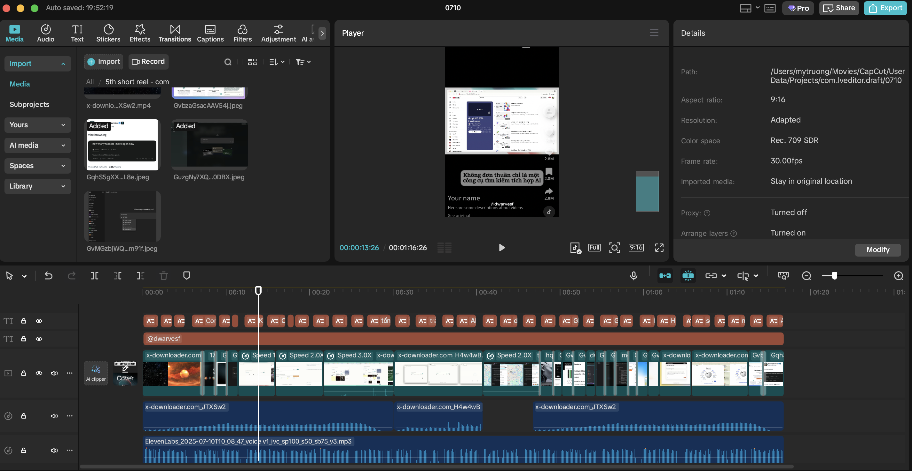

We care about doing things right and having a bit of fun along the way. Our new video pipeline is built to help us tell better stories, faster. Whether it’s a deep tech explainer or a meme with bite, every piece now flows through a system that keeps us sharp and in sync.

## Why build a video pipeline?

Because we want our videos to sound like us: clear, clever, and just the right amount of weird. Instead of cobbling things together every time, we built a flow. So the team can focus on the good stuff like ideas, stories, and the occasional perfectly timed troll without getting bogged down.

## Long form video workflow: detailed steps and tools

**Target channels:** YouTube, LinkedIn

**Use case:**  Explainers, dev logs, research stories, design walkthroughs

### Draft the script

*Tool: Notion*

We start with a clear requirement:

- What are we trying to explain and the message?
- Who’s it for?
- Any references we admire?

This becomes the draft script. Everyone chimes in until the script hits the right tone: smart, simple, not boring, aligned with how we talk as engineers.

### Generate the script

*Tool: Generative AI*

We write or co-write the video script using LLMs to help reshape ideas from memos, meetings, or chat threads into a clear voiceover-ready script. The goal is to make the message clear and structured, keeping it aligned with how we’d speak as builders. Think of this as refactoring written insight into spoken form. 

### Choose the reader voice

*Tool: ElevenLabs, Google AI Studio or a Dwarves voice*

Sometimes it’s a Dwarves teammate. Sometimes it’s AI from Elevenlabs. Either way, the voice should match the vibe: grounded, calm, witty, a little smug (in a good way), never robotic.

### Add transcript

*Tool: Capcut*

We pull a clean transcript for captions. Captions help with clarity, accessibility, repurposing and easier to clip down later. Makes sure keep it clean and time-synced.

### Gather visuals

*Tools: Figma, Google, Meme Kitchen, Giphy, Reddit community*

We source or create visuals to match the story, diagrams, code snippets, product screenshots, doodles, or memes. Rule of thumb: visuals should add clarity, not just decoration.

### Edit and output production video

*Tool: Capcut desktop*

Capcut handles most of our editing from syncing visuals and audio to adding subtitles, transitions, and some flair. Final output: 1080p, platform-ready title and description.

## Short video workflow

Shorts are where we get to mess around. Memes, quick hits, highlights whatever gets the point across in under a minute.

**Target channels:** YouTube shorts, Instagram reels, Facebook reels

**Use case:** 1-minute tips, memes, or repurposed long-form content

- **Script**: Notion & Generative AI
- **Visuals**: Giphy, Canva, Reddit community, Google
- **Edit**: Capcut (desktop or phone)
- **Post**: Native apps (YouTube shorts, IG reels, Facebook reels)

### Two ways to make Shorts

**Scripted short formats**

- “Dad, how do I?” explainer style
- “1-Minute Crafts” for dev/design tools
- Quick intros to internal tools or team practices

**Cut from long-form**

- Pull 1–3 highlights from a longer video
- Add captions or transcript overlay
- Export as Shorts-ready clip

## Support layer (behind the scenes)

- **Where do we store things?**
    - All assets (scripts, audio, visuals, exports) go into Google Drive.
    - Organized by episode or series folder.
    - Notion Content calendar is used for asset tracking and version control.
- **How do we notify the team?**
    - Use Dwarves discord (🗣・operations) when the draft is ready.
    - Feedback and final review tracked at #operation, #lobby.
    - Tag stakeholders for final sign-off
- **How are credentials managed?**
    - Platform credentials (YouTube, LinkedIn) are managed by the content lead.
    - Access is shared only with designated team members.
    - Credential list reviewed and rotated quarterly.

## Script for short teel: “AI-agent explained” example

[Opening image: Three stacked icons labeled 1, 2, 3 with “AI Levels”]

Voiceover:
Let’s talk AI agents. Not every AI is created equal. Most people call everything “AI” but there are three levels, and only one of them is actually doing your job for you.

[Cut to: LLM icon, chat bubble]
Level one: Large language models. These are your classic ChatGPTs. They wait for your prompt, spit out text, and never touch your stuff unless you say so. Basically, a smart parrot with a keyboard.

[Cut to: Workflow diagram, gears turning]
Level two: AI workflows. Now you’ve got automation. You design the steps, AI follows your recipe, and everything is nice and predictable. If you want a robot intern who never goes off-script, this is your stop.

[Cut to: Agent icon, branching paths, goal flag]
Level three: AI agents. Here’s where the magic (and chaos) happens. The AI decides what to do, judges its own work, and keeps trying until it gets the result. It’s like hiring a junior dev who never sleeps and sometimes invents whole new bugs.

[Cut to: Meme “I let the agent handle it, now I have no idea what’s running in prod”]
Sure, it feels like the future. But if you’re still making all the decisions, you’re not using an agent, you’re just automating.

[Closing image: Giphy sticky note “Let the agent vibe, but check the logs”]
So, want to level up? Let the AI make the calls, but don’t blame us when it starts refactoring your life.

## Final notes

This pipeline is how we turn working knowledge into visual stories. It’s how we build our public memory, just like our memo.

Stick to the system. Improve where needed. And ship it when it’s clear, not when it’s perfect.