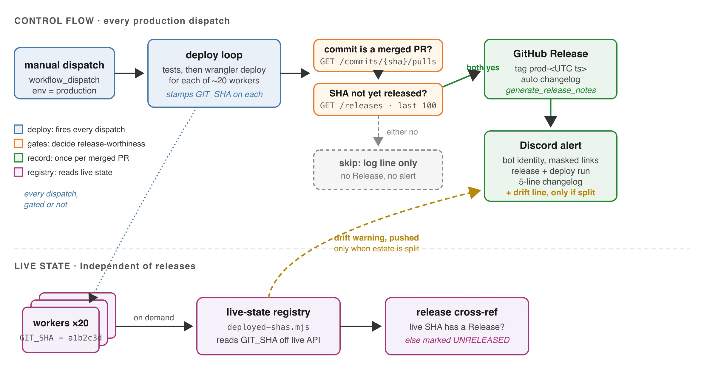

Our platform monorepo deploys about twenty Cloudflare Workers out of one repository, in one pipeline run, from a manually dispatched GitHub Actions workflow. We added a GitHub Release per production deploy so there would be a durable record of what shipped. Within about half a day the Releases tab had four entries covering roughly two distinct revisions, and we deleted them by hand.

Nothing was broken. The pipeline did exactly what we asked. The problem was that we had asked for the wrong thing.

## The three layers

```
Layer            Fires                        Answers
---------------  ---------------------------  -----------------------------
Deploy           every production dispatch    did the code ship
Release          once per merged PR           what shipped, and when
Live registry    on demand                    what is running right now
Drift warning    only when inconsistent       something is off, look now
```



_The finished pipeline: every dispatch deploys and stamps the commit onto each worker, but only a commit that clears both gates (merged PR, not already released) produces a Release and an alert. The bottom lane reads version state back off the live platform, independent of releases, and pushes a drift warning into the alert only when the fleet is split across commits._

Everything below is the story of arriving at that topology. It looks obvious written down. It was not obvious while we were treating "we deployed" and "we released" as the same event.

## Why the cadence broke the model

Release-per-deploy is a fine default when a human decides to ship, writes a changelog, and presses a button on Friday afternoon. It stops being fine when an AI pair-programming session is doing the work.

In that mode the loop is tight: make a change, commit, dispatch, look at production, adjust. The deploy button gets pressed because pressing it is how you see whether the thing works, not because a body of work is finished. Some of those dispatches are a one-line copy fix. Some are a retry because the first run looked ambiguous and re-running was cheaper than reading the log carefully.

Every one of those minted a release. The tab that was supposed to be a history of meaningful revisions became a log of button presses, and a log of button presses is something we already had, called the Actions tab.

The naive fix is a retention policy: keep the last N releases, delete the rest. We did not do that, because it contradicts the reason releases exist. Deleting old releases discards exactly the history worth keeping. The pollution was not a storage problem, it was a trigger problem.

## Gate the release, not the deploy

The fix that survived: keep deploying on every dispatch, and gate only the release. Two conditions, either of which skips the whole block (no release, no notification, one log line).

**One, the commit came from a merged pull request.** GitHub will tell you directly:

```bash
merged_pr=$(curl -sSf -H "Authorization: Bearer ${GH_TOKEN}" \
  -H "Accept: application/vnd.github+json" \
  "https://api.github.com/repos/${REPO}/commits/${GITHUB_SHA}/pulls" \
  | jq -r '[.[] | select(.merged_at != null)][0].html_url // empty')
```

For a squash-merge commit on the default branch, that returns the originating PR. For a direct commit it returns nothing. The job needs `pull-requests: read` for the lookup. We verified it against a real merge commit before trusting it rather than assuming the endpoint behaved as documented.

This is the load-bearing gate. A commit that never went through review was never a candidate for the release history in the first place, whatever the deploy pipeline did with it.

**Two, this revision is not already released.** Our tags carry a UTC timestamp, which means they never collide, which means a re-dispatch of the same commit happily mints a second release for a revision that already had one. That is precisely how four releases appeared for two revisions. So before minting, check the recent releases for one whose `target_commitish` already matches the deployed SHA, and skip if found.

Both gates are cheap and bounded. The net effect is the one we wanted: dispatch as often as the work requires, and the Releases tab grows once per merged PR.

## The label that was quietly lying

A smaller thing, worth naming because it is the kind of error that survives review.

The deploy notification carried a link labelled `test run: passed`. The link pointed at the whole workflow run, which includes the test job and the deploy loop that actually shipped every worker. So the URL was right and the label was wrong: it framed the message as a test-status check when the reader is trying to learn whether the revision shipped.

It now reads `deploy: succeeded`. Same URL, and the word stays literal, because the runner aborts on the first failing command and the line therefore never posts after a failed test or a failed worker deploy.

We then found the same stale framing in the release body itself, still saying "test run" while the notification said "deploy". Two surfaces describing one event in two vocabularies is how people learn to distrust both.

## The question the gating created

Gating releases behind merged PRs raises an obvious objection: if someone ships a small fix that never becomes a PR, how do we know what is actually running?

Answer: not from releases at all. The deploy loop stamps the deployed commit onto every worker as a plain variable, and a script reads that back off the live platform API:

```
worker configs under workers/, env production

workers/client/invoice          df-client-invoice        5427cca...
workers/contractor/payout       df-contractor-payout     5427cca...
workers/treasury/icy            df-treasury-icy          5427cca...
...

5427cca... -> UNRELEASED, https://github.com/.../commit/5427cca...
```

This reads live state, not a deploy log, so it cannot drift. It answers "what is running right now" independently of whether a release exists, which is exactly the property that lets us gate releases aggressively without losing the incident-time answer.

The `UNRELEASED` marker is the cross-reference we added afterwards: every distinct live commit is checked against the Releases tab, and if a live revision has no release, the script says so instead of printing a bare hash. In the run above that is correct and expected, because we had just cleared the polluted releases by hand.

## Push the warning, do not wait to be asked

A pull-based script only helps someone who thinks to run it. The failure mode worth catching is the one nobody is looking for.

Our deploy loop skips any worker whose config does not declare the target environment. That is deliberate, and it means a worker can sit on an older commit while everything around it moves forward, with nothing surfacing the fact. So the same script now runs inside the deploy step and its output is grepped for one line:

```
⚠️ 3 distinct commits are live. The estate is not on one build.
```

Appended to the deploy notification only when there is drift. Never an all-clear on a clean deploy, because a line that appears every time stops being read.

The finished notification:

```
🚀 platform · production deploy #37
sha: a1b2c3d
📦 release: 20260812.153000
⚙️ deploy: succeeded

📝 changes:
* feat(payout): verify the Drive copy before commit-by-file flips Paid
* fix(invoice): missing month paperwork no longer blocks generation
```

The changes list is not ours to generate. GitHub produces it when you pass `generate_release_notes: true` on release creation, and we read it back out of that same response instead of making a second call or parsing git log. Both links are masked markdown, which renders in a bot message's plain content even though Discord strips it from user-typed messages.

## What transfers

The specifics are Cloudflare and GitHub Actions. The shape is not.

**Deploy frequency and release frequency are different numbers, and agent-driven work makes the gap enormous.** Any pipeline that assumes they are equal will produce noise proportional to how productive the session was, which is a bad incentive.

**Gate the record, not the action.** Slowing deploys to protect the release history would have been the wrong trade. Deploys are cheap and should stay cheap; the release is the thing that needs a meaning.

**A version marker that reads live state beats one that reads a log.** The registry survived every change to the release policy precisely because it never depended on it.

**Notifications should stay quiet when things are fine.** The drift line is valuable because it is rare. An all-clear on every deploy would train everyone to skip the message, and the one time it mattered they would.

Five pull requests, one afternoon, most of it spent deleting things we had built earlier the same day. The reverted work was not wasted; a tag scheme keyed on the run number looked correct until we noticed re-runs reuse that number, and finding that out cost less than shipping it would have.
