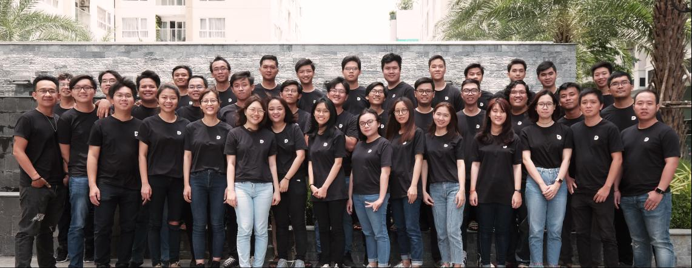

> "Building an innovation startup requires lots of different things, and it is tough." Five years ago, we decided to do something about it.

Five years ago, we started with a simple belief: great software deserves better than hit-and-run development. What began as three people sitting around coffee shop corners in Saigon has grown into something we never quite imagined: a 60+ strong team spanning three continents, serving clients globally while staying true to our core belief that craftsmanship matters.

As we mark our fifth anniversary, it's worth reflecting on what we've learned, what we've built, and where we're headed. This isn't just a company milestone. It's a story about choosing quality over quick fixes, people over processes, and building something that lasts.

## The problem we set out to solve

Most software firms don't get the respect they deserve, and frankly, they've earned that reputation. Tight deadlines and tighter budgets force teams into bad habits. They hit and run. The codebase they leave behind is full of shortcuts and technical debt. It damages everyone's pride.

That's exactly why we started Dwarves Foundation. We wanted to build things right. We believed that software engineering disciplines should shine, that innovative quality products could change the world for the better, and that there had to be a different way.

Our very first office was 20 square meters in a small alley of District 3. We didn't even have that until six months after we started. Before that, we held team meetings and client calls around coffee shop corners. The journey of empowering innovation began from those humble beginnings.

## By the numbers

The growth from 3 to 60+ people tells a story of sustainable expansion built on solid foundations:

| Metric | Value |
|--------|-------|
| **Continents** | 3 with our presence |
| **Years in market** | 5+ |
| **Global clients** | 15+ worldwide |
| **Open source projects** | 15+ |
| **Platforms & apps** | 20 delivered |
| **Annual growth rate** | 30% |
| **Team members** | 60+ talented |
| **Alumni network** | 100+ members |
| **Office space** | 300 square meters |
| **Code base** | 500K+ lines and counting |

## The journey: Year by year

Looking back, our timeline tells the story of steady, intentional growth.

### 2015: The foundation

We started with a team of 3. We adopted the name Dwarves Foundation and its lore. Our mission and core values took shape. We established our presence on Facebook, Twitter, and Github, set up our source version control on Gitlab CE.

Our first technical choices mattered: Go, Docker, and Ansible. We landed our first client in Singapore and shipped our first build as a team. By year's end, we'd grown to 10 people and acquired the domain dwarvesf.com. We adopted CI/CD and code review practices, and welcomed our first client in Vietnam.

### 2016: Building momentum

The team reached 15. Our very first designer joined the woodland. We expanded internationally with our first clients in the UK and France. Technically, we adopted DC/OS as our container orchestration tool and embraced microservice architecture. We also acquired the domains dwarves.foundation and d.foundation.

### 2017: Scaling up

We hit 25 team members and formed our first QC team. We tripled our office space and added Swift and Kotlin to our technical stack. The first ideas about remote culture started taking shape.

### 2018: Going global

We established US and EU branches. The team reached 40, and we appointed our first VP of Engineering. We adopted a company-wide expertise ladder. Our operations and business teams joined the woodland, and we launched our first internship program. We applied automation testing, composed the Dwarves Manifesto for Craftsmanship, and adopted Kubernetes and TypeScript.

### 2019: Embracing the future

The team hit 50 and we gradually adopted remote culture. We published the first version of the Dwarves Handbook and Playbook. We landed our first clients in the US, Australia, Netherlands, and Malaysia. We officially launched our Ventures arm at dwarves.ventures and made our first acceleration batch. We applied Scrum at Scale, launched our Tech Radar program, and built the Fortress dashboard for full operational automation.

### 2020: Setting the stage

We established our Canadian branch. We shipped the first version of our automation framework and distributed our first dividend batch to shareholders. We heavily invested in community and CSR work. The future was just beginning.

## Five lessons learned the hard way

### 1. People's values come first

It all starts with people. Put the human factor at the core of everything. Be a good listener. Respect others. Understand other people's values, concerns, and points of view.

When we started hiring, we looked for people's unique value. Being different from others is always a source of strength. The difference can be anything: how they think, their vision of technology, their approach to operations, presentation skills, communication abilities, leadership style, speed of prototyping, emotional intelligence. We built an organization where those specialties are respected, not one that relies on stereotyped technical evaluations.

### 2. Maintain a positive can-do attitude

Keep a positive outlook no matter how difficult the circumstances, but stay honest about the situation. This balance has carried us through challenging projects and market conditions.

### 3. Lead by example

Lead by example. Never complain. When in doubt, start working on the actual thing to figure it out. This approach has helped us navigate uncertainty and build trust with both team members and clients.

### 4. Look for partnership, not just business

Don't look for business, look for partnership. It's about giving, not taking. This mindset has led to our strongest client relationships and most successful projects.

### 5. Keep moving ahead

Enjoy the journey. Don't plan your life or career too much. Things happen. Keep moving ahead. Each situation, even the most difficult ones, has blessings and joys if you look for them and appreciate them.

## What we built together

Below are some things we accomplished as a team. Not all of them are significant in isolation, but together they represent what we're proud of.

### Vision and belief

Dwarvish magic was fundamentally technological know-how. With software continuing to change the world, we wanted to build a company where software engineering disciplines could shine, where innovative quality products are shipped to change the world for the better.

At our woodland, Dwarves are encouraged to thoroughly assess and evaluate product quality before handing it to users. By participating in every detail of the work, we take craftsmanship as one of the most fundamental factors in career transformation for engineers. Top-notch products require world-class engineers, and craftsmanship is what makes it happen. Craftsmanship flows through team spirit, or it doesn't exist at all.

"We choose innovation to be one of our core values that form ideas to affect society for the better."

### Culture: Engineering driven

We built a culture based on three principles:

- **Systematic discipline:** We follow processes that work
- **Engineers are not commodities:** We value people as craftspeople, not resources
- **The best idea wins:** Merit matters more than hierarchy

### The Dwarves Manifesto

The manifesto became our principles and definition of engineering philosophy. These guiding ideas help shape how we think and work, ensuring we maintain our core values while delivering quality software. As we honor and stand for software craftsmanship, we turned these principles into concrete, applicable messages.

### The Dwarves Handbook

After years of working with companies from startups to corporates, building world-class products and leading teams to success, we created the Dwarves Handbook.

The handbook shares what's worth knowing about Dwarves: our company, culture, processes, and history. It's a guide to understanding what people are talking about, whether it's okay to take vacation when you've only been with us a few months (yes), what our benefits package looks like, and everything in between. The handbook gives us an opportunity to clarify who we are as a company. What do we stand for? How should we work?

The playbook, on the other hand, contains our practices in software development: guides for getting things done, programming well, programming in style, and collaborating successfully.

### Agile at scale

We applied Agile methodology and Scrum to run our entire company, not just development teams:

- Business direction planning with eight-week cycles
- Operations planning and review between departments
- Hiring for culture and values over just technical skills
- Encouraging team members to embrace tacit knowledge sharing
- Functional teams reaching semi-autonomy and performing on their objectives

### Remote working pioneer

We endorsed and adopted remote culture from early 2019, before it became mainstream. This brought benefits to the team and transformed how we collaborate. We don't manage chairs. People have more time for family and focused work. They focus on quality conversations and output rather than random interrupting messages.

People moved their conversations to Basecamp, where all information lives. Check-in messages help the team get to know each other better. People from different time zones can catch up when they finish their work, and transparency returned to our culture.

### Engineering ladder

Along with our engineering practices, we developed a ranking ladder that helps us classify and build mentoring relationships between Dwarves. Leads and seniors are assigned objectives. During each cycle, they can choose mentees from junior members. The ranking system is structured on our engineering-driven culture. It starts from D to C, to B, to A, and ends with S, with several checkpoints in between.

We try to make everything clearer about how contributions are distributed. It all comes down to your unique values and how impactful they are.

### Automation operations

Most software companies can't automate their business workflow. It requires well-defined processes, and the cost is expensive.

We built Fortress, a dashboard with a built-in bot integrated with Basecamp and other task management tools. It aggregates all operational data and schedules tasks that other companies need entire teams to handle. With a team size of 60, only 4 Dwarves wear additional hats to run daily operations: recruitment, candidate assessment, onboarding, leave requests, payroll, accounting, and company valuation. All operational data flows into a single hub for data analytics and optimization.

### Open structure

Our open organizational structure reflects the ownership that team members can have and transparency in team direction. After 5 years, we reward contributions by giving portions of company profit to exceptional Dwarves who want to make a legacy here. With the unique value and impact they bring to the table, they help speed up our collective success.

## A message to our community

To every person who has been part of our first five years, whether as a team member, client, partner, or supporter: thank you. Your contributions shaped who we are and where we're going.

We're building more than a company. We're creating a community of craftspeople who believe software can change the world for the better. That belief, more than any technology or process, will carry us into the next chapter.

The first five years taught us that building something meaningful takes time, patience, and unwavering commitment to quality. We're excited about the problems we'll solve, the technologies we'll explore, and the talented people who will join our journey.

## Special thanks

Every contribution counts. Thanks for always being around, listening to our story, and supporting our moves in one way or another.

Bui Vu Nam, Bui Trung Hieu, Tieu Quang Huy, Pham Duy Khang, Nguyen Thanh Tung, Nguyen Huu Loc, Le Ngoc Thach, Do Chi Thien, Nguyen Manh Hieu, Le Nhu Khanh, Nguyen Thanh Trung, Le Thi Minh Tam, Nguyen Minh Tuan, Nguyen Le Duy, Nguyen Pham Hoang Diem, Vo Anh Duy, Nguyen Thanh Long, Truong Hoang Phuong, Chu Duc Trung, Nguyen Quoc Huy, Ngo Tuan Anh, Tu Dang Khoa, Vu Huy Quan, Nguyen Duc Thanh, Nguyen Manh Quoc Anh, Le Phuoc My, Mai Lam Trong Nguyen, Tran Thanh Phuong, Le Chau Vinh Hoi, Trinh Van Huy.

Thanks for joining us in the first five years. We look forward to the next five.

---

**Vietnam**: 200 Ba Thang Hai, D10, Ho Chi Minh  
**US**: 2035 Sunset Lake, Newark, Delaware  
**Canada**: 8 Leavey Court, Toronto
