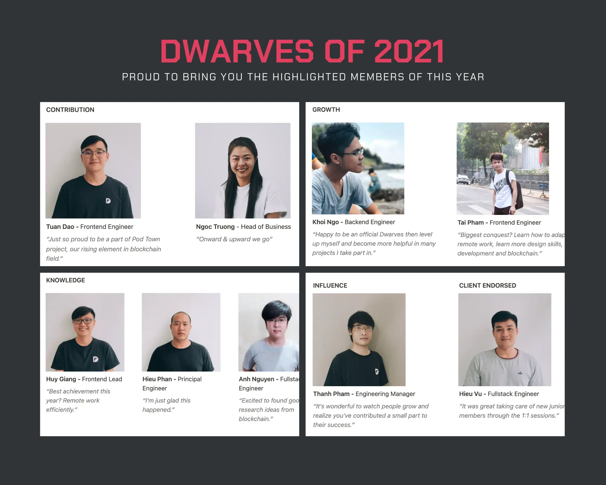
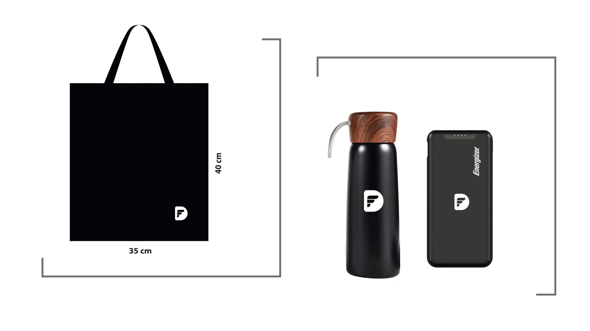
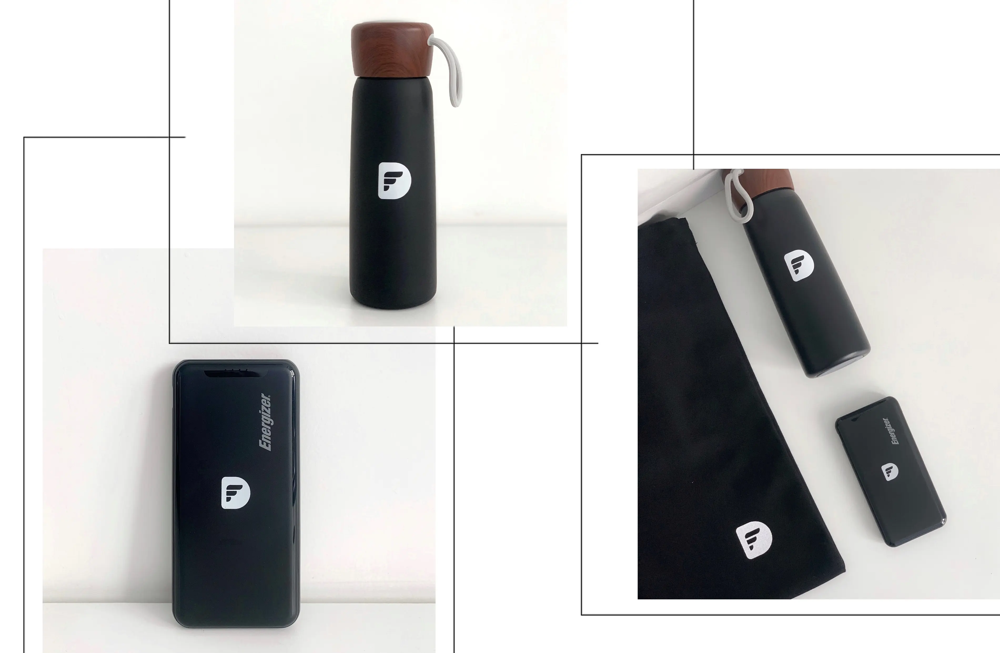

Apart from the team's voting result for each title, the team leads also selected the **Honorable Mention** and **Client Endorsed**, as we want to honor all of the hard work.

You can find the **[voting details here](https://docs.google.com/spreadsheets/d/1ggaJYllrIg8IK8uFOEqWFoHUATM1BP6ISTrX-emsdIc/edit#gid=0)**. The final result was close since you're all awesome!

Let's all welcome our Dwarves of 2021 🛠

### Claim Your Prize
Based on the prize value in each title, let’s select your prize item in this sheet [https://bit.ly/3G0LuAU](https://bit.ly/3G0LuAU). A few notes on this: 

* You can choose ***any item*** - as long as the subtotal value is ***≤= your prize value***. 
* The prize value can’t be redeemed in cash. 
* Please help to select your prize **before Jan 14, 2022**. We will close the list by then.
* If your name is on the list but you can’t input the prize, drop your email to Duy.
* If you got any wishlist item that also matches your prize value, please ping Duy for further support. 

**We’ve also prepared you all a mini merchandise set for the rest of the team**
Hope you can travel anywhere with this combo. Please help by inputting your info in the tab Team Address - [https://bit.ly/3G0LuAU](https://bit.ly/3G0LuAU).

A big congratulations to our Dwarves of 2021! And thank you to all the Dwarves teammates for being with us through the past seven years. May we all enter 2022 with happiness and success. ♡

