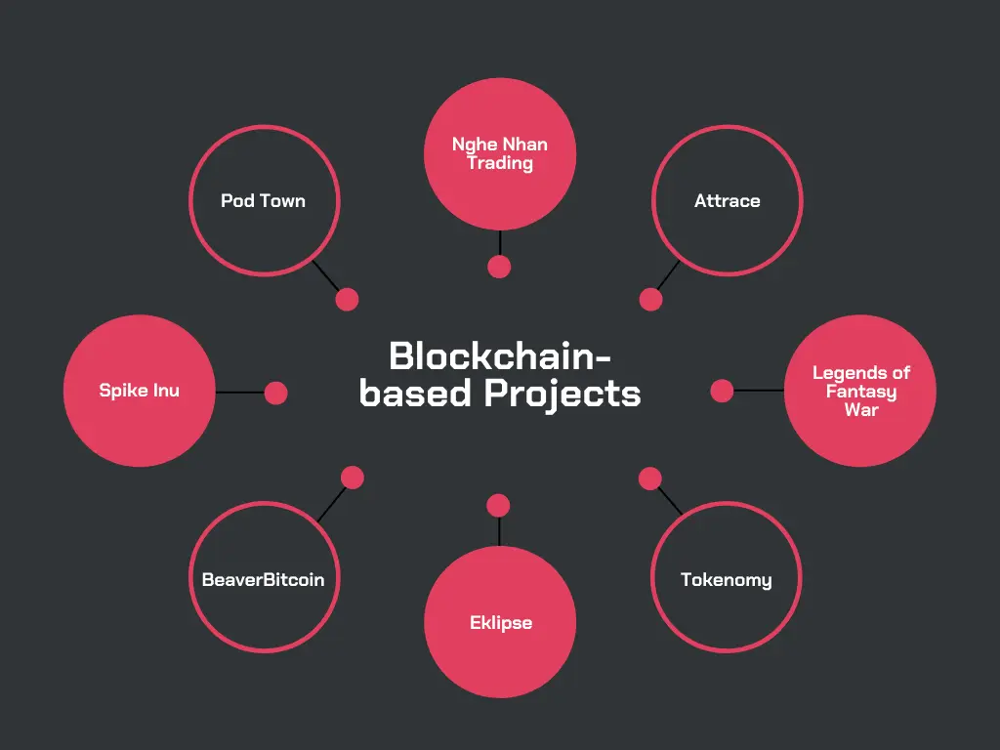
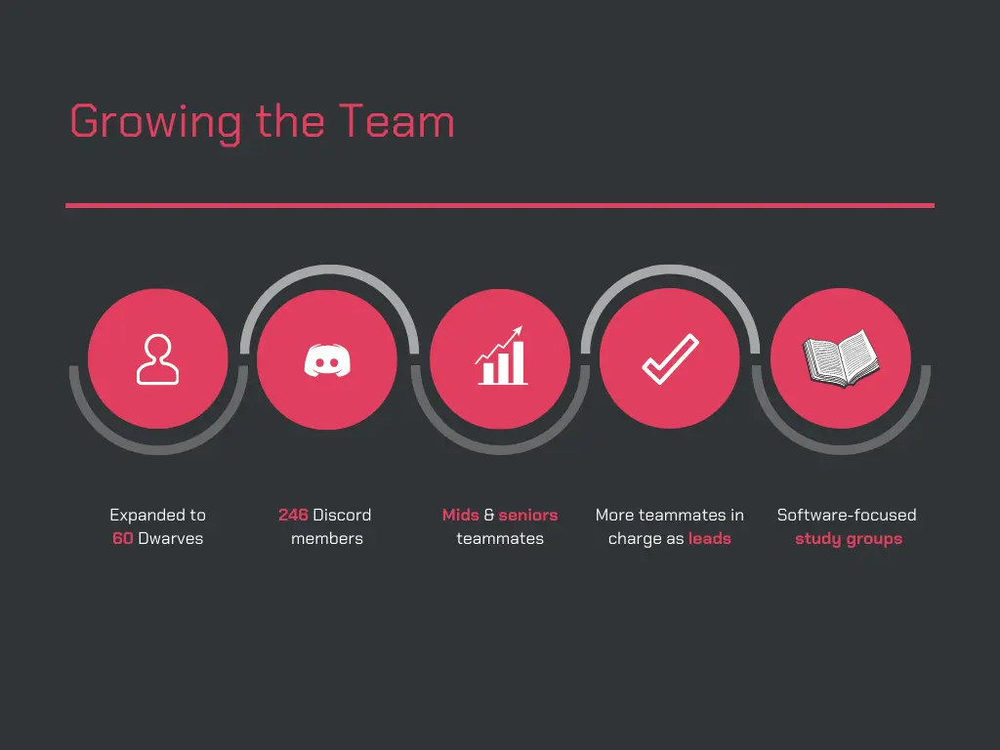
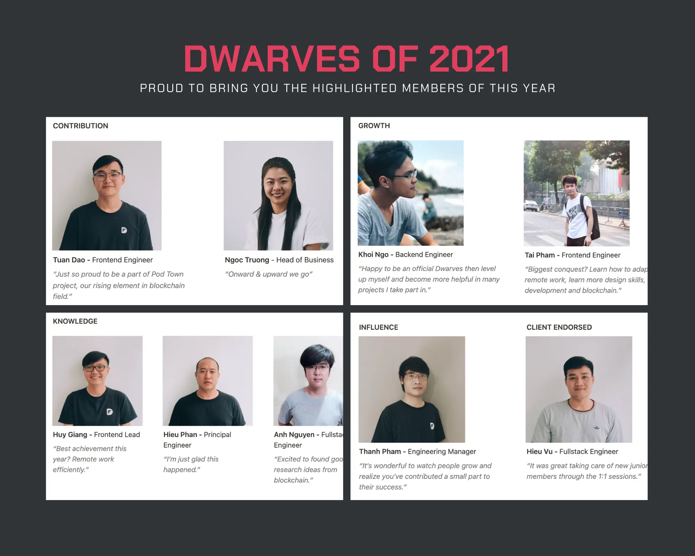
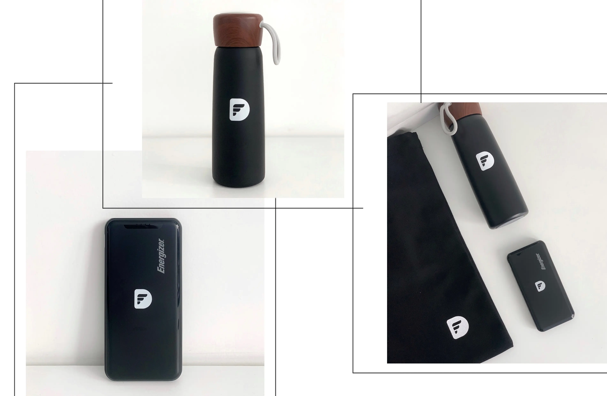

### Moving with Blockchain
We shift our focus to real deals. 

Meanwhile, **#blockchain** **#web3** channels are there for the Dwarves to learn & exchange their knowns. Grab your seat.

The teammates also propose to join blockchain projects. We’re happy to onboard Hien, Tu, and Ngoc Mai on Spike Inu and Eklipse - and actively seek more chances for our teammates.

### Selective in Project Decision
It’s a promise of bigger clients & better team deployment.

We were able to drop the long-term projects that no longer match our business direction; successfully committed to **deploying a minimum of 3 Dwarves** for almost all remaining projects. With this change, we also **increased the headcount rate** as we believe it should grow alongside our ability to deliver.

### Growing The Team
A special congrats to Cuong Mai, Tom, & Ngoc Mai for passing the probation and becoming true Dwarves. Last month brought us Phat Ha, who’s currently in charge of Nghe Nhan Trading. The Dwarves are growing, by all means. 

The Dwarves have shown their ongoing ability to deliver more credible outputs within each project and were significantly endorsed by the clients.

We got Momos, Relay, BeaverBitcoin & Tokenomy as examples. Some Dwarves joined us lately, but they’ve already shown they’re the right person for the job.

* Ngoc Thanh - Spike Inu
* An Tran - Nghe Nhan Trading
* Tom - LFW BE lead & study group lead
* Hoang Nguyen - SP Digital

### And The Attached Benefits
That growth explains our **upgrade in the benefits package**. We did a full upgrade on the team, from base salary to WFH station upgrade. You guys really earned this. 

### Office Status
I think it’s safe to announce that one-way tickets to our remote hubs will be available by the 1st quarter of 2022. Additionally, we might host tech events, seminars, and training in Da Nang. 

### Dwarves of 2021
A huge congratulations to our **[Dwarves of 2021](https://memo.d.foundation/changelog/2021-dwarves-of-the-year/)**! Please help to tick your wishlist items so we can proceed with them as soon as possible.

We’ve received much input to help improve the team. All of those ideas have been logged into our 2022 to-do list.

And Dwarves, don’t forget to drop your info at Team Address - I’ll have these small gifts delivered to you real soon.

Here’s to rock 2022!

