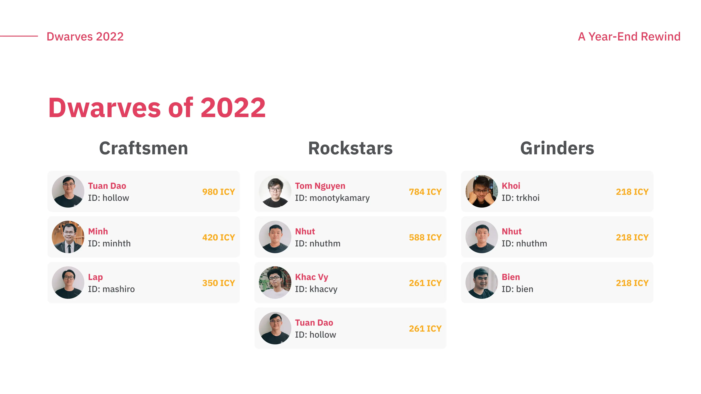
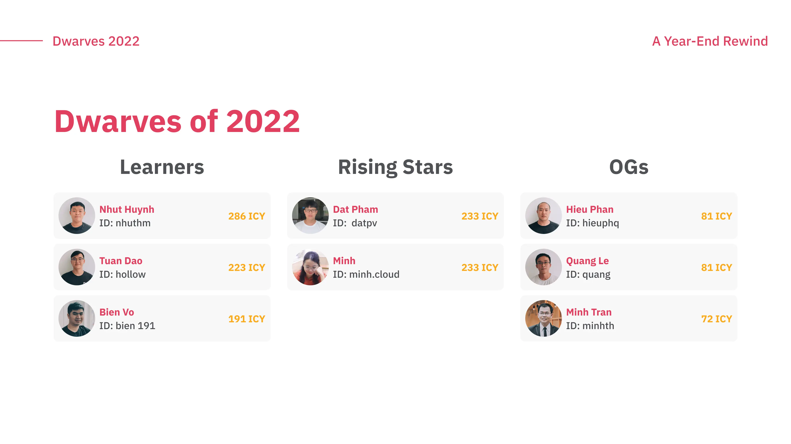
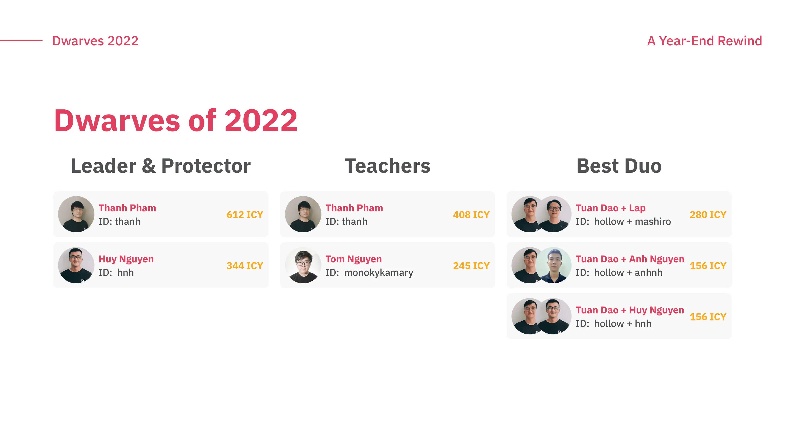
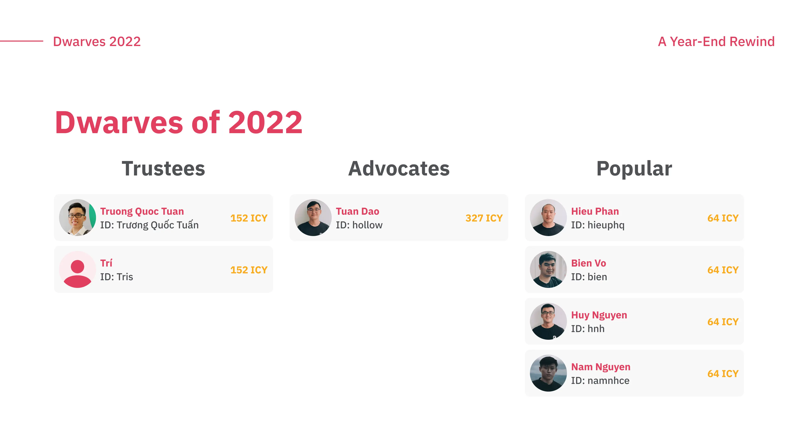
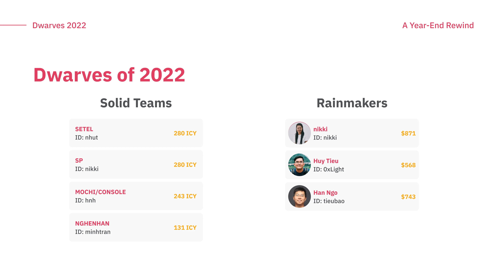
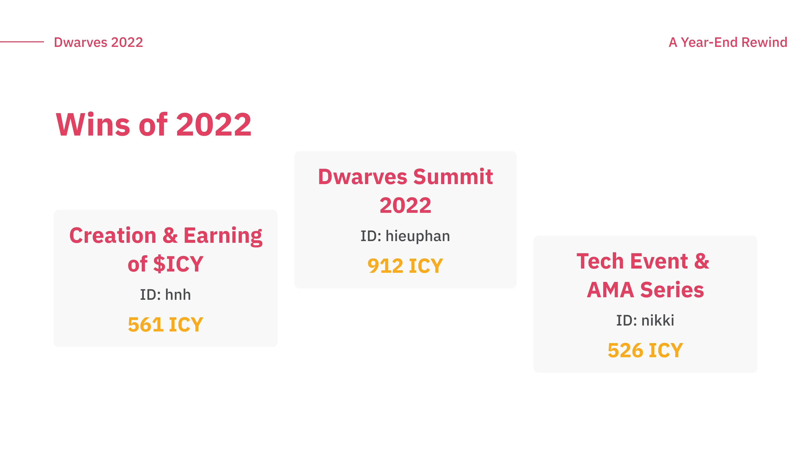

It's been a long journey, but we've finally made it to 2022 and what a year it's been for our team of Dwarves. Countless hours of hard work and it's all paid off with our big wins of the year. Honored for all and huge congratulations to our Dwarves of 2022.

A total of **~$18,000 awarded and rewarded by** [$ICY - Dwarves official token](https://www.facebook.com/photo.php?fbid=860144451875324&set=pb.100036393316096.-2207520000.&type=3), with a few names appearing several times. We congratulate the Dwarves who went above and beyond to make 2022 an unforgettable year for everyone.

The best part is a true testament to the power of teamwork. We want nothing more than to ship products we're proud of and to become a company that offers its employees a great life.

As we step ahead to 2023, we're excited for what the future holds. Take on new challenges and continue to push the boundaries to achieve even greater success.
