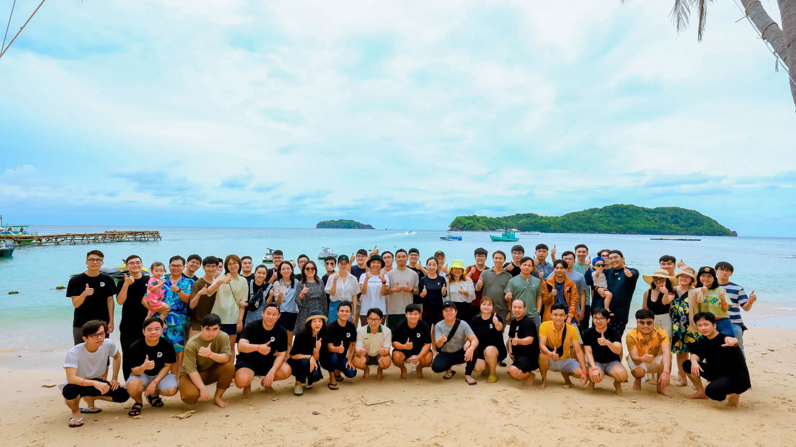
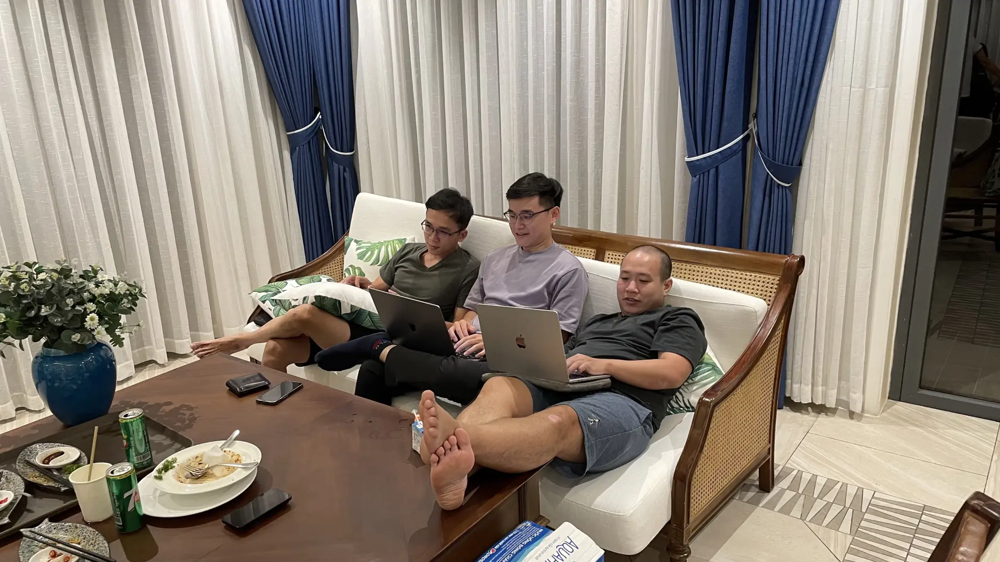
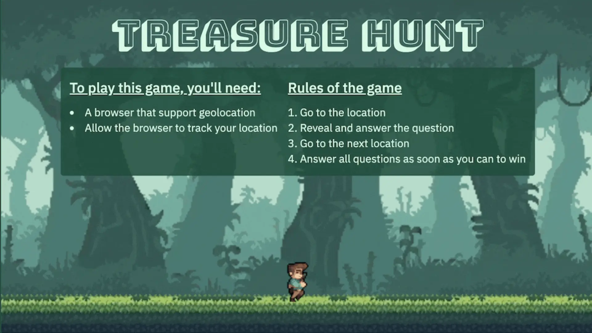
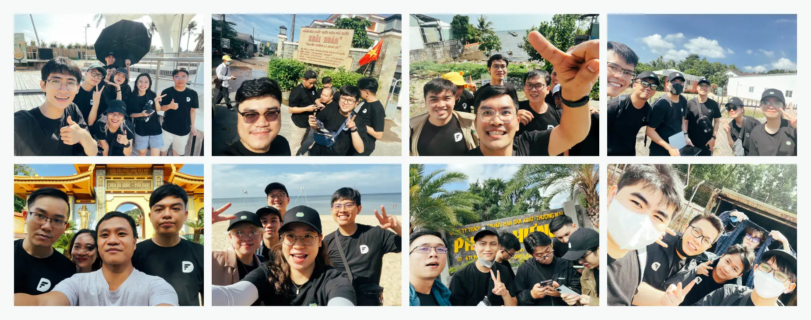
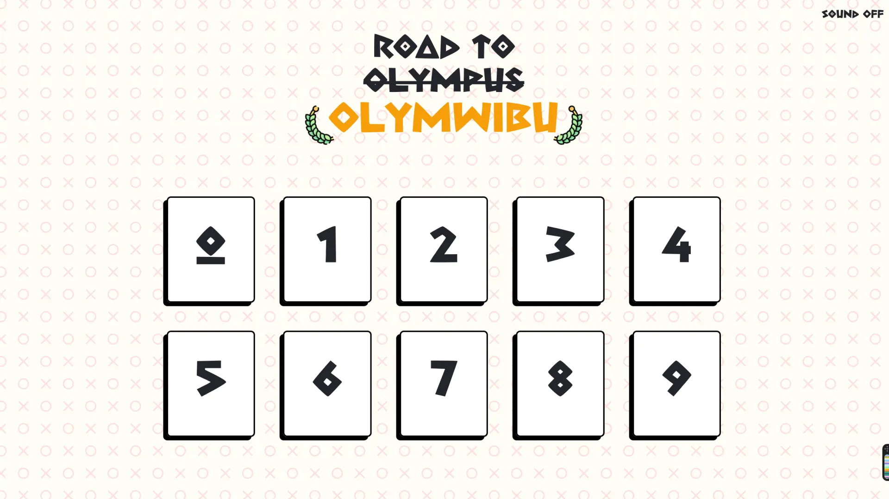
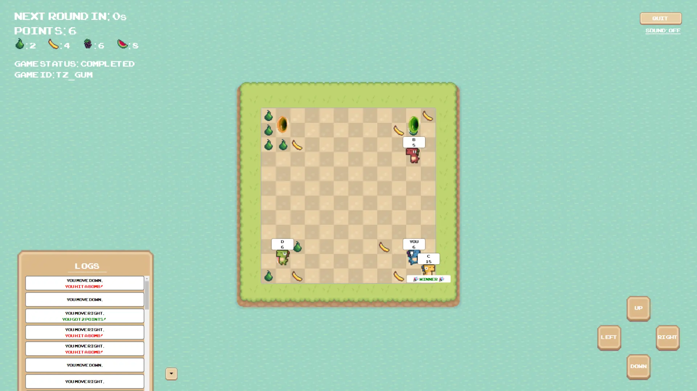
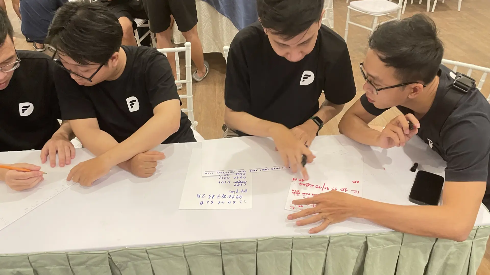
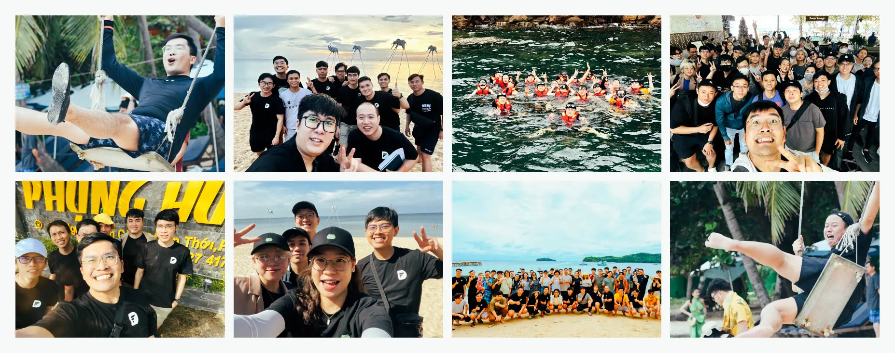

We don’t treat team bonding the common way because we understand our engineers. Most of our engineers don’t want to run and get sweaty on the beach for “team-building” activities, or pretend to smile in front of the travel agent’s camera.

This was our first company get-together after 2 years of COVID. It was organized in a way that we can all look back at the progress we’ve made, pat ourselves on the back, have a blast together, and look forward to an even better 2023.



## Remote First Company
We started with *Remote OK* back in 2017, following 37Signals, our tech crush at that time. In 2021, COVID took how we work to the next level. Since 2021, we have transitioned from a *Remote OK* to a **Remote First company** (except for some teammates due to the client’s security requirements). Our internal processes and engineers’ soft skills have been upgraded tremendously, making sure we perform smoothly across multiple time zones and geographies.

## Team scale
Growing cross-functional teams at Dwarves is challenging, but it’s rewarding getting to collaborate with like-minded peeps. We’ve seen 1.5x growth of our team to a total of just over 100 team members, and everyone has given us unexpected and incredible results.

Although it’s short of our 2022 goal of doubling the team, we’re very proud nonetheless.

**In 2022 alone, we:**

* Received 400+ applications 
* Invited 91 engineers for interviews
* Onboarded 29 new teammates

While the ratio of ~0.07% is astounding, it speaks to standards and quality. We are selective with who joins the team. For anyone who joins us, it’s a given they are pros at their jobs; they also need to love the culture we are working hard to protect and build up.

## Partner & Business Growth
We never pay a single cent to run ads, and rarely ever participate in pitching for new projects. Clients come to us through their networks and connections. Someone works with us,is happy about our services, they refer us when someone else has a need.

In 2022, we grew to 6 partners who are willing to refer our services. These partners brought in 5 new projects, at a referral rate of 5-12% over the generated revenue.

## Community Growth
We’ve been active in a few communities, such as the Golang community, Webuild, Techie stories, Startup.vn.

**Dwarves Network**
* [Techie Story](http://techiestory.net/)
* [WeBuild](http://webuild.community/)
* [Startup.vn](https://startup.vn/)
* [Golang Vietnam](http://golang.org.vn/)

Most especially, Dwarves Discord Network where every techie can join to hang out and learn has grown to 600+ members.

We’ve seen various tech-focused channels and events for the community,  as well as ways for everyone  [learn and earn](https://memo.d.foundation/). 

* **#engineering**: share our software know-how, programming advice, and technical insights.
* **#learning-topics:** our knowledge-sharing system, where the Dwarves keep their learning, discoveries and helpful practice to build quality software.
* **#blockchain:** where to find the knowledge piece to build the social layer for blockchain ecosystem.
* **#campfire:** off-topics connect with our friends, alumni, and like-minded people.
* **#minigame**: our Thursday minigame and happy hour for the Dwarves and communities. We work and have fun.

## Company Trip Summit 2022
Since we’re engineers, we know it would be more fun to create apps and games as a way to bond as a company outside of physical activities. Organizing the games for everyone was a challenge, but we certainly had a blast.



It was all for 3 things: the games, the drinks, and the prizes. A total reward of **150,000,000 VND** (~$**6,000**) was distributed into 4 original engineering styled games:

### Treasure Hunt



A location-based scavenger hunt where we took pictures of proof at locations along with answering questions in our custom-made web app. 

Whoever answers the most questions, wins the hunt.



### Road to Olymwibu
A 4-team game where teams choose multiple choice questions to answer across a range of topics to acquire points. Teams are also able to attack, steal, and double down on points.

Teams who answer incorrectly would have to drink. 🍺🍺

Whichever team has the most points wins the round.



### Hunger Games



A global turn-based 4-team 12x12 grid game played on a real-time web application to collect points scatted across the grid.

Teams who encountered a fruit would gain points. Those who encountered a bomb would have to drink 🍺. Whichever team has the most points wins the round.

### Enigma
A writing game to XOR decrypt a hexadecimal message to ASCII with an ASCII key. 

The message must be relayed through hand signs, with no devices or prepared items allowed for use to decrypt the message. 



The encrypted message and key given to the teams at the start of the game:

```yaml
		encryptedMessage: 52 1B 53 3E 49 26 47 15 2B
		key: goggins
```
The expected output after decrypting the message in ASCII:

```yaml
		message: 5t4Y H4rD
```
We took the opportunity to drink and have fun and help teams earn a bit for their efforts. We’ve also certainly enjoyed our stay in Phu Quoc. Our team had fun swimming near the coast, enjoying food, riding rides at the water park, and exploring everything at Phu Quoc.



## Look forward to Dwarves Summit 2023
We’re really happy about how Summit 2022 turned out. We’ve had quite a lot of fun together as a team, and we are really excited about next year.

Likewise, we’ve learned a lot during the trip and have taken a few steps ahead in planning for our next trip.

* **Activities developed for engineers, by engineers.**<br>We want our people to have true, meaningful fun, so we want to open opportunities for our team to take part in developing games for not just our next trip but for everyone to enjoy.
* **International trips.**<br>With the pandemic settling down globally, we will definitely have a look at places we haven’t been to and explore them together.
* **Even bigger incentives.**<br>Allow everyone to earn and have fun doing so.
* **Albums and videos for everyone to look back to.** <br>Create memories that everyone can take home, enjoy watching, and brag to their friends about.

Our goal for next year is to incorporate **Mastery, Meaning, and Autonomy**. These are some of the things we have in our backlog, and we’re certainly excited to try out more when we get to it.

Here’s to the restart of our adventures together and to many more experiences and opportunities for 2023!
