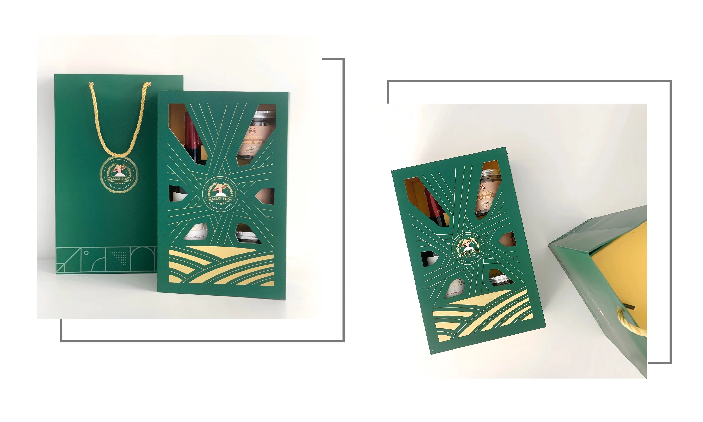

### Project Highlights
**MStation as our latest blockchain-based project**
It's the first BSCS Metaverse blockchain game on Binance Smart Chain (BSC). Players can summon characters, complete daily mining missions, protect the MStation, and loot rare items to play and earn. 

We get to deploy a full team for this project, consisting of 6 people, with Khai Le as part-time PM and Ngọc Thành as Team Lead.

We're getting multiple upselling requests, so we need more people to join our team. Dig through your network and refer to us for a handsome bonus! Positions we're hiring can be found **[HERE](https://memo.d.foundation/careers/hiring/)**.

### Performance Review
The team has received all of the self-review notes. Due to the volume of our teammates, 1-1 meetings for some of you will soon be scheduled after the Lunar New Year.

The final result will be announced before March. Hope to see the good updates by then — if you know what I mean. 

### Study Groups/ Brainery Clean-up
We’re resuming Brainery Repo in 2022. Currently, the repo is getting formatted and cleaned up. We also develop writing guidelines to quickly pick up with the on-goings.

The reward mechanism for presenters and knowledge crafters is also back in the game. Ops Team has begun to recollect all the notes to ensure no effort is left behind.

### Profit-Sharing & 13th Bonus Salary
All sent through Viet Nam bank & TWise. It’s a part of our culture and is applied for teammates who have joined us for more than 24 months. Everyone has put in their hard work to keep the team moving forward. Profit-sharing is the act of 'we reap what we sow'.

To read more on the model and other team benefits, I’ve got you the latest updates of **[Dwarves Handbook/benefit-and-perks](https://github.com/dwarvesf/handbook/blob/master/benefits-and-perks.md#employee-profit-sharing)**.

### 1-way Flight Ticket Policy
Based on the submission result, we’d love to enable this as soon as possible.

Guys, let us introduce the latest DF Policy: **Flight Ticket Package**

Who is this package for: Full-time members who have worked with the Dwarves for more than 6 months are eligible. The model goes as follows:

* **4 times a year**, the Dwarves Team provides a commuting package to its members with a maximum amount of **2.000.000 VND/ time**.
* The timeline of this trip is up to you. However, since this was made to encourage the team to try out our work hubs and get to know their teammates- **our destination must be either Da Lat or Da Nang**, and hopefully Ha Noi soon.
* Trips need time to prepare (and recover afterward), so the team can’t use up the budget of 4 trips per year in one travel instance. This goes against the policy.
* For better flexibility, we encourage you to actively make the booking and send us the receipt. The Ops team will help you process the reimbursement.

To sign up for your first trip, please head to this form: [https://forms.gle/SusWDKUn2KjkewBH6](https://forms.gle/SusWDKUn2KjkewBH6)

### Team Hangouts
Last month, we finally had the chance to gather for a casual dinner to wrap up the year. Now that the Covid situation is somewhat under control, we think it's safe to slowly resume this tradition.

Since we have people in HCMC, Hanoi, and Danang, we can't all meet at the same place. Therefore:

* We can have 1 sponsored team dinner per month.
* We'll try to align so teams in all locations can hang out simultaneously, at least. Facetime can also be an option. Or team airdrop.
* Ops will refund the expense in full.

### Lunar New Year Gift-set Delivery
All wrapped and delivered!
A small gift to thank you for being with us for the past year. May we all enter 2022 with success and prosperity. 

Happy the year of Tiger. Let’s rock 2022 together!

