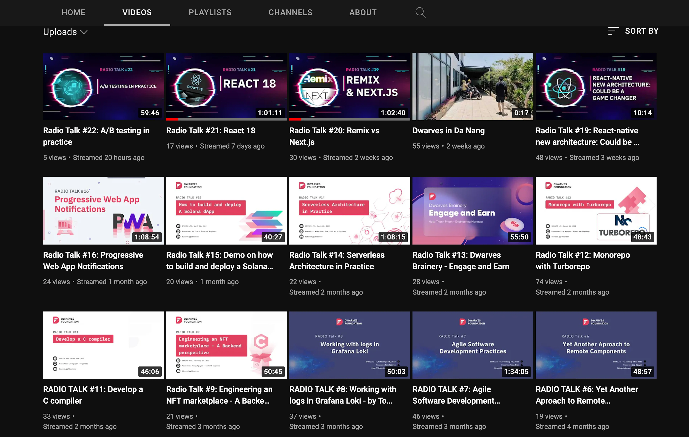
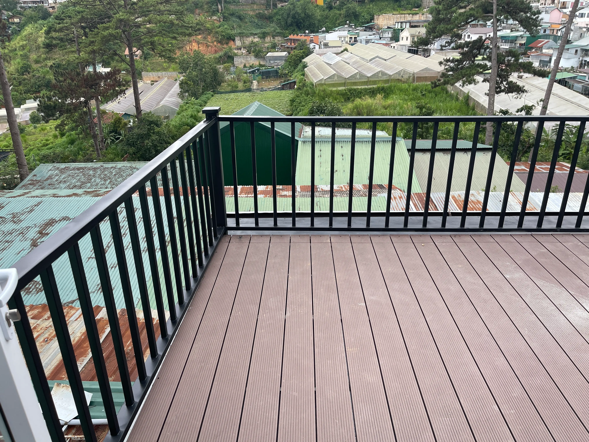
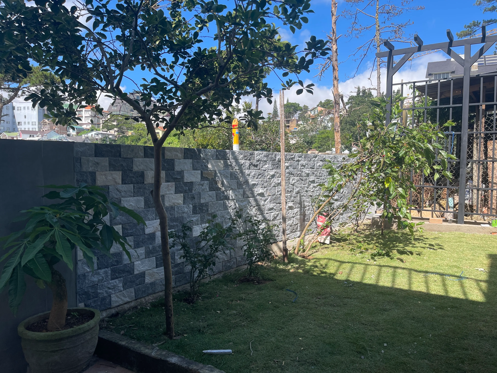
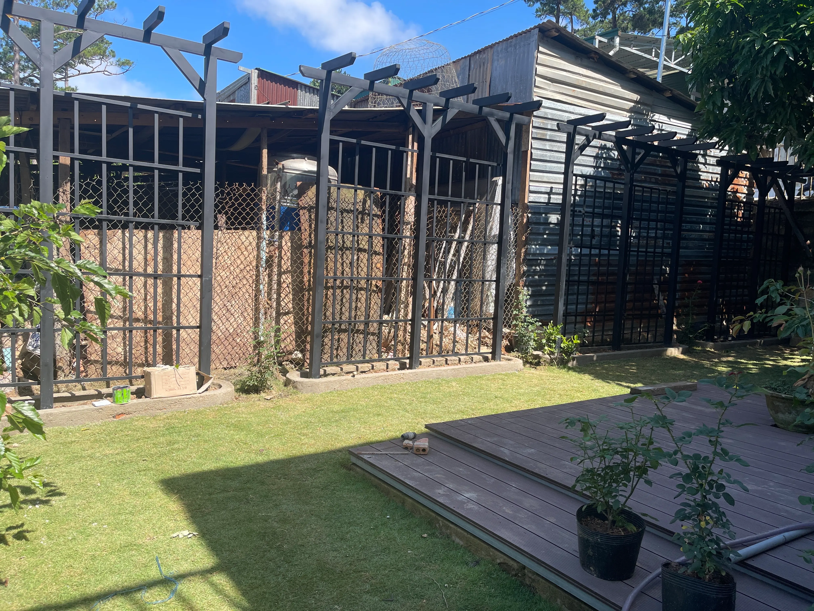

## Foundation
### Project Allocation
We concluded the partnership with Relay and Eklipse. It has been a fun (and wild) ride for some of you. New resources are being allocated to help balance the current workload of active projects. If you need to discuss your workload or seek more room for project work, please ping Giang or Nikki.

### Our view on Blockchain
Got a quick chat with Ngoc Thanh, our Sr. Blockchain Engineer and his perception of blockchain at **[Memo](https://memo.d.foundation/DF-Apprenticeship-2022-Meet-The-Mentors-Ngoc-Thanh-Pham-a6f8c3c7d4a14bd5be55d6465b9f330b)**.

Blockchain is taking shape in how we run the team. Peeps, please help update your insights if you haven’t. We have study groups and discussion channels. Peeps who are familiar, we’d be glad if you could share what you’ve learned with the rest of us.

## Growth
### Kicking off Apprenticeship Training
The training phase kicked off last week with 7 new Apprentices. To keep up with the latest session, check out that Event button in Discord space and click ‘**Interested**’ to see what you prefer. More room still needs improvements, but we’re following the right track.

### Onboarding new Interns
We got 4 new Interns from Bach Khoa this summer. They’re all excited to pick up new workflow and work with mentors. Can see the real progress happening through their daily updates. 

### Data Team Form-up
Another direction besides blockchain? Data. Tom and Dung are the first members to take care of this. Data is becoming more and more critical to how we shape businesses. Having teammates with thorough insights on this will support us to go further.

Ping Tom if you want to be part of the squad. And stay tuned for Dung’s first sharing on **Apache Spark**, coming this **[Jun 06 - 5PM](https://www.youtube.com/live/6nini4cmk1E?si=8sFJdTNFv3CypQCe)**.

### Revisit the Radio Talks
Highlights will be summarized and shared through Memo to those who want to keep up:

* [**React 18**](https://memo.d.foundation/playground/_memo/react-18/)
* [**Remix versus Next.js**](https://memo.d.foundation/playground/_memo/remix-versus-nextjs/)

Feels more like listening? Pay a visit to **[Dwarves Youtube](http://www.youtube.com/channel/UC_SyzGLf6wiqctQFsRI_frw)** for every streaming.

## Team
### Dalat Office
As in the last update, the office is set for you to visit, but more updates are still coming. Rock fences and plant dividers are newly added to enhance our space.

The balcony was also retouched. And hear us out, standing desks will be a thing in this work hub.

## Coming up next
We’re moving with the industry. The current trend has been revolving around blockchain. You may hear some Dwarves have dipped their toes into blockchain work in partnerships with Spike Inu, Nghe Nhan Trading, MStation, or Pod Town.

Henceforth, we strongly encourage the team to expand their know-how in this field, starting with smart contracts. The Senior Dwarves will also advance further in this direction, through training, project works, and even self-development.

All these efforts aim to align with our business goals. We’re sorting more resources to help with new partnerships coming up.

Let’s cross our fingers and buckle up for what’s next in June. 
