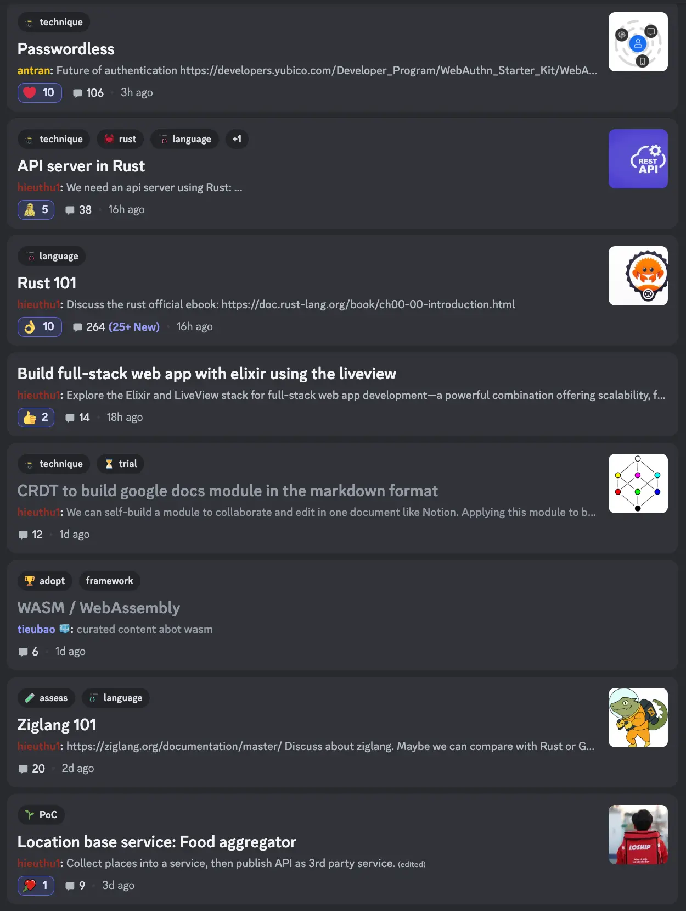
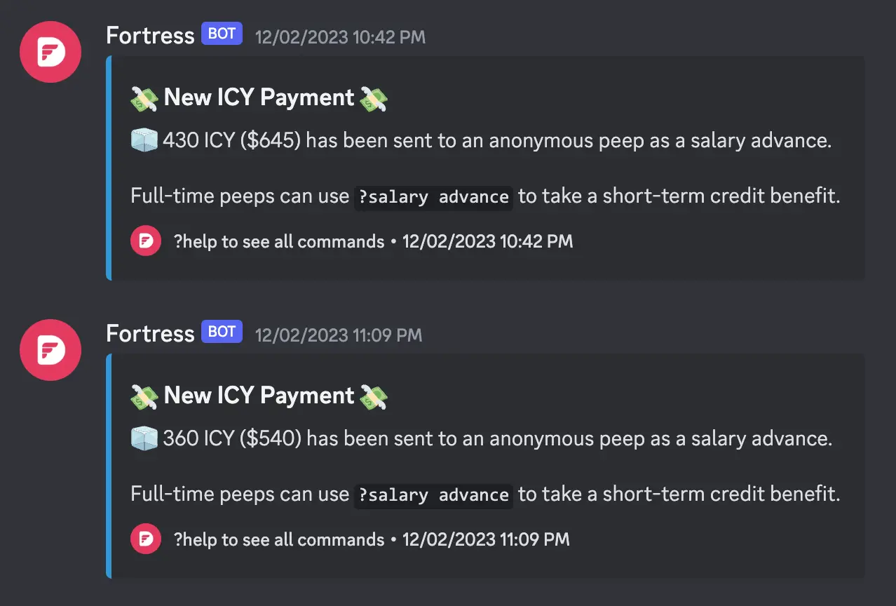

---
tags:
  - newsletter
  - meet-up
  - golang
  - updates
title: What's New in November 2023
date: 2023-12-06
description: Each month, we release a recap noting all the significant changes in our company and our team. November is our month for meetups and outstanding craftsmanship.
authors:
  - nikki
---

Last November, we kicked off the Labs team, introduced Salary Advance for the Dwarves, upgraded note.d.foundation, supported Golang meetup, and demonstrated craftsmanship through various case studies and demos.

- **[Launching Labs team](#launching-labs-team)** - Dwarves R&D team is officially in operation.
- **[Monthly top performers](#monthly-top-performers)** - The top 5 high-performing members get rewards and NFT badges. NFT badges can be staked to earn shares of the company.
- **[Salary Advance](#salary-advance)** - Dwarves' team members now can get an advance of their monthly salary in case of emergency.
- **[memo.d.foundation](#misc)** - upgraded homepage, categorized content, and now searchable.
- **[Join our team](#join-our-team)** - React Native Developer, Admin / Ops

## Launching Labs team
With Labs team, it's all about researching cool, industry-moving technologies and producing practical use cases using those tech. In our backlog: WASM, Passwordless, Rust, AI, MPC, UI practices, Elixir, Golang.

Head to [November Forward Engineering](https://note.d.foundation/memo/forward-engineering-november-2023/) for more details.

## Monthly top performers
Each month we track how productive and valuable each of our team members by using delivery points. For now, the top 5 high-performing members get rewards with $ICY. In Nov, kudos to those peeps who outperformed the rest: **Hai Huynh, Chinh Le, Phat Nguyen, Minh Tran, Ngoc Thanh.**

Last month we also shipped quite a number of features for our clients: [time-sensitive alarms for a trading platform](http://hedge.foundation), [money transfer with Mochi](http://mochi.gg), live annotation for various content formats, user signup/login flow at kiosks.

Coming next: NFT badges. NFT badges can be staked to earn shares of the company.

## Salary Advance
Dwarves' team members now can get an advance of up to 25% of their monthly salary. The payment is made in $ICY and can be redeemed via https://icy.so

This bot command can be used in our Discord server, and anonymously :)

## Misc
- Our Discord server is for everyone. We're happy to see ~400 active users last month, and of course, the top ten voices in get 5 $ICY each.
- More bounties are up for grab: https://memo.d.foundation/earn/
- Techie story are now on [Tiktok](https://www.tiktok.com/@techiestory.net), highlighting 4 stories about life in tech in US & Japan

## Join our team
We are looking for the following talents to join our team

- React Native Developer (Project-based Contractor)
- Admin / Ops (Fulltime)

Email us at spawn@d.foundation or ping @nikki on Discord for JDs / to refer someone you know. TIA!
