---
tags:
  - team
  - wrap-up
  - newsletter
  - updates
title: 2024 In Review
date: 2025-01-16
description: Closing another milestone with 2024, it has been a year of building and rebuilding — strengthening what works, fixing what doesn’t, and uncovering new paths along the way. Every milestone reached this year carries the marks of teamwork and persistence.
authors: 
  - innno_
---

> **Before you dive in** Dwarves is operated as a 50% company, 50% community. Everything we learn along the way of work, we transform into knowledge and distribute back to our tech community.
If you want to get in touch, visit [Dwarves Network](http://discord.gg/dwarvesv) 

Closing another milestone with 2024, it has been a year of building and rebuilding — strengthening what works, fixing what doesn’t, and uncovering new paths along the way. Every milestone reached this year carries the marks of teamwork and persistence.

Market shifts opened new territories, while our core in sharing knowledge and AI grew stronger. We turned AI from experiments into daily tools, grew our lab team into a real force for innovation, and watched 37 OGIF sessions turn into solutions everyone uses. Knowledge sharing became part of our DNA, with 335 memo entries proving that good ideas need to be shared.

Starting with a handful of tech enthusiasts, our community now spans across different domain. For a tech team like Dwarves, there are only a few things that matter. Let’s reflect and reinforce what matters to us.

# Team growth
## memo.d.foundation: Capturing a year of collective knowledge with 335 entries
[memo.d.foundation](https://memo.d.foundation/) started as a company wiki and grew into a central hub for documenting what we learn as a team and community. From tech know-how to operational know-how, it's all here. **With 335 entries published this year**, it shows how knowledge sharing has become part of our DNA.

The focus on Mastery, Meaning, and Autonomy (MMA) drove real growth in our knowledge base. You can see it in the increased contributions, covering everything from practical work solutions to foundational concepts. 

Highlights:

- Streamlined memo submissions with quick commands like `?memo pr` and `?memo list`.
- Real-time PR notifications in Discord for easier collaboration.

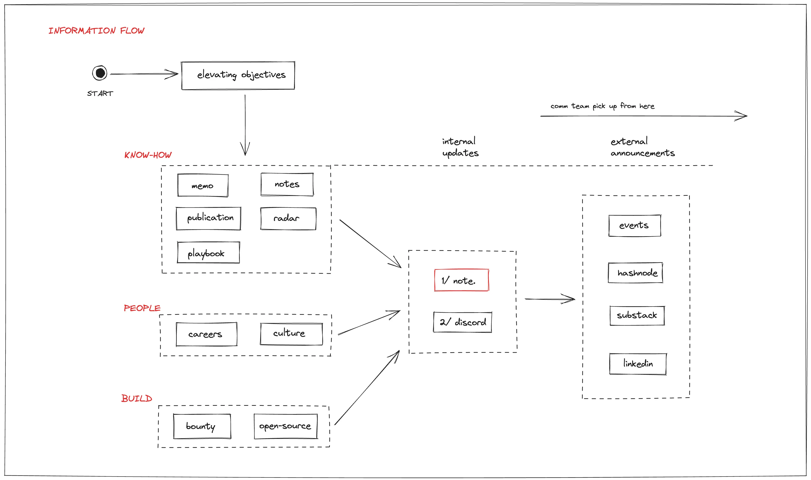

## OGIF: When learning and sharing became part of our DNA
Every Friday at 5PM, we gather on Discord to share what we've learned. **37 sessions** this year, each adding something useful to how we think and work.

The idea stays simple: take 10 minutes to teach everyone learn something new. From coding patterns to market shifts, if it helps, it belongs here. We've covered everything from Go weekly, system design, AI/LLM, blockchain to product design and tech signal reports.

OGIF showed us who digs deep into problems, who explains clearly, who brings different angles. These talks helped form our labs’ team naturally.

## ICY in 2024: A reward system knowledge powers team growth
Launched in September 2022, ICY was used to reward for all members for engaging in discussions, research on Dwarves’ tech, and more.

This year, a monthly pool of 2500 ICY (~$4000) sparked more learning than we anticipated. When AI and LLM insights took center stage, we tripled the rewards to keep good ideas flowing.

**6,660 ICY (~$9k)** distributed highlighted our commitment to learning together, with 70% of rewards going to AI/LLM, Golang, Software Architecture, and Blockchain. Made sense, given how fast this space moves. Check it out at [🧊・earn-icy](https://discord.com/channels/462663954813157376/1006198672486309908/1239502938918096960).

**Key contributors:**

- **OGIF Talks:** @fuatto, @datnguyennnx, @monotykamary, @hoangnnh, @lapnn, @nambui.
- **Memo Notes:** @thanh, @hoangnnh, @datnguyennnx, @fuatto.
- **Bounties:** @bienvh, @innno, @minhcloud, @quang.
- **Tech sharing:** @monotykamary, @phucld, @minhlq, @antran, @huymaius, @datnguyenxx.

ICY enhancements included moving contracts to Base chain, GitHub account linking, and laying the groundwork for NFT and staking opportunities. Even guests now earn ICY - a warm welcome and simple way to reward collaboration.

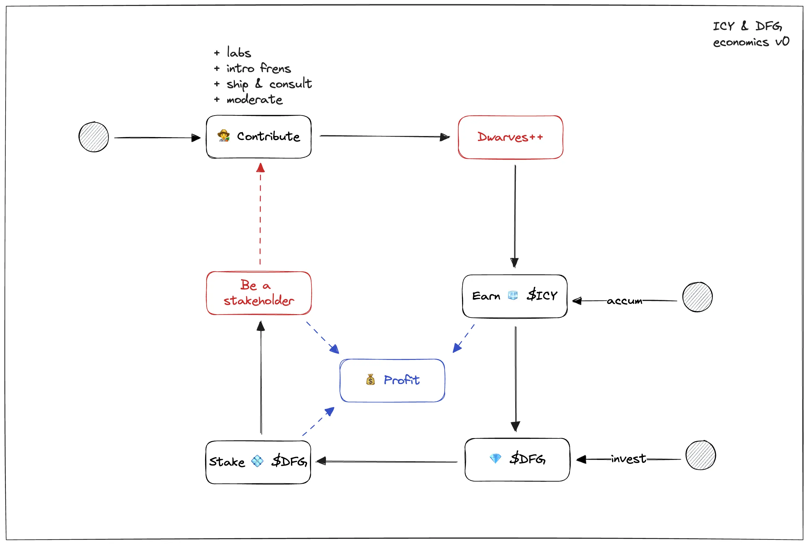

## Team copilots: AI tools that made workflows faster
We didn’t just build tools; we shared them. The team copilots index became a collection of practical solutions, built by us, for us, and ready for the team to use. 

**Why it mattered:**

- Tools solving real problems, tested and proven by teammates.
- A hub for sparking ideas to build your own copilots.
- AI helpers simplifying and speeding up daily tasks.

You can explore the full list of copilots [here](https://memo.d.foundation/playground/ai/copilots/team-copilots).

The focus was never on complexity but on simplicity and utility. Every tool was built with a clear purpose: to help the team do better work with less friction.

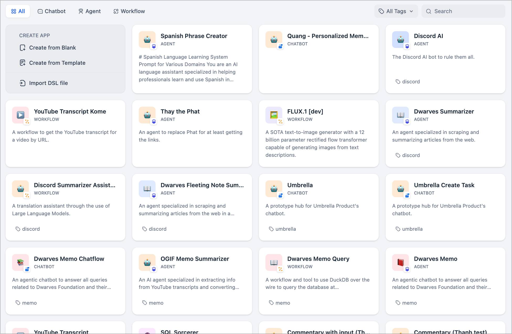

## Internal tools upgrade: How Fortress, Tono, and Mochi automated operations
Our Discord bots got some nice upgrades this year, thanks to @hnh, @tom, and @bienvh putting in the work. Each improvement made day-to-day stuffs easier, from tracking contributions to sharing knowledge.

- Tonobot streamlined tracking contributors, created helpful reading lists, and introduced the `sum` command (thanks to @nam and @tom) for breaking down links into concise insights. It made spotting activity and key content easier.
- Fortress enhanced real-time memo updates, delivered detailed weekly reports, and improved issue tracking. Progress tracking became seamless, ensuring important details never slipped through.
- Mochi brought a virtual kudos system for recognizing contributions, boosting community spirit with simple yet meaningful appreciation.

These updates came from understanding team needs and making them happen. Simple improvements that lead to smoother workflows.

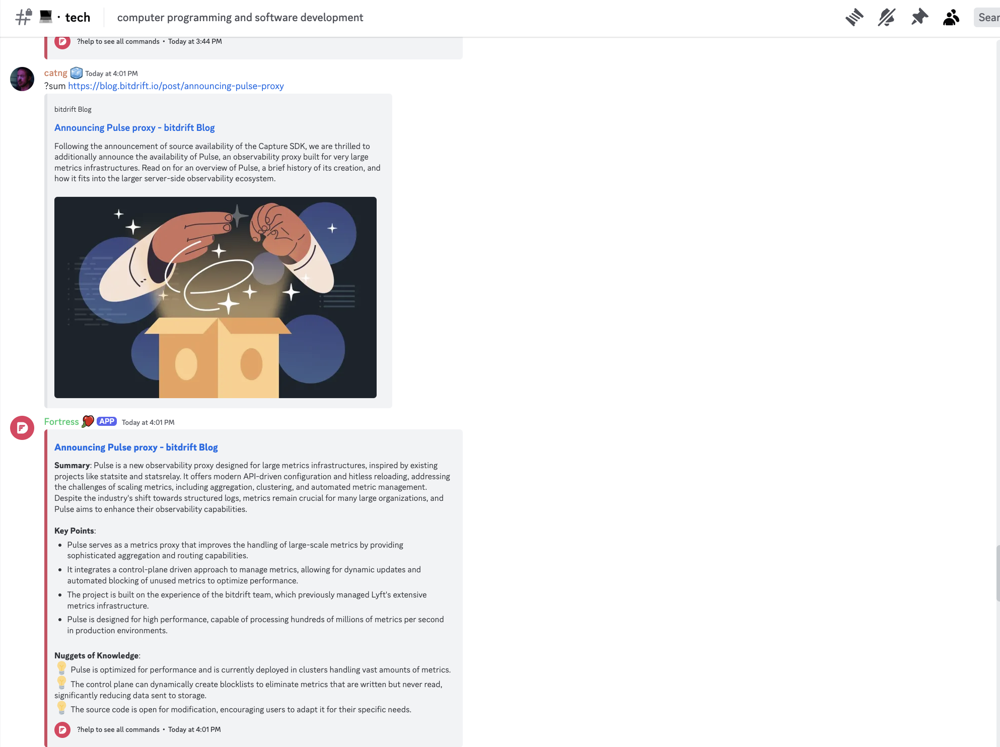

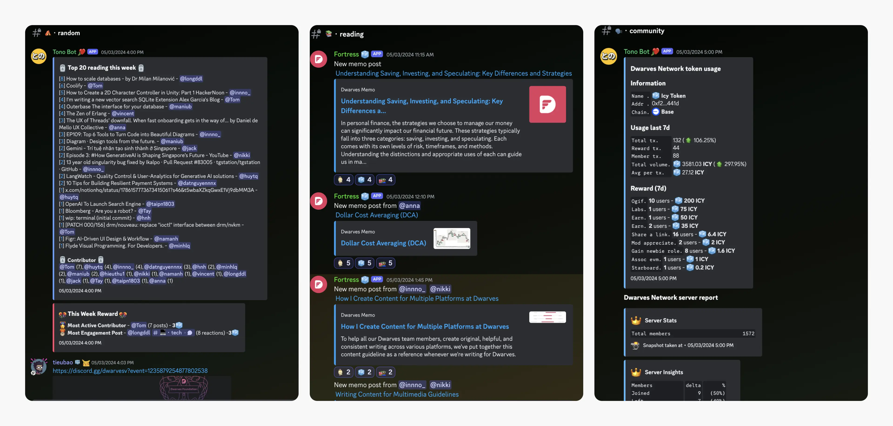

## Weekly Commentary: Turning trends, insights into actionable items
As a research-focused team, collecting and sharing knowledge became part of our speed. We saw it in our velocity - shipping got smoother when everyone knew more. 

This year, our weekly updates grew from Go-weekly insights into a broader lens on what we’re building and learning as a team. 

**Commentary series expanded into four practical domains**

- **Go weekly** grew with @fuatto's Enterprise MOC, showing how we're using Golang for real business challenges.
- **AI Digest** delivered clear, tool-focused updates for applying AI effectively.
- **Product Design Weekly** offered actionable UI/UX tips that go beyond surface-level advice.
- **Consulting Snapshot** highlighted key tech and business trends that matter.

Weekly OGIF sessions and memo notes kept the insights flowing. Each series aims for the same thing: useful knowledge you can put to work.

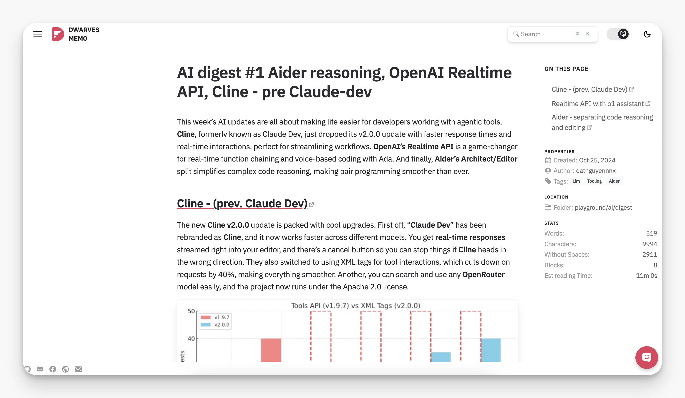

## AI Club: Adapting to change with smarter workflows and practical AI tools
The **🧙・ai-club** opened its doors this year. It became a hub for exploring AI and Large Language Models (LLMs) while delivering tools that made an impact on daily workflows.

- **🧙・ai-club** served as a collaborative corner, designing AI agents tailored to projects, from coding accelerators to workflow enhancers.
- The **ai-sheep role** recognized those engaging with AI through shared content, lightning talks, or practice tasks, encouraging contributions from all levels of interest.
- **Copilot Bounties**: rewarded meaningful contributions, whether insights, tools, or advancements in AI/LLM applications.

The AI-Club showed us what happens when team effort meets focused exploration: smarter tools, better workflows, and new skills to take forward.

## Research topics 2024: Exploring 40 topics on the most promising technologies
Good tech solves real problems, and that’s what drives us. **40 topics stood out,** each selected for its impact and relevance.These topics were pitched, prioritized, and led by the team with input from senior members:

- **Tooling:** Streamlined workflows using tools like Devbox, Colima, and better monitoring systems.
- **Architecture:** Explored event-driven systems and modular design for scalable solutions.
- **LLM:** Applied RAG and MLOps to practical, real-world use cases.
- **Blockchain:** Investigated Solana’s infrastructure and evaluated blockchain models.
- **Security:** Focused on zero-trust systems and robust practices to enhance safety.

Key actions included leveling up **Tono Bot** and **Memo** with RAG, refining **Devbox** with better organization, and solidifying our **Cybersecurity Framework**.

We’re happy to have everyone on board and joining hands.

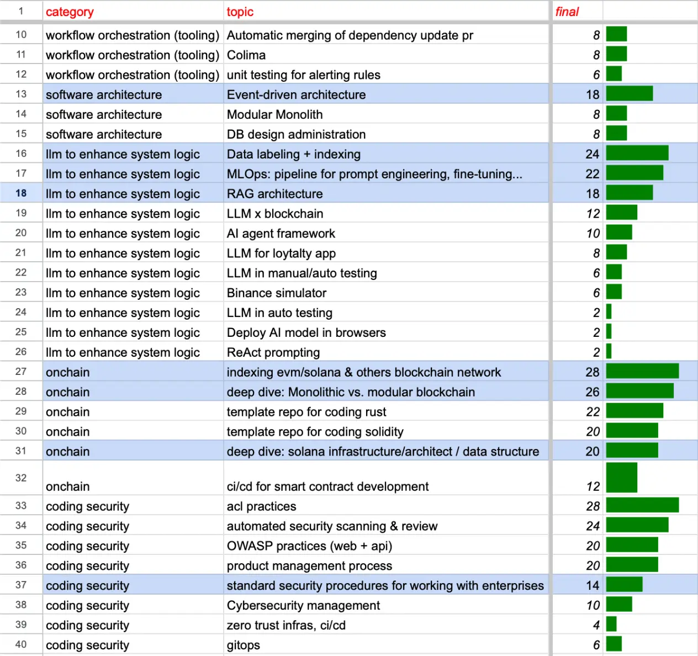

## Connecting our tools: How small improvements made daily work flow
Making our daily tools talk to each other properly. Notion and Slack integrations wrapped up, Telegram and JIRA next in line. Each connection means less manual work, easier knowledge flow.

The **🧊・bounties** channel tracks where we're headed. You can see what's done, what's next, and how it all ties together.

We keep improving based on what teams actually need. Check the bounties channel for updates as they happen.

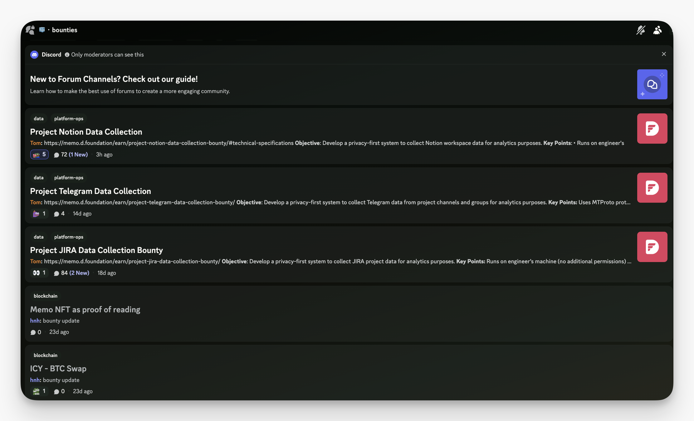

## Welcoming new members to the team
This year, we proudly welcomed @minhkek as a permanent addition to our BD team. Minh’s ability to bridge our work with business and deliver results made the transition seamless. Many of this year’s projects owe their success to his efforts.

We also had @datnguyennnx and @ngocquang join us as interns this summer, showcasing their capabilities and potential.

Looking ahead, we’ve resumed hiring and are excited to welcome more like-minded folks to the team. [Check out hiring](https://memo.d.foundation/careers/hiring//).

# Business growth
2024 brought shifts worth noting. Markets changed direction, services adapted, and Vietnam's tech scene showed signs of life.

## Market shifts
### New partnerships and team growth

- **Research Lab**: Led by [@thanh](https://memo.d.foundation/contributor/thanh) and [@Tom](https://memo.d.foundation/contributor/tom), we broke new ground in AI with professional collaborations alongside **Ascenda**, **FornaxAI**, and **Plot**.
- **Web3 and Quant Teams**: Thriving teams delivered impactful results with **Y[Redacted]** and **Hedge**, while laying the foundation for upcoming projects already in the pipeline.

### Navigating a changing landscape in 2024
Tech kept moving in 2024, and the changes caught our attention. New partnerships in AI, blockchain, and fintech brought fresh challenges, pushing us from development work to technical consulting. Engineers stepped up, taking on key roles in project decisions.

May took us to Singapore's Echelon Asia Summit, where [@tieubao](https://memo.d.foundation/contributor/tieubao), [@nikki](https://memo.d.foundation/contributor/nikki), and [@huytq](https://memo.d.foundation/contributor/huytq)  explored Southeast Asia’s tech future, uncovering trends in funding, AI, and emerging APAC projects.

### Expanding skills and expertise to meet the demands
Generative AI shifted how we talked about projects. Clients looked beyond specialists, wanting people who could mix backend with blockchain, blend full-stack with data skills. Work concentrated on four areas: **Blockchain, Data, Platform Engineering, AI/LLM.**

Our engineering team embraced these shifts naturally, adding new strengths while staying rooted in solid engineering practices.

## Dwarves’ services in 2025
### Introducing hourly billing: Flexibility for clients, clarity for teams
The year brought changes to how we deliver value. We moved to hourly billing - giving clients more flexibility and teams more clarity. Simple idea: fair hours for good work. To understand how this new model benefits both our team and our clients, read the full article [here.](https://memo.d.foundation/playbook/business/pricing-model-bill-by-hours/)

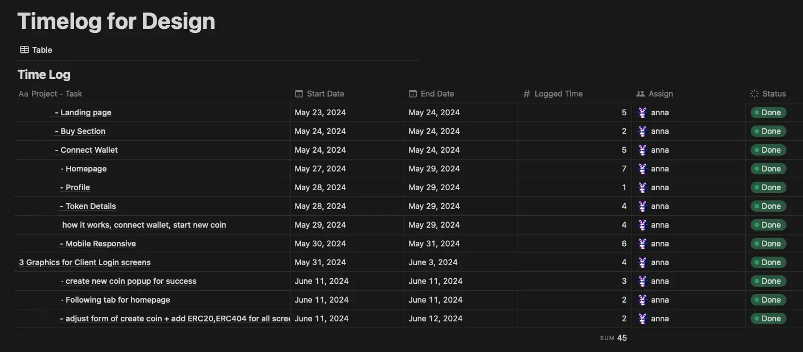

### Refining service packages for what clients actually need
We’re re-centering our focus to meet the moment. AI, blockchain, data - this is where we’re investing our time and talent, as we keep pace with client needs and market demands.

1. **Consulting shift**: As client requirements change, so do our team’s. We’re doubling down on adaptable, high-impact contributors while others may pause or refocus to match our direction.
2. **Lab team**: The Lab remains the heartbeat of our innovation. Expectations (and rewards) are higher for those pushing the boundaries, writing, exploring, and applying new ideas.
3. **Community backbone**: Nine years in, our Discord stays strong - a space for learning, sharing, and connecting, whether you’re new, tenured, or alumni.

Simplifying where it counts, we’ve delivered faster solutions and brought clarity to every project.

## Vietnam tech ecosystem
### Building a network of trusted partners in Vietnam’s tech ecosystem
Vietnam’s tech market is vibrant and growing, attracting startups and investors. Following the forecast, Vietnam’s digital economy is projected to reach $43 billion by 2025, fueled by breakthroughs in AI, fintech, and crypto - areas we’re eager to shape alongside nearly 100 active investors.

Leading firms like 500 Startups Vietnam, VSV Capital, and VinaCapital Ventures are driving this progress, supporting innovative startups and the broader ecosystem. By connecting key players in the ecosystem, this report aims to establish a network of trusted partners who can collaborate and drive mutual growth.

# Community growth
Being part of the tech community means stepping up, sharing what you’ve learned, and helping others grow. At Dwarves network, contributing back is woven into everything we do.

Haven’t properly highlighted this yet, but 2024 brought some real bright spots in how we learn together. 37 OGIF sessions, 335 memo entries and a monthly pool of 2500 ICY for learning might just sound like numbers, but each one proved why sharing knowledge makes a difference.

## A community driven by learning and sharing culture
Through **memo** and **OGIF**, it doesn’t just sit on a shelf, they’re put to work by anyone who needs them. The monthly rewards made sharing worth everyone's time. Discord saw more tech discussion, memo tackled harder problems, and OGIF sessions dug deeper into tech that mattered. Anyone can earn ICY by participating in community activities.

Shout out to:

- **Long Bui Van** (@longddl): Shared valuable notes on Data Pipeline Design Framework, Vector Database.
- **Jack** (@jack) and Phuc Le (@phucld): Collaborating on bridging $DFG from Ethereum Mainnet to Base Network for staking.

Big thanks to the contributions from both the team and community that have made Dwarves thrive: @tom, @hnh, @lapnn, @theoctopus, @minhlq, @nikki, @taipham, @vincent, @phucld, @julis, @antran, @innno_, @minh_cloud, @bienvh, @huymaius, @huytq, @datnguyennnx,@nhuthm, @nam,@hieuthu1, @tristran, @truongquoctuan.

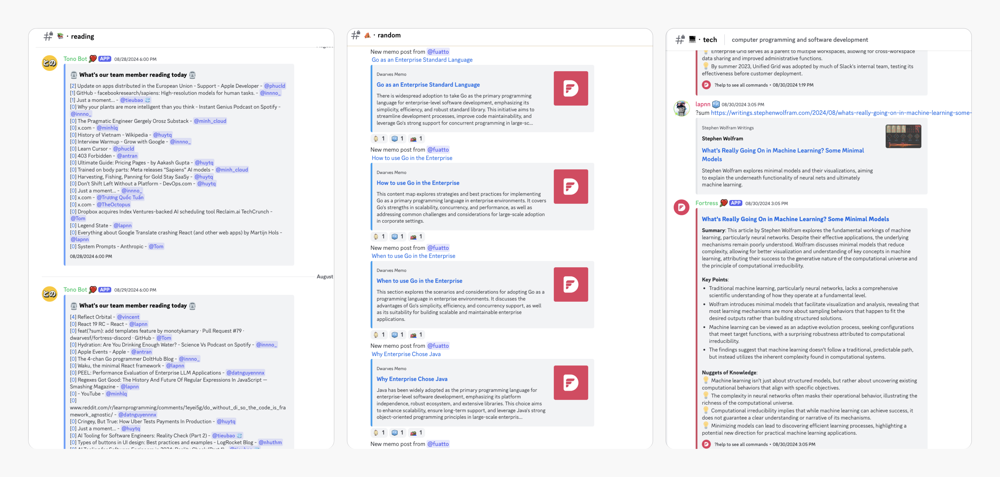

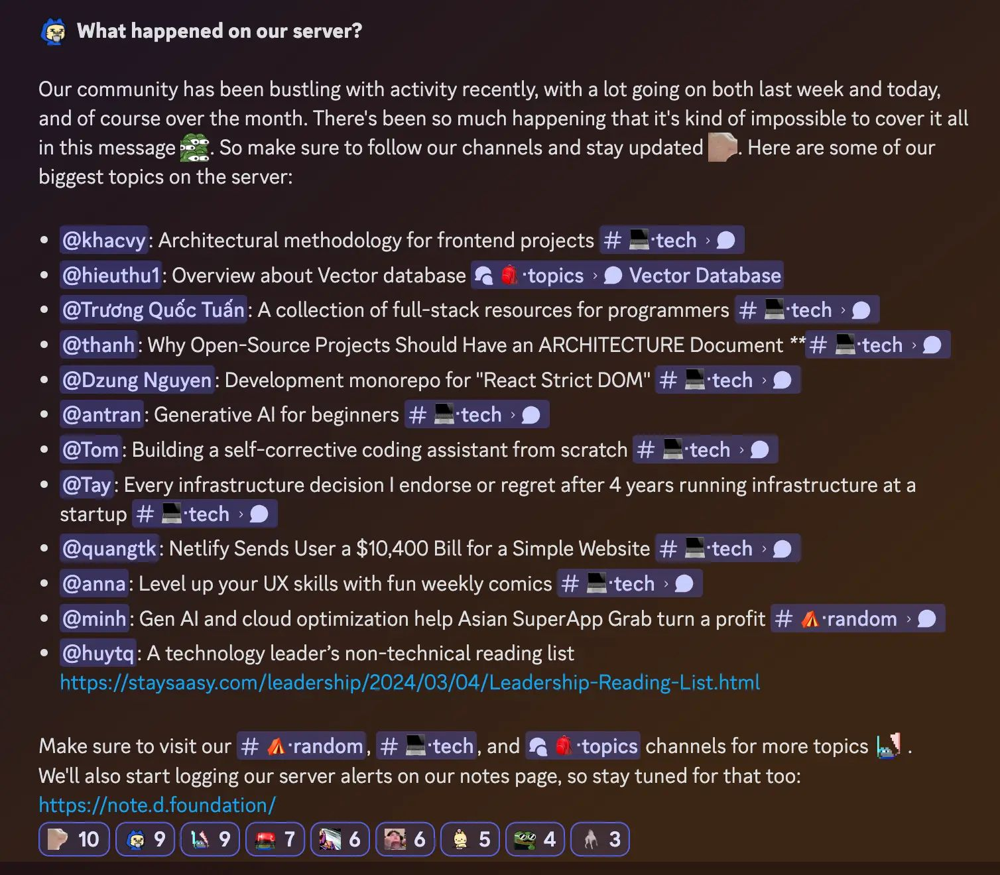

## Dwarves offline meet-up: Over 50 members came together for networking and OGIF talks
May 31st marked our second Ho Chi Minh City meetup, and it was a night to remember. Over 50 of us gathered to talk tech, connect, and share ideas—good vibes all around. 

We caught up on all things Dwarves, swapped updates, and got into discussions that mattered. Everyone left with something valuable, and seeing the energy in the room? We couldn’t be happier.

A huge thank you to our community members: @jack, @tannhatcmcs, and @congiomat for their participation. Stay tuned for the next meetup, more stories to come together.

## Dwarves Open Source: Fueling innovation together
We deepened our commitment to open-source, empowering our team and community to build and share tools that address real problems. From practical libraries to AI-driven projects, each contribution brought us closer to collective progress.

Our aim was clear: foster innovation while giving back to the tech world. Hosting and sharing projects became a way for everyone to contribute meaningfully, and earn rewards along the way.

**Key highlights:**

- Empowered team and community members to host projects, driving collaboration.
- Expanded our GitHub with impactful contributions addressing tangible problems.
- Recognized efforts with ICY rewards, making every contribution count.

Explore what’s live: [Dwarves Open Source on GitHub](https://github.com/dwarvesf/opensource).

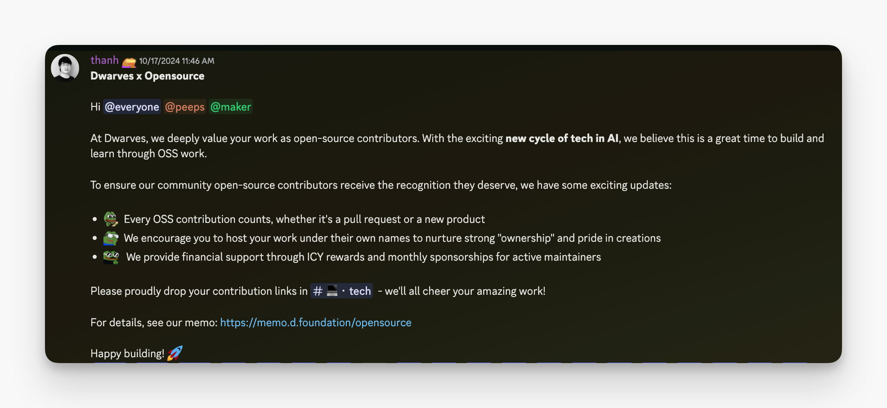

## Engaging with the community: Showing up and sharing back
The tech community is active right now, and we’re right in the mix. We’re diving headfirst into events, meetups, and summits to connect with the tech community. That gives us a clearer sense of where we need to grow.

What we’re doing:

- Connecting at the right places - tech meetups, summits, and shows where we meet peers, partners, and clients who are building interesting things.
- Bringing knowledge back home - capturing insights from every event through memos, podcasts, and OGIF sessions.
- Adding to the conversation - taking what we’ve learned and built, and sharing it back with the community.

# Workplace growth
## Return to the office: creating spaces where good work happens
We focused on making Hado office a productive and flexible space for focused work. Equipped with **Apple Studio Displays, Herman Miller chairs**, high-speed internet, and serene workspaces, it’s designed to help you get into the zone. Meeting rooms and 24/7 access offered flexibility when collaboration or quiet focus was needed.

We added perks like parking, lunch, and dinner subsidies to make the experience smoother. An automated check-in system at **🏢・lobby** rewarded every visit with **3 ICY**—a small gesture to keep us connected. Thanks to [@Tom](https://memo.d.foundation/contributor/Tom) for streamlining this process.

[Read our hybrid culture story.](https://memo.d.foundation/handbook/hybrid-working/)

## Exclusive Dwarves NFTs: Unique tokens to recognize our team members contributions
To celebrate our crew, we introduced **Peeps NFT**, an exclusive collection honoring the work and spirit of the Dwarves team. These non-transferable tokens aren’t just collectibles—they grant access to internal communications and earning opportunities, making every role feel even more special.

- View your NFT: [OpenSea Collection](https://opensea.io/collection/dwarves-4)
- How it works: Tono Bot automatically assigns the **@peeps** role when your connected wallet holds a Dwarves NFT.

A token of appreciation for every team member who helps Dwarves thrive.

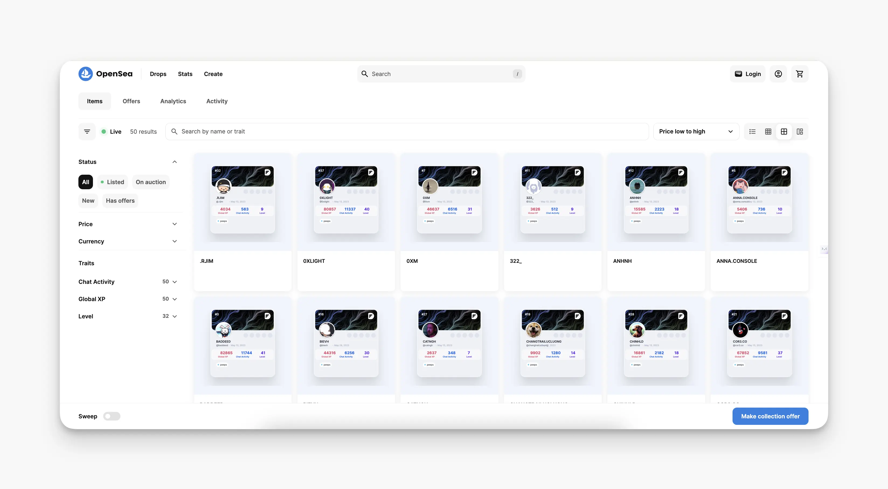

## Summit 2024: Penang adventures that strengthened our team
December took us off the grid and into the heart of Penang, giving us a chance to step outside our screens and into shared adventures. The team naturally broke into their own rhythms: street food trails, heritage walks, challenge courses, or simply finding peace by the waves.

Every moment shared, every snapshot dropped into **🌉・moments**. ICY was nice, but the connections made? Unbeatable. Penang reminded us of what works best: trusting the team to chart their path.

Coming back home with stronger bonds, and the confidence that comes from seeing our team thrive both online and off. [Catch the full Penang story here.](https://memo.d.foundation/updates/changelog/2024-summit-building-bonds-our-way/)

# Onward 2025
Like crafting software, building Dwarves Foundation has been a journey of experimentation. Some things worked, some didn’t, but every year we’ve added something meaningful to the core.

2024 pushed us into interesting spaces - AI went from experiments to real tools, knowledge sharing turned into daily habit, and the community grew naturally. But this is just the beginning.

2025 opens with questions we're eager to answer, about tech, others about how we work. The best lines are yet to be written.

A strong team is built on its people and their beliefs. We're looking forward to the surprises ahead with all of you.