---
tags:
  - newsletter
  - team
  - community
title: "State of Dwarves: 2024 Semi-annual Review"
date: 2024-07-04
description: The past six months have been packed with many improvements to our Discord server from new standards and automation to engaging activities and rewards. Take a moment to reflect on our journey so far, and let's get excited about what we'll accomplish together before the year ends.
authors:
  - innno_
  - nikki
  - thanh.pham
---

In the past six months, we've made some pretty impressive strides in testing new standards and adding more automation, activities, and rewards to our Discord server to foster a supportive community among tech lovers.

Take a moment to reflect on our journey so far, and let's get excited about what we'll accomplish together before the year ends.

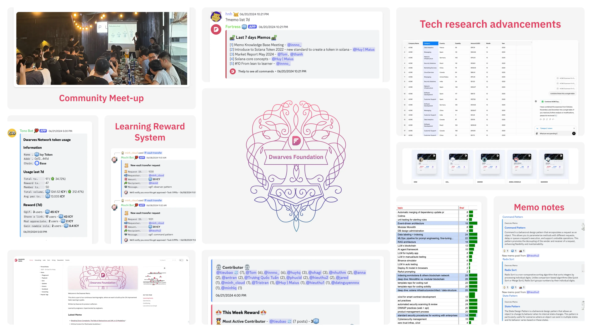

## Community Growth
### Organized offline meet-up
Our Year-End Party (YEP) was the first offline meet-up that set the tone for future gatherings,  where peeps can connect in person with like-minded people. Building on its success, we hosted our second Ho Chi Minh City meetup on May 31st.

Over 50 enthusiastic members joined us for a night of tech talks, and all-around good vibes. It was an opportunity to connect with our community in person and share our passion for technology.

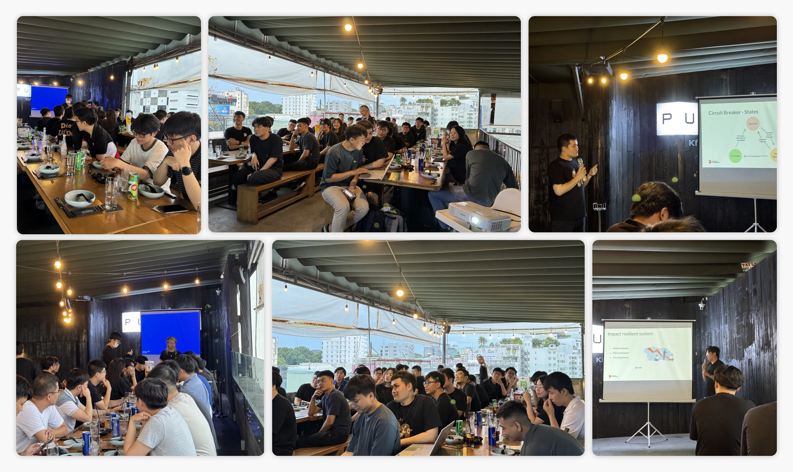

### Dwarves community is growing with more contributions
A big thanks to our active members who have taken part in learning and sharing knowledge with our peeps. 

Long Bui Van (@longddl) has published helpful notes on data pipelines and learning vector databases. You can explore at:

- [Data Pipeline Design Framework](https://memo.d.foundation/playground/engineering/data/data-pipeline-design-framework/)
- [Quick Learning Vector Database](https://memo.d.foundation/playground/engineering/data/quick-learning-vector-database/)

@jack collaborated with @phucld on [How to bridge $DFG from Ethereum Mainnet to Base Network for staking.](https://memo.d.foundation/playground/01_literature/how-to-transfer-dfg-from-eth-to-base-for-staking/)

Additionally, several other members have made noteworthy contributions from @tom, @hnh, @vincent, @bienvh, @innno_, @nikki, @huytq, @minhlq, @nhuthm, @hieuthu1, @antran, @ngocthanh, @thanh, @minh_cloud, @minh, @truongquoctuan, @tristran, @anna, @nambui, @tay, @datpv, @datnguyennnx, @nam, @taipn, @hoangnnh, @lapnn, @hieuthu2, @huymaius, @phucld for keeping our server active and full of great content.

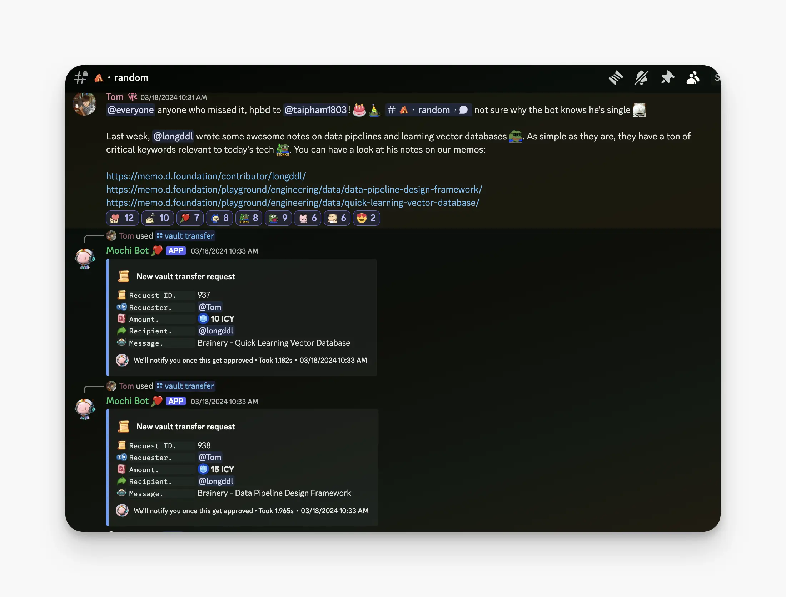

## Team Growth
### Building Dwarves’ wiki - memo.d.foundation
[memo.d.foundation](http://memo.d.foundation/) is where we share how we work, learn, and operate as a team. This site is part of our continuous learning engine, aiming to build a 1% improvement habit by learning in public.

There's a long road ahead to make it the ultimate knowledge source for the team, as a research-focused firm. We aim for the memo to be a centralized knowledge hub that uses a markdown format, displays a graph view, and connects through topic nodes.

Through learning, sharing, applying, and elevating our core knowledge, we can grow as a team and ship software more efficiently.

You will get a 5-15 ICY reward for each publication. Community members are welcome to share their learning notes too. 

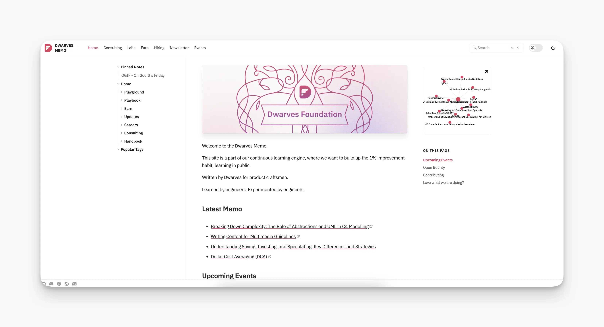

### Upgrading ICY reward for Dwarves learning system
We're excited about the future of ICY and our plans rolled out since its launch in September 2022:

- Monthly reward system for learning contribution up to 3000 ICY.
- ICY contract moved to Base chain for NFT/staking.
- New members joining our Discord with a verified account will get 0.1 ICY.
- Share links in **💻・tech, 💡・til** earn 1 ICY.
- Share your expertise in OGIF talks and earn 15-25 ICY per talk.
- Rewarding our top contributors weekly on Friday receives 3 ICY.
- Link Mochi wallet to GitHub for ICY rewards
- Earn & Stake ICY for rewards and future benefits.

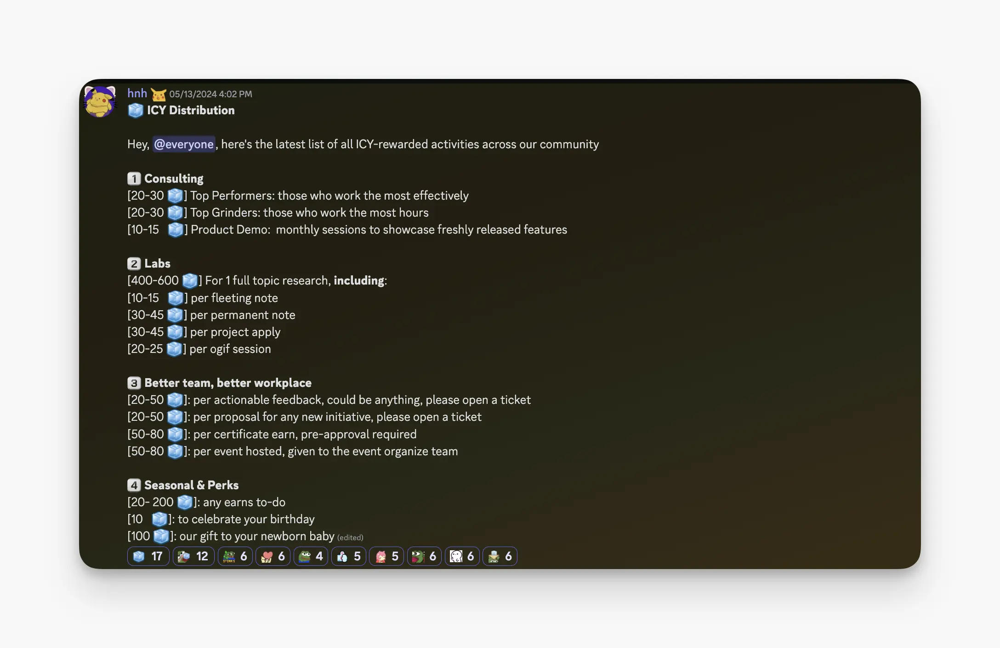

### Exclusive Dwarves NFTs for our team members
Peeps NFT is an exclusive collection for Dwarves Foundation members, granting access to internal communications and earning opportunities.

Each NFT signifies a unique role with special perks and privileges for our members.

These unique non-transferable tokens can be viewed on OpenSea at https://opensea.io/collection/dwarves-4.

[@Tono](https://memo.d.foundation/contributor/Tono) Bot will automatically grant the [@peeps](https://memo.d.foundation/contributor/peeps) role to NFT holders with connected wallets.

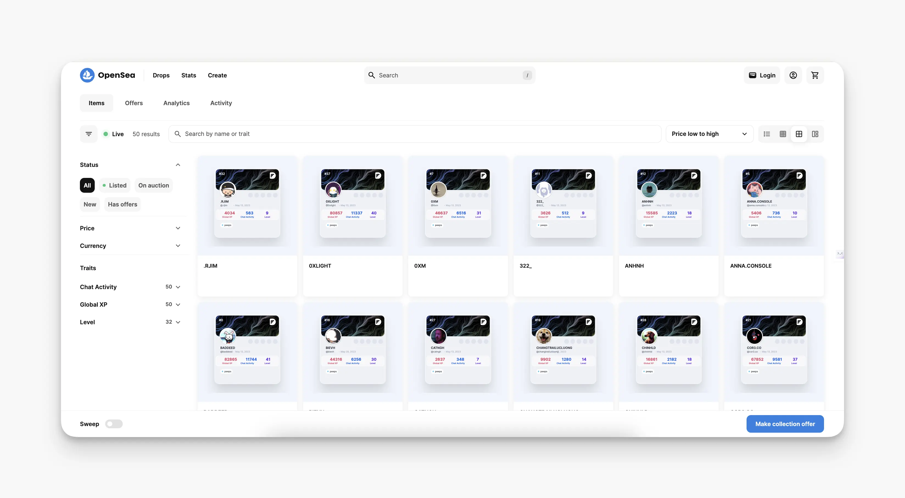

### Improvement in internal tooling: Fortress, Tono, Mochi
We’ve made several upgrades to enhance our Discord server with our self-built bots, improving task management and overall server experience.

**Tono:** Server management bot that keeps the network running smoothly, tracks weekly activities, and generates top contributor and top reading lists both daily and weekly.

**Fortress:** Tracks performance and issue reporting, offering real-time memo updates and weekly memo publication reports.

**Mochi:** Tip bot for sending virtual kudos to show appreciation for others.

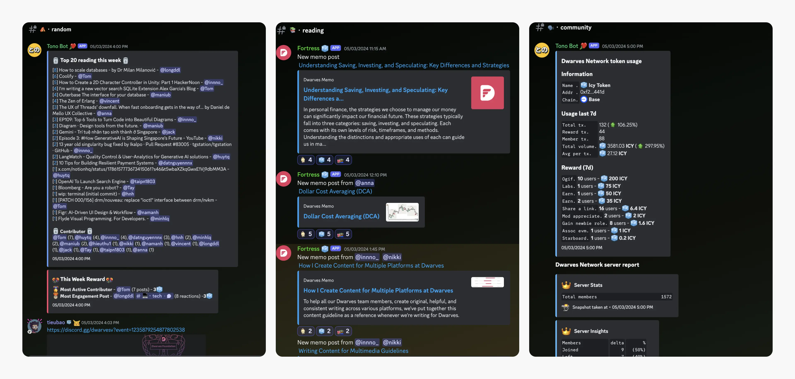

### Research topics: the road to expand the knowledge base
Solving problems using the latest technologies has always been our goal. This year's research focus is based on five key pillars:

- **Tooling:** Devbox, Colima, alert/monitoring standards
- **Software Architecture:** Event-driven architecture, Modular Monolith
- **LLM:** RAG, MLOps
- **Blockchain:** Solana infrastructure, Monolithic vs. Modular blockchain
- **Coding Security:** Standard security procedures, Zero trust infrastructure, GitOps

We've made progress in building internal tools like Tono Bot and Memo using LLM/RAG. Additionally, we've introduced our [Cyber Security Framework](https://memo.d.foundation/playground/01_literature/security/how-i-came-up-with-our-security-standard/) and adopted & built a Map of Content for [Devbox](https://memo.d.foundation/playground/01_literature/devbox-local-development-env/).

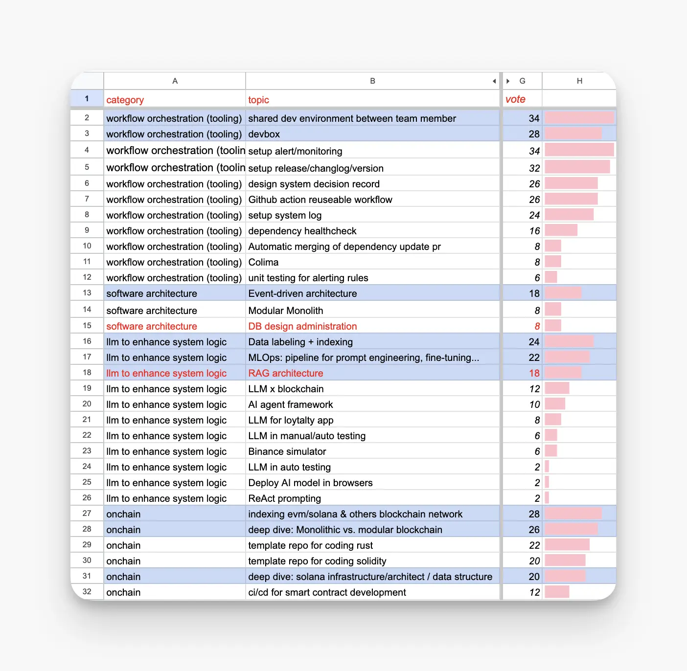

### Tech research advancements in tooling, architecture, & LLM
We closely monitor tech trends every month to identify those with high potential that could become part of our growing tech stack. 

In the past six months, our radar has detected:

- AI/LLM dominating the market. We've seen advanced models like GPT-4o and Sora, and open-source models like Llama 3 and Mistra, [providing new opportunities](https://memo.d.foundation/playground/01_literature/market-report-may-2024#gpt-4o-opportunities-and-disruptions) for richer applications and automation tools.
- RAG remains the top architecture for applications with LLM models. The [next advancements](https://www.notion.so/State-of-Dwarves-2024-Semi-annual-Review-7915e90978c14739be0ad7e66a377718?pvs=21) will refine retrieval processes to manage the growing online information, including multimodal data integration.
- Rust is the top choice for developing tooling and system-level software due to its performance. Big names like [Google and Microsoft advocate for Rust](https://memo.d.foundation/playground/01_literature/market-report-mar-2024/#other-notable-trends) to address [memory safety vulnerabilities](https://www.notion.so/State-of-Dwarves-2024-Semi-annual-Review-7915e90978c14739be0ad7e66a377718?pvs=21).
- Edge computing and serverless architecture are the [new wave in modern web development](https://www.notion.so/State-of-Dwarves-2024-Semi-annual-Review-7915e90978c14739be0ad7e66a377718?pvs=21). Platforms like Cloudflare and Fly.io are simplifying complexity for developers. Building web applications with edge computing speeds up page load times and reduces server maintenance costs.

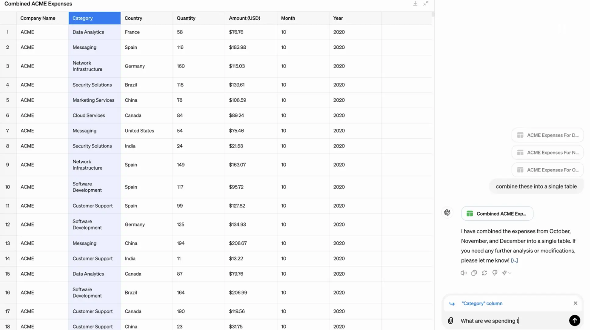

### Resume OGIF - Dwarves' weekly Friday sharing
OGIF is our weekly Friday tradition where members share 10-minute talks. After three months we have discussed diverse topics like software development, industry trends, finance, entrepreneurship, blockchain, AI, and more. It's a quick, engaging way to learn something new.

In this era of public learning, we’re excited to see what the team will create. You can revisit our OGIF sharing [here](https://memo.d.foundation/updates/ogif/11-ogif-office-hours-0621/). 

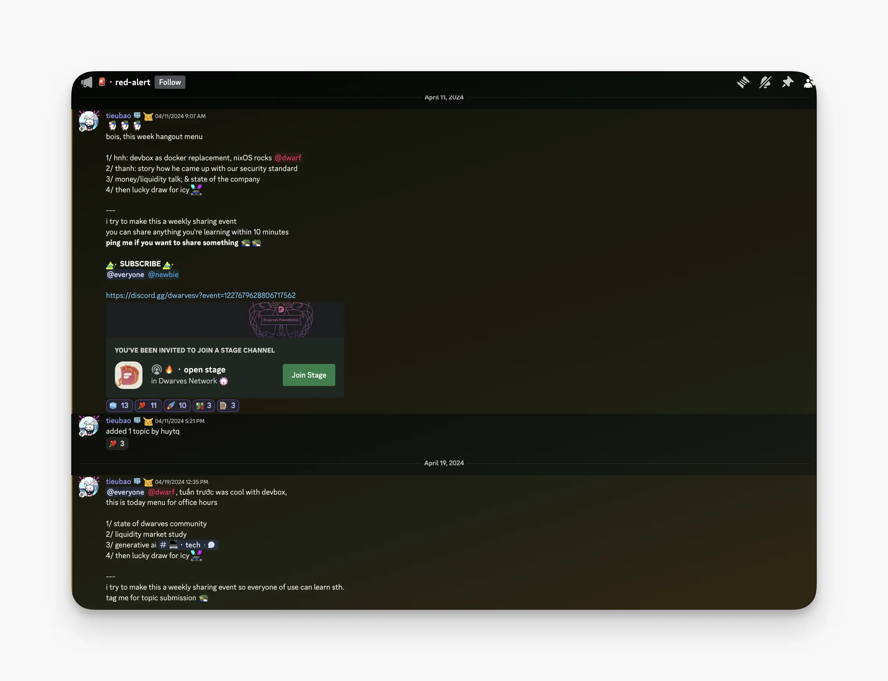

### Reorganize Discord roles: MMA system
We've revamped our Discord roles, now ladder-based and function-based, offering additional activities and benefits, especially with NFT and ICY staking.

**MMA-based new roles system**

- Mastery: Recognizing expertise.
- [@sers](https://memo.d.foundation/contributor/sers) (Meaning): Acknowledging contributions both at work and beyond.
- [@chad](https://memo.d.foundation/contributor/chad) (Autonomy): Highlighting high performers who excel in quality, quantity, communication, cooperation, and reliability.

**Consulting staff**

- Peeps: Newcomers, qualified to work with us.
- Baby dwarf: Purpose-seeking individuals.
- Dwarf: Members involved in R&D and learning activities.

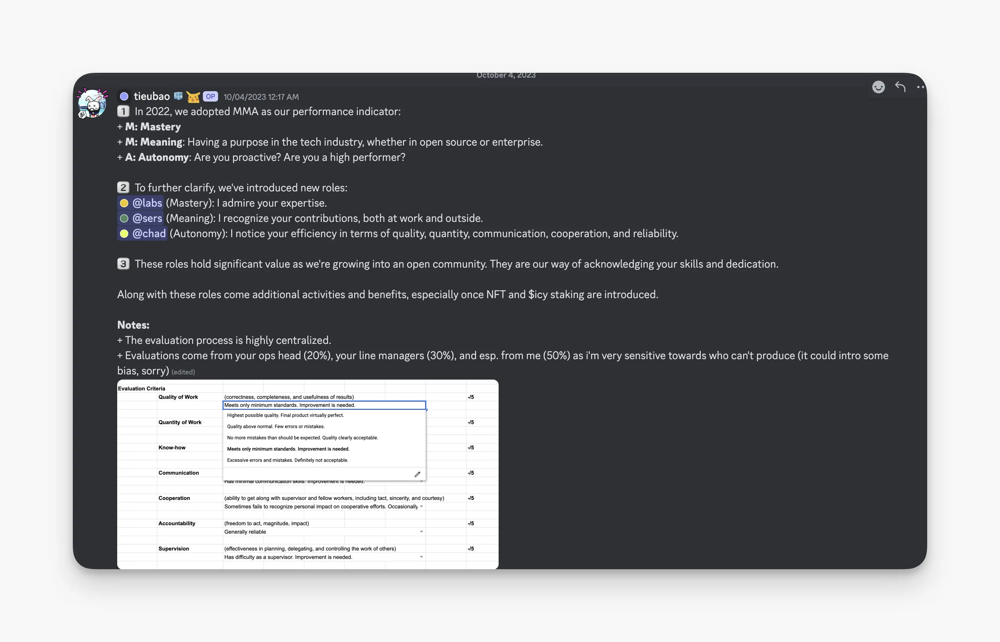

### Monthly top performers: Honoring your work efforts
Each month, we use delivery points to recognize our team's efforts. Team members who earn the most points shipped and effort spent receive ICY rewards.

**Highlight Top Performers:**

- **January:** @ngocthanh, @chinhld, @jim, @taipn, @phatnt
- **February:** @chinhld, @haihuynh, @khacvy, @taipn, @tay
- **March:** @ngocthanh, @nam, @taipn, @jim, @trkhoi
- **April:** @hoangnnh, @minhth, @nam, @haihuynh, @hieuvd
- **May:** @trkhoi, @ngocthanh, @haihuynh, @bienvh, @chinhld

### SPGroup WALA x Echelon Asia Summit 2024
In May, our team leaders [@tieubao](https://memo.d.foundation/contributor/tieubao), [@nikki](https://memo.d.foundation/contributor/nikki), and [@huytq](https://memo.d.foundation/contributor/huytq) attended the Echelon Asia Summit in Singapore. The event focused on the future of Southeast Asia’s tech and startup ecosystem, highlighting the trends and high-growth industries.

We observed the evolving use of funds by investors and startups, advancements in AI, and upcoming projects in the APAC tech startup landscape.

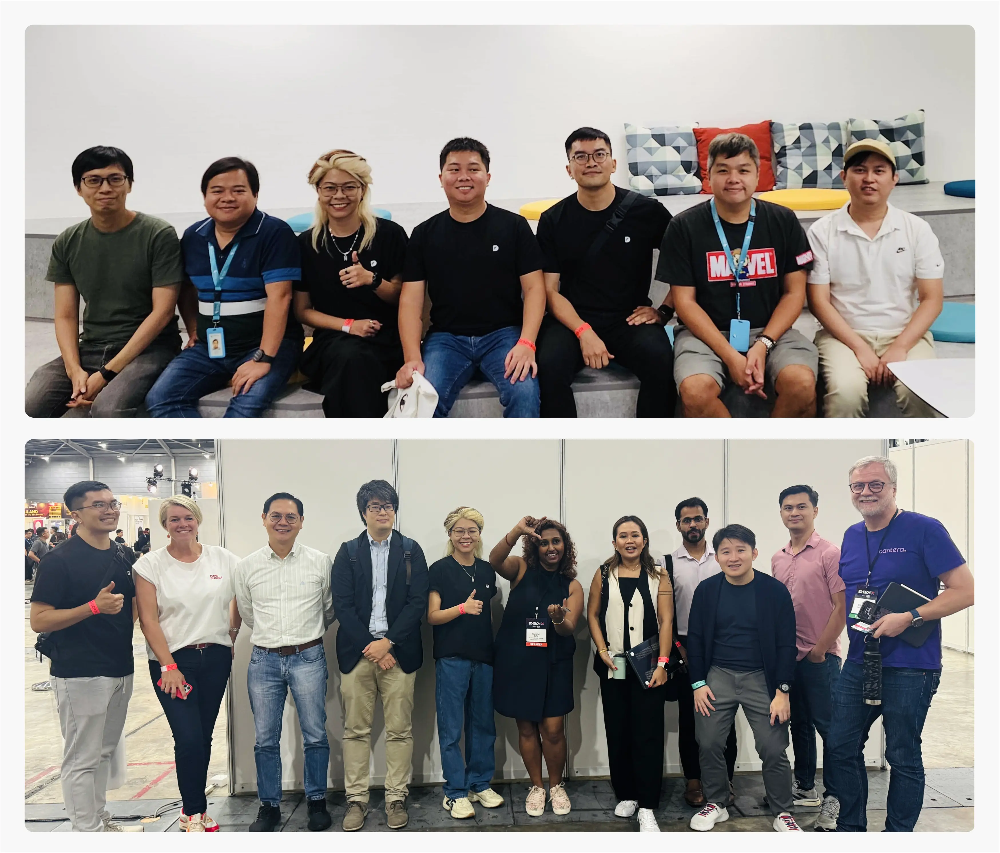

### Launching Dwarves internship program
We’ve launched another internship batch. This time, we welcome @datnguyennnx and @ngocquang to our team. We hope Dat and Quang will thrive and grow with us as they embark on this new chapter at Dwarves.

### Team promotion and new teammate
We've made some changes to our team structure. @hnh has been promoted to Chief of Staff, and @minh_cloud is now our Junior PM and Executive Assistant. We're also delighted to welcome our new teammate, @minh, who brings business development experience to our team.

### Brand new merchandise
The operations team is gearing up for another batch of t-shirts and stickers. The response to the new sticker set has been positive. We’re excited to see our community members sporting these items and showcasing their pride in being part of the Dwarves Foundation.

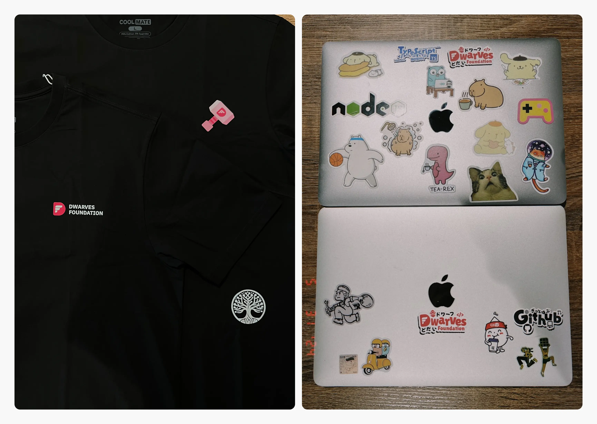

Let's wrap this up with a cheer on top, celebrating the many wins we've enjoyed. Here's to continuing our journey with the same enthusiasm and dedication in 2024. 

Thank you all for being a part of our inner circle, and helping us achieve MMA's goals.
