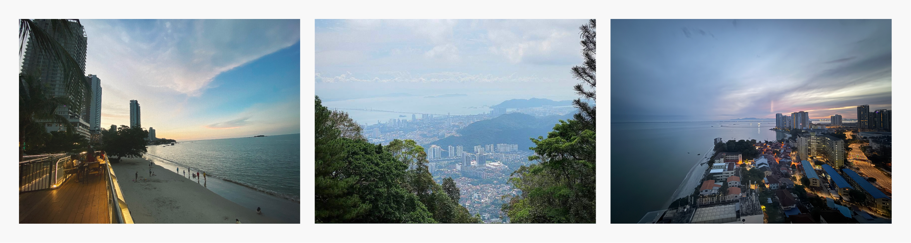

## The journey begins
Penang's vibrant streets became our playground this year. Our goal stood clear and simple: reconnect, recharge, and create memories together. The excitement built as team members from different cities touched down, some crossing borders for the first time.

What made it special? Letting things flow naturally. Despite working 100% remotely, our team clicked instantly in person. Those first-meeting jitters melted away faster than Penang's morning mist, proving that strong remote connections translate beautifully to real life.

## Taking the leap beyond borders
Stepping into Penang sparked something special. First-time travelers got their passport stamps while seasoned ones became guides, sharing tips from local dishes to hidden street art spots. This wasn't just a gathering; it was our first shared adventure abroad.

## Remote-first, but never distant
Working remotely, our team thrives on digital connections. Yet in Penang, Discord chats transformed into breakfast plans, virtual high-fives became real celebrations, and daily standups turned into evening street food hunts. Our online chemistry translated naturally to real-world friendships - proving we've built something special beyond screens, a team that's connected beyond screens.

## The three pillars come to life
Remember our 2022 vision of Mastery, Meaning, and Autonomy? Penang turned these from concepts into reality:

**Mastery** popped up in unexpected places. Here it showed up in how we turned moments into memories. Every photo dropped in **🌉・moments** automatically earned ICY - no approvals needed, no best-shot contests, just pure team storytelling in action.

**Meaning** hit different when everyone picked their path. Whether wandering heritage streets or conquering Escape Penang's challenges, each choice mattered, not a checkbox. Teams clicked over shared interests, building bonds that make Monday's Discord chats more fun.

**Autonomy** did what it does best - let people be people. No scripts, no forced fun. Teams came together naturally, called their own shots, and turned Penang into their playground. From dawn coffee to twilight beach hangs, every move was team-picked and team-approved.

## Making memories our way
Our **🌉・moments** lit up with photos and stories, each ICY token marking another team memory made.

- **Food adventurers** dove into Penang's legendary street food scene, turning every meal into a chance to know each other better.
- **Cultural explorers** wandered through George Town's heritage streets, their shared discoveries becoming team memories.
- **Adventure seekers** conquered Escape Penang together, trading keyboards for climbing ropes.
- **Beach crew** found their rhythm by the waves, where casual conversations built lasting connections.

## Where it all came together
This summit showed us something powerful about our remote culture: connection transcends distance. When teammates meet, online rapport naturally turns into real-world friendships, proving we’re building something truly special.

Standing back and watching these moments unfold hit different. The real win? Give people space to connect, and they'll create something better than any playbook could design. Each shared moment, each ICY token earned - they're all threads in a bigger tapestry of a team that stays close no matter the miles.

Here's to the incredible family we've built - one that makes every summit feel like a homecoming. When we come together, it feels like we were never apart.

