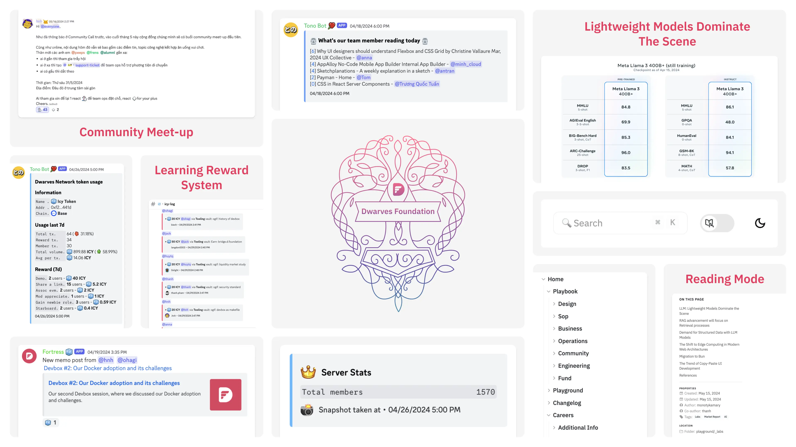
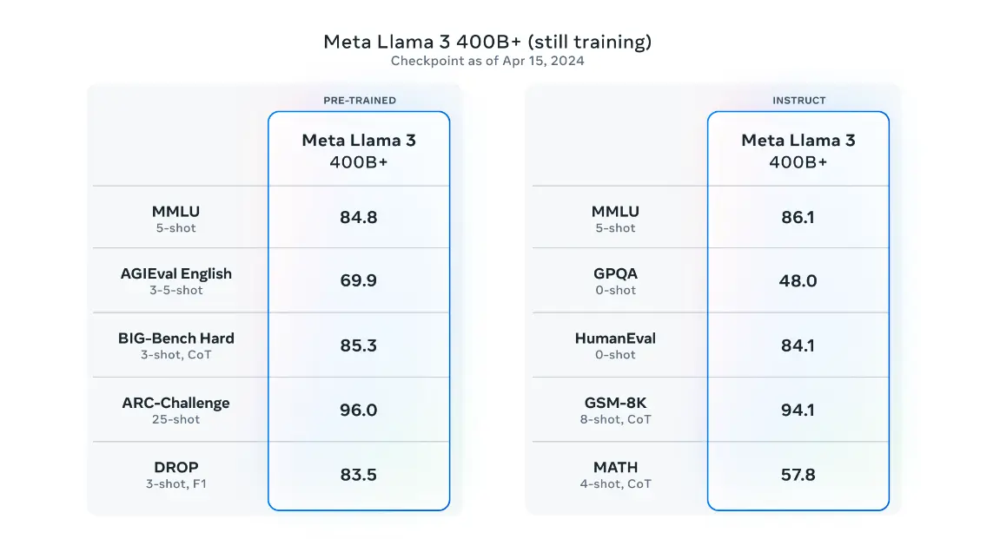
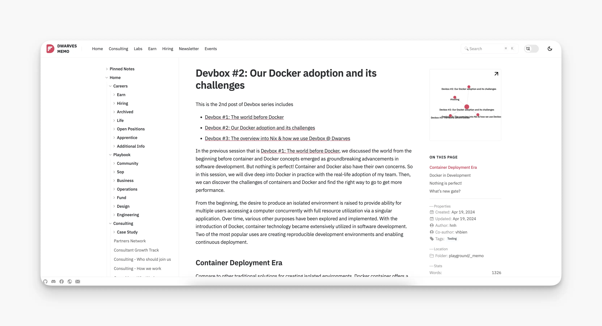
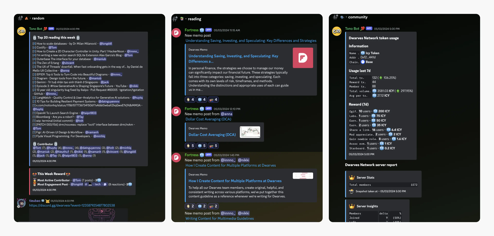
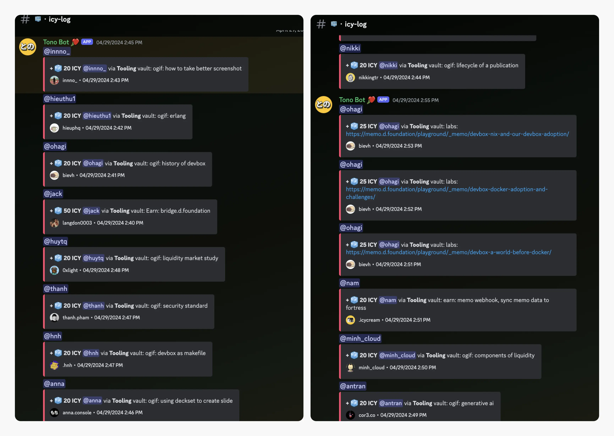
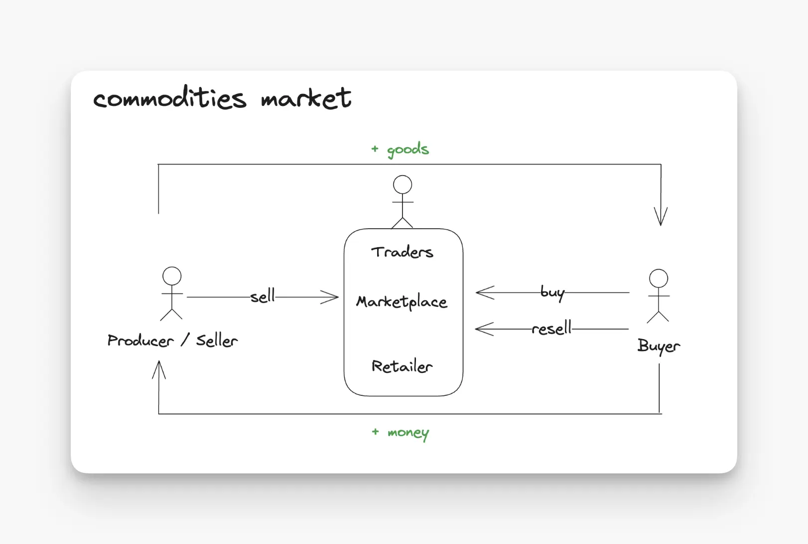

---
tags:
  - newsletter
  - meet-up
  - tech-report
  - community
title: What's New in April 2024
date: 2024-05-23
description: In this April, we're focused on memo upgrading, reward system, OGIF, internal tooling, community meetup and market report. 
authors:
  - innno_
---

- [**Reporting tech signals:**](#reporting-tech-signals---ai-edge-computing-and-ui-innovations-driving-change) major updates in Meta's Llama 3, the growth of RAG systems, the move to edge computing, and the influence of Bun 1.1 in JavaScript.
- [**memo.d.foundation:**](#upgrading-the-new-sidebar-and-reading-mode-on-memodfoundation) improve experience with new sidebar, pinned notes, and reading mode.
- [**The new features in Tonobot and Fortress are**](#new-features-in-tonobot-and-fortress-our-internally-automated-bots) top contributor reading lists, real-time memo post updates, and weekly reporting on Dwarves Network.
- [**Upgrading learning reward system:**](#monthly-reward-system-for-learning-contribution) monthly pool up to 700 ICY, aligned with our research-focused orientation.
- [**Dwarves office hour:**](#the-traditional-dwarves-office-hour-happens-every-friday-afternoon) weekly sharing so everyone can learn something within 10 minutes.

## Reporting tech signals - AI, edge computing, and UI innovations driving change
In April 2024, we saw exciting technological advancements and key trends to influence various markets profoundly.

- The release of Meta's Llama 3, Databricks' DBRX, and Mixtral 8x22B offer high-quality options for self-hosted LLM applications, making AI more accessible and affordable for businesses.
- The trend of Retrieval Augmented Generation (RAG) systems is gaining traction, integrating real-time data for more accurate LLM responses.
- The tech landscape is experiencing a shift towards edge computing for faster and more cost-effective web applications
- Bun 1.1 is making waves in the JavaScript ecosystem with its speed and compatibility, while the copy-paste UI development approach offers developers greater flexibility and customization.

[Read our full report](https://memo.d.foundation/playground/_labs/market-report-april-2024/) for a deeper dive into these trends and their potential impact.

## Upgrading the new sidebar and reading mode on memo.d.foundation
In recent months, we’ve been improving memo.d.foundation, our “digital knowledge hub”. Every piece of knowledge finally has a place to organize in a cleaner, more productive space. 

Here's what you can expect: 

- Keep your eyes comfy with the new interface: now boasting a sleek sidebar, pinned notes, and new reading mode, complete with author information, table of contents, and estimated reading time.
- Plus, a user-friendly sidebar folder tree makes navigating your knowledge a breeze.
- Kudos to the hard work of @Tom and @vincent for meticulously preparing the data and implementing DuckDB-WASM, resulting in lightning-fast rendering and coding on Hugo.
- Special shoutout to @innno_ and the communication team for their efforts in learning and using development tools to contribute to this project.

Let us know what you think.

## New features in Tonobot and Fortress, our internally automated bots
The nitty-gritty details we've implemented to make Discord better with our self-built bots, thanks to @hnh, @nam, and @bienvh. Here are a quick rundown of Tonobot and Fortress’s latest features:

- Tonobot can now track weekly Dwarves Network activities and generate top contributor reading lists. This means you can access clear reports with minimal effort.
- Fortress bot: top reading list and real-time memo post updates provide accessibility for users engaging with our content.

## Monthly reward system for learning contribution
We're set to update the reward system, introducing a monthly pool of up to ~700 ICY for your learning contributions. You can collect valuable insights from diverse sources and submit them to memo.d.foundation.

As a **research-focused firm**, we encourage the team to learn, contribute, share, and collect knowledge from around. It became clear that our velocity (ability to ship more and more regularly) and our roadmap would all improve. 

We welcome everyone in the Dwarves Network to participate.

## The traditional Dwarves office hour happens every Friday afternoon
At 5PM, every Friday afternoon, everyone in community is invited to gather on Discord to share our work with others. In the April Community Call we walked through:

- Our friend @jack demo step-by-step guide with @phucld on how to bridge [$dfg](https://bridge.d.foundation/) from ETH Mainnet to the Base chain ecosystem to experience a smooth and seamless cross-chain smkwap.
- @minh_cloud took a further in the component liquid market: definition, benefits in trading, and examples.
- What you need to dive in with Erlang 101 by @hieuthu1, covered getting started with Erlang.

**Upcoming event:**

-  Community meetup in Ho Chi Minh City on Friday, May 31st. 
