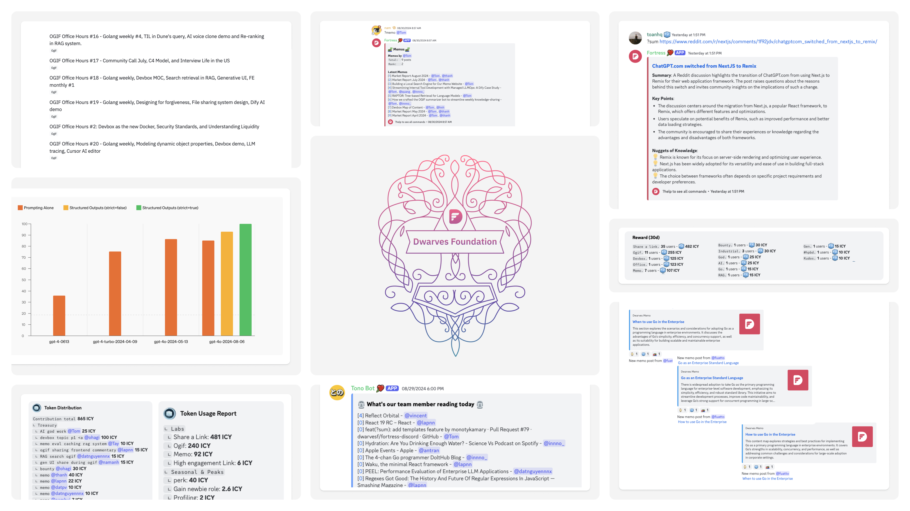
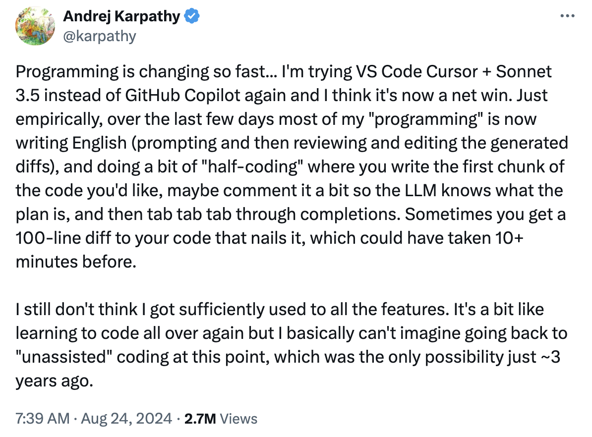
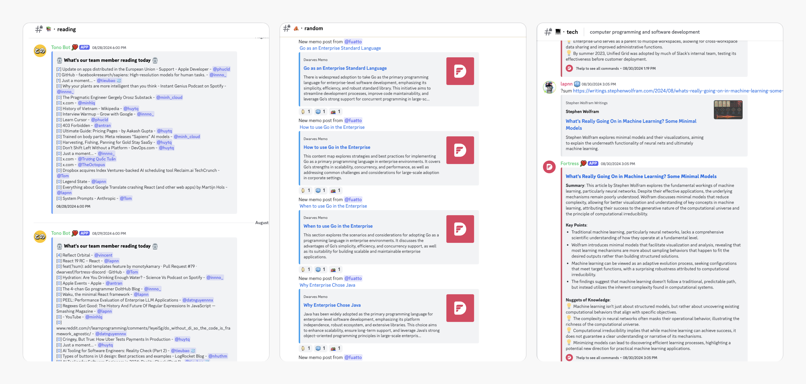
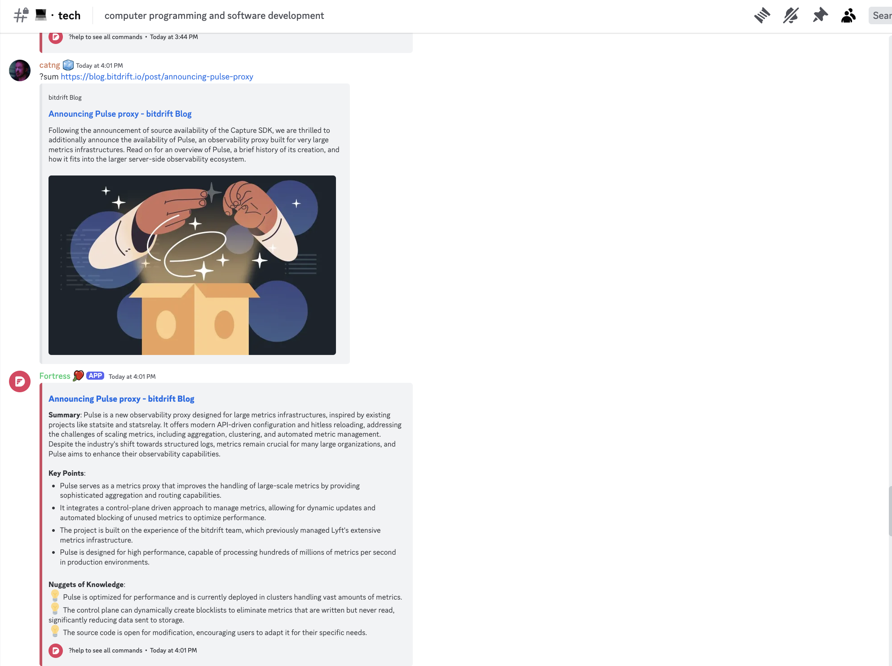
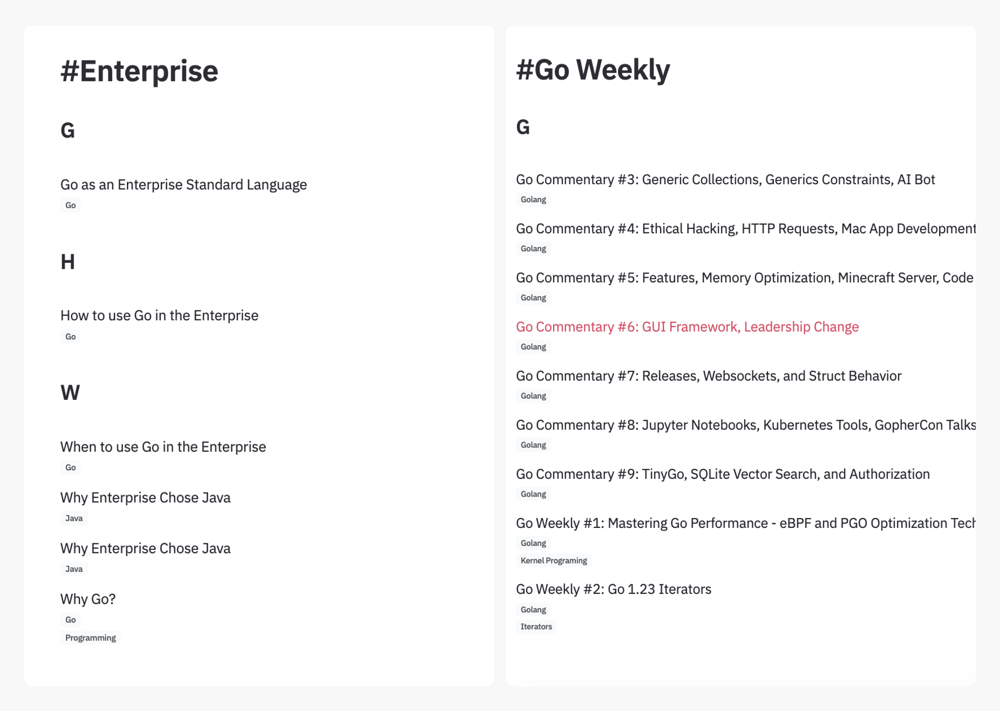
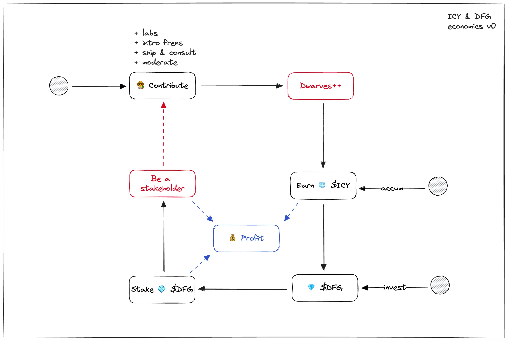

---
tags:
  - newsletter
  - memo
  - community
title: What's New in August 2024
date: 2024-09-06
description: Each month, we release a recap highlighting key updates and progress within our team and community. August updates highlight AI tools, enhanced community discussions, the sum command upgrade, Go enterprise MOC insights, and earning dfg tokens through contributions.
authors:
  - innno_
---

- [**Reporting tech signal:**](#reporting-tech-signal-ais-impact-on-programming-and-new-opportunities) How AI tools like Cursor and Claude 3.5 Sonnet are changing programming, with insights on generative apps, prompt caching, and structured outputs.
- [**Community activities:**](#community-engagement-memo-notes-ogif-office-hours-and-tech-discussions) Increased discussions in the  [**💻・tech**](https://discord.com/channels/462663954813157376/810481888619135046/1281086341995565057), [**💡・til**](https://discord.com/channels/462663954813157376/1001883339046797342/1281097209072320615) channels. Shoutouts to key contributors from the team and community for their involvement.
- [**Upgrading the `sum` command:**](#link-summaries-with-sum-command) The `sum` command now delivers faster summaries with key points and nuggets of knowledge. Thanks to Nam and Tom for the upgrade.
- [**Golang enterprise MOC:**](#go-enterprise-solutions-and-what-weve-learned) Phat Nguyen compiled the Go Enterprise MOC, giving us deeper insights into how we’re tackling enterprise challenges with Golang.
- [**dfg token:**](#dfg-token-earn-by-contributing) The dfg token can now be earned through team contributions, tracked by ICY in team activities.

## Reporting tech signal: AI’s impact on programming and new opportunities
August brought some exciting developments in AI-driven programming and app creation. Tools like **Cursor** and **Claude 3.5 Sonnet** are pushing programming toward AI-guided code, while **Generative Apps** are moving beyond UI, with AI tools now able to build mini apps from simple prompts.

Other highlights include:

- **AI in Programming:** Tools like Cursor and Claude 3.5 Sonnet are shifting coding from manual work to AI-guided, moving towards an AI-driven future.
- **Generative Apps:** AI tools like Claude and ChatGPT are now building mini apps from prompts, reshaping app creation.
- **Amazon's AI Development:** Amazon's GenAI assistant has slashed upgrade times and costs, automating 79% of code reviews.
- **Prompt Caching:** Anthropic’s caching cuts costs by up to 90%, boosting efficiency in apps needing repeated context like chatbots.
- **OpenAI’s Structured Output:** OpenAI enforces data adherence to JSON schemas, raising the bar in fields like healthcare and finance.
- **Frontend Evolution:** Tools like shadcn and v0.dev are accelerating UI development with AI-enhanced prototyping.

[Check out the latest market trends.](https://memo.d.foundation/playground/01_literature/market-report-aug-2024/)

## Community engagement: memo notes, OGIF office hours, and tech discussions
Since we introduced the monthly pool for learning activities, the biggest impact has been the rise in real learning and discussions happening in memo notes, OGIF office hours, and discord network. We’ve made it simple for everyone to contribute.

Practical insights are brought to the table, and we work through them together—no fluff.

Plus, there’s a new Fortress bot feature to check available ICY for grabbing, making it easier to see what’s up for grabs. 

Big thanks to the contributions from both the team and community: @tom, @lapnn, @theoctopus, @minhlq, @taipham, @vincent, @phucld, @julis, @antran, @innno_, @minh_cloud, @bienvh, @huymaius, @huytq, @datnguyennnx, @nam, @hieuthu1, @tristran. 

Here’s what we covered in August:

- [Devbox Map of Content](https://memo.d.foundation/playground/-devbox/) - [@bienvh](https://memo.d.foundation/contributor/bienvh)
- [Go commentary weekly](https://memo.d.foundation/tags/go-weekly/) - [@fuatto](https://memo.d.foundation/contributor/fuatto)
- [Market report August](https://memo.d.foundation/playground/01_literature/market-report-aug-2024/) - [@thanh](https://memo.d.foundation/contributor/thanh), [@tom](https://memo.d.foundation/contributor/tom)
- [Frontend market report](https://memo.d.foundation/playground/01_literature/engineering/frontend/frontend-report-july-2024/), - [@lapnn](https://memo.d.foundation/contributor/lapnn), [@hienld](https://github.com/leduyhien152)
- [Design file-sharing system - Part 1: Directory Structure](https://memo.d.foundation/playground/01_literature/design-file-sharing-system-part-1-directory-structure/), [Design file-sharing system - Part 2: Permission & Password](https://memo.d.foundation/playground/01_literature/design-file-sharing-system-part-2-permission-and-password/) - [@datpv](https://github.com/datphamcode295)
- [Evaluating search engine in RAG systems](https://memo.d.foundation/playground/01_literature/hybrid-search/) - [@datnguyennnx](https://memo.d.foundation/contributor/datnguyennnx)
- [Evaluating caching in RAG systems](https://memo.d.foundation/playground/01_literature/caching-with-rag-system/) - [@tay](https://github.com/taynguyen)
- [Generative UI](https://memo.d.foundation/playground/01_literature/generative-ui/) - [@namanh](https://github.com/tonible14012002), @ngocquang
- [Designing for forgiveness](https://memo.d.foundation/playground/01_literature/designing-for-forgiveness/) - [@nambui](https://github.com/Maniub102)
- [Design custom/dynamic object properties](https://memo.d.foundation/playground/01_literature/designing-a-model-with-dynamic-properties/) - [@lapnn](https://memo.d.foundation/contributor/lapnn)
- [OGIF office hour](https://memo.d.foundation/tags/office-hours/)

## Link summaries with `sum` command
We’ve upgraded the **`sum`** command on our Discord to make it easier to get the important stuff. Now, with a summary opening, key points, and nuggets of knowledge, it’s quicker to catch up on useful links. Special thanks to [@nam](https://github.com/namnhce) and [@tom](https://memo.d.foundation/contributor/tom) for leading this improvement.

## Go enterprise solutions and what we’ve learned
August brings a major update to our Go commentary. [@fuatto](https://memo.d.foundation/contributor/fuatto) has put together the Go Enterprise MOC, offering a clear look at how we’re applying Golang to tackle enterprise challenges and highlighting how we’re stretching its capabilities.

We’re still delivering our Go commentary weekly through OGIF sessions and memo notes. [Take a look here](https://memo.d.foundation/tags/go-weekly/).

## dfg token: earn by contributing
The **dfg token** has evolved from a private stock-like idea to a way to reward team members for their contributions. It’s part of our plan to build a brand we can all be proud of.

Originally tied to our Employee Ownership Program (EOP), the **dfg token** can now be earned through team activities. Contributions are tracked and rewarded with ICY coins. Soon, ICY will be required to earn the token.

[Check out for the details.](https://memo.d.foundation/playbook/community/df-protocol-icy-dfg/) 

