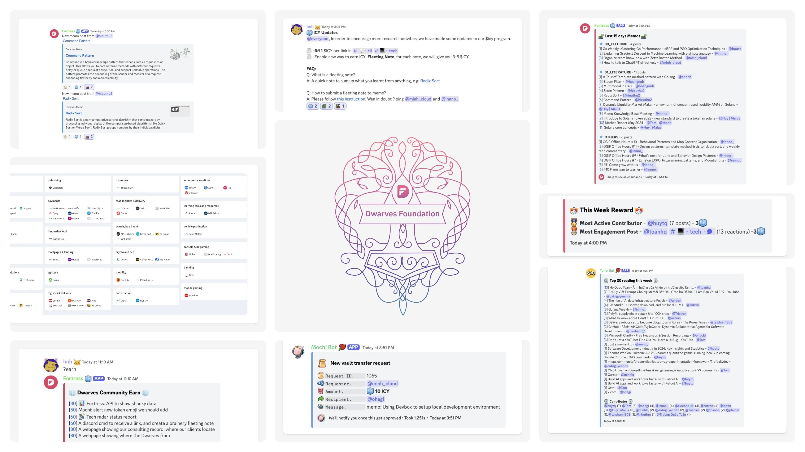
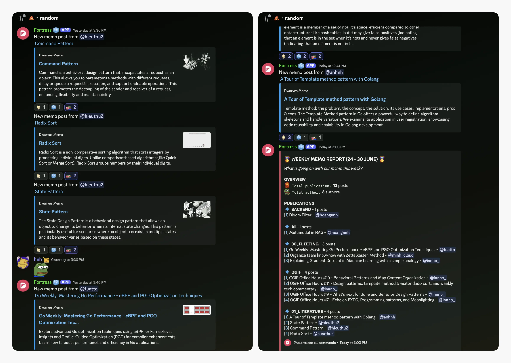
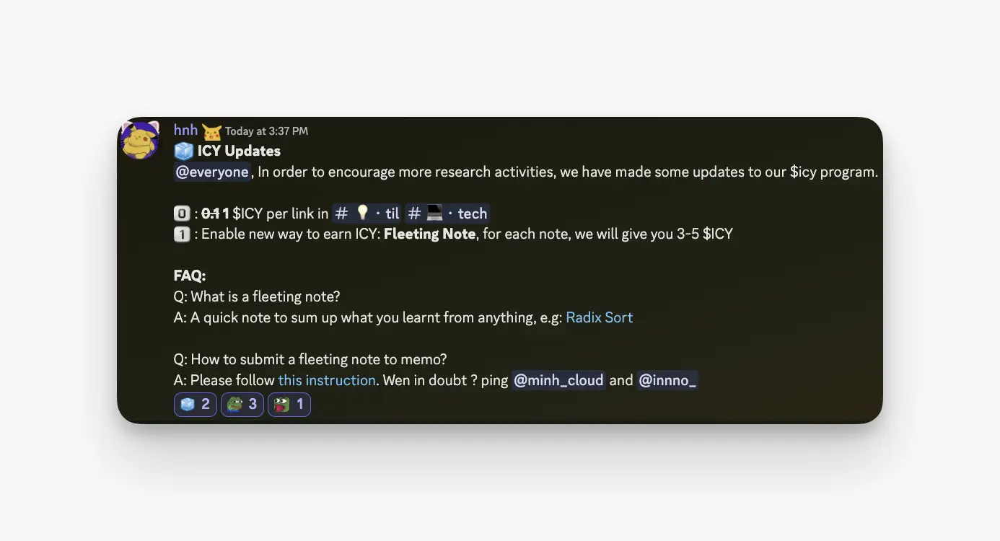
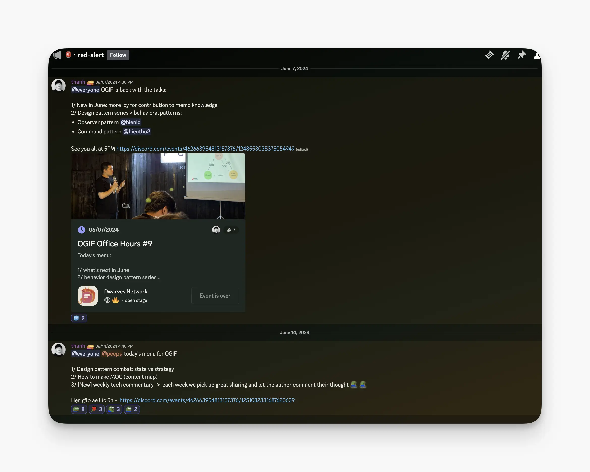
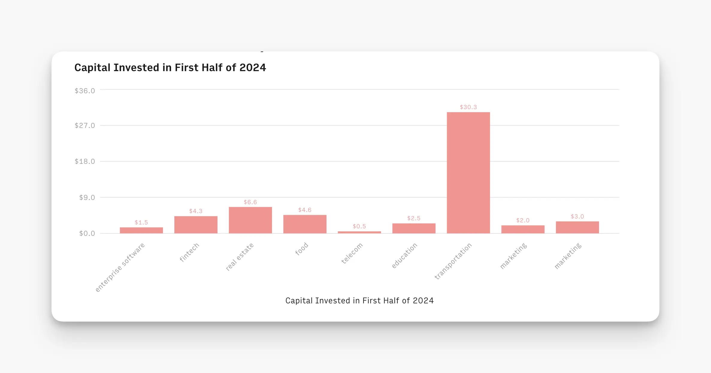

---
tags:
  - newsletter
  - memo
  - community
title: What's New in June 2024
date: 2024-07-04
description: In June, we expanded our knowledge base on software design, LLMs, and blockchain, while actively encouraging knowledge-sharing through increased ICY rewards. Our Vietnam Tech Scene report highlighted key industry players, and weekly OGIF talks fostered discussions on diverse tech topics like design patterns, data modalities, and blockchain architecture
authors:
  - innno_
  - nikki
---

- [**memo.d.foundation**](#the-growing-of-memo-pile): more entries focusing on software design, LLM and blockchain, a key focus of our continuous learning journey. 
- [**Increased ICY Rewards**](#enable-reward-for-the-learning-system): the increasing amount of fleeting notes boosted our learning reward system.
- [**Dwarves Token Usage**](#dwarves-token-usage-for-june): our community's exceptional engagement led to ~500 ICY rewarded for contributions, with notable efforts in OGIF talks, tech sharing, and Memo notes.
- [**Vietnam Tech Scene**](#building-a-network-of-trusted-partners-in-vietnams-tech-ecosystem) report covered notable insights into our nation's tech landscape, as well as key players in AI, fintech, and blockchain/crypto ecosystem.
- [**Weekly OGIF Talks**](#dwarves-office-hours-at-5pm-every-friday): Our Friday sessions promote a knowledge-sharing culture. In June, we've covered design patterns, content mapping, software design, data modalities, and blockchain architecture.

## The growing of memo pile
With the focus on Mastery, Meaning, and Autonomy (MMA) has driven significant growth in our brainery. This is evident from the increase in content submitted by our contributors on areas for work delivery, and foundational knowledge.

[memo.d.foundation](http://memo.d.foundation/), is creating a rich resource that both internal and community members can benefit from. Last month, Dwarves’ team members added several new entries from LLM, design patterns to blockchain concepts. Dwarves monthly rewards will be equally shared among all contributors.

1. [A Tour of Template method pattern with Golang](https://memo.d.foundation/playground/01_literature/template-method-design-pattern/) - [@anhnh](https://github.com/anhnh12) 
2. [Multimodal in RAG](https://memo.d.foundation/playground/01_literature/Engineering/AI/multimodal-in-rag/) - [@hoangnnh](https://github.com/nnhuyhoang)
3. [Bloom filter](https://memo.d.foundation/playground/01_literature/engineering/backend/bloom-filter/) - [@hoangnnh](https://github.com/nnhuyhoang)
4. [Command](https://memo.d.foundation/playground/01_literature/engineering/backend/bloom-filter/), [State Pattern](https://memo.d.foundation/playground/01_literature/state-pattern/), and [Radix sort](https://memo.d.foundation/playground/01_literature/radix-sort/) - [@hieuvd](https://github.com/vdhieu)
5. [Go Weekly: Mastering Go performance](https://memo.d.foundation/playground/00_fleeting/go-weekly-510/) - [@phatnt](https://github.com/fuatto)
6. [Using devbox to setup local development environment](https://memo.d.foundation/playground/01_literature/devbox-local-development-env/) by [@hnh](https://github.com/huynguyenh), [@bienvh](https://github.com/baenv)
7. [Organize team know-how with the Zettenlkasten method](https://memo.d.foundation/playground/00_fleeting/organize-team-know-how-with-zettelkasten-method/) - [@minh_cloud](https://github.com/minhcloud)
8. [How to talk to ChatGPT effectively](https://memo.d.foundation/playground/00_fleeting/how-to-talk-to-chatgpt-effectively/) - [@minh_cloud](https://github.com/minhcloud)
9. [Dynamic Liquidity Market Maker - a new form of concentrated liquidity AMM on Solana](https://memo.d.foundation/playground/01_literature/dynamic-liquidity-market-a-new-form-of-concentrated-liquidity-amm-on-solana/) -[@huymaius](https://github.com/quanghuynguyen1902)
10. [Introduce Solana Token 2022](https://memo.d.foundation/playground/01_literature/introduce-to-solana-token-2022-new-standard-to-create-a-token-in-solana/) - [@huymaius](https://github.com/quanghuynguyen1902)
11. [Solana core concepts](https://memo.d.foundation/playground/01_literature/solana-core-concepts/) - [huymaius](https://github.com/quanghuynguyen1902)
12. [Market Report May](https://memo.d.foundation/playground/01_literature/market-report-may-2024/) - [@thanh](https://github.com/zlatanpham), [@tom](https://github.com/monotykamary)
13. [How to make an MOC](https://memo.d.foundation/playground/01_literature/how-to-make-a-moc/) - [@thanh](https://github.com/zlatanpham)
14. [A tour of Singleton design pattern with Golang](https://memo.d.foundation/playground/01_literature/singleton-design-pattern/) - [@anhnh](https://github.com/anhnh12) 
15. [Going through use cases of the prototype design pattern and it place among the creational pattern](https://memo.d.foundation/playground/01_literature/prototype-design-pattern/) - [@.rjim](https://github.com/R-Jim)
16. [Introduce builder pattern and its use cased](https://memo.d.foundation/playground/01_literature/builder-design-pattern/) by [@vincent](https://github.com/tuanddd)
17. [Explaining gradient descent in ML](https://memo.d.foundation/playground/00_fleeting/explaining-gradient-descent-in-machine-learning-with-a-simple-analogy/) - [@innno_](https://github.com/innnotruong) 

## Enable reward for the learning system
Dwarves has always been a playground for techies, where learning and sharing go hand-in-hand. The increase in valuable content shared by our team and community members deserves greater recognition and rewards. 

To keep the momentum going, we’ve upped the ICY rewards for our learning activities.

Multiple activities are going on at [🧊・earn-icy](https://discord.com/channels/462663954813157376/1006198672486309908/1239502938918096960):

- Share your expertise in OGIF talks and earn 15-25 ICY per talk.
- Distill your OGIF insights into valuable notes on Memo and earn 10-15 ICY.
- Got a quick learning or discovery? Share it as a fleeting note and earn 3-5 ICY.
- Each link shared in **💡・til, 💻・tech** channels receive 1 ICY.
- Rewarding our top contributors weekly on Friday receives 3 ICY.
- ICY airdrop when joining community calls.

Everyone in the community is welcome to join hands.

## Dwarves token usage for June
Our community's engagement has been exceptional this month, reflected in the active use of Dwarves Token. We don’t limit any roles to join us; more room means more participants. 

In June alone, ~500 ICY were rewarded for all contributions, highlighting:

- OGIF talks: 175 ICY (~262 USDC)
- 183 links were shared: 166.8 ICY (~238.5 USDC)
- Memo notes: 109 ICY (~163.5 USDC)

With notable contributors: 

- OGIF talks: @hieuvd, @hoangnnh, @anhnh, @jim, @taipn
- Tech Sharing: @tom, @innno_, @bienvh, @huytq
- Memo: @thanh, @huymaius, @hoangnnh, @jim, @hieuvd

Kudos to those peeps who are top contributors, @hieuvd, @thanh, @tom. 

## Dwarves office hours at 5PM every Friday
Our OGIF sessions continue to be a hit. These Friday afternoon talks are a chance for team members to share their knowledge on various topics. 

We have discussed: 

- [Behavior Design Pattern: Observe pattern, Design pattern](https://memo.d.foundation/playground/01_literature/command-pattern/) by @hoangnnh, @hieuvd
- [Design pattern: State vs Strategy](https://memo.d.foundation/playground/01_literature/state-pattern/) by @jim, @anhnh
- [How to make MOC (content map)](https://memo.d.foundation/playground/01_literature/how-to-make-a-moc/) by @thanh
- [Template method](https://memo.d.foundation/playground/01_literature/template-method-design-pattern/) & [Visitor radix sort](https://memo.d.foundation/playground/01_literature/radix-sort/) by @anhnh, @taipn
- [Go Weekly: Mastering Go performance](https://memo.d.foundation/playground/00_fleeting/go-weekly-510/)  by @phatnt
- [Solana core concepts](https://memo.d.foundation/playground/01_literature/solana-core-concepts/) by @huymaius
- [Multimodal in RAG](https://memo.d.foundation/playground/01_literature/Engineering/AI/multimodal-in-rag/) by @hoangnnh

We have distributed **175 ICY for OGIF in June.** 

## Building a network of trusted partners in Vietnam’s tech ecosystem
We're monitoring developments in Vietnam's tech landscape. Despite global economic challenges, Vietnam's tech market is thriving, making it an attractive hub for startups and investors.

By connecting key players in the ecosystem, this report aims to establish a network of trusted partners who can collaborate and drive mutual growth.

Key highlights include:

- **Investment and Growth:** $529 million in investments in 2023, with Vietnam ranking third in Southeast Asia for deal count and value.
- **Sector Surge:** Substantial growth in Healthcare and Education investments, up by 391% and 107%.
- **Digital Economy:** Fastest-growing in Southeast Asia, projected to reach $43 billion by 2025.
- **Active-Investors:** Nearly 100 investors, including major players like 500 Startups Vietnam, VSV Capital, and VinaCapital Ventures.
- **AI/Fintech Leaders:** Influential investors like 500 Startups Vietnam, VSV Capital, and VinaCapital Ventures significantly impact the AI and fintech sectors.
- **Blockchain and Crypto Leaders:** Animoca Brands, Foresight Ventures, and HashKey Capital are driving innovation in the blockchain/crypto space.
- **Legal Support:** Favorable policies fostering innovation and growth, with improved public market governance and increased M&A activities driven by local conglomerates.

