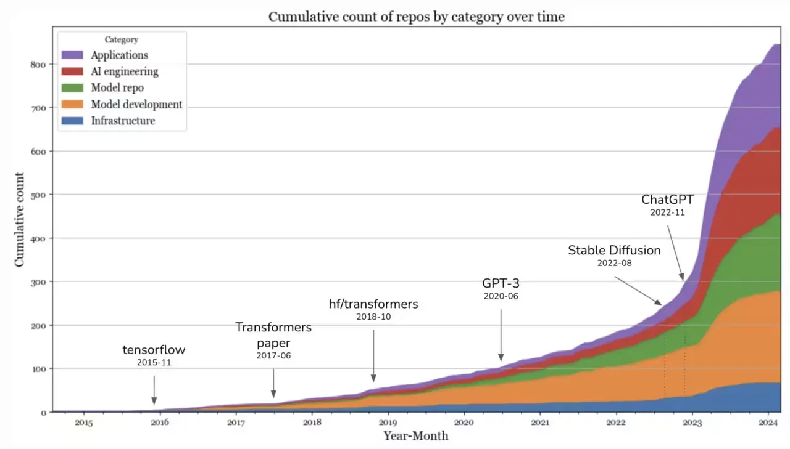
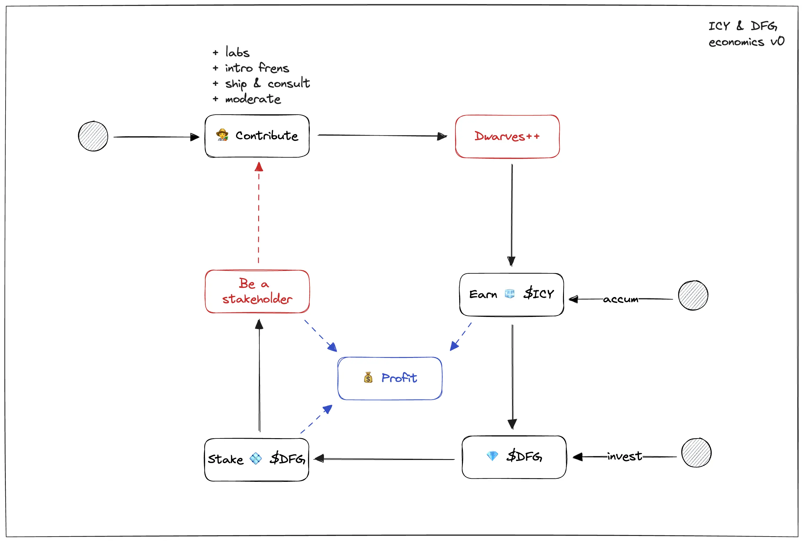

---
tags:
  - newsletter
  - ICY
  - tech-report
  - community
title: What's New in March 2024
date: 2024-04-03
description: In this March, we're eyeing on what's brewing in the tech market, ICY updates in 2024, the first offline meetup and product demo. 
authors:
  - innno_
---

- **Reporting tech signals**: everything new on artificial intelligence, API techniques, toolings, programming languages, and the intersection of design and engineering.
- **ICY in 2024**: all you need to know about ICY’ latest updates.
- **Demo and Showcase**: Monthly product demos and showcases are now a regular event at Dwarves.
- **Community meet-up**: the first Dwarves x Community Members offline event in Saigon.

## Reporting Tech Signals: How GenAI is changing the way developers work
In March 2024, we identified relevant emerging technologies and business benefits to support our technology roadmap and which trends hold the most potential across various markets.

Highlights for this month:

- The increasing prominence of individual-led application development alongside the growing popularity of prompt engineering and AI interfaces.
- The noteworthy productivity potential of GenAI, drives its widespread adoption across enterprises.
- Improved infrastructure and API techniques facilitated enhanced operational efficiency, with contributions from individual developers and tech giants such as Google, OpenAI, and Microsoft.
- Advancements in in-app design for LLMs (Large Language Models), setting the stage for more advanced virtual assistants.

[Read the full report here](https://memo.d.foundation/playground/_labs/market-report-mar-2024/)

## ICY Updates in 2024
Since its launch in September 2022, ICY was used to reward the network members and allow all members to earn ICY through engagement in discussions, research on Dwarves' tech, and more.

In March:

- To welcome new members to our Discord discussions, we're giving away ICY to members with the @guest role as a warm welcome from us. Additionally, we've implemented a new role system to make it more fun and organized.
- We transferred the ICY contract from Polygon to the Base chain, paving the way for further NFT/staking advancements, with updated Mochi & Onchain balances.
- To expand our reach beyond Discord, we've initiated the linking of Mochi wallet accounts with GitHub accounts, rewarding linked users with ICY tokens.

[How we set up Discord server](https://memo.d.foundation/playbook/community/starting-your-journey-at-dwarves-discord/)

## Community Engagement: Offline Meetups in April
Starting this April, we're excited to launch a fresh initiative focused on nurturing stronger connections and more meaningful interactions within our community. We'll trade our usual team dinners for engaging offline meetups held every three months in Ho Chi Minh City.  We can't wait to see you there.

## Demo and Showcase: Give your screenshots a cleaner look with Backr
The next initiative in our monthly call will have a broader range of topics to discuss, including project demos and product showcases.

- Elevate your screenshots with [Backr](https://getbackr.vercel.app/), a tool crafted by Tuan Dao. It allows you to set captivating backgrounds and make your captures look stunning.
- Also, our team member, Khac Vy actively participates in the weekly Solana event, Build Station, which is organized every Saturday. Reach out to Khac Vy if you're interested in joining. The "Build Station" offers developers a platform to connect, learn, and share experiences.

**Coming up:**

- Mark your calendars for our first offline meetup in Ho Chi Minh City (TBA).
